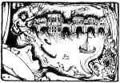

  
[Intangible Textual Heritage](../../../index)  [Legends and
Sagas](../../index)  [English Folklore](../index)  [Index](index) 
[Previous](meft20)  [Next](meft22) 

------------------------------------------------------------------------

# The Pedlar of Swaffham

 [  
Click to enlarge](img/021.jpg)

IN the old days when London Bridge was lined with shops from one end to
the other, and salmon swam under the arches, there lived at Swaffham, in
Norfolk, a poor pedlar. He'd much ado to make his living, trudging about
with his pack at his back and his dog at his heels, and at the close of
the day's labour was but too glad to sit down and sleep. Now it fell out
that one night he dreamed a dream, and therein he saw the great bridge
of London town, and it sounded in his ears that if he went there he
should hear joyful news. He made little count of the dream, but on the
following night it came back to him, and again on the third night.

Then he said within himself, 'I must needs try the issue of it,' and so
he trudged up to London town. Long was the way and right glad was he
when he stood on the great bridge and saw the tall houses on right hand
and left, and had glimpses of the water running and the ships sailing
by. All day long he paced to and fro, but he heard nothing that might
yield him comfort. And again on the morrow he stood and he gazed -- he
paced afresh the length of London Bridge, but naught did he see and
naught did he hear.

Now the third day being come as he still stood and gazed, a shopkeeper
hard by spoke to him.

'Friend,' said he, 'I wonder much at your fruitless standing. Have you
no wares to sell?'

'No, indeed,' quoth the pedlar.

'And you do not beg for alms?'

'Not so long as I can keep myself.'

'Then what, I pray thee, dost thou want here, and what may thy business
be?'

'Well, kind sir, to tell the truth, I dreamed that if I came hither, I
should hear good news.'

Right heartily did the shopkeeper laugh.

'Nay, thou must be a fool to take a journey on such a silly errand. I'll
tell thee, poor silly country fellow, that I myself dream too o' nights,
and that last night I dreamt myself to be in Swaffham, a place clean
unknown to me, but in Norfolk if I mistake not, and methought I was in
an orchard behind a pedlar's house, and in that orchard was a great oak
tree. Then me-seemed that if I digged I should find beneath that tree a
great treasure. But think you I'm such a fool as to take on me a long
and wearisome journey and all for a silly dream. No, my good fellow,
learn wit from a wiser man than thyself. Get thee home, and mind thy
business.'

When the pedlar heard this he spoke no word, but was exceeding glad in
himself, and returning home speedily, digged underneath the great oak
tree, and found a prodigious great treasure. He grew exceeding rich, but
he did not forget his duty in the pride of his riches. For he built up
again the church at Swaffham, and when he died they put a statue of him
therein all in stone with his pack at his back and his dog at his heels.
And there it stands to this day to witness if I lie.

------------------------------------------------------------------------

[Next: The Old Witch](meft22)
