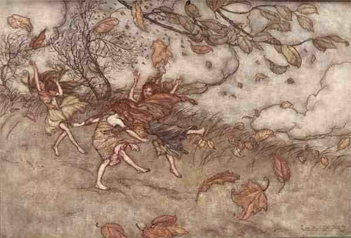

  
[Intangible Textual Heritage](../../../index)  [Legends and
Sagas](../../index)  [English Folklore](../index) 

------------------------------------------------------------------------

<table width="75%">
<colgroup>
<col style="width: 50%" />
<col style="width: 50%" />
</colgroup>
<tbody>
<tr class="odd">
<td width="50%" data-valign="TOP"></td>
<td width="50%" data-valign="TOP"><h1 id="a-peep-at-the-pixies-or-legends-of-the-west" data-align="CENTER">A Peep at the Pixies, or Legends of the West</h1>
<h2 id="by-anna-eliza-bray" data-align="CENTER">by Anna Eliza Bray</h2>
<h4 id="section" data-align="CENTER">[1854]</h4></td>
</tr>
</tbody>
</table>

------------------------------------------------------------------------

[Title Page](ppx00)  
[Dedication](ppx01)  
[Advertisement](ppx02)  
[Introduction](ppx03)  
[Pixy Gathon, or, the Tailor's Needle](ppx04)  
[The Three Trials, or, the Story of Crabby Cross](ppx05)  
[The Seven Crosses of Tiverton, or, The Pixy Picket](ppx06)  
[Background Notes on the Seven Crosses of Tiverton](ppx07)  
[Fontina, or, The Pixies' Bath](ppx08)  
[The Lady of the Silver Bell](ppx09)  
[The Belfry Rock, or, The Pixies' Revenge](ppx10)  
[Appendix: Notes](ppx11)  
