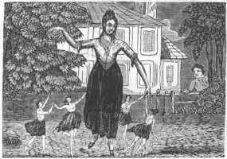

  
[Intangible Textual Heritage](../../../index)  [Sagas and
Legends](../../index)  [English Folklore](../index) 

------------------------------------------------------------------------

# Popular Romances of the West of England

## collected and edited by Robert Hunt

#### \[1903, 3rd edition\]

------------------------------------------------------------------------

[Title Page](prwe000)  
[Preface to the Third Edition](prwe001)  
[Introduction](prwe002)  

### VOLUME ONE

### The Giants

[The Age of the Giants](prwe003)  
[Corineus and Gogmagog](prwe004)  
[The Giants of the Mount](prwe005)  
[The Key of the Giant's Castle](prwe006)  
[The Rival Giants](prwe007)  
[The Giants of Trencrom, or Trecrobben](prwe008)  
[The Giants at Play](prwe009)  
[Holibun of the Cairn](prwe010)  
[The Giant of Nancledry](prwe011)  
[Trebiggan the Giant](prwe012)  
[The Lord of Pengerswick and the Giant of St. Michael's
Mount](prwe013)  
[The Giant of St. Michael's Mount loses his wife](prwe014)  
[Tom and the Giant Blunderbuss or, The Wheel and Exe Fight](prwe015)  
[Tom the Giant, his wife Jane and Jack the Tinkeard](prwe016)  
[How Tom and the Tinkeard found the Tin, and how it led to Morva
Fair](prwe017)  
[The Giant of Morva](prwe018)  
[The Giant Bolster](prwe019)  
[The Hack and Cast](prwe020)  
[The Giant Wrath, or Ralph](prwe021)  
[Ordulph the Giant](prwe022)  

### The Fairies

[The Elfin Creed of Cornwall](prwe023)  
[Nursing a Fairy](prwe024)  
[Changelings](prwe025)  
[The Lost Child](prwe026)  
[A Native Pigsey Story](prwe027)  
[The Night-Riders](prwe028)  
[The Fairy Tools, or Barker's Knee](prwe029)  
[The Piskies in the Cellar](prwe030)  
[The Spriggans of Trencrom Hill](prwe031)  
[The Fairy Miners - the Knockers](prwe032)  
[The Spriggan's Child](prwe033)  
[The Piskies' Changeling](prwe034)  
[The Pixies of Dartmoor](prwe035)  
[The Fairy Fair in Germoe](prwe036)  
[St Margery and the Piskies](prwe037)  
[The Fairy Revels on the "Gump" St Just](prwe038)  
[The Fairy Funeral](prwe039)  
[The Fairy Revel](prwe040)  
[Betty Stogs and Jan the Mounster](prwe041)  
[The Four-leaved Clover](prwe042)  
[The Fairy Ointment](prwe043)  
[How Joan Lost the Sight of her Eye](prwe044)  
[The Old Woman who turned her Shift](prwe045)  
[The Fairy Widower](prwe046)  
[The Small People's Gardens](prwe047)  
[St Levan Fairies](prwe048)  
[The Adventures of Cherry of Zennor](prwe049)  
[Anne Jeffries and the Fairies](prwe050)  
[The Piksie Threshers](prwe051)  
[The Muryan's Bank](prwe052)  

### Romances of Tregeagle

[The Demon Tregeagle](prwe053)  
[Jahn Tergagle the Steward](prwe054)  
[Dosmery Pool](prwe055)  
[The Wish Hounds](prwe056)  
[Chaney's Hounds](prwe057)  

### Romances of the Mermaids

[Morva or Morveth](prwe058)  
[Merrymaids and Merrymen](prwe059)  
[The Mermaid of Padstow](prwe060)  
[The Mermaid of Rock](prwe061)  
[The Mermaid of Seaton](prwe062)  
[The Old Man of Cury](prwe063)  
[The Mermaid's Vengence](prwe064)  

### Romances of the Rocks

[Cromlech and Druid Stones](prwe065)  
[The Logan or Loging Rock](prwe066)  
[Mincamber, Main-Amber or Ambrose's Stone](prwe067)  
[Zennor Coits](prwe068)  
[The Men-an-Tol](prwe069)  
[The Crick Stone in Morva](prwe070)  
[The Dancing Stones, the Hurlers &c](prwe071)  
[The Nine Maids, or Virgin Sisters](prwe072)  
[The Twelve-o'-clock Stone](prwe073)  
[The Men-Scryfa](prwe074)  
[Table-Men - The Saxon's Kings Visit to the Land's End](prwe075)  
[Merlyn's Prophecies](prwe076)  
[The Armed Knight](prwe077)  
[The Irish Lady](prwe078)  
[The Devil's Doorway](prwe079)  
[Piper's Hole, Scilly](prwe080)  
[The Devil's Coit &c](prwe081)  
[King Arthur's Stone](prwe082)  
[The Cock-Crow Stone](prwe083)  

### Romances of lost Cities

[Lost Lands](prwe084)  
[The Tradition of Lyonesse or Lethowsow](prwe085)  
[Cudden Point and the Silver Table](prwe086)  
[The Padstow "Hobby Horse"](prwe087)  
[St Michsel's Mount - The White Rock in the Wood](prwe088)  
[Gwavas Lake](prwe089)  
[The City of Langarrow or Langona](prwe090)  
[The Sands at Lelant and Phillack](prwe091)  
["The island" St Ives](prwe092)  
[The Chapel Rock, Perran-Porth](prwe093)  

### Romances of Fire Worship

[Fire Worship](prwe094)  
[Baal Fires](prwe095)  
[The Garrack Zans, or Holy Rock](prwe096)  
[Fire Ordeal for the Cure of Disease](prwe097)  
[Burning Animals Alive](prwe098)  

### Demons and Spectres

[The Hooting Cairn](prwe099)  
[Jago's Demon](prwe100)  
[Peter the Devil](prwe101)  
[Dando and his Dogs](prwe102)  
[The Devil and his Dandy-Dogs](prwe103)  
[The Spectral Coach](prwe104)  
[Sir Francis Drake and his Demon](prwe105)  
[The Parson and his Clerk](prwe106)  
[The Haunted Widower](prwe107)  
[The Spectre Bridegroom](prwe108)  
[Duffy and the Devil](prwe109)  
[The Lovers of Porthangwartha](prwe110)  
[The Ghost of Rosewarne](prwe111)  
[The Suicide's Spearman](prwe112)  
[The Suicide's Ghost](prwe113)  
[The "Ha-af" a Face](prwe114)  
[The Warning](prwe115)  
[Laying a Ghost](prwe116)  
[A Flying Spirit](prwe117)  
[The Execution and Wedding](prwe118)  
[The Lugger of Croft Pasco Pool](prwe119)  

### VOLUME TWO

### Legends of the Saints

[Legends of the Saints](prwe120)  
[The Crowza Stones](prwe121)  
[The Longstone](prwe122)  
[St Sennen and St Just](prwe123)  
[The Saint and Johana](prwe124)  
[The Saint's Path](prwe125)  
[The St Leven Stone](prwe126)  
[The Two Breams](prwe127)  
[St Keyne](prwe128)  
[St Dennis's Blood](prwe129)  
[St Kea's Boat](prwe130)  
[St German's Well](prwe131)  
[How St Piran reached Cornwall](prwe132)  
[St Peran, the Miner's Saint](prwe133)  
[The Discovery of Tin](prwe134)  
[St Neot, the Pigmy](prwe135)  
[St Neot and the Fox](prwe136)  
[St Neot and the Doe](prwe137)  
[St Neot and the Thieves](prwe138)  
[St Neot and the Fishes](prwe139)  
[Probus and Grace](prwe140)  
[St Nectan's Kieve and the Lonely Sisters](prwe141)  
[Theodore, King of Cornwall](prwe142)  

### Holy Wells

[Well Worship](prwe143)  
[The Well of St Constantine](prwe144)  
[The Well of St Ludgvan](prwe145)  
[Gulval Well](prwe146)  
[The Well of St Keyne](prwe147)  
[Maddern or Madron Well](prwe148)  
[The Well of Altar-Nun](prwe149)  
[St Gundred's Well at Roach Rock](prwe150)  
[St Cuthbert's or Cubert's Well](prwe151)  
[Rickety Children](prwe152)  
[Chapell Uny](prwe153)  
[Perran Well](prwe154)  
[Redruth Well](prwe155)  
[Holy Well at Little Conan](prwe156)  
[The Preservation of Holy Wells](prwe157)  

### Romances of Arthur

[Arthur Legends](prwe158)  
[The Battle of Vellan-druchan](prwe159)  
[Arthur at the Land's End](prwe160)  
[Traditions of the Danes in Cornwall](prwe161)  
[King Arthur in the Form of a Chough](prwe162)  
[The Cornish Chough](prwe163)  
[Slaughter Bridge](prwe164)  
[Camelford and King Arthur](prwe165)  
[Dameliock Castle](prwe166)  
[Carlian in Kea](prwe167)  

### Romances of Witches, Etc.

[The "Cunning Man"](prwe168)  
[Notes on Witchcraft](prwe169)  
[Ill-wishing](prwe170)  
[The "Peller"](prwe171)  
[Bewitched Cattle](prwe172)  
[How to become a Witch](prwe173)  
[Cornish Sorcerors](prwe174)  
[How Pengerswick became a Sorcerer](prwe175)  
[The Lord of Pengerswick an Enchanter](prwe176)  
[The Witch of Fraddam and Pengerswick](prwe177)  
[Trewa, the Home of Witches](prwe178)  
[Kenidzhak Witch](prwe179)  
[The Witches of the Logan Stone](prwe180)  
[Madgy Figgy's Chair](prwe181)  
[Old Mage Figgy and the Pig](prwe182)  
[Madame Noy and Old Joan](prwe183)  
[The Witch of Treva](prwe184)  
[How Mr Lenine gave up Courting](prwe185)  
[The Witch and the Toad](prwe186)  
[The Sailor Wizard](prwe187)  

### Traditions of Tinners

[Traditions of Tinners](prwe188)  
[The Tinner of Chryannor](prwe189)  
[Who are the Knockers ?](prwe190)  
[Miner's Superstitions](prwe191)  
[Christmas-Eve in the Mines](prwe192)  
[Warnings and "Tokens"](prwe193)  
[The Ghost on Horseback](prwe194)  
[The Black Dogs](prwe195)  
[Pitmen's Omens and Goblins](prwe196)  
[The Dead Hand](prwe197)  
[Dorcas, the Spirit of Polbreen Mine](prwe198)  
[Hingston Downs](prwe199)  

### Romances of Fishermen and Sailors

[The Pilot's Ghost Story](prwe200)  
[The Phantom Lights](prwe201)  
[Jack Harry's Lights](prwe202)  
[The Pirate Wrecker and the Death Ship](prwe203)  
[The Spectre Ship of Porthcuno](prwe204)  
[The Lady with the Lantern](prwe205)  
[The Drowned "Hailing their Names"](prwe206)  
[The Voice from the Sea](prwe207)  
[The Smuggler's Token](prwe208)  
[The Hooper of Sennen Cove](prwe209)  
[How to Eat Pilchards](prwe210)  
[Pilchards Crying for More](prwe211)  
[The Pressing-Stones](prwe212)  
[Whipping the Hake](prwe213)  

### Death Tokens and Superstitions

[The Death Token of the Vingoes](prwe214)  
[The Death Fetch of William Rufus](prwe215)  
[Sir John Arundell](prwe216)  
[Phantoms of the Dying](prwe217)  
[The White Hare](prwe218)  
[The Hand of a Suicide](prwe219)  
[The North Side of a Church](prwe220)  
[Popular Superstitions](prwe221)  

### Customs of Ancient Days

[Sanding the Step on New Year's Day](prwe222)  
[May-Day](prwe223)  
[Shrove Tuesday at St Ives](prwe224)  
["The Furry, " Helstone](prwe225)  
[Midsummer Superstitious Customs](prwe226)  
[Crying the Neck](prwe227)  
[Drinking the Apple-Trees on Twelfth-Night](prwe228)  
[Allhallows-Eve at St Ives](prwe229)  
[The Twelfth Cake](prwe230)  
[Oxen Pray on Christmas-Eve](prwe231)  
["St George" - The Christmas Plays](prwe232)  
[Geese-Dancing - Plough Monday](prwe233)  
[Christmas at St Ives](prwe234)  
[Lady Lovell's Courtship](prwe235)  
[The Game of Hurling](prwe236)  

### Sham Mayors

[The Mayor of Mylor](prwe237)  
[The Mayor of St Germans](prwe238)  
[The Mayor of Halgaver Moor](prwe239)  
[The Faction Fight at Cury Great Tree](prwe240)  
[Towednack Cuckoo Feast](prwe241)  
[The Duke of Restormel](prwe242)  

### Popular Superstitions

[Charming and Prophetic Power](prwe243)  
[Fortune Telling, Charms etc.](prwe244)  
[The Zennor Charmers](prwe245)  
[J - H - The Conjurer of St Columb](prwe246)  
[Cures for Warts](prwe247)  
[A Cure for Paralysis](prwe248)  
[A Cure for Rheumatism](prwe249)  
[Sundry Charms](prwe250)  
[The Club Moss](prwe251)  
[Moon Superstitions](prwe252)  
[Cures for Whooping Cough](prwe253)  
[Cure of Toothache](prwe254)  
[The Convalescent's Walk](prwe255)  
[Adders and the Milpreve](prwe256)  
[Snakes Avoid the Ash-Tree](prwe257)  
[To Charm a Snake](prwe258)  
[The Ash-Tree](prwe259)  
[Rhyme on the Even Ash](prwe260)  
[A Test of Innocency](prwe261)  
[The Bonfire Test](prwe262)  
[Lights Seen by the Converted](prwe263)  
[The Migratory Birds](prwe264)  
[Shooting Stars](prwe265)  
[The Sun Never Shines on the Perjured](prwe266)  
[Characteristic](prwe267)  
[The Mutton Feast](prwe268)  
[The Floating Grindstone](prwe269)  
[Celts- Flint Arrow-heads, etc.](prwe270)  
[The Horns on the Church Tower](prwe271)  
[Tea-Stalks and Smut](prwe272)  
[An Old Cornish Rhyme](prwe273)  
[To Choose a Wife](prwe274)  
[The Robin and the Wren](prwe275)  
[To Secure Good Luck for a Child](prwe276)  
[Innocency](prwe277)  
[Rain at Bridal or Burial](prwe278)  
[Crowing Hens etc.](prwe279)  
[The New Moon](prwe280)  
[Looking-Glasses](prwe281)  
[The Magpie](prwe282)  
[The Month of May Unlucky](prwe283)  
[On the Births of Children](prwe284)  
[On Washing Linen](prwe285)  
[Itching Ears](prwe286)  
[The Spark on the Candle](prwe287)  
[The Blue Vein](prwe288)  
[The Croaking of the Raven](prwe289)  
[Whistling](prwe290)  
[Meeting on the Stairs](prwe291)  
[Treading on Graves](prwe292)  
[A Loose Garter](prwe293)  
[To Cure the Hiccough](prwe294)  
[The Sleeping Foot](prwe295)  
[The Horse-Shoe](prwe296)  
[The Black Cat's Tail](prwe297)  
[Unlucky Things](prwe298)  
[The Limp Corpse](prwe299)  
["By Hook or by Crook"](prwe300)  
[Weather Signs](prwe301)  
[Weather at Liskeard](prwe302)  
[The First Butterfly](prwe303)  
[Peculiar Words and Phrases](prwe304)  

### Miscellaneous Stories

[The Bells of Forrabury Church](prwe305)  
[The Tower of Minster Church](prwe306)  
[Temple Moors](prwe307)  
[The Legend of Tamara](prwe308)  
[The Church and the Barn](prwe309)  
[The Penryn Tragedy](prwe310)  
[Goldsithney Fair and the Glove](prwe311)  
[The Harlyn Pie](prwe312)  
[Packs of Wool The Foundation of the Bridge of Wadebridge](prwe313)  
[The Last Wolf in England](prwe314)  
[Churches Built in Performance of Vows](prwe315)  
[Bolait, The Field of Blood](prwe316)  
[Woeful Moor, and Bodrigan's Leap](prwe317)  
[Pengerswick Castle](prwe318)  
[The Clerks of Cornwall](prwe319)  
[A Fairy Caught](prwe320)  
[The Lizard People](prwe321)  
[Prussia Cove and Smugglers' Holes](prwe322)  
[Cornish Teeny-Tiny](prwe323)  
[The Spaniard at Penryn](prwe324)  
[Boyer, Mayor of Bodmin](prwe325)  
[Thomasine, Bonaventure](prwe326)  
[The Last of the Killigrews](prwe327)  
[Saint Gerennius](prwe328)  
[Cornish Dialogue](prwe329)  

### Appendix

[Bellerian](prwe330)  
[The Poem of the Wrestling](prwe331)  
[Shara and Sheela](prwe332)  
[The Hag's Bed near Fermoy](prwe333)  
[The Giant of Nancledry; and Trebiggan the Giant](prwe334)  
[Geese Dancing - Guise Dancing - Guizards](prwe335)  
[Wayland Smith](prwe336)  
[The Wonderful Cobbler of Wellington](prwe337)  
[H](prwe338)  
[St Piran's-Day and Picrous-Day](prwe339)  
[Moses Pitt's Letter Respecting Anne Jeffries](prwe340)  
[The Bargest, or Spectre Hound](prwe341)  
[The Mermaid's Revenge](prwe342)  
[Rock Masses, Celtic](prwe343)  
[Ambrosiae Petrae](prwe344)  
[Padstow Hobby Horse](prwe345)  
[The City of Langarrow or Langona - Perran Churches](prwe346)  
[St Piran - Perran Zabuloe](prwe347)  
[St Chiwidden](prwe348)  
[The Discoverer of Tin](prwe349)  
[St Neot](prwe350)  
[The Sisters of Glen-Neot](prwe351)  
[Millington of Pengerswick](prwe352)  
[Pengerswick](prwe353)  
[Saracen](prwe354)  
[The Tinner of Chyannor](prwe355)  
[Merry Sean Lads](prwe356)  
[The North Side of a Church](prwe357)  
[Peculiar Words and Phrases](prwe358)  
[The Harlyn Pie](prwe359)  
