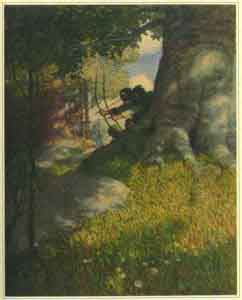

  
[Intangible Textual Heritage](../../../index)  [Sagas &
Legends](../../index)  [England](../index) 

------------------------------------------------------------------------

# Robin Hood and His Adventures

## by Paul Creswick

### Illustrations by N.C. Wyeth

#### \[1903\]

------------------------------------------------------------------------

This is Paul Creswick's able retelling of the Robin Hood myth. The Robin
Hood narrative first surfaced as a short mention in *Piers Plowman*, and
accreted details through folk-tales, [ballad](../boeb/index),
literature, and of course, cinema. Like other English literary
productions such as King Arthur or Sherlock Holmes, the fact that Robin
Hood is a fiction is almost irrelevant; people *want* to believe that he
was an actual historical personage. Creswick's version of this tale
brings it to life, and the luminous Wyeth illustrations complete the
picture.

------------------------------------------------------------------------

[Title Page](rh00)  
[Illustrations](rh01)  
[Chapter 1](rh02)  
[Chapter 2](rh03)  
[Chapter 3](rh04)  
[Chapter 4](rh05)  
[Chapter 5](rh06)  
[Chapter 6](rh07)  
[Chapter 7](rh08)  
[Chapter 8](rh09)  
[Chapter 9](rh10)  
[Chapter 10](rh11)  
[Chapter 11](rh12)  
[Chapter 12](rh13)  
[Chapter 13](rh14)  
[Chapter 14](rh15)  
[Chapter 15](rh16)  
[Chapter 18](rh17)  
[Chapter 17](rh18)  
[Chapter 18](rh19)  
[Chapter 19](rh20)  
[Chapter 20](rh21)  
[Chapter 21](rh22)  
[Chapter 22](rh23)  
[Chapter 23](rh24)  
[Chapter 24](rh25)  
[Chapter 25](rh26)  
[Chapter 26](rh27)  
[Chapter 27](rh28)  
[Chapter 28](rh29)  
[Chapter 29](rh30)  
[Chapter 30](rh31)  
[Chapter 31](rh32)  
[Chapter 32](rh33)  
[Chapter 33](rh34)  
[Chapter 34](rh35)  
[Epilogue](rh36)  
