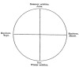

  
[Intangible Textual Heritage](../../../index)  [Legends and
Sagas](../../index)  [England](../index)  [Index](index) 
[Previous](sac04)  [Next](sac06) 

------------------------------------------------------------------------

*Stonehenge and Other British Stone Monuments Astronomically
Considered*, by Norman Lockyer, \[1906\], at Intangible Textual Heritage

------------------------------------------------------------------------

p. 12

### CHAPTER II

### THE ASTRONOMICAL DIVISIONS OF THE YEAR

IT is next important to deal with the yearly path of the sun, with a
view of studying the relation of the various points of the horizon
occupied by the sun at different times in the year. In the very early
observations that were made in Egypt, Chaldæa and elsewhere, when the
sun was considered to be a god who every morning got into his boat and
floated across space, there was no particular reason for considering the
amplitude at which the boat left, or came to, shore. But a few centuries
showed that this rising or setting of the sun in widely varying
amplitudes at different times of the year at the same place obeyed a
very definite law.

In its northward passage it reaches the highest point at our summer
solstice, and then goes down again till it reaches its greatest southern
declination, as it does in our winter. At both these points the sun
appears to stand still in its north or south movement, and the Latin
word solstice exactly expresses that idea. The change of declination
brought about by these movements will affect the place of the sun's
rising and setting; this is why the sun sets most to the north in

p. 13

summer and most to the south in winter. At the equinoxes the sun has
always 0° Decl., so it rises and sets due east and west all over the
world. But at the solstices it has its greatest declination of 23½° N.
or S.; it will rise and set therefore furthest from the east and west
points; how far, will depend upon the latitude of the place, as will
have been gathered from the preceding table (p.
[11](sac04.htm#img_01100)).

These solstices and their accompaniments are among the striking things
in the natural world. In the winter solstice we have the depth of
winter, in the summer solstice we have the height of summer, while at
the equinoxes we have but transitional changes; in other words, while
the solstices point out for us the conditions of greatest heat and
greatest cold, the equinoxes point out for us those two times of the
year at which the temperature conditions are very nearly equal, although
of course in the one case we are saying good-bye to summer and in the
other to winter.

Did the ancients know anything about these solstices and these
equinoxes? Dealing with the monumental evidence in Egypt alone, the
answer is absolutely overwhelming. Many thousand years ago the Egyptians
were perfectly familiar with the solstices, and therefore with the
yearly path of the sun.

This fundamental division of the sun's apparent revolution and course
which define our year into four nearly equal parts may be indicated as
in [Fig. 5](#img_fig05), the highest point reached by the sun in our
northern hemisphere being represented at the top.

In order better to consider the problem as it was presented to the early
astronomers who built observatories

p. 14

(temples) to mark these points, we may deal with the bearings of the
points occupied by the sun on the

[  
Click to enlarge](img/fig05.jpg)  
FIG. 5.—The four Astronomical Divisions of the year.  

horizon (either at rising or setting) at the times indicated. These
points are defined, as we have seen, by

[  
Click to enlarge](img/fig06.jpg)  
FIG. 6.—The various bearings of the s in risings and settings in a place
with a N. latitude of 51°.  

their "amplitude" or their distance in degrees from the E. or W. points
of the horizon. In the diagram ([Fig. 6](#img_fig06))

p. 15

\[paragraph continues\] I represent the
conditions of our chief British sun-temple, Stonehenge, in latitude 51°
N. approximately.

Taking the astronomical facts regarding the solstices. and equinoxes for
the first year (1901) of the present century, we find—

|     |        |              |                  |               |
|-----|--------|--------------|------------------|---------------|
| Sun | enters | Aries,       | Spring equinox,  | March 21.     |
| "   | "      | Gemini,      | Summer solstice, | June 21.      |
| "   | "      | Libra,       | Autumn equinox,  | September 23. |
| "   | "      | Sagittarius, | Winter solstice, | December 23.  |

These points, then, are approximately ninety-one days apart (91 × 4 =
364).

In [Fig. 6](#img_fig06) I deal with the "amplitudes" at Stonehenge, that
is, the angular distance along the horizon from the E. and W. points, at
which the sunrise and sunset are seen at the solstices; at the equinoxes
they are seen at the E. and W. points. But as these amplitudes vary with
the latitude and therefore depend upon the place of observation, a more
general treatment is possible if we deal with the declination of the sun
itself, that is, its angular distance from the equator.

The maximum declination depends upon the obliquity of the ecliptic, that
is, the angle between the plane of the ecliptic and that of the equator
at the time of observation. When the Stonehenge Sarsen Stones were
erected this angle was, as I shall show later on, 23° 54´ 30″. Its mean
value for the present year (1906) is 23° 27´ 5″; it is decreasing very
slowly.

It will be obvious from [Fig. 6](#img_fig06) that in temples built to
observe the solstices or equinoxes, if they were open from end to end,
looking in one direction we should see the sun rising at a solstice or
equinox, and looking in the other we should see the sun setting at the

p. 16

opposite one. I shall show later on that this statement requires a
slight modification.

But temples so built interfered with the ceremonial, which required that
the light should illuminate a naos—that is, the Sanctuary or Holy of
Holies, only entered by the High Priest, and generally kept dark.
Usually, therefore, two temples were built back to back, with a common
axis, as at Karnak.

And here a very important point comes in; which time of the year and day
of the year are most easy to fix by astronomical observation? As a
matter of fact the summer solstice, the position of the sun on the
longest day, is a point easily fixed. All we have to do is to observe
the sun rising more and more to the north as the summer approaches,
until at the very height of the summer we have the extreme
north-easterly point of the horizon reached, and the sun stands still.
We have the solstice. We can then put a row of stakes up, and so fix the
solstitial line. Of course we find, as mankind has found generally, that
the sun comes back next year to that same solstitial place of rising or
setting. So that when we have once got such an alignment for the rising
of the sun at midsummer, we can determine the length of the year in
days, and therefore the beginning of each year as it comes round.

So much, then, for the chief points in what we may term the astronomical
year, those at which the sun's declination is greatest and least. We see
that they are approximately ninety-one days apart—say three months.

------------------------------------------------------------------------

[Next: Chapter III. The Agricultural Divisions of the Year](sac06)
