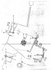
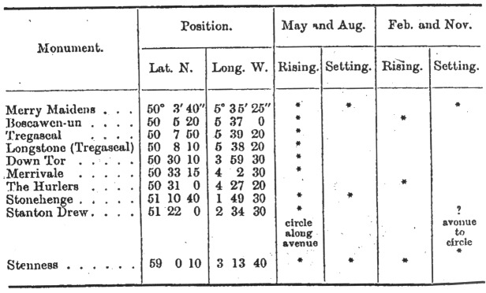
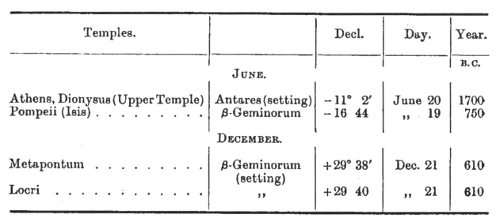
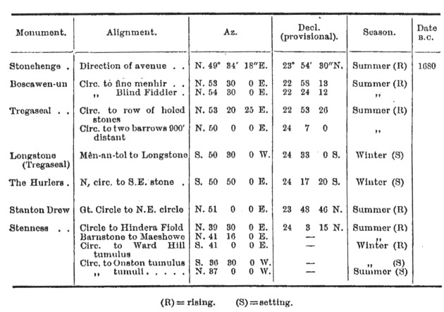
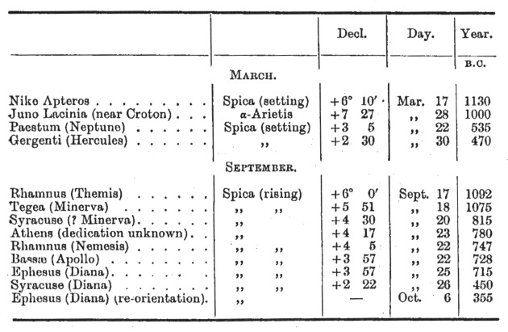
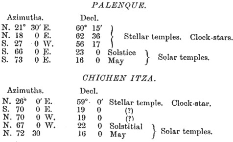

  
[Intangible Textual Heritage](../../../index)  [Legends and
Sagas](../../index)  [England](../index)  [Index](index) 
[Previous](sac31)  [Next](sac33) 

------------------------------------------------------------------------

*Stonehenge and Other British Stone Monuments Astronomically
Considered*, by Norman Lockyer, \[1906\], at Intangible Textual Heritage

------------------------------------------------------------------------

p. 304

### CHAPTER XXIX

### A SHORT HISTORY OF SUN TEMPLES

*The Original Cult*

I HAVE given detailed evidence showing that the first circle builders in
Britain worshipped the May-year sun whether they brought it with them or
not. This year was used in Babylon, Egypt, and afterwards in Greece. In
the two former countries May was the harvest month, and thus became the
chief month in the year. The dates were apt to vary with the local
harvest time.

The earliest extant temple aligned to the sun at this festival seems to
have been that of Ptah at Memphis, 5200 B.C. I have already referred to
this temple in relation to the clock-star observations carried on in it.

This approximate date of the building of the temple is obtained by the
evidence afforded (1) by the associated clock-star (see [p.
298](sac31.htm#page_298)), and (2) by the fact that the god Ptah
represented the star Capella, since there is a Ptah temple at Thebes
aligned on Capella at a later time, when by the precessional movement it
had been carried outside the solar limit. There was also a similar
temple at Annu (Heliopolis, lat. N. 30° 10´), but it has disappeared.
The light of the sun fell along the axis when

p. 305

the sun had the declination N. 11°, the Gregorian dates being April 18
and August 24.

Another May-year temple was that of Menu at Thebes,

 

[  
Click to enlarge](img/fig63.jpg)  
FIG. 63.—Layard's plan of the Palace of Sennacherib discovered in the
mound of Kouyunjik. The temple axis, XXXVI., XXXIV., XXIX., XIX. (XXII.
is on a lower level), faces the rising of the May sun.  

\[paragraph continues\] Az. N. 72° 30´ W.
(lat. N. 25°; sun's declination N. 15°; Gregorian date, May 1).

As we have seen ([p. 299](sac31.htm#page_299)), Spica had this
declination in 3200 B.C., and the coincidence, may have been the reason

p. 306

for the erection, or, more probably, the restoration, of the
temple, [1](#fn_122) especially as γ Draconis
came into play as a new clock-star at the same date.

[  
Click to enlarge](img/fig64.jpg)  
FIG. 64.—Layard's plan of the Mound at Nimrood showing its equinoctial
orientation.  

The researches of Mr. Penrose in Greece have provided us with temples
oriented to the May-year sun. I shall return to them afterwards, as they
are later in time than the British monuments.

p. 307

The explorations of Sir H. Layard at Nineveh, lat. 36° N., have shown
that the temple in Sennacherib's

[  
Click to enlarge](img/fig65.jpg)  
FIG. 65.—The Temples at Chichen Itza.  

palace, which may have been a restoration of a much older temple, was
also oriented to the May sun.

p. 308

It is a pity that our present-day archaeologists do not more strictly
follow the fine example set by Sir Henry Layard in his explorations of
Kouyunjik. When he had unearthed Sennacherib's palace (700 B.C.) he was
careful to give the astronomical and magnetic bearings of the buildings
and of the temple which seemed to form the core of them. The bearing is
Az. N. 68° 30´ E., giving the sun's declination as N. 16°.

I am enabled by the kindness of Mr. John Murray to give copies of the
plans which Sir H. Layard prepared of the excavations both at Kouyunjik
and Nimrood, showing the careful orientation which enables us to claim
Sennacherib's temple as one consecrated to the May year, while at
Nimrood (Babylon) the equinoctial worship was in vogue as at the
pyramids.

In association with these plans of Layard's, I give another by Mr.
Maudslay of the as carefully oriented temples at Chichen Itza (N. lat.
20°) explored by him. In these temples, of unknown date and origin, the
azimuths of two show that the May year was worshipped. [1](#fn_123)

p. 309

*The May-Year Monuments in Britain*.

In the first glimpses of the May year in Egypt we have dates from 5000
B.C. It does not follow that it did not reach Great Britain before about
2000 B.C. because monuments made their appearance about that time. It is
clear, also, that with the possibilities of coastwise traffic as we have
found it, it might as easily have reached Ireland by then; 2000 B.C.,
therefore, is a probable date for the May worship to have reached
Britain arguing on general principles; we now come to a detailed summary
of the facts showing that it really reached Britain earlier.

Alignments in British monuments designed to mark the place of the sun's
rising or setting on the quarter-days of the May year have been found as
follows:—

 

I have already shown that it was the practice in ancient times for the
astronomer-priests not only to

p. 310

watch the clock-stars during the night, but also other stars which rose
or set about an hour before sunrise, to give warning of its approach on
the days of the principal festivals.

Each clock-star, if it rose and set very near the north point, might be
depended on to herald the sunrise on *one* of the critical days of the
year, but for the others other stars would require to be observed. This
practice was fully employed in Britain.

*May Warnings*.—The following table gives the stars I have so far noted
which were used as warners for the May festival.

<table data-border="1">
<colgroup>
<col style="width: 33%" />
<col style="width: 33%" />
<col style="width: 33%" />
</colgroup>
<tbody>
<tr class="odd">
<td data-valign="top">
Monument.
</td>
<td data-valign="top">
Star.
</td>
<td data-valign="top">
Date or dates 
B.C.
</td>
</tr>
<tr class="even">
<td data-valign="top">
Stonehenge
</td>
<td data-valign="top">
Pleiades (R)
</td>
<td data-valign="top">
1950
</td>
</tr>
<tr class="odd">
<td data-valign="top">
Merry Maidens
</td>
<td data-valign="top">
Pleiades (R) 
Antares (S)
</td>
<td data-valign="top">
1930 
1310
</td>
</tr>
<tr class="even">
<td data-valign="top">
The Hurlers
</td>
<td data-valign="top">
Antares (S) 
Pleiades (R)
</td>
<td data-valign="top">
1720 
1610
</td>
</tr>
<tr class="odd">
<td data-valign="top">
Merrivale
</td>
<td data-valign="top">
Pleiades (R) 
     „
</td>
<td data-valign="top">
1610 
1420
</td>
</tr>
<tr class="even">
<td data-valign="top">
Boscawen-un
</td>
<td data-valign="top">
Pleiades (R)
</td>
<td data-valign="top">
1480
</td>
</tr>
<tr class="odd">
<td data-valign="top">
Tregaseal
</td>
<td data-valign="top">
Pleiades (R)
</td>
<td data-valign="top">
1270
</td>
</tr>
<tr class="even">
<td data-valign="top">
Stenness
</td>
<td data-valign="top">
Pleiades (R)
</td>
<td data-valign="top">
1230
</td>
</tr>
<tr class="odd">
<td data-valign="top">
Longstone (Tregaseal)
</td>
<td data-valign="top">
Pleiades (R)
</td>
<td data-valign="top">
1030
</td>
</tr>
</tbody>
</table>

\(R\) = rising. (S) = setting.

It is convenient here to give a list of the May warning stars found by
Mr. Penrose in Greece, as it shows that the same stars were observed for
the same purpose.

p. 311

<table data-border="1">
<colgroup>
<col style="width: 20%" />
<col style="width: 20%" />
<col style="width: 20%" />
<col style="width: 20%" />
<col style="width: 20%" />
</colgroup>
<tbody>
<tr class="odd">
<td data-valign="top">
 
</td>
<td data-valign="top">
 
</td>
<td data-valign="top">
Decl.
</td>
<td data-valign="top">
Day.
</td>
<td data-valign="top">
Year. 
B. C.
</td>
</tr>
<tr class="even">
<td data-valign="top">
Archaic temple of Minerva
</td>
<td data-valign="top">
Pleiades (R)
</td>
<td data-valign="top">
+  7° 50´
</td>
<td data-valign="top">
April 20
</td>
<td data-valign="top">
2020
</td>
</tr>
<tr class="odd">
<td data-valign="top">
Hiero of Epidaurus, Asclepieion
</td>
<td data-valign="top">
    „    (R)
</td>
<td data-valign="top">
+  9  15
</td>
<td data-valign="top">
  „   28
</td>
<td data-valign="top">
1275
</td>
</tr>
<tr class="even">
<td data-valign="top">
Hecatompedon
</td>
<td data-valign="top">
    „     (R)
</td>
<td data-valign="top">
+  9  58
</td>
<td data-valign="top">
  „   26
</td>
<td data-valign="top">
1150
</td>
</tr>
<tr class="odd">
<td data-valign="top">
Older Erechtheum
</td>
<td data-valign="top">
Antares (S)
</td>
<td data-valign="top">
- 14  31
</td>
<td data-valign="top">
  „   29
</td>
<td data-valign="top">
1070
</td>
</tr>
<tr class="even">
<td data-valign="top">
Temple of Bacchus
</td>
<td data-valign="top">
Pleiades (R)
</td>
<td data-valign="top">
+ 10  35
</td>
<td data-valign="top">
  „   29
</td>
<td data-valign="top">
1030
</td>
</tr>
<tr class="odd">
<td data-valign="top">
Corinth
</td>
<td data-valign="top">
Antares (S)
</td>
<td data-valign="top">
- 16   0
</td>
<td data-valign="top">
May  6
</td>
<td data-valign="top">
770
</td>
</tr>
<tr class="even">
<td data-valign="top">
Aegina
</td>
<td data-valign="top">
    „     (S)
</td>
<td data-valign="top">
- 16  45
</td>
<td data-valign="top">
  „    7
</td>
<td data-valign="top">
630
</td>
</tr>
</tbody>
</table>

The warning stars at Athens were the Pleiades for temples facing the
east, and Antares for temples using the western horizon.

 

*August warnings*.—Sunrise at the August festival was heralded by the
rising of Arcturus, which, as we have seen, was also used as a
clock-star. The alignments and dates given in the Arcturus table
therefore hold good for August. At the Hurlers, where the hill over
which Arcturus was observed fell away abruptly, we find Sirius
supplanting Arcturus as the warning star for August in 1690 B.C.

 

*November warnings*.—So far I have discovered no evidence that any star
was employed to herald the November sun. There may be two reasons for
this. In the first place the November festival "Halloween" took place at
sun*se*t and the sun itself could be watched, no heralding star being
necessary.

Secondly, the atmospheric conditions which prevail in Britain during
November would not be conducive to the making of stellar observations
*at the horizon*, and only risings or settings were observed with regard
to the quarter-days.

p. 312

*February Warnings*.—In the same way that Arcturus served the double
purpose of clock-star and herald for the August sun, so did Capella
serve to warn the February sun in addition to its use at night. The
alignments and dates given in the Capella table will therefore hold good
for its employment at the February quarter-day.

 

*The Solstitial Year Monuments*.

In Egypt generally, the solstitial worship followed that of the May and
equinoctial years. The religion of Thothmes III. and the Rameses was in
greatest vogue 2200-1500 B.C.

We find little trace of it in Greece proper, though Mr. Penrose has
traced it in Calabria and Pompeii, and in some of the islands.

The solstitial cult was born in Egypt; it is a child of the Nile-rise. I
have shown in my Dawn of Astronomy that the long series of temples
connected with the solstice may have commenced about 3000 B.C.; but for
long it was a secondary cult; it was parochial until the twelfth
dynasty, say 2300 B.C. Egypt's solstitial "golden age" may be given as
1700 B.C., and her influence abroad was very great, so that much travel,
"coastwise" and other, may, be anticipated. It is for some centuries
after the first date that the introduction of the solstitial worship
into Britain may be anticipated. It, for instance, is quite probable
that the pioneers of this worship should have reached Stonehenge in 2000
B.C.

p. 313

The solstitial alignments found by Mr. Penrose in Greece are as
follows:—

 

We find plentiful evidence that the worship of the solstitial sun such
as was carried on in Egypt at Karnak and at other places [1](#fn_124) was introduced into Britain some time
after the May-year worship was provided for in the monuments.

Although some of the alignments already discovered are in all
probability solstitial, the variation of the sun's solstitial
declination is so slow and takes place between such narrow limits that a
most careful determination of the actual azimuths and of the angular
heights of the various horizons must be made before any definite
conclusion as to dates can be arrived at. The necessity for this care is
illustrated in the paper on Stonehenge [2](#fn_125) communicated to the Royal Society by Mr.
Penrose and myself in 1891; where, after taking the greatest
precautions, the resulting date. was, in doubt to the amount of 200
years in either direction.

p. 314

So far Stonehenge is the only temple at which these observations have
been made, so that for the other alignments contained in the following
list no dates can yet be given.

 

I cited an alignment at the Hurlers which marked the rising point of
Betelgeuse. This star warned the summer solstice sunrise at about the
Hurlers' date. So far, however, I have not yet found any suggestion of
its use elsewhere.

At Shovel Down and Challacombe on Dartmoor there are avenues pointing a
few degrees west of north. The sight-lines along these avenues would
mark the setting-point of Arcturus at the time that that star (setting)
warned the rising of the sun at the summer solstice; but this use cannot
be considered as established, as Arcturus would scarcely set before its
light was drowned in that of the rising sun. The absence of

p. 315

darkness in high summer in these latitudes and the bad weather in the
winter may both be responsible for so few alignments for the solstices.

 

*The Equinoctial Year Monuments*.

The equinoctial pyramid and Babylonian cult in vogue in Egypt in the
early dynasties (4000 B.C.), with the warning stars Aldebaran (March)
and Vega (September), was represented in Greece at a much later period.
The facts for Greece, according to Mr. Penrose, are as follows:—

 

In Britain equinoctial alignments are not wanting, but so few have been
traced that I have reserved them for future inquiry.

------------------------------------------------------------------------

### Footnotes

[306:1](sac32.htm#fr_122) See *Dawn of
Astronomy*, p. 318.

[308:1](sac32.htm#fr_123) The temple conditions
are approximately as follows:—

 

[313:1](sac32.htm#fr_124) *Dawn of Astronomy*,
p. 78.

[313:2](sac32.htm#fr_125) *Proc. Roy. Soc*.,
vol. 69.

------------------------------------------------------------------------

[Next: Chapter XXX. The Life of the Astronomer-Priests](sac33)
