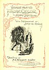
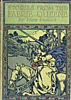
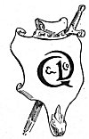

  
[Intangible Textual Heritage](../../../index)  [Sagas &
Legends](../../index)  [England](../index)  [Index](index) 
[Next](sfq01) 

------------------------------------------------------------------------

<table>
<colgroup>
<col style="width: 100%" />
</colgroup>
<tbody>
<tr class="odd">
<td><a href="img/front.jpg"> 
Click to enlarge</a> 

''She nigher drew, and saw that joyous end: 
Then God she prayed and thankt her faithfull Knight 
That had atchievde so great a conquest by his might.'' 
                --Page 86. 
</td>
</tr>
</tbody>
</table>

# Stories From The Faerie Queene

## by Mary Macleod

##### With Introduction by John W. Hales

##### Drawings by A. G. Walker, Sculptor

#### London, Wells Gardner, Darton & Co. Ltd.

#### 3 Paternoster Buildings, E.C.

#### \[1916\]

###### Scanned at Intangible Textual Heritage, January, 2004. J. B. Hare, redactor. This text is in the public domain. These files may be used for any non-commercial purpose, provided this notice of attribution is left intact.

[  
Click to enlarge](img/title.jpg)  
Image of Title Page  

[  
Click to enlarge](img/fcover.jpg)  
Image of Front Cover  

p. vi

[  
Click to enlarge](img/vi00.jpg)

First Edition, September 1897  
*Second Edition, April* 1900  
*Third Edition, January* 1903  
*Fourth Edition, November* 1906  
*Fifth Edition, August* 1908  
*Sixth Edition, November* 1912  
*Seventh Edition, August* 1916

------------------------------------------------------------------------

[Next: Introduction](sfq01)
