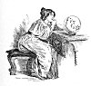
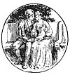

  
[Intangible Textual Heritage](../../../index)  [Sagas &
Legends](../../index)  [England](../index)  [Index](index) 
[Previous](sfq01)  [Next](sfq03) 

------------------------------------------------------------------------

p. xxi

[  
Click to enlarge](img/xxi00.jpg)

# CONTENTS

|                                                                           |                           |
|---------------------------------------------------------------------------|---------------------------|
| THE RED CROSS KNIGHT--                                                    | PAGE                      |
|     THE COURT OF THE QUEEN                                                | [1](sfq04.htm#page_1)     |
|     THE WOOD OF ERROR                                                     | [4](sfq04.htm#page_4)     |
|     THE KNIGHT DECEIVED BY THE MAGICIAN                                   | [8](sfq05.htm#page_8)     |
|     THE KNIGHT FORSAKES UNA                                               | [12](sfq06.htm#page_12)   |
|     HOLINESS FIGHTS FAITHLESS, AND MAKES FRIENDS WITH FALSE RELIGION      | [15](sfq07.htm#page_15)   |
|     UNA AND THE LION                                                      | [17](sfq08.htm#page_17)   |
|     IN THE HANDS OF THE ENEMY                                             | [23](sfq09.htm#page_23)   |
|     THE HOUSE OF PRIDE                                                    | [26](sfq10.htm#page_26)   |
|     THE BATTLE FOR THE SHIELD                                             | [36](sfq12.htm#page_36)   |
|     UNA AND THE WOODLAND KNIGHT                                           | [41](sfq12.htm#page_41)   |
|     THE FALSE PILGRIM                                                     | [43](sfq13.htm#page_43)   |
|     GIANT PRIDE                                                           | [47](sfq14.htm#page_47)   |
|     PRINCE ARTHUR                                                         | [50](sfq15.htm#page_50)   |
|     THE WONDROUS BUGLE AND THE MIGHTY SHIELD                              | [54](sfq16.htm#page_54)   |
|     THE KNIGHT WITH THE HEMPEN ROPE                                       | [63](sfq17.htm#page_63)   |
| p. xxii                                       |                           |
|     IN THE CAVE OF DESPAIR                                                | [68](sfq18.htm#page_68)   |
|     HOW THE RED CROSS KNIGHT CAME TO THE HOUSE OF HOLINESS                | [73](sfq19.htm#page_73)   |
|     THE CITY OF THE GREAT KING                                            | [79](sfq20.htm#page_79)   |
|     THE LAST FIGHT                                                        | [84](sfq21.htm#page_84)   |
|     "EASE AFTER WAR"                                                      | [86](sfq22.htm#page_86)   |
| THE GOOD SIR GUYON--                                                      |                           |
|     SIR GUYON MEETS THE MAGICIAN                                          | [92](sfq24.htm#page_92)   |
|     FRIEND OR FOE?                                                        | [96](sfq24.htm#page_96)   |
|     THE STORY OF THE KNIGHT AND THE LADY                                  | [100](sfq25.htm#page_100) |
|     THE THREE SISTERS                                                     | [104](sfq27.htm#page_104) |
|     BRAGGADOCHIO                                                          | [108](sfq27.htm#page_108) |
|     FURY'S CAPTIVE                                                        | [112](sfq28.htm#page_112) |
|     THE ANGER OF FIRE                                                     | [116](sfq29.htm#page_116) |
|     THE IDLE LAKE                                                         | [121](sfq30.htm#page_121) |
|     THE REALM OF PLUTO                                                    | [127](sfq31.htm#page_127) |
|     THE CAVE OF MAMMON                                                    | [132](sfq32.htm#page_132) |
|     THE CHAMPION OF CHIVALRY                                              | [139](sfq34.htm#page_139) |
|     THE HOUSE OF TEMPERANCE                                               | [144](sfq34.htm#page_144) |
|     THE ROCK OF REPROACH AND THE WANDERING ISLANDS                        | [150](sfq35.htm#page_150) |
|     SEA-MONSTERS AND LAND-MONSTERS                                        | [156](sfq37.htm#page_156) |
|     THE BOWER OF BLISS                                                    | [158](sfq37.htm#page_158) |
| THE LEGEND OF BRITOMART--                                                 |                           |
|     HOW SIR GUYON MET A CHAMPION MIGHTIER THAN HIMSELF                    | [167](sfq39.htm#page_167) |
|     HOW BRITOMART FOUGHT WITH SIX KNIGHTS                                 | [172](sfq40.htm#page_172) |
|     HOW IT FARED WITH BRITOMART IN CASTLE JOYOUS                          | [177](sfq40.htm#page_177) |
|     HOW BRITOMART LOOKED INTO THE MAGIC MIRROR                            | [181](sfq41.htm#page_181) |
|     HOW BRITOMART WENT TO THE CAVE OF THE MAGICIAN MERLIN                 | [186](sfq42.htm#page_186) |
|     HOW BRITOMART SET FORTH ON HER QUEST                                  | [192](sfq44.htm#page_192) |
| p. xxiii                                     |                           |
|     HOW BRITOMART CAME TO THE CASTLE OF THE CHURL MALBECCO                | [196](sfq44.htm#page_196) |
|     HOW BRITOMART WALKED THROUGH FIRE                                     | [200](sfq46.htm#page_200) |
|     WHAT BRITOMART SAW IN THE ENCHANTED CHAMBER                           | [206](sfq46.htm#page_206) |
|     HOW BRITOMART RESCUED A FAIR LADY FROM A WICKED ENCHANTER             | [212](sfq47.htm#page_212) |
|     WHAT STRANGE MEETINGS BEFELL ON THE WAY                               | [217](sfq48.htm#page_217) |
|     HOW SIR SATYRANE PROCLAIMED A GREAT TOURNAMENT                        | [223](sfq50.htm#page_223) |
|     WHAT BEFELL ON THE FIRST AND SECOND DAYS OF THE TOURNAMENT            | [229](sfq50.htm#page_229) |
|     HOW BRITOMART DID BATTLE FOR THE GOLDEN GIRDLE                        | [234](sfq52.htm#page_234) |
|     HOW THE GOLDEN GIRDLE WAS AWARDED TO THE FALSE FLORIMELL              | [239](sfq52.htm#page_239) |
|     HOW SIR SCUDAMOUR CAME TO THE HOUSE OF CARE                           | [244](sfq53.htm#page_244) |
|     HOW THE "SAVAGE KNIGHT" MET THE "KNIGHT WITH THE EBONY SPEAR"         | [250](sfq55.htm#page_250) |
|     HOW BRITOMART ENDED HER QUEST                                         | [255](sfq55.htm#page_255) |
| THE SQUIRE OF LOW DEGREE--                                                |                           |
|     THE GIANT WITH FLAMING EYES                                           | [260](sfq57.htm#page_260) |
|     "FOR HIS FRIEND'S SAKE"                                               | [268](sfq57.htm#page_268) |
|     THE GIANT'S DAUGHTER                                                  | [274](sfq58.htm#page_274) |
| THE ADVENTURES OF SIR ARTEGALL--                                          |                           |
|     THE SWORD OF JUSTICE AND THE IRON MAN                                 | [280](sfq60.htm#page_280) |
|     THE ADVENTURE OF THE SARACEN'S BRIDGE                                 | [286](sfq60.htm#page_286) |
|     THE GIANT WITH THE SCALES                                             | [290](sfq61.htm#page_290) |
|     BORROWED PLUMES, AND THE FATE OF THE SNOWY LADY                       | [294](sfq62.htm#page_294) |
|     HOW THE GOOD HORSE BRIGADORE KNEW HIS OWN MASTER                      | [301](sfq63.htm#page_301) |
| p. xxiv                                       |                           |
|     THE ADVENTURE OF THE TWO BROTHERS AND THE COFFER                      | [305](sfq64.htm#page_305) |
|     RADIGUND, QUEEN OF THE AMAZONS                                        | [311](sfq66.htm#page_311) |
|     HOW SIR ARTEGALL THREW AWAY HIS SWORD                                 | [318](sfq66.htm#page_318) |
|     THE HOUSE OF GUILE                                                    | [323](sfq67.htm#page_323) |
|     THE BATTLE OF QUEEN RADIGUND AND BRITOMART                            | [331](sfq69.htm#page_331) |
|     THE ADVENTURE OF THE DAMSELS THE TWO KNIGHTS, AND THE SULTAN'S HORSES | [336](sfq69.htm#page_336) |
|     THE ADVENTURE AT THE DEN OF DECEIT                                    | [345](sfq71.htm#page_345) |
|     THE ADVENTURE OF THE TYRANT GRANTORTO                                 | [352](sfq72.htm#page_352) |
| SIR CALIDORE, KNIGHT OF COURTESY--                                        |                           |
|     THE QUEST OF THE BLATANT BEAST                                        | [360](sfq73.htm#page_360) |
|     THE PROUD DISCOURTEOUS KNIGHT                                         | [369](sfq73.htm#page_369) |
|     CORIDON AND PASTORELLA                                                | [374](sfq74.htm#page_374) |
|     IN THE BRIGANDS' DEN                                                  | [381](sfq76.htm#page_381) |
|     THE BEAST WITH A THOUSAND TONGUES                                     | [389](sfq77.htm#page_389) |

[  
Click to enlarge](img/xxiv00.jpg)

 

------------------------------------------------------------------------

[Next: Illustrations](sfq03)
