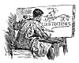
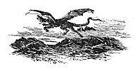

  
[Intangible Textual Heritage](../../../index)  [Sagas &
Legends](../../index)  [England](../index)  [Index](index) 
[Previous](sfq02)  [Next](sfq04) 

------------------------------------------------------------------------

p. xxv

[  
Click to enlarge](img/xxv00.jpg)

# ILLUSTRATIONS

|                                                                          |                                                                            |
|--------------------------------------------------------------------------|----------------------------------------------------------------------------|
| FRONTISPIECE--                                                           | [On the morning of the third day he slew the Dragon.](sfq00.htm#img_front) |
| [TITLE-PAGE.](sfq00.htm#img_title)                                       |                                                                            |
|                                                                          | PAGE                                                                       |
| Heading to Introduction                                                  | [vii](sfq01.htm#img_vii00)                                                 |
|    "        Contents                                                     | [xxi](sfq02.htm#img_xxi00)                                                 |
|    "        List of Illustrations                                        | [xxv](#img_xxv00)                                                          |
| Arming the Knight                                                        | [1](sfq04.htm#img_00100)                                                   |
| There rode into the city a fair lady                                     | [3](sfq04.htm#img_00300)                                                   |
| Rushing at his foe                                                       | [6](sfq05.htm#img_00600)                                                   |
| At last they chanced to meet an old man                                  | [9](sfq06.htm#img_00900)                                                   |
| "The Lady Una has left you!"                                             | [13](sfq07.htm#img_01300)                                                  |
| Sleeping quietly in her bower                                            | [14](sfq07.htm#img_01400)                                                  |
| The two knights levelled their spears and rushed at each other           | [16](sfq08.htm#img_01600)                                                  |
| When she slept, he kept watch                                            | [19](sfq09.htm#img_01900)                                                  |
| He was afraid to go too near                                             | [23](sfq09.htm#img_02300)                                                  |
| Tearing off his helmet                                                   | [24](sfq10.htm#img_02400)                                                  |
| With his sword he struck the lion                                        | [25](sfq10.htm#img_02500)                                                  |
| They saw in front of them a grand and beautiful building                 | [26](sfq11.htm#img_02600)                                                  |
| p. xxvi                                      |                                                                            |
| High above all sat the Queen                                             | [29](sfq11.htm#img_02900)                                                  |
| The coach was drawn by an ugly and ill-matched team                      | [33](sfq11.htm#img_03300)                                                  |
| Duessa stole secretly to the lodging of the pagan knight                 | [37](sfq12.htm#img_03700)                                                  |
| A poor, simple pilgrim                                                   | [45](sfq14.htm#img_04500)                                                  |
| The Knight tried to seize his weapons                                    | [48](sfq15.htm#img_04800)                                                  |
| The Prince carried him out of the castle                                 | [59](sfq17.htm#img_05900)                                                  |
| They saw a knight galloping towards them                                 | [65](sfq18.htm#img_06500)                                                  |
| They came to the place where Despair had his dwelling                    | [69](sfq19.htm#img_06900)                                                  |
| The third daughter, whose name was Love                                  | [77](sfq20.htm#img_07700)                                                  |
| It was called "The City of the Great King"                               | [81](sfq21.htm#img_08100)                                                  |
| The Red Cross Knight and Una were betrothed                              | [87](sfq23.htm#img_08700)                                                  |
| Sir Guyon and the Black Palmer                                           | [92](sfq24.htm#img_09200)                                                  |
| He saw marching to meet him a noble Knight                               | [93](sfq24.htm#img_09300)                                                  |
| A beautiful lady sat alone, weeping bitterly                             | [97](sfq25.htm#img_09700)                                                  |
| An end to all her sorrow                                                 | [103](sfq26.htm#img_10300)                                                 |
| They came to a Castle on a rock near the sea                             | [105](sfq27.htm#img_10500)                                                 |
| "Yield thyself my captive!"                                              | [110](sfq28.htm#img_11000)                                                 |
| A savage man beating a handsome youth                                    | [113](sfq29.htm#img_11300)                                                 |
| "There is now coming a knight of wondrous power".                        | [119](sfq30.htm#img_11900)                                                 |
| "Lady, you have not done right to mislead me like this                   | [123](sfq31.htm#img_12300)                                                 |
| He began with trembling hands to pour them through a hole into the earth | [129](sfq32.htm#img_12900)                                                 |
| "Behold what living eye has never seen before"                           | [135](sfq33.htm#img_13500)                                                 |
| Watched over by a beautiful angel                                        | [140](sfq34.htm#img_14000)                                                 |
| The Knights soon drove them into confusion                               | [147](sfq35.htm#img_14700)                                                 |
| The ferryman had to put forth all his strength and skill                 | [153](sfq36.htm#img_15300)                                                 |
| A pack of wild beasts rushed forward                                     | [159](sfq38.htm#img_15900)                                                 |
| Acrasia tried to set herself free                                        | [164](sfq38.htm#img_16400)                                                 |
| Disguising themselves in poor clothes                                    | [167](sfq39.htm#img_16700)                                                 |
| Hurled from his horse                                                    | [169](sfq39.htm#img_16900)                                                 |
| Britomart saw six knights                                                | [173](sfq40.htm#img_17300)                                                 |
| One of them shot a keen arrow at her                                     | [179](sfq41.htm#img_17900)                                                 |
| p. xxvii                                    |                                                                            |
| Britomart looked well at the figure of this Knight                       | [184](sfq42.htm#img_18400)                                                 |
| Deep in some work of wonder                                              | [189](sfq43.htm#img_18900)                                                 |
| Glaucé, taking down the armour, dressed her in it                        | [193](sfq44.htm#img_19300)                                                 |
| The valiant stranger was a beautiful maiden                              | [198](sfq45.htm#img_19800)                                                 |
| The flames parted on either side                                         | [203](sfq46.htm#img_20300)                                                 |
| He rode on a ravenous lion                                               | [209](sfq47.htm#img_20900)                                                 |
| Fastened to a brazen pillar                                              | [214](sfq48.htm#img_21400)                                                 |
| They presently saw two knights in armour                                 | [219](sfq49.htm#img_21900)                                                 |
| Feeding on the dead body of a milk-white palfrey                         | [225](sfq50.htm#img_22500)                                                 |
| Both champions were felled to the ground                                 | [231](sfq51.htm#img_23100)                                                 |
| Smote him sorely on the visor                                            | [237](sfq52.htm#img_23700)                                                 |
| Britomart showed her lovely Amoret                                       | [241](sfq53.htm#img_24100)                                                 |
| They heard the sound of many iron hammers                                | [247](sfq54.htm#img_24700)                                                 |
| Threatening to strike                                                    | [254](sfq55.htm#img_25400)                                                 |
| At last she was obliged to leave him                                     | [258](sfq56.htm#img_25800)                                                 |
| The rescue of Amoret                                                     | [260](sfq57.htm#img_26000)                                                 |
| A mighty man, riding on a dromedary                                      | [265](sfq57.htm#img_26500)                                                 |
| The Giant's daughter came one day in glee to the prison                  | [271](sfq58.htm#img_27100)                                                 |
| He found Pœana playing on a rote                                         | [275](sfq59.htm#img_27500)                                                 |
| The Saracen's Bridge                                                     | [280](sfq60.htm#img_28000)                                                 |
| Wild beasts ... wrongfully oppressing others of their own kind           | [283](sfq60.htm#img_28300)                                                 |
| Sir Artegall gripped him fast by his iron collar                         | [288](sfq61.htm#img_28800)                                                 |
| They beheld a giant on a rock, holding a pair of scales                  | [291](sfq62.htm#img_29100)                                                 |
| Straightway the enchanted damsel vanished into nothing                   | [299](sfq63.htm#img_29900)                                                 |
| He scourged him out of the court                                         | [303](sfq64.htm#img_30300)                                                 |
| "I helped to save her from the jaws of death"                            | [308](sfq65.htm#img_30800)                                                 |
| In the midst of them be saw a Knight pinioned                            | [312](sfq66.htm#img_31200)                                                 |
| He was dazzled with astonishment                                         | [320](sfq67.htm#img_32000)                                                 |
| She came to a window opening to the west                                 | [326](sfq68.htm#img_32600)                                                 |
| In the temple of Isis                                                    | [333](sfq69.htm#img_33300)                                                 |
| The Sultan's horses, like hungry hounds, cruelly chased him              | [342](sfq70.htm#img_34200)                                                 |
| The noise of her weeping speedily brought forth the villain              | [347](sfq71.htm#img_34700)                                                 |
| p. xxviii                                  |                                                                            |
| Artegall, with his sword Crysaor, swiftly cut off his head               | [359](sfq72.htm#img_35900)                                                 |
| Sir Calidore and the shepherds                                           | [360](sfq73.htm#img_36000)                                                 |
| A comely Squire, bound band and foot to a tree                           | [363](sfq73.htm#img_36300)                                                 |
| The Knight invited him to sit down beside them                           | [373](sfq74.htm#img_37300)                                                 |
| He saw seated on a little hillock a beautiful maiden                     | [375](sfq75.htm#img_37500)                                                 |
| The brigands made search to see who was slain                            | [383](sfq76.htm#img_38300)                                                 |
| He threw his shield on him, and pinned him to the ground                 | [391](sfq77.htm#img_39100)                                                 |

[  
Click to enlarge](img/xxviii00.jpg)

------------------------------------------------------------------------

[Next: The Court of the Queen](sfq04)
