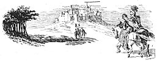

  
[Intangible Textual Heritage](../../../index)  [Sagas &
Legends](../../index)  [England](../index)  [Index](index) 
[Previous](sfq10)  [Next](sfq12) 

------------------------------------------------------------------------

[  
Click to enlarge](img/02600.jpg)

### The House of Pride

Now the Red Cross Knight, because of his lack of loyalty to Una, fell
into much danger and difficulty. His first fault was in believing evil
of her so readily, and leaving her forlorn; after that he was too easily
beguiled by the pretended goodness and beauty of

p. 27

\[paragraph continues\] Duessa. All who fight in a good cause must
beware of errors such as these. If matters do not go exactly as we wish,
we must not lose heart and get impatient; even if we cannot understand
what is happening, we must trust that all will be well. We must keep
steadily to the one true aim set before us, or else, like the Red Cross
Knight, we may be led astray by false things that are only pleasant in
appearance, and have no real goodness.

Duessa and the Knight travelled for a long way, till at last they saw in
front of them a grand and beautiful building. It seemed as if it were
the house of some mighty Prince; a broad highway led up to it, all
trodden bare by the feet of those who flocked thither. Great troops of
people of all sorts and condition journeyed here, both by day and night.
But few returned, unless they managed to escape, beggared and disgraced,
when, ever afterwards, they lived a life of misery.

To this place Duessa guided the Red Cross Knight, for she was tired with
the toilsome journey, and the day was nearly over.

It was a stately palace, built of smooth bricks, cunningly laid together
without mortar. The walls were high, but neither strong nor thick, and
they were covered with dazzling gold-foil. There were many lofty towers
and picturesque galleries, with bright windows and delightful bowers;
and on the top there was a dial to tell the time.

It was lovely to look at, and did much credit to the workman that
designed it; but it was a great pity

p. 28

that so fair a building rested on so frail a foundation. For it was
mounted high up on a sandy hill that kept shifting and falling away.
Every breath of heaven made it shake; and all the back parts, that no
one could see, were old and ruinous, though cunningly painted over.

Arrived here, Duessa and the Red Cross Knight passed in at once, for the
gates stood wide open to all. They were in charge of a porter, called
"Ill-come," who never denied entrance to any one. The hall inside was
hung with costly tapestry and rich curtains. Numbers of people, rich and
poor, were waiting here, in order to gain sight of the Lady of this
wonderful place.

Duessa and the Knight passed through this crowd, who all gazed at them,
and entered the Presence Chamber of the Queen.

What a dazzling sight met. their eyes! Such a scene of splendour had
never been known in the court of any living prince. A noble company of
lords and ladies stood on every side, and made the place more beautiful
with their presence.

High above all there was a cloth of state, and a rich throne as bright
as' the sun. On the throne, clad in royal robes, sat the Queen. Her
garments were all glittering with gold and precious jewels; but so great
was her beauty that it dimmed even the brightness of her throne. She sat
there in princely state, shining like the sun. She hated and despised
all lowly things of earth. Under her scornful feet lay a dreadful
dragon, with a hideous tall. In her hand she held a mirror in which she
often looked at her face; she took

p. 29

 

<table>
<colgroup>
<col style="width: 100%" />
</colgroup>
<tbody>
<tr class="odd">
<td><a href="img/02900.jpg"> 
Click to enlarge</a> 

''Lo! underneath her scornful feet was layn 
A dreadful dragon with a hideous trayne; 
And in her hand she held a mirrhour bright, 
Wherein her face she often viewed fayne, 
And in her self-loved semblance took delight.'' 
</td>
</tr>
</tbody>
</table>

 

p. 31

great delight in her own appearance, for she was fairer than any living
woman.

She was the daughter of grisly Pluto, King of Hades, and men called her
proud Lucifera. She had crowned herself a queen, but she had no rightful
kingdom at all, nor any possessions The power which she had obtained she
had usurped by wrong and tyranny. She ruled her realm not by laws, but
by craft, and according to the advice of six old wizards, who with their
bad counsels upheld her kingdom.

As soon as the Knight and Duessa came into the presence-chamber, an
usher, by name *Vanity*, made room and prepared a passage for them, and
brought them to the lowest stair of the high throne. Here they made a
humble salute, and declared that they had come to see the Queen's royal
state, and to prove if the wide report of her great splendour were true.

With scornful eyes, half unwilling to look so low, she thanked them
disdainfully, and did not show them any courtesy worthy of a queen,
scarcely even bidding them arise. The lords and ladies of the court,
however, were all eager to appear well in the eyes of the strangers.
They shook out their ruffles, and fluffed up their curls, and arranged
their gay attire more trimly; and each one was jealous and spiteful of
the others.

They did their best to entertain the Knight, and would gladly have made
him one of their company. To Duessa, also, they were most polite and
gracious, for formerly she had been well known in that court. But to the
knightly eyes of the warrior all the glitter of the crowd seemed vain
and worthless, and he thought.

p. 32

that it was unbefitting so great a queen to treat a strange knight with
such scant courtesy.

Suddenly, Queen Lucifera rose from her throne, and called for her coach.
Then all was bustle and confusion, every one rushing violently forth.
Blazing with brightness she paced down the hall, like the sun dawning in
the east. All the people thronging the hall thrust and pushed each other
aside to gaze upon her. Her glorious appearance amazed the eyes of all
men.

Her coach was adorned with gold and gay garlands, and was one of the
most splendid carriages ever seen, but it was drawn by an ugly and
ill-matched team. On every animal rode one of her evil Councillors, who
was much like in nature to the creature that carried him.

The first of these, who guided all the rest, was *Idleness*, the nurse
of Sin. He chose to ride a slothful ass; he looked always as if he were
half asleep, and as if he did not know whether it were night or day. He
shut himself away from all care, and shunned manly exercise, but if
there were any mischief to be done he joined in it readily. The Queen
was indeed badly served who had Idleness for her leading Councillor.

Next to him came *Gluttony*, riding on a pig; then *Self-indulgence* on
a goat, *Avarice* on a camel, *Envy* on a wolf, and *Wrath* on a lion.
Each in his own way was equally hideous and hateful.

As they went along, crowds of people came round, shouting for joy;
always before them a foggy mist sprang up, covering all the land, and
under their feet lay the dead bones of men who had wandered from the
right path.

p. 33

 

<table>
<colgroup>
<col style="width: 100%" />
</colgroup>
<tbody>
<tr class="odd">
<td><a href="img/03300.jpg"> 
Click to enlarge</a> 

''. . . This was drawne of six unequall beasts 
On which her six sage Counsellours did ryde.'' 
</td>
</tr>
</tbody>
</table>

 

p. 34

So forth they went in this goodly array to enjoy the fresh air, and to
sport in the flowery meadows. Among the rest, next to the chariot, rode
the false Duessa, but the good Knight kept far apart, not joining in the
noisy mirth which seemed unbefitting a true warrior.

Having enjoyed themselves awhile in the pleasant fields, they returned
to the stately palace. Here they found that a wandering knight had just
arrived. On his shield, in red letters, was written the name "Sans Joy,"
which means *Joyless*, and he was the brother of *Faithless*, whom the
Red Cross Knight had slain, and of *Lawless*, who had taken Una captive.
He looked sullen and revengeful, as if he had in his mind bitter and
angry thoughts.

When he saw the shield of his slain brother, Faithless, in the hands of
the Red Cross Knight's page, he sprang at him and snatched it away. But
the Knight had no mind to lose the trophy which he had won in battle,
and, attacking him fiercely, he again got possession of it.

Thereupon they hastily began to prepare for battle, clashing their
shields and shaking their swords in the air. But the Queen, on pain of
her severe displeasure, commanded them to restrain their fury, saying
that if either had a right to the shield, they should fight it out
fairly the next day.

That night was passed in joy and gaiety, feasting and making merry in
bower and hall. The steward of the court was *Gluttony*, who poured
forth lavishly of his abundance to all; and then the chamberlain,
*Sloth*, summoned them to rest.

------------------------------------------------------------------------

[Next: The Battle for the Shield](sfq12)
