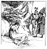

  
[Intangible Textual Heritage](../../../index)  [Sagas &
Legends](../../index)  [England](../index)  [Index](index) 
[Previous](sfq24)  [Next](sfq26) 

------------------------------------------------------------------------

### Friend or Foe?

Archimago and Sir Guyon came presently to a place where a beautiful lady
sat alone, with torn clothes and ruffled hair; she was weeping bitterly
and wringing her

p. 97

hands, and when Sir Guyon asked her the cause of her grief, she said it
was because she had been most cruelly treated by a rough knight.

This lady who seemed so good and gentle was, in

[  
Click to enlarge](img/09700.jpg)

reality, no other than Duessa (or *Falsehood*), who had formerly led the
Red Cross Knight into such trouble. Her old companion, Archimago, had
found her wandering forlorn in the desert whither she had been banished

p. 98

by Prince Arthur, and had again decked her out in fine clothes and
ornaments, so that she might help him in his wicked schemes.

Her cunning quite deceived Sir Guyon, who believed everything she told
him.

"Be comforted, fair lady," he said, "and tell me who did this, so that I
can punish him at once."

"I do not know his name," she replied, "but he rode a dappled grey
steed, and on his silver shield there was a red cross."

When Sir Guyon heard this he was amazed.

"I cannot think how that knight could have done such a deed," he said,
"for I can say boldly he is a right good knight. I was present when he
first took arms and started out to help the Lady Una, since when he has
won great glory, as I have heard tell. Nevertheless, he shall be made to
explain this, and if he cannot clear himself of all blame, be sure he
shall be well punished."

Duessa was greatly pleased when she heard this, for now she hoped there
would be a quarrel between the two knights.

Archimago then led Sir Guyon by an unknown way through woods and across
mountains, till they came at last to a pleasant dale which lay between
two hills. A little river ran through this valley, and by it sat a
knight with his helmet unlaced, refreshing himself with the cool water
after his long journey and hard work.

"Yonder is the man!" cried Archimago. "He has come here thinking to hide
himself, but in vain, for you will soon make him repent of his cruelty.

p. 99

\[paragraph continues\] All success to you! We will stay here, and watch
from a distance."

Archimago and Duessa left Sir Guyon, who immediately rushed forward to
the attack. The stranger, seeing a knight hurrying so fiercely towards
him, seized his own weapons, prepared for battle, and sprang to meet
him. Vie two had almost met when Sir Guyon suddenly lowered his spear.

"Mercy, Sir Knight! Mercy!" he cried. "Pardon my rashness, that had
almost led me to disgrace my honour by raising my weapon against the
sacred badge on your shield."

When the Red Cross Knight, for he indeed it was, heard the other's
voice, he knew him at once,

"Ah! dear Sir Guyon," he said, bowing courteously, "it is I rather who
should be blamed. In my reckless haste I almost did violence to the
image of Queen Gloriana which I now see inscribed on your shield. The
fault is mine!"

So the two knights made friends, and talked very happily together, and
Sir Guyon explained how he had been cheated by Archimago and Duessa, who
had both now fled away. Then up came Guyon's guide, Conscience, and as
soon as his eye fell on the Red Cross Knight, he knew him, for he had
seen him at the court of Queen Gloriana.

"Joy be with you, and everlasting fame, for the great deeds you have
done!" he cried. "Your glorious name is enrolled in the heavenly
register, where you have won a seat among the saints. But we luckless
mortals are only now beginning to run the race in which you

p. 100

have gained such renown." Then to his master he said, " God grant you,
Guyon, to end your work well, and bring your weary bark safely to the
wished-for haven."

"Palmer," said the Red Cross Knight, "give the praise to GOD, to whom
all honour is due, and who made my hand the organ of His might.
Attribute nothing to me except a willing heart; for all that I did, I
only did as I ought. But as for you, fair sir, whose turn it is now," he
added to Guyon, "may you prosper as well as you can wish, and may we
hear thrice happy tidings of you; for you are indeed worthy, both in
courage and gentle manners."

Then the two Knights took leave of each other with much courtesy and
goodwill. Sir Guyon went forward on his journey, still guided by the
Black Palmer, who led him over hill and dale, pointing out the way with
his staff, and by his wise judgment guarding his master from all dangers
into which his own hasty nature might have made him fall.

------------------------------------------------------------------------

[Next: The Story of the Knight and the Lady](sfq26)
