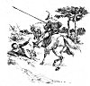

  
[Intangible Textual Heritage](../../../index)  [Sagas &
Legends](../../index)  [England](../index)  [Index](index) 
[Previous](sfq27)  [Next](sfq29) 

------------------------------------------------------------------------

### Braggadochio

As soon as it was dawn, Sir Guyon arose, and, mindful of his appointed
work, armed himself again for the journey.

The little baby whom he had rescued he entrusted

p. 109

to the tender care of Medina, entreating her to train him up as befitted
his noble birth. Then, since his good steed had been stolen from him, he
and the Palmer fared forward on foot.

It will be remembered that when Sir Guyon heard the cries for help of
the Lady Amavia, he dismounted, and ran into the thicket, leaving his
horse outside. While he was absent, there wandered that way an idle,
worthless fellow, called Braggadochio. This was a man who never did
anything great or good, but who was extremely vain and boastful, and
always trying to make out that he was somebody grand. When he saw the
beautiful horse with its golden saddle and rich trappings, and Sir
Guyon's spear, he immediately took possession of them, and hurried away.
He was so puffed up with self-conceit that he felt now as if he were
really some noble knight, and he hoped that every one else would think
the same of him. He determined to go first to court, where he thought
such a gallant show would at once attract notice and gain him favour. '

Braggadochio had never been trained in chivalry; he rode very badly, and
could not manage Sir Guyon's splendid high-spirited horse in the least.
He managed, however, to stick on somehow, and presently, seeing a man
sitting on a bank by the roadside, and wishing to show off, he rode at
him, pretending to aim at him with his spear. The silly fellow fell flat
down with fear, crying out for mercy. Braggadochio was very proud and
delighted at this, and shouted at him in a loud voice, "Die, or yield
thyself my captive!" The man was so terrified that he promised at once
to become

p. 110

\[paragraph continues\] Braggadochio's servant. So the two went on
together. They were excellently well suited, for both were vain, and
false, and cowardly, while Braggadochio tried to get his own way, by
bluster, and his companion by cunning.

[  
Click to enlarge](img/11000.jpg)

Trompart (or *Deceit*), for that was the man's name, speedily discovered
the folly of his master. He was very wily-witted and well accustomed to
every form of cunning trickery, and, to suit his own purpose, he
flattered tip Braggadochio, and did all he could to encourage his idle
vanity.

p. 111

Presently, as the two went along, they met the wicked magician,
Archimago (or *Hypocrisy*), who was now just as angry with Sir Guyon as
he had been before with the Red Cross Knight. When he saw Braggadochio,
he thought he had found a good opportunity to be revenged on both the
knights, and, going up to him, he asked if he would be willing to fight
them.

Braggadochio immediately pretended to fall into a great rage against
them, and said he would slay them both. Then Archimago, seeing that he
had no sword, warned him that he must arm himself with the very best
weapons, for they were two of the mightiest warriors living.

"Silly old man said!" Braggadochio boastfully. "Stop giving advice.
Isn't one brave man enough, without sword or shield, to make an army
quail? You little know what this right hand can do. Once, when I killed
seven knights with one sword, I swore thenceforward never to wear a
sword in battle again, unless it could be the one that the noblest
knight on earth wears."

"Good!" said the magician quickly; "that sword you shall have very
shortly. For now the best and noblest knight alive is Prince Arthur, who
lives in the land of the Faerie Queene. He has a sword that is like a
flaming brand. I will undertake that, by my devices, this sword is found
to-morrow at your side."

At these words the boaster began to quake, for he could not think who it
was that spoke like this. Then Archimago suddenly vanished, for the
north wind, at his command, carried him away, lifting him high into the
air.

p. 112

Braggadochio and Deceit looked all about, but could find no trace of
him. Nearly dead with fright, they both fled, never turning to look
round till, at last, they came to a green forest where they hid
themselves. Even here fear followed them, and every trembling leaf and
rustle of the wind made their hair stand on end.

------------------------------------------------------------------------

[Next: Fury's Captive](sfq29)
