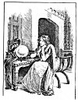

  
[Intangible Textual Heritage](../../../index)  [Sagas &
Legends](../../index)  [England](../index)  [Index](index) 
[Previous](sfq41)  [Next](sfq43) 

------------------------------------------------------------------------

### How Britomart looked into the Magic Mirror

As Britomart and the Knight journeyed away from Castle Joyous, it came
into the Knight's mind to ask the Princess what had brought her into
that part of the country, and why she disguised herself thus: for she
seemed a beautiful lady when she was dressed as one, but the handsomest
knight alive when she was clad in armour.

"Fair sir," replied Britomart, "I would have you know that from the hour
when I left my nurse's arms, I have been trained up in warlike ways, to
toss spear and shield, and to meet and overthrow warrior knights. I
loathe to lead the lazy life of pleasure that most ladies do, fingering
fine needle and fancy thread; I would rather die at the point of the
foeman's spear. All my delight is set on deeds of arms, to hunt out

p. 182

perils and adventures wherever they may be met by sea or land, not for
riches nor for reward, but only for glory and honour. For this reason, I
came into these parts, far from my native country, without map or
compass, to seek for praise and fame.

"For report has blazed forth that here, in the land of the Faerie
Queene, many famous knights and ladies dwell, and many strange
adventures can be found, out of which much glory may be won; and to
prove this, I have begun this voyage. But may I ask of you, courteous
Knight, tidings of one who has behaved very badly to me, and con whom I
am seeking to revenge myself; he is called Artegall."

Britomart did not mean what she said of Artegall; she only spoke like
this to conceal her real feelings. As soon as the words were uttered she
repented, and would have recalled them, but her companion answered
almost before she had finished speaking. He said she was very wrong to
upbraid so scornfully a gentle Knight, for of all who ever rode at tilt
or tourney, the noble Artegall was the most renowned. It would be very
strange, therefore, if any shameful thought ever entered his mind, or if
he did any deed deserving of blame, for noble courage does nothing
unworthy of itself.

Britomart grew wonderfully glad to hear her love thus highly praised,
and rejoiced that she had given her heart to one so gallant; but in
order to lead the Knight to speak further in the same style, she still
pretended to find fault with Artegall, and asked where he might be
found, because she wanted to fight with him.

p. 183

"Ah, if only reason could persuade you to soften your anger!" said the
Knight. "It is a bold thing to imagine you can bind a man like this down
to hard conditions, or to hope to match in equal fight one whose prowess
has no living rival. Besides, it is not at all easy to tell where or how
he can be found, for he never dwells in any settled spot, but roams all
over the world, always doing noble deeds, defending the rightful cause
of women and orphans, whenever he hears they are oppressed by might or
tyranny. Thus he wins the highest honour."

These words sank into Britomart's heart, and filled her with rapture;
but still she would not let her companion see it.

"Since it is so difficult to find Sir Artegall," she said, "tell me some
marks by which he may be known, in case I happen to meet him by chance.
What is he like? What is his shield--his arms--his steed--and anything
else that may distinguish him?"

The Knight set himself to point out all these, and described Sir
Artegall in every particular.

But Britomart knew already exactly what Sir Artegall was like; and this
is how she came to know it.

Long ago in Britain she had seen his image plainly revealed in a magic
mirror, and ever since then she had loved no one else.

For in the days when her father, King Ryence, reigned over South Wales,
Merlin, the great magician, had by his spells devised a wonderful
looking-glass, the fame of which soon went through all the world.

p. 184

For this mirror had the power of showing perfectly whatever thing the
world contained, between heaven

[  
Click to enlarge](img/18400.jpg)

and earth, provided it had to do with the person who looked into it.
Whatever a foe had done, or a friend

p. 185

had feigned, was revealed in this mirror, and it was impossible to keep
anything secret from it.

The mirror was round and hollow, and seemed like a great globe of glass.
Merlin gave it to King Ryence as a safeguard, so that if foes ever
invaded his kingdom he would always know it at home before he heard
tidings, and thus be able to prevent them. A present which could thus
detect treason and overthrow enemies, was a famous one for a prince.

One day Britomart happened to go into her father's private room. Nothing
was kept hidden from her, for she was his only daughter, and his heir.
When she spied the mirror, she first looked in to see herself, but in
vain. Then, remembering the strange power it was said to possess, she
tried to think of some interesting thing that concerned herself, and
thus she wondered what husband fortune would allot to her.

Immediately there was presented to her eyes the picture of a gallant
Knight, clad in complete armour. His face, under the uplifted visor of
the helmet, showed forth like the sun, to terrify his foes and make glad
his friends. His heroic grace and noble bearing added to the grandeur of
his figure.

His crest was a crouching hound, and all his armour seemed of an antique
fashion, but was wonderfully massive and stout, and fretted all round
with gold; written on it in ancient lettering were the words--

"Achilles arms, which Artegall did win."

On his shield he bore the device of a little crowned ermine on an azure
field.

p. 186

Britomart looked well at the figure of this Knight, and liked it well,
and then went on her way, never dreaming that her future fate lay hidden
at the bottom of this globe of glass.

------------------------------------------------------------------------

[Next: How Britomart went to the Cave of the Magician Merlin](sfq43)
