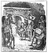

  
[Intangible Textual Heritage](../../../index)  [Sagas &
Legends](../../index)  [England](../index)  [Index](index) 
[Previous](sfq44)  [Next](sfq46) 

------------------------------------------------------------------------

### How Britomart came to the Castle of the Churl Malbecco

One night, as Britomart was riding on her way, a fearful storm came on,
great blasts of wind and a pelting shower of hall. Seeing a Castle in
front of her, she went up to it, and earnestly begged to be let In. But
the Castle belonged to a miserly churl, called Malbecco, who, because of
his jealous and peevish disposition, refused to allow any strangers to
enter his doors. He cared nothing what men said of him, good or bad; all
his mind was set upon hoarding up heaps of ill-gotten gain. He was old
and ugly, and lacking in all kindness and courtesy. Instead of opening
his doors to all wandering knights, as was the custom of the time, he
kept them close-barred, and even in the midst of the terrible tempest
which was then raging, Britomart was flatly refused entrance. She was
greatly displeased at this, and determined when the time came to punish
the churl for his discourtesy.

p. 197

But, in order to escape the fury of the gale, she was compelled to seek
some refuge near. Beside the Castle gate was a little shed, meant for
swine, but when she tried to enter she found it already full of guests.
Another party of knights had been refused admittance at the Castle, and
were forced to fly there for shelter. These would not at first allow
Britomart to enter, whereupon she grew very angry, and declared she
would either lodge with them in a friendly fashion, or she would turn
them all out of the shed, whether they were willing or not, and then she
challenged them to come forth and fight.

The knights would now have been willing to let her come in, but her
boastful tone irritated them; one of them, Paridell by name, was
especially annoyed,. and hastily mounting his steed he rode forth to
fight with her. Their spears met with such fury that both man and horse
were borne to the ground, and Paridell was so sorely bruised that he
could scarcely arise to continue the combat on foot, with swords, as was
then the custom.

But his companion, Sir Satyrane (who was the good Knight who had
formerly befriended Una in the forest), stepped forward to prevent
Britomart and Paridell from fighting further, and his, wise speeches
soon soothed their anger. When peace was restored, they agreed to join
together to punish the unmannerly churl, who had acted so ungraciously
in refusing them shelter from the tempest, and they went towards the
gates to burn them down.

Malbecco, seeing that they were really resolved to

p. 198

set fire to the building, rail frantically, and called to them from the
castle wall, beseeching them humbly to have patience with him, as being
ignorant of his servants' rudeness and inattention to strangers. The

[  
Click to enlarge](img/19800.jpg)

knights were willing to accept his excuses, though they did not believe
them, and they did not refuse to enter.

They were brought into a beautiful bower, and served with everything
needful, though their host

p. 199

secretly scowled at them, and welcomed them more through fear than
charity. They took off their wet garments, and undid their heavy armour,
to dry themselves at the fire. Britomart, like the rest, was forced to
disarray herself. When she lifted her helmet, and her golden locks fell
like a cloud of light to the ground, they were all amazed to find the
valiant stranger was a beautiful maiden. They stood gazing at her,
silent with astonishment, for eve had never seen a fairer woman, but
chiefly they marvelled at her chivalry and noble daring. They longed to
know who she might be, yet no one questioned her, and every one loved
her on the spot.

Supper was then served, and when the meal was over the Lady Hellenore,
wife of Malbecco, invited all the knights to tell their name and
kindred, and any deeds of arms they had done. They talked so long about
their various strange adventures, and the daring feats and many dangers
they had passed through, that old Malbecco grew quite impatient. He took
no interest in conversation of this kind. At last, when the night was
half spent, he persuaded them to go to rest; so they all retired to the
rooms prepared for them.

The next day, as soon as the sun shone in the sky, Britomart rose up and
set forth on her journey. Sir Satyrane went with her, but Paridell
pretended to have been so much hurt by his fight with Britomart that he
must stay behind at the Castle till his wounds were cured.

------------------------------------------------------------------------

[Next: How Britomart walked through Fire](sfq46)
