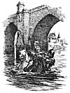

  
[Intangible Textual Heritage](../../../index)  [Sagas &
Legends](../../index)  [England](../index)  [Index](index) 
[Previous](sfq60)  [Next](sfq62) 

------------------------------------------------------------------------

### The Adventure of the Saracen's Bridge

Sir Artegall soon came to the place where he saw the Saracen ready armed
on the bridge, waiting for spoil. When he and Talus drew near to cross
it, an ugly-looking rascal came to them to demand passage-money,
according to the custom of the law. "Lo, there are your wages!" said Sir
Artegall, and smote him so that he died.

When the Pagan saw this he grew very angry, and at once prepared himself
for battle; nor was Sir Artegall behind, so they both ran at each other
with levelled spears. Right in the middle, where they would have met
breast to breast, a trap was let down to make them fall into the river.
The wicked wretch leaped down, knowing well that his foe would fall; but
Sir Artegall was on his guard, and also leaped before he fell,

p. 287

Then both of them being in the stream they flew at each other violently,
the water in no way cooling the heat of their temper but rather adding
to it. But there the Saracen, who was well used to fighting in the
water, had great advantage, and often almost overthrew Sir Artegall. The
charger, also, which he rode could swim like a fish.

When Sir Artegall saw the odds against him, he knew there was no way but
to close hastily with his foe, and driving strongly at Pollenté he
gripped him fast by his iron collar, and almost throttled him. There
they strove and struggled together, each trying to drag the other from
his horse, but nothing could make Artegall slacken his grip. At length
he forced Pollenté to forsake his horse's back, for fear of being
drowned, and to betake himself to his swimming. There Pollenté had no
advantage, for Artegall was skilful in swimming, and dared venture in
any depth of Water. So every knight exposed to peril should be expert in
swimming and able to make his way through water,

For some time the end of the contest was doubtful, for besides being
skilled in that exercise, both were well trained in arms and thoroughly
tried Artegall, however, kept his breath and strength better, so that
his foe could no longer withstand him, nor bear himself upright, but
fled from the water to the land. Artegall, wit h his bright sword,
Chrysaor, pursued him so closely that Pollenté had scarcely set foot on
shore before his head was cut off.

This done, Sir Artegall took his way to the castle

p. 288

in which Munera dwelt, guarded by many defenders Artegall sought
entrance, but was refused and defied

[  
Click to enlarge](img/28800.jpg)

with a torrent of evil abuse. He was also beaten with stones flung down
from the battlements, so that he was

p. 289

forced to retire, and he bade his servant Talus invent some way by which
he could enter without danger.

Then Talus went to the castle gate, and let fly at it with his iron
flail, so that it sorely terrified all the warders, and made those stoop
who had borne themselves so proudly. He battered and banged on the door,
and thundered strokes so hideously that he shook the very foundations of
the building, and filled all the house with fear and uproar.

At this noise the Lady Munera appeared on the castle wall. When she saw
the dangerous state in which she stood, she feared she would soon be
destroyed, and began with fair words to entreat the Iron Man below to
cease his outrage; for neither the force of the stones which they threw,
nor the power of charms which she wrought against him could make him
stop.

But when she saw him proceed, unmoved by pity or by prayers, she tried
to bribe him with a goodly reward. She caused great sacks with countless
riches to be brought to the battlements, and poured over the castle
wall, so that she might gain some time, though dearly bought, whilst he
gathered up the gold.

Talus was not in the least moved or tempted by this, but still continued
his assault with the iron flail, so that at length he rent down the
door, and made a way for his master. When Artegall entered, it was no
use for any one to try to withstand him. They all fled; their hearts
failed them, and they hid in corners here and there; and their wicked
lady herself, half-dead, hid in terror. For a long time no one could
find

p. 290

her, but Talus, who, like a bloodhound, could track out secret things,
at length found her where she Jay hidden under a heap of gold, and
dragged her forth. Sir Artegall himself pitied her sad plight, but he
could not change the course of justice. Like her father, Munera had to
be punished, in order to warn all mighty people who possess great power
that they must use it in the right way, and not oppress the feeble. The
Tyrant's daughter was thrown into the water, and the stream washed her
away.

Then Talus took all the ill-gotten gold and treasure which her father
had scraped together by hook and crook, and burning it into ashes,
poured it into the river. Lastly, he pulled down the castle to its very
foundation, and broke up all the hewn stones, so that there could be no
hope of its being restored, nor memory of it among any nation. All which
Talus having thoroughly performed, Sir Artegall reformed the evil
fashion and wicked customs of the bridge; and this done, he returned to
his former journey.

------------------------------------------------------------------------

[Next: The Giant with the Scales](sfq62)
