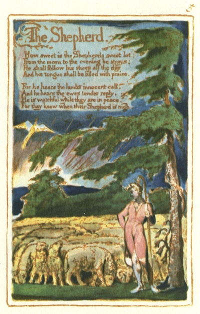

  
[Intangible Textual Heritage](../../../index)  [Legends and
Sagas](../../index)  [England](../index)  [Index](index) 
[Previous](sie03)  [Next](sie05) 

------------------------------------------------------------------------

[Buy this Book at
Amazon.com](https://www.amazon.com/exec/obidos/ASIN/1854377299/internetsacredte)

------------------------------------------------------------------------

  
*Songs of Innocence and of Experience*, by William Blake, \[1789-1794\],
at Intangible Textual Heritage

------------------------------------------------------------------------

p. 5

 

### The Shepherd.

How sweet is the Shepherds sweet lot,  
From the morn to the evening he strays:  
He shall follow his sheep all the day  
And his tongue shall be filled with praise.

For he hears the lambs innocent call.  
And he hears the ewes tender reply.  
He is watchful while they are in peace,  
For they know when their Shepherd is nigh.

------------------------------------------------------------------------

[Next: The Ecchoing Green](sie05)
