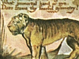
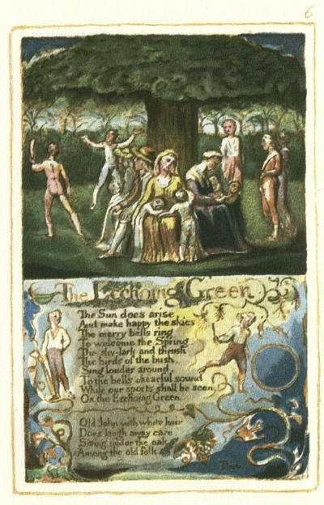
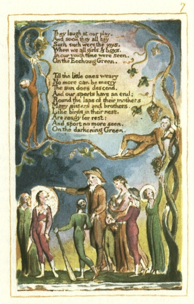

  
[Intangible Textual Heritage](../../../index)  [Legends and
Sagas](../../index)  [England](../index)  [Index](index) 
[Previous](sie04)  [Next](sie06) 

------------------------------------------------------------------------

[Buy this Book at
Amazon.com](https://www.amazon.com/exec/obidos/ASIN/1854377299/internetsacredte)

------------------------------------------------------------------------

  
*Songs of Innocence and of Experience*, by William Blake, \[1789-1794\],
at Intangible Textual Heritage

------------------------------------------------------------------------

p. 6

 

### The Ecchoing Green

The Sun does arise,  
And make happy the skies.  
The merry bells ring,  
To welcome the Spring.  
The sky-lark and thrush,  
The birds of the bush,  
Sing louder around,  
To the bells chearful sound,  
While our sports shall be seen  
On the Ecchoing Green.

Old John with white hair  
Does laugh away care,  
Sitting under the oak,  
Among the old folk.

*They*

p. 7

 

They laugh at our play,  
And soon they all say,  
Such such were the joys,  
When we all girls & boys,  
In our youth time were seen,  
On the Ecchoing Green.

Till the little ones weary  
No more can be merry  
The sun does descend,  
And our sports have an end:  
Round the laps of their mothers,  
Many sisters and brothers,  
Like birds in their nest,  
Are ready for rest:  
And sport no more seen,  
On the darkening Green.

------------------------------------------------------------------------

[Next: The Lamb](sie06)
