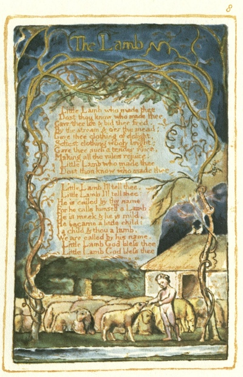

  
[Intangible Textual Heritage](../../../index)  [Legends and
Sagas](../../index)  [England](../index)  [Index](index) 
[Previous](sie05)  [Next](sie07) 

------------------------------------------------------------------------

[Buy this Book at
Amazon.com](https://www.amazon.com/exec/obidos/ASIN/1854377299/internetsacredte)

------------------------------------------------------------------------

  
*Songs of Innocence and of Experience*, by William Blake, \[1789-1794\],
at Intangible Textual Heritage

------------------------------------------------------------------------

p. 8

 

### The Lamb

  Little Lamb who made thee  
  Dost thou know who made thee  
Gave thee life & bid thee feed,  
By the stream & o’er the mead;  
Gave thee clothing of delight,  
Softest clothing wooly bright;  
Gave thee such a tender voice,  
Making all the vales rejoice:  
  Little Lamb who made thee  
  Dost thou know who made thee

  Little Lamb I'll tell thee,  
  Little Lamb Ill tell thee;  
He is called by thy name,  
For he calls himself a Lamb:  
He is meek & he is mild,  
He became a little child:  
I a child & thou a lamb,  
We are called by his name.  
  Little Lamb God bless thee,  
  Little Lamb God bless thee.

------------------------------------------------------------------------

[Next: The Little Black Boy](sie07)
