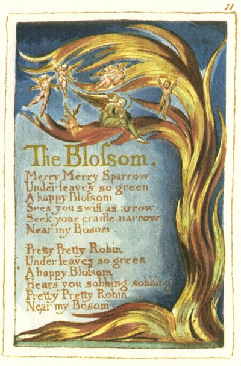

  
[Intangible Textual Heritage](../../../index)  [Legends and
Sagas](../../index)  [England](../index)  [Index](index) 
[Previous](sie07)  [Next](sie09) 

------------------------------------------------------------------------

[Buy this Book at
Amazon.com](https://www.amazon.com/exec/obidos/ASIN/1854377299/internetsacredte)

------------------------------------------------------------------------

  
*Songs of Innocence and of Experience*, by William Blake, \[1789-1794\],
at Intangible Textual Heritage

------------------------------------------------------------------------

p. 11

 

### The Blossom.

Merry Merry Sparrow  
Under leaves so green  
A happy Blossom  
Sees you swift as arrow  
Seek your cradle narrow  
Near my Bosom.

Pretty Pretty Robin  
Under leaves so green  
A happy Blossom  
Hears you sobbing sobbing  
Pretty Pretty Robin  
Near my Bosom.

------------------------------------------------------------------------

[Next: The Chimney Sweeper](sie09)
