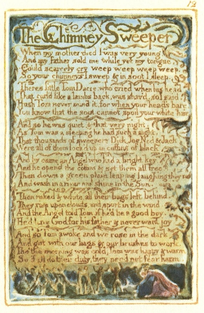

  
[Intangible Textual Heritage](../../../index)  [Legends and
Sagas](../../index)  [England](../index)  [Index](index) 
[Previous](sie08)  [Next](sie10) 

------------------------------------------------------------------------

[Buy this Book at
Amazon.com](https://www.amazon.com/exec/obidos/ASIN/1854377299/internetsacredte)

------------------------------------------------------------------------

  
*Songs of Innocence and of Experience*, by William Blake, \[1789-1794\],
at Intangible Textual Heritage

------------------------------------------------------------------------

p. 12

 

### The Chimney Sweeper

When my mother died I was very young,  
And my father sold me while yet my tongue,  
Could scarcely cry weep weep weep weep.

So your chimneys I sweep & in soot I sleep.  
Theres little Tom Dacre, who cried when his head  
That curl’d like a lambs back, was shav’d, so I said,  
Hush Tom never mind it, for when your head's bare,  
You know that the soot cannot spoil your white hair.

And so he was quiet, & that very night,  
As Tom was a sleeping he had such a sight,  
That thousands of sweepers Dick, Joe, Ned & Jack  
Were all of them lock’d up in coffins of black,

And by came an Angel who had a bright key,  
And he open’d the coffins & set them all free.  
Then down a green plain leaping laughing they run  
And wash in a river and shine in the Sun.

Then naked & white, all their bags left behind,  
They rise upon clouds, and sport in the wind.  
And the Angel told Tom, if he’d be a good boy,  
He’d have God for his father & never want joy.

And so Tom awoke and we rose in the dark  
And got with our bags & our brushes to work.  
Tho’ the morning was cold, Tom was happy & warm.  
So if all do their duty, they need not fear harm.

------------------------------------------------------------------------

[Next: The Little Boy lost](sie10)
