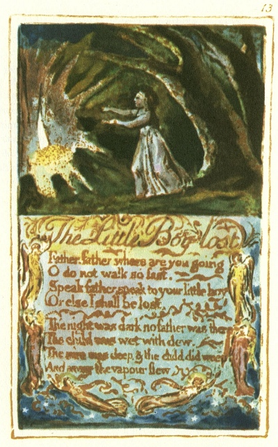

  
[Intangible Textual Heritage](../../../index)  [Legends and
Sagas](../../index)  [England](../index)  [Index](index) 
[Previous](sie09)  [Next](sie11) 

------------------------------------------------------------------------

[Buy this Book at
Amazon.com](https://www.amazon.com/exec/obidos/ASIN/1854377299/internetsacredte)

------------------------------------------------------------------------

  
*Songs of Innocence and of Experience*, by William Blake, \[1789-1794\],
at Intangible Textual Heritage

------------------------------------------------------------------------

p. 13

 

### The Little Boy lost

Father, father, where are you going  
O do not walk so fast.  
Speak father, speak to your little boy  
Or else I shall be lost,

The night was dark no father was there  
The child was wet with dew.  
The mire was deep, & the child did weep  
And away the vapour flew.

------------------------------------------------------------------------

[Next: The Little Boy found](sie11)
