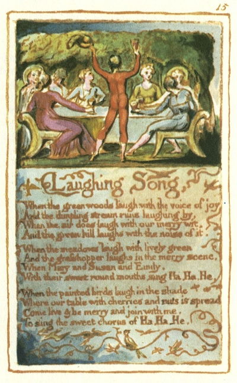

  
[Intangible Textual Heritage](../../../index)  [Legends and
Sagas](../../index)  [England](../index)  [Index](index) 
[Previous](sie11)  [Next](sie13) 

------------------------------------------------------------------------

[Buy this Book at
Amazon.com](https://www.amazon.com/exec/obidos/ASIN/1854377299/internetsacredte)

------------------------------------------------------------------------

  
*Songs of Innocence and of Experience*, by William Blake, \[1789-1794\],
at Intangible Textual Heritage

------------------------------------------------------------------------

p. 15

 

### Laughing Song,

When the green woods laugh with the voice of joy  
And the dimpling stream runs laughing by,  
When the air does laugh with our merry wit,  
And the green hill laughs with the noise of it.

When the meadows laugh with lively green  
And the grasshopper laughs in the merry scene,  
When Mary and Susan and Emily,  
With their sweet round mouths sing Ha, Ha, He.

When the painted birds laugh in the shade  
Where our table with cherries and nuts is spread  
Come live & be merry and join with me,  
To sing the sweet chorus of Ha, Ha, He.

------------------------------------------------------------------------

[Next: A Cradle Song](sie13)
