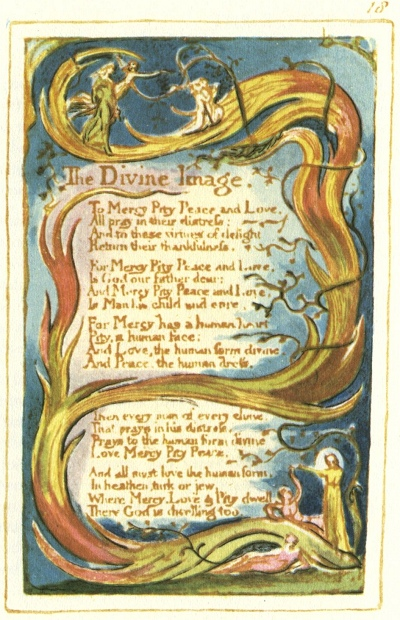

  
[Intangible Textual Heritage](../../../index)  [Legends and
Sagas](../../index)  [England](../index)  [Index](index) 
[Previous](sie13)  [Next](sie15) 

------------------------------------------------------------------------

[Buy this Book at
Amazon.com](https://www.amazon.com/exec/obidos/ASIN/1854377299/internetsacredte)

------------------------------------------------------------------------

  
*Songs of Innocence and of Experience*, by William Blake, \[1789-1794\],
at Intangible Textual Heritage

------------------------------------------------------------------------

p. 18

 

### The Divine Image.

To Mercy Pity Peace and Love,  
All pray in their distress:  
And to these virtues of delight  
Return their thankfulness.

For Mercy Pity Peace and Love,  
Is God our father dear:  
And Mercy Pity Peace and Love,  
Is Man his child and care.

For Mercy has a human heart  
Pity, a human face:  
And Love, the human form divine,  
And Peace, the human dress.

Then every man of every clime,  
That prays in his distress,  
Prays to the human form divine  
Love Mercy Pity Peace.

And all must love the human form,  
In heathen, turk or jew.  
Where Mercy, Love & Pity dwell,  
There God is dwelling too.

------------------------------------------------------------------------

[Next: Holy Thursday](sie15)
