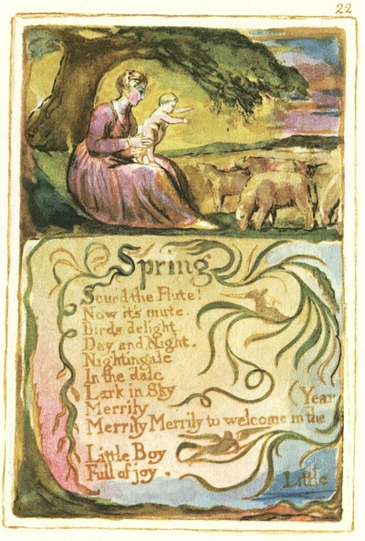
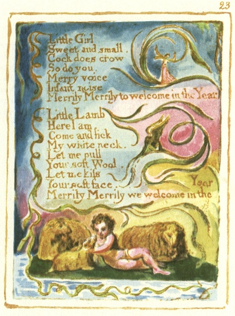

  
[Intangible Textual Heritage](../../../index)  [Legends and
Sagas](../../index)  [England](../index)  [Index](index) 
[Previous](sie16)  [Next](sie18) 

------------------------------------------------------------------------

[Buy this Book at
Amazon.com](https://www.amazon.com/exec/obidos/ASIN/1854377299/internetsacredte)

------------------------------------------------------------------------

  
*Songs of Innocence and of Experience*, by William Blake, \[1789-1794\],
at Intangible Textual Heritage

------------------------------------------------------------------------

p. 22

 

### Spring

Sound the Flute!  
Now it's mute.  
Birds delight  
Day and Night.  
Nightingale  
In the dale  
Lark in Sky  
Merrily  
Merrily Merrily to welcome in the Year

Little Boy  
Full of joy.

*Little*

p. 23

 

Little Girl  
Sweet and small.  
Cock does crow  
So do you.  
Merry voice  
Infant noise  
Merrily Merrily to welcome in the Year

Little Lamb  
Here I am,  
Come and lick  
My white neck.  
Let me pull  
Your soft Wool.  
Let me kiss  
Your soft face.  
Merrily Merrily we welcome in the Year

------------------------------------------------------------------------

[Next: Nurse's Song](sie18)
