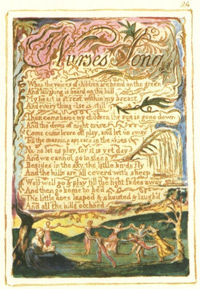

  
[Intangible Textual Heritage](../../../index)  [Legends and
Sagas](../../index)  [England](../index)  [Index](index) 
[Previous](sie17)  [Next](sie19) 

------------------------------------------------------------------------

[Buy this Book at
Amazon.com](https://www.amazon.com/exec/obidos/ASIN/1854377299/internetsacredte)

------------------------------------------------------------------------

  
*Songs of Innocence and of Experience*, by William Blake, \[1789-1794\],
at Intangible Textual Heritage

------------------------------------------------------------------------

p. 24

 

### Nurse's Song

When the voices of children are heard on the green  
And laughing is heard on the hill,  
My heart is at rest within my breast  
And everything else is still

Then come home my children, the sun is gone down  
And the dews of night arise  
Come come leave off play, and let us away  
Till the morning appears in the skies

No no let us play, for it is yet day  
And we cannot go to sleep  
Besides in the sky, the little birds fly  
And the hills are all coverd with sheep

Well well go & play till the light fades away  
And then go home to bed  
The little ones leaped & shouted & laugh’d  
And all the hills ecchoed

------------------------------------------------------------------------

[Next: Infant Joy](sie19)
