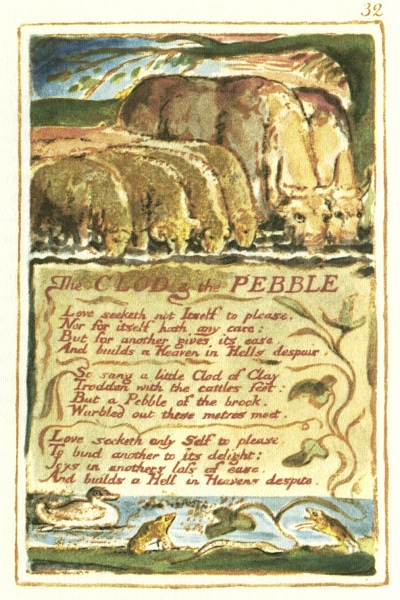

  
[Intangible Textual Heritage](../../../index)  [Legends and
Sagas](../../index)  [England](../index)  [Index](index) 
[Previous](sie25)  [Next](sie27) 

------------------------------------------------------------------------

[Buy this Book at
Amazon.com](https://www.amazon.com/exec/obidos/ASIN/1854377299/internetsacredte)

------------------------------------------------------------------------

  
*Songs of Innocence and of Experience*, by William Blake, \[1789-1794\],
at Intangible Textual Heritage

------------------------------------------------------------------------

p. 32

 

### The CLOD & the PEBBLE

Love seeketh not Itself to please,  
Nor for itself hath any care;  
But for another gives its ease,  
And builds a Heaven in Hells despair.

So sang a little Clod of Clay,  
Trodden with the cattles feet;  
But a Pebble of the brook,  
Warbled out these metres meet.

Love seeketh only Self to please,  
To bind another to Its delight:  
Joys in anothers loss of ease,  
And builds a Hell in Heavens despite.

------------------------------------------------------------------------

[Next: Holy Thursday](sie27)
