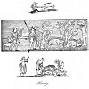
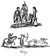
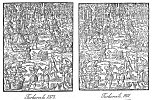

  
[Intangible Textual Heritage](../../../index) 
[Legends/Sagas](../../index)  [England](../index)  [Index](index) 
[Previous](spe04)  [Next](spe06) 

------------------------------------------------------------------------

p. 1

# SPORTS AND PASTIMES OF THE PEOPLE OF ENGLAND

# BOOK I

# RURAL EXERCISES PRACTISED BY PERSONS OF RANK

### CHAPTER I

State of Hunting among the Britons--The Saxons expert in Hunting--The
Danes also--The Saxons subsequently--The Normans--Their tyrannical
Proceedings--Hunting and Hawking after the Conquest--Laws relating to
Hunting--Hunting and Hawking followed by the Clergy--The Manner in which
the dignified Clergy in the Middle Ages pursued these Pastimes--The
English Ladies fond of these Sports--Privileges of the Citizens of
London to Hunt--Private Privileges for Hunting--Two Treatises on Hunting
considered--Names of Beasts to be hunted--Wolves--Wild Boars--Fox and
Badger--Wild Cat and Marten--Otter--Dogs for Hunting--Royal
Hunting--Hare Coursing--Terms used in Hunting--Times when to Hunt--Later
Hunting Treatises.

HUNTING AMONG THE BRITONS.--Dio Nicæus, an ancient author, speaking of
the inhabitants of the northern parts of this island, tells us, they
were a fierce and barbarous people, who tilled no ground, but lived upon
the depredations they committed in the southern districts, or upon the
food they procured by hunting. Strabo also says, that the dogs bred in
Britain were highly esteemed upon the continent, on account of their
excellent qualities for hunting; and these qualities, he seems to hint,
were natural to them, and not the effect of tutorage by their foreign
masters. The information derived from the above-cited authors does not
amount to a proof that the practice of hunting was familiar with the
Britons collectively; yet it certainly affords much fair argument in the
support of such an opinion; for it is hardly reasonable to suppose that
the pursuit of game should have been confined to the uncultivated
northern freebooters, and totally neglected by the more civilised
inhabitants of the southern parts of the island. We are well assured
that venison constituted a great portion of their food, and as they had
in their possession such dogs as were naturally prone to the chase,
there can be little doubt that they would exercise them for the purpose
of procuring their favourite diet; besides, they kept large herds of
cattle, and flocks of sheep, both of which required protection from the
wolves, and other ferocious animals, that infested the woods and
coverts, and must frequently have rendered hunting an act of absolute
necessity.

p. 2

We do not find, that, during the establishment of the Romans in Britain,
there were any restrictive laws promulgated respecting the killing of
game. It appears to have been an established maxim, in the early
jurisprudence of that people, to invest the right of such things as had
no master with those who were the first possessors. Wild beasts, birds,
and fishes, became the property of those who first could take them. It
is most probable that the Britons were left at liberty to exercise their
ancient privileges; for, had any severity been exerted to prevent the
destruction of game, such laws would hardly have been passed over
without the slightest notice being taken of them by the ancient
historians.

HUNTING AMONG THE SAXONS.--The Germans, and other northern nations, were
much more strongly attached to the sports of the field than the Romans,
and accordingly they restricted the natural rights which the people
claimed of hunting. The ancient privileges were gradually withdrawn from
them, and appropriated by the chiefs and leaders to themselves; at last
they became the sole prerogative of the crown, and were thence extended
to the various ranks and dignities of the state at the royal pleasure.

As early as the ninth century, and probably long before that period,
hunting constituted an essential part of the education of a young
nobleman. Asser assures us, that Alfred the great, before he was twelve
years of age, "was a most expert and active hunter, and excelled in all
the branches of that most noble art, to which he applied with incessant
labour and amazing success." It is certain that, whenever a temporary
peace gave leisure for relaxation, hunting was one of the most favoured
pastimes followed by the nobility and persons of opulence at that
period. It is no wonder, therefore, that dogs proper for the sport
should be held in the highest estimation. When Athelstan, the grandson
of Alfred, had obtained a signal victory at Brunanburgh over Constantine
king of Wales, he imposed upon him a yearly tribute of gold, silver, and
cattle; to which was also added a certain number of "hawks, and
sharp-scented dogs, fit for hunting of wild beasts." His successor,
Edgar, remitted the pecuniary payment on condition of receiving annually
the skins of three hundred wolves. We do not find, indeed, that the
hawks and the hounds were included in this new stipulation; but it does
not seem reasonable that Edgar, who, like his predecessor, was extremely
fond of the sports of the field, should have given up that part of the
tribute.

\* By the laws of King Ethelred hunting was prohibited on the Sunday's
festival; an enactment that was renewed by King Cnut. Hunting was
considered so unsuitable a pastime for the clergy that Archbishop
Theodore assigned a year's penance for anyone in minor orders that
indulged in it, two years for a deacon, and three years for a priest.
Archbishop Egbert, of York, improved on this by assigning seven years of
penance for the like offence on an episcopal offender. King Edgar's
canons forbade a priest to hunt, hawk, or dice, but to study books as
becometh his order. [1](#fn_97)

 

[  
Click to enlarge](img/pl01.jpg)  
Hunting (1)  

 

p. 3

HUNTING AMONG THE DANES.--The Danes deriving their origin from the same
source as the Saxons, differed little from them in their manners and
habitudes, and perhaps not at all in their amusements; the propensity to
hunting, however, was equally common to both. When Cnut the Dane had
obtained possession of the throne of England, he imposed several
restrictions upon the pursuit of game, which were not only very severe,
but seem to have been altogether unprecedented; and these may be deemed
a sufficient proof of his strong attachment to his favourite pastime,
for, in other respects, his edicts breathed an appearance of mildness
and regard for the comforts of the people. [1](#fn_98)

HUNTING DURING THE RESTORATION OF THE SAXONS.--After the expulsion of
the Danes, and during the short restoration of the Saxon monarchy, the
sports of the field still maintained their ground. Edward the Confessor,
whose disposition seems rather to have been suited to the cloister than
to the throne, would join in no other secular amusements; but he took
the greatest delight, says William of Malmsbury, "to follow a pack of
swift hounds in pursuit of game, and to cheer them with his voice." He
was equally pleased with hawking, and every day, after divine service,
he spent his time in one or other of these favourite pastimes. Harold,
who succeeded him, was so fond of his hawk and his hounds, that he
rarely travelled without them. He is so represented upon the famous
tapestry of Bayeux, with his hounds by his side and a hawk upon his
hand, when brought before William duke of Normandy. [2](#fn_99) Travelling thus accompanied, was not a
singular trait in the character of a nobleman at this period.

The representation in the centre of the first plate of a Saxon
chieftain, attended by his huntsman and a couple of hounds, pursuing the
wild swine in a forest, is taken from a painting of the ninth century in
the Cotton Library. [3](#fn_100)

At the top of the same plate is a representation of the manner of
attacking the wild boar, from a manuscript written about the
commencement of the fourteenth century, in the possession of Mr Francis
Douce; whilst the unearthing of a fox, at the bottom of the plate, is
from a manuscript in the Royal Library, [4](#fn_101) written about the same time as the
latter.

HUNTING AMONG THE NORMANS OPPRESSIVELY EXERCISED.--During the tyrannical
government of William the Norman, and his two sons who succeeded him,
the restrictions concerning the killing of game were by no means
meliorated. The privileges of hunting in the royal forests were confined
to the king and his favourites; and, to render these receptacles for the
beasts of the chase more capacious, or to make new ones, whole villages
were de-populated, and places of divine worship overthrown; not the
least regard being

p. 4

paid to the miseries of the suffering inhabitants, or the cause of
religion. [1](#fn_102) These despotic
proceedings were not confined to royalty, as may be proved from good
authority. I need not mention the New Forest, in Hampshire, made by the
elder William, or the park at Woodstock in Oxfordshire, seven miles in
circumference, and walled round with stone by Henry his son. This y
park, Stowe tells us, was the first made in England. The royal example
was first followed by Henry earl of Warwick, who made a park at
Wedgenoke, near Warwick, to preserve his deer and other animals for
hunting; after this the practice of park-making became general among
persons of opulence.

This subject is delineated, with great force of colouring, by John of
Salisbury, a writer of the twelfth century, when the severity of the
game laws was somewhat abated. "In our time," says the author, "hunting
and hawking are esteemed the most honourable employments, and most
excellent virtues, by our nobility; and they think it the height of
worldly felicity to spend the whole of their time in these diversions;
accordingly they prepare for them with more solicitude, expense, and
parade, than they do for war; and pursue the wild beasts with greater
fury than they do the enemies of their country. By constantly following
this way of life, they lose much of their humanity, and become as
savage, nearly, as the very brutes they hunt." He then proceeds in this
manner: "Husbandmen, with their harmless herds and flocks, are driven
from their well cultivated fields, their meadows, and their pastures,
that wild beasts may range in them without interruption." He adds,
addressing himself to his unfortunate countrymen, "If one of these great
and merciless hunters shall pass by your habitation, bring forth hastily
all the refreshment you have in your house, or that you can readily buy,
or borrow from your neighbour; that you may not be involved in ruin, or
even accused of treason." [2](#fn_103) If this
picture of Norman tyranny be correct, it exhibits a melancholy view of
the sufferings to which the lower classes of the people were exposed; in
short, it appears that these haughty Nimrods considered the murder of a
man as a crime of less magnitude than the killing of a single beast
appointed for the chase.

HUNTING AND HAWKING AFTER THE CONQUEST.--King John was particularly
attached to the sports of the field; and his partiality for fine horses,
hounds, and hawks, is evident, from his frequently receiving such
animals, by way of payment, instead of money, for the renewal of grants,
fines, and forfeitures, belonging to the crown. [3](#fn_104)

In the reign of Edward I. this favourite amusement was reduced to a
perfect science, and regular rules established for its practice; these
rules were afterwards extended by the master of the game belonging to
king Henry IV. and drawn up for the use of his son, Henry prince of
Wales. Both these

p. 5

tracts are preserved, and we shall have occasion to speak a little
fuller concerning them in the course of this chapter.

Edward III. took so much delight in hunting, that even at the time he
was engaged in war with France, and resident in that country, he had
with him in his army sixty couple of stag hounds, and as many hare
hounds, [1](#fn_105) and every day he amused
himself with hunting or hawking.

It also appears that many of the great lords in the English army had
their hounds and their hawks, as well as the king; to this may be added,
from the same author, that is, Froissart, who was himself a witness to
the fact, that Gaston earl of Foix, a foreign nobleman contemporary with
king Edward, kept upwards of six hundred dogs in his castle for the
purpose of hunting. He had four greyhounds called by the romantic names
of Tristram, Hector, Brute, and Roland. [2](#fn_106)

\* James I. preferred the amusement of hunting to hawking or shooting.
It is said of this monarch that he divided his time betwixt his
standish, his bottle, and his hunting; the last had his fair weather,
the two former his dull and cloudy. [3](#fn_107) In "The King's Christian Duties," which
James wrote for his son, he says: "I cannot omit hare hunting, namely
with running hounds, which is the most honourable and noblest thereof;
for it is a thievish form of hunting to shoot with guns or bows, and
greyhound hunting (coursing) is not so martial a game." James enclosed
the park of Theobalds with a brick wall ten miles in extent, the deer in
which were valued at £1000. Neither age nor illness deterred him from
his favourite amusement; in 1619, when only able to be carried in a
chair or litter, he came to Theobalds, and would have the deer mustered
before him; and in 1624, contrary to the order of his physicians, he
left Royston to see some hawks fly at Newmarket. [4](#fn_108)

It would be an endless, as well as a needless task, to quote all the
passages that occur in the poetical and prose writings of the last three
centuries, to prove that this favourite pastime lost nothing of its
relish in more modern times; on the contrary, it seems to have been more
generally practised. Sir Thomas More, who wrote in the reign of Henry
VIII., describing the state of manhood, makes a young gallant to say,

Man-hod I am, therefore I me delyght  
To hunt and hawke, to nourishe up and fede  
The greyhounde to the course, the hawke to th’ flight,  
And to bestryde a good and lusty stede. [5](#fn_109)

These pursuits are said by later writers to have been destructive to the
fortunes of many inconsiderate young heirs, who, desirous of emulating
the state of their superiors, have kept their horses, hounds, and hawks,
and flourished away for a short time, in a style that their income was
inadequate to support.

LAWS RELATING TO HUNTING.--Laws for punishing such as hunted, or

p. 6

destroyed the game, in the royal forests, and other precincts belonging
to the crown, were, as we have just hinted above, established with
unprecedented severity by Cnut, the Dane, when he ascended the throne of
England.

The severity of the game laws was rather increased, than abated, under
the governance of the first four Norman monarchs. Henry II. is said to
have relaxed their efficacy; rather, I presume, by not commanding them
to be enforced with rigour, than by causing them to be abrogated; for
they seem to have virtually existed in the reign of king John; and
occasioned the clause in the Forest Charter, insisting that no man
should forfeit his life, or his limbs, for killing the king's
deer;--but, if he was taken in the fact of stealing venison belonging to
the king, he should be subjected to a heavy fine; and, in default of
payment, be imprisoned for one year and one day; and after the
expiration of that time, find surety for his good behaviour, or be
banished the land. [1](#fn_110) This charter
was afterwards confirmed by his son Henry III. and the succeeding
monarchs.

HUNTING BY THE CLERGY.--Another clause in the same charter grants to an
archbishop, bishop, earl, or baron, when travelling through the royal
forests, at the king's command, the privilege to kill one deer or two in
the sight of the forester, if he was at hand; if not, they were
commanded to cause a horn to be sounded, that it might not appear as if
they had intended to steal the game.

It is evident that this privilege was afterwards construed into a
permission for the personages named therein to hunt in the royal chases;
but the words of the charter are not to that amount, and ought, says
Spelman, to be taken literally as they stand in the translation: they
could not however, at any rate, adds he, mean, "that the ecclesiastics
are to hunt the deer themselves, for they suppose them to be no hunters,
as the earls and barons might be; and therefore it is not said, that he
who claims the venison shall blow the horn, but only that he shall cause
it to be sounded. [2](#fn_111)

The propensity of the clergy to follow the secular pastimes, and
especially those of hunting and hawking, is frequently reprobated by the
poets and moralists of the former times. Chaucer makes the monks much
better skilled in riding and hunting, than in divinity. The same poet,
afterwards, in the "Ploughman's Tale," takes occasion to accuse the
monks of pride, because they rode on coursers like knights, having their
hawks and hounds with them. In the same tale he severely reproaches the
priests for their dissolute manners, saying that many of them thought
more upon hunting with their dogs, and blowing the horn, than of the
service they owed to God. [3](#fn_112)

The prevalence of these excesses occasioned the restrictions, contained
in an edict established in the thirteenth year of Richard II., which
prohibits any priest, or other clerk, not possessed of a benefice to the
yearly amount of ten

p. 7

pounds, from keeping a greyhound, or any other dog for the purpose of
hunting; neither might they use ferrits, hayes, nets, hare-pipes, cords,
or other engines to take or destroy the deer, hares, or rabbits, under
the penalty of one year's imprisonment. [1](#fn_113) The dignified clergy were not affected
by this statute, but retained their ancient privileges, which appear to
have been very extensive. By the game law of Cnut the Dane they were
permitted to hunt in the forests belonging to the crown; and these
prerogatives were not abrogated by the Normans. Henry II., displeased at
the power and ambition of the ecclesiastics, endeavoured to render these
grants of none effect; not by publicly annulling them, but by putting in
force the canon law, which strictly forbade the clergy to spend their
time in hunting and hawking; and for this purpose, having obtained
permission from Hugo Pertroleonis, the Pope's legate, he caused a law to
be made, authorising him to convene the offenders before the secular
judges, and there to punish them. [2](#fn_114)
The establishment of this edict was probably more to show his power,
than really to restrain them from hunting.

HUNTING AND HAWKING IN THE MIDDLE AGES BY BISHOPS, &c.--The bishops and
abbots of the middle ages hunted with great state, having a large train
of retainers and servants; and some of them are recorded for their skill
in this fashionable pursuit. Walter, bishop of Rochester, who lived in
the thirteenth century, was an excellent hunter, and so fond of the
sport, that at the age of fourscore he made hunting his sole employment,
to the total neglect of the duties of his office. [3](#fn_115) In the succeeding century an abbot of
Leicester surpassed all the sportsmen of the time in the art of hare
hunting; [4](#fn_116) and even when these
dignitaries were travelling from place to place, upon affairs of
business, they usually had both hounds and hawks in their train.
Fitzstephen assures us that Thomas à Becket, being sent as ambassador
from Henry II. to the court of France, assumed the state of a secular
potentate; and took with him dogs and hawks of various sorts, such as
were used by kings and princes. [5](#fn_117)

The clergy of rank, at all times, had the privilege of hunting in their
own parks and inclosures; and therefore, that they might not be
prevented from following this favourite pastime, they took care to have
such receptacles for game belonging to their houses. At the time of the
Reformation, the See of Norwich, only, was in the possession of no less
than thirteen parks, well stocked with deer and other animals for the
chase. [6](#fn_118) At the end of a book of
Homilies in MS., in the Cotton Library, [7](#fn_119) written about the reign of Henry VI., is
a poem containing instructions to priests in general, and requiring
them, among other things, not to engage in "hawkynge, huntynge, and
dawnsynge."

HUNTING AND HAWKING BY LADIES.--The ladies often accompanied the
gentlemen in hunting parties; upon these occasions it was usual to draw
the game into a small compass by means of inclosures, and temporary
stands were

p. 8

made for them to be spectators of the sport; though in many instances
they joined in it, and shot at the animals as they passed by them, with
arrows. Agreeable to these manners, which custom reconciled to the fair
sex, most of the heroines of romance are said to be fond of the sports
of the field. In an old poem entitled the "Squyer of lowe degre," [1](#fn_120) the king of Hungary promises his
daughter that in the morning she shall go with him on a hunting party,
arrayed most gorgeously, and riding in a chariot covered with red
velvet, drawn by

Jennettes of Spayne that ben so white,  
Trapped to the ground with velvet bright.

\[paragraph continues\] In the field, says he, the game shall be
inclosed with nets, and you placed at a stand so conveniently that the
harts and the hinds shall come close to you--

Ye shall be set at such a tryst,  
That hert and hynde shall come to your fyst.

\[paragraph continues\] He then commends the music of the bugle-horn--

To here the bugles there yblow  
With theyr bugles in that place,  
And seven score raches at his rechase.

\[paragraph continues\] He also assures her that she should have--

A lese of herhounds with her to strake.

The harehound, or greyhound, was considered as a very valuable present
in former times, and especially among the ladies, with whom it appears
to have been a peculiar favourite; and therefore in another metrical
romance, probably more ancient than the former, called "Sir
Eglamore," [2](#fn_121) a princess tells the
knight that if he was inclined to hunt, she would, as an especial mark
of her favour, give him an excellent greyhound, so swift that no deer
could escape from his pursuit--

Syr yf you be on huntynge founde,  
I shall you gyve a good greyhounde  
  That is dunne as a doo:  
For as I am trewe gentylwoman,  
There was never deer that he at ran,  
  That myght yscape him fro.

It is evident, however, that the ladies had hunting parties by
themselves. An illustration in a manuscript of the early part of the
fourteenth century reproduced on the second plate depicts them in the
open fields winding the horn, rousing the game, and pursuing it, without
any other assistance. [3](#fn_122) We may also
observe, that, upon these occasions, the female Nimrods dispensed with
the method of riding best suited to the modesty of the sex, and sat
astride on the saddle like the men; but this indecorous custom, I trust,
was never general, nor of long continuance, even with the heroines who
were most delighted with these

 

[  
Click to enlarge](img/pl02.jpg)  
Hunting (2)  

 

p. 9

masculine exercises. An author of the seventeenth century speaks of
another fashion, adopted by the fair huntresses of the town of Bury in
Suffolk. "The Bury ladies," says he, "that used hawking and hunting,
were once in a great vaine of wearing breeches," which it seems gave
rise to many severe and ludicrous sarcasms. The only argument in favour
of this habit, was decency in case of an accident. But it was observed
that such accidents ought to be prevented, in a manner more consistent
with the delicacy of the sex, that is, by refraining from those
dangerous recreations. [1](#fn_123)

The hunting dresses, as they appeared at the commencement of the
fifteenth century, are given from a manuscript of that time in the
Harleian Collection, [2](#fn_124) at the top of
the second plate.

Queen Elizabeth was extremely fond of the chase, and the nobility who
entertained her in her different progresses, made large hunting parties,
which she usually joined when the weather was favourable. She very
frequently indulged herself in following of the hounds, and hunted the
red and fallow deer, the hare, and the otter. "Her majesty," says a
courtier, writing to Sir Robert Sidney, "is well and excellently
disposed to hunting, for every second day she is on horseback and
continues the sport long." [3](#fn_125) At this
time her majesty had just entered the seventy-seventh year of her age,
and she was then at her palace at Outlands. Often, when she was not
disposed to hunt herself, she was entertained with the sight of the
pastime. At Cowdrey, in Sussex, the seat of Lord Moritecute, A.D. 1591,
one day after dinner her grace saw from a turret, "sixteen bucks all
having fayre lawe, pulled downe with greyhounds in a laund or
lawn." [4](#fn_126)

\* At the close of the eighteenth century Hertfordshire knew a
distinguished lady huntress who rivalled Queen Elizabeth in her keenness
for the chase at an advanced age. In 1793 Lady Salisbury, a most daring
rider and sportswoman, became the active mistress of the Hertfordshire
hounds, which were called during her reign the Hatfield hounds. It was
not until Lady Salisbury was seventy-eight years of age that she gave up
the mistresship and ceased to follow the foxhounds; even then she said
that she thought she was good enough to hunt with the harriers. [5](#fn_127)

PRIVILEGES OF THE CITIZENS OF LONDON TO HUNT AND HAWK.--The citizens of
London were permitted to hunt and hawk in certain districts. And one of
the clauses, in the royal charter granted to them by Henry I., runs to
this purport: "The citizens of London may have chases, and hunt as well,
and as fully, as their ancestors have had; that is to say, in the
Chiltre, in Middlesex, and Surry." [6](#fn_128)
Hence we find, that these privileges were of ancient standing. They were
also confirmed by the succeeding charters. Fitzstephen, who wrote
towards the close of the reign of Henry II., says, that the Londoners
delight

p. 10

themselves with hawks and hounds, for they have the liberty of hunting
in Middlesex, Hertfordshire, all Chilton, and in Kent to the waters of
Grey, [1](#fn_129) which differs somewhat from
the statement in the charter. These exercises were not much followed by
the citizens of London at the close of the sixteenth century, not for
want of taste for the amusement, says Stow, but for leisure to pursue
it. [2](#fn_130) Strype, however, so late as
the reign of George I., reckons among the modern amusements of the
Londoners, "Riding on horseback and hunting with my Lord Mayor's hounds,
when the common-hunt goes out."

This common-hunt of the citizens is ridiculed in an old ballad called
the "London Customs," published in D’Urfey's Collection, [3](#fn_131) I shall select the three following
stanzas only.

Next once a year into Essex a hunting they go;  
To see ’em pass along, O ’tis a most pretty shew:  
Through Cheapside and Fenchurch-street, and so to Aldgate pump,  
Each man with ’s spurs in ’s horses sides, and his back-sword cross his
rump.

My lord he takes a staff in hand to beat the bushes o’er;  
I must confess it was a work he ne’er had done before.  
A creature bounceth from a bush, which made them all to laugh;  
My lord, he cried, a hare a hare, but it prov’d an Essex calf.

And when they had done their sport, they came to London where they
dwell,  
Their faces all so torn and scratch’d, their wives scarce knew them
well;  
For ’twas a very great mercy, so many ’scap’d alive,  
For of twenty saddles carried out, they brought again but five.

Privileges to hunt in certain districts, were frequently granted to
individuals either from favour, or as a reward for their services.
Richard I. gave to Henry de Grey, of Codnor, the manor of Turroe, in
Essex, with permission to hunt the hare and the fox, in any lands
belonging to the crown, excepting only the king's own demesne parks; and
this special mark of the royal favour was confirmed by his brother John,
when he succeeded to the throne. [4](#fn_132)

Others obtained grants of land, on condition of their paying an annual
tribute in horses, hawks, and hounds. And here I cannot help noticing a
curious tenure, by which Bertram de Criol held the manor of Setene, or
Seaton, in Kent, from Edward I.; he was to provide a man, called
*veltarius*, or huntsman, [5](#fn_133) to lead
three greyhounds when the king went into Gascony, so long as a pair of
shoes, valued at fourpence, should last him. [6](#fn_134)

Two EARLY TREATISES ON HUNTING.--The earliest known English treatise on
hunting dates from early in the fourteenth century; it was originally
written

p. 11

in French, by William Twici, or Twety, grand huntsman to king Edward
II. [1](#fn_135) There is an English version of
this, nearly coeval with the original in the Cotton collection, but in
that copy the name of John Gyfford is joined to that of Twety, and both
of them are said to be "maisters of the game" to king Edward, and to
have composed this treatise upon "the crafte of huntynge." [2](#fn_136) In the same volume of the Cotton
collection is a treatise written by the Master of the Game to Henry IV.
for the use of prince Henry his son; it is little more than an
enlargement of the former tract. [3](#fn_137)
The Book of St Albans, so called because it was printed there, contains
the first treatise upon the subject of hunting that ever appeared from
the press. It is however evidently compiled from the two tracts above
mentioned, notwithstanding the legendary authority of Sir Tristram,
quoted in the beginning. The Book of St Albans is said to have been
written by Juliana Barnes, or Berners, the sister of lord Berners, and
prioress of the nunnery of Sopewell, about the year 1481, and was
printed soon afterwards. This book contains two other tracts, the one on
hawking, and the other on heraldry. It has been reprinted several times,
and under different titles, with some additions and amendments, but the
general information is the same. [4](#fn_138)

NAMES OF BEASTS OF SPORT.--Twici introduces the subject with a kind of
poetical prologue, in which he gives us the names of the animals to be
pursued; and these are divided into three classes.

The first class contains four, which, we are informed, may be properly
called beasts for hunting; namely, the hare, the hart, the wolf, and the
wild boar.

The second class contains the names of the beasts of the chase, and they
are five; that is to say, the buck, the doe, the fox, the martin, and
the roe.

In the third class we find three, that are said to afford "greate
dysporte" in the pursuit, and they are denominated, the grey or badger,
the wild-cat, and the otter.

Most of the books upon hunting agree in the number and names of the
first class; but respecting the second and third they are not so clear.
The beasts of the chase in some are more multifarious, and divided into
two classes: the first called beasts of sweet flight, are the buck, the
doe, the bear, the rein-deer, the elk, and the spytard, which was the
name for a hart one hundred years old. In the second class, are placed
the fulimart, the fitchat or fitch, the cat,

p. 12

the grey, the fox, the weasel, the martin, the squirrel, the white rat,
the otter, the stoat, and the pole-cat; and these are said to be beasts
of stinking flight.

WOLVES.--The reader may possibly be surprised, when he casts his eye
over the foregoing list of animals for hunting, at seeing the names of
several that do not exist at this time in England, and especially of the
wolf, because he will readily recollect the story so commonly told of
their destruction during the reign of Edgar. It is generally admitted
that Edgar gave up the fine of gold and silver imposed by his uncle
Athelstan, upon Constantine the king of Wales, and claimed in its stead
the annual production of three hundred wolves' skins; because, say the
historians, the extensive woodlands and coverts, abounding at that time
in Britain, afforded shelter for the wolves, which were exceedingly
numerous, and especially in the districts bordering upon Wales. By this
prudent expedient, add they, in less than four years the whole island
was cleared from these ferocious animals, without putting his subjects
to the least expense; but, if this record be taken in its full latitude,
and the supposition established that the wolves were totally
exterminated in Britain during the reign of Edgar, more will certainly
be admitted than is consistent with the truth, as certain documents
clearly prove.

The words of William of Malmsbury relative to wolves in Edgar's time are
to this purport. "He, Edgar, imposed a tribute upon the king of Wales
exacting yearly three hundred wolves. This tribute continued to be paid
for three years, but ceased upon the fourth, because *nullum se ulterius
posse invenire professus*; it was said that he could not find any
more"; [1](#fn_139) that is, in Wales, for it
can hardly be supposed that he was permitted to hunt them out of his own
dominions.

As respects the existence of wolves in Great Britain afterwards, and
till a very much later period, it appears that in the forty-third year
of Edward III. Thomas Engaine held lands in Pytchley, in the county of
Northampton, by service of finding at his own cost certain dogs for the
destruction of wolves, foxes, etc. in the counties of Northampton,
Rutland, Oxford, Essex, and Buckingham. As late as the eleventh year of
Henry VI. (1433) Sir Robert Plumpton held one bovate of land, in the
county of Nottingham, called Wolf hunt land, by service of winding a
horn, and chasing or frighting the wolves in the forest of Shirewood.

\* It seems most probable that wolves became extinct in England during
the reign of Henry VII., or at all events they were exceedingly rare
after that reign. The Lancashire forests of Blackburnshire and Bowland,
the wilder parts of the Derbyshire Peak, and the wolds of Yorkshire were
among the last retreats of the wolf. It has been confidently stated that
entries of payments for the destruction of wolves in the account books
of certain parishes of the East Riding, presumably of the sixteenth or
seventeenth century date, are still extant, [2](#fn_140) but this appears to be an error. Wolves
were common in Scotland in

p. 13

the seventeenth century, and they lingered on in exceptional cases until
about the middle of the eighteenth century; the last recorded instance
of one being killed was in 1743. The packs of Irish wolves were
extirpated in 1710, but the last one was not killed in Ireland until
1770. [1](#fn_141)

\* The wolves of England in historic times were probably more often
trapped than hunted. The family of Wolfhunt who held land of the king in
Peak forest by the service of taking the wolves, adopted other means
than hunting to keep them down. An inquiry as to the rights of the
foresters of the Peak was held in 1285. John le Wolfhonte and Thomas
Folejambe then held a bovate of land, which was formerly one serjeanty
assigned for taking the forest wolves. They stated that twice each year,
namely, in March and September, they had to go through the midst of the
forest to place pitch to take the wolves [2](#fn_142) in the places they frequented, because
at those seasons of the year the wolves were not able to smell disturbed
soil as at others. In dry summers they also went at the feast of St
Barnabas (June 11th), when the wolves had whelps, to take and destroy
them; and then they had with them a servant to carry their traps
(*ingenia*), and they carried an axe and a spear, with a cutlass or
hunting knife attached to their girdle, but neither bow nor arrows. They
had also with them a mastiff, not lawed, and trained for this
work. [3](#fn_143)

\* WILD BOARS.--The wild boar is one of the oldest and most renowned of
the animals of the British forests. It appears on ancient British coins,
and was figured in various works of art pertaining to the later Celtic
period. [4](#fn_144) The wild boar graces more
than one piece of sculpture of the time of the Roman occupation, and two
altars have been found in the north of England dedicated to the god
Sylvanus by grateful hunters who had succeeded in killing enormous
boars. [5](#fn_145) The story of Edward the
Confessor rewarding the huntsman Nigell for slaying a fierce wild boar
in the royal forest of Bernwood, Bucks, by granting him an estate and
the custody of that forest has often been told. The hunting of the wild
boar was assiduously followed up by the Norman conquerors. The wild boar
not infrequently occurs in their ecclesiastical sculpture, as on the
tympana of church doorways at Hognaston, Parwich, and Ashford,
Derbyshire; Little Longford, Wilts; and St Nicholas’, Ipswich. [6](#fn_146)

\* Holinshed states that Henry I. was specially devoted to boar hunting,
which he describes as "a very dangerous exercise." The boar was one of
the badges of Edward III., and was specially adopted by Richard III. The
manor of Blechesdon, Oxfordshire, was held by the service of presenting
the king with a boar spear when he came to hunt at Cornbury or
Woodstock. The use of

p. 14

boar spears in Norfolk in the middle of the fifteenth century is twice
named in the "Paston Letters,"

\* A full inventory of the arms and armour pertaining to Henry VIII., at
Westminster, the Tower, and Greenwich, at the close of his reign,
enumerates no fewer than 550 "bore-speres." Of this number, 291 had
"asshen staves trymed with crymesym velvet and fringed with redde
silke," 162 were knotted and leathered, and 97 had "asshen staves trymed
with lether." Two others were "graven and gilt." At Greenwich there was
also "a bore-spere hedde of Morish worke." Many of these weapons were
doubtless for parade and possibly for warlike use if the necessity
arose; but those that were simply knotted and leathered (to secure a
firmer grip) were probably genuine and serviceable boar spears. In the
same inventory are vast numbers of Moorish pikes, bills, halberds,
partisans, and javelins. [1](#fn_147) The chief
distinction between the boar spear and other spears was its broad head
and the cross-bar just below the head to prevent the weapon entering too
deeply. It is not generally remembered that the javelin, as its name
implies (*jabali*, a wild boar), was originally a boar spear of a light
character, that could be thrown as a dart.

\* References to wild boars might be almost indefinitely extended, for
they overran the whole country for many centuries, and were afterwards
hunted in all the great forests of England. As forests lessened in
extent the wild swine decreased in numbers, but there are abundant
proofs of their thriving in Durham, Lancashire, Staffordshire, and
Wiltshire in the sixteenth century. James I. hunted the wild boar at
Windsor in 1617. [2](#fn_148) They were still
wild at Chartley, Staffordshire, in 1683. Charles II.'s reign is the
latest time at which this animal is known to have been found in England
in a really wild state. Various vain efforts were made to reintroduce
them into England during the nineteenth century. [3](#fn_149)

\* The best account of the old English hunting of the wild boar is given
in George Turbervile's liberally illustrated "Noble Art of Venerie or
Hunting," which was first printed in 1575 and reproduced in 1611. He
says, in chapter forty-nine, that the boar ought not to be counted among
the beasts of venery chaseable with hounds, as he is the proper prey of
a mastiff or such like dogs, for as much as he is a heavy beast and of
great force, and will not lightly flee nor make chase before hounds. He
thinks it a great pity to hunt the boar with a good kennel of hounds, as
"he is the only beast which can dispatch a hound at one blow, for though
other beasts do bite, snatch, teare, or rend your houndes, yet there is
hope of remedie if they be well attended; but if a Bore do once strike
your hounde, and light betweene the foure quarters of him, you shall
hardly see him escape; and there withall this subtilitie he hath, that
if he be run with a good kenell of hounds, which he perceiveth holde in
rounde and followe him harde, he will flee into the strongest thicket
that he can finde, to the end he may kill them at leisure one after
another, the which I have seene by experience

p. 15

oftentimes. And amongst others I saw once a Bore chased and hunted with
fiftie good hounds at the least, and when he saw that they were all in
full crie, and helde in round togethers, he turned heade afore them, and
thrust amiddest the thickest of them. In such sorte that he slew
sometimes sixe or seaven (in manner) with twinkling of an eye; and of
the fiftie houndes there went not twelve sounde and alive to their
masters' houses." Turbervile then proceeds to show how the boar may
properly be hunted and killed with either the sword or the boar spear.
The boar was to be followed up by relays of dogs until brought to bay,
and then the huntsmen were to ride in upon all at once, having cast
round the place where he was, "and it shall be hard if they give him not
one scratch with a sword or some wound with a boar-spear." He recommends
the hanging of bells on the boar-hounds necks, as a preventative to the
boar striking them.

\* FOXES.--In Turbervile's book, the hunting of the fox and badger are
described together. Both were then hunted or rather drawn with terriers,
and Turbervile remarks--"as touching foxes, I account small pastime of
hunting of them, especially within the ground; for as soone as they
perceyve the Terryers, if they yearne hard and ge neare unto them, they
will bolte and come out streygthwaies, unlesse it be when the bitch
hathe yong Cubbes: then they will not forsake their yong ones though
they die for it." When a fox was hunted "above grounde," after the
earths had been stopped, the hounds of the chase thus employed are
described as greyhounds, showing that the fox was usually coursed by
sight and not followed by scent.

\* The keeping of public packs of hounds did not obtain in England until
about the close of the seventeenth century, and these packs hunted the
stag, the fox, and the hare, indiscriminately. One of the first packs of
hounds kept solely for fox hunting was the Hertfordshire; it was started
in 1725 with Mr John Calvert as the first master, the kennels being at
Cheshunt and Redbourne. [1](#fn_150) The first
real steady pack of foxhounds in the West of England was that hunted by
Mr Thomas Fownes, of Stapleton, Dorset, which was started in 1730. [2](#fn_151)

\* WILD CATS AND MARTINS.--The wild cat is named by Turbervile, in 1575,
in connection with the martin, as vermin which used to be commonly
hunted in England. At that time they were not hunted designedly, but if
a hound chanced to cross a wild cat he would hunt it as soon as any
chase--"and they make a noble crye for the time that they stand up. At
last when they may no more they will take a tre, and therein seeke to
beguile the hounds. But if the hounds hold into them, and will not so
give it over, then they leape from one tree to another, and make great
shift for their lives, with no lesse pastime to the huntsmen." The wild
cat is now extinct in England as well as in the southern counties of
Scotland. Probably the last wild cat killed in England was that shot by
Lord Ravens-worth at Eslington, Northumberland, in 1853. That beautiful
animal, the

p. 16

martin, once so common in England's forests, is now rapidly
disappearing. It is supposed to still linger in the Somersetshire and
Devonshire confines of Exmoor. [1](#fn_152) Mr
Harting, writing in 1883, says that the martin still holds its own in
the mountainous parts of Cumberland and Westmoreland, where it is
occasionally hunted with foxhounds. [2](#fn_153)

\* The Rev. H. A. Macpherson, writing in 1901, says that "the marten
continues to preserve a precarious footing among the mountain tops in
the centre and west of Cumberland. . . . As long as these animals were
fairly numerous they used to be hunted by the dalesmen, and many a
spirited chase has been described to me by venerable sportsmen." The
last wild cat of this county was killed on Great Mell Fell early in the
nineteenth century. [3](#fn_154) The martin has
become extinct in Derbyshire and Staffordshire within the last fifty
years. [4](#fn_155)

\* OTTERS.--The directions given for hunting the otter in the earliest
known treatises and books correspond so closely to the customs still
observed in that sport, which has never died out in England, that it
would be superfluous to reproduce them. Otter-hunting was especially
popular in the days of James I. In November 1604 a commission was issued
by John Parry, master of the Herts otter hounds, to take dogs up the
rivers for the king's diversions; millers were at the same time ordered
to stop their watercourses during the hunting. In 1607 the king made a
grant of hounds and beagles, spaniels, and mongrels to Henry Mynours,
master of the otter hounds at Theobalds, for his majesty's
disport. [5](#fn_156)

\* DOGS OF THE CHASE.--General Pitt-Rivers, in his recent series of
painstaking excavations at Rushmore, Rotherley, etc., has established
the fact that a great variety of dogs were known and domesticated in
Romano-British days, from the mastiff and greyhound down to small
terriers and lapdogs. [6](#fn_157)

In the manuscripts before mentioned we find the following names for the
dogs employed in the sports of the field; that is to say, raches, or
hounds; running hounds, or harriers, to chase hares; and greyhounds,
which were favourite dogs with the sportsmen; alauntes, or bull-dogs,
these were chiefly used for hunting the boar; the mastiff is also said
to be "a good hounde" for hunting the wild boar; the spaniel was of use
in hawking; "hys crafte," says the author, "is for the perdrich or
partridge, and the quaile; and, when taught to couch, he is very
serviceable to the fowlers, who take those birds with nets." There must,
I presume, have been a vast number of other kinds of dogs known in
England at this period; these, however, are all that the early writers,
upon the subject of hunting, have thought proper to enumerate.

\* The following is the amusing list given by Dam Julyano in 1406:--

p. 17

"Thyse be the names of houndes. Fyrste there is a Grehoun; a Bastard; a
Mengrell; a Mastif; a Lemor; a Spanyel; Raches; Kenettys; Teroures;
Butchers houndes; Dunghyll dogges; Tryndeltaylles; and pryckeryd currys;
and smalle ladye's popees that bere awaye the flees and dyvers small
sawtes."

ROYAL HUNTING.--Several methods of hunting were practised by the
sportsmen of this kingdom, as well on horseback as on foot. Sometimes
this exercise took place in the open country; sometimes in woods and
thickets; and sometimes in parks, chases, and forests, where the game
was usually enclosed with a haye or fence-work of netting, supported by
posts driven into the ground for that purpose. The manner of hunting at
large needs no description; but, as the method of killing game within
the enclosures is now totally laid aside, it may not be amiss to give
the reader some idea how it was performed, and particularly when the
king with the nobility were present at the sport. All the preparations
and ceremonies necessary upon the occasion are set down at large in the
manuscript made for the use of Prince Henry, mentioned before; the
substance of which is as follows.

When the king should think proper to hunt the hart in the parks or
forests, either with bows or greyhounds, the master of the game, and the
park-keeper, or the forester, being made acquainted with his pleasure,
was to see that everything be provided necessary for the purpose. It was
the duty of the sheriff of the county, wherein the hunting was to be
performed, to furnish fit stabling for the king's horses, and carts to
take away the dead game. The hunters and officers under the forester,
with their assistants, were commanded to erect a sufficient number of
temporary buildings [1](#fn_158) for the
reception of the royal family and their train; and, if I understand my
author clearly, these buildings were directed to be covered with green
boughs, [2](#fn_159) to answer the double
purpose of shading the company and the hounds from the heat of the sun,
and to protect them from any inconveniency in case of foul weather.
Early in the morning, upon the day appointed for the sport, the master
of the game, with the officers deputed by him, was to see that the
greyhounds were properly placed, and the person nominated to blow the
horn, whose office was to watch what kind of game was turned out, and,
by the manner of winding his horn, signify the same to the company, that
they might be prepared for its reception upon its quitting the cover.
Proper persons were then to be appointed, at different parts of the
enclosure, to keep the populace at due distance. The yeomen of the
king's bow, and the grooms of his tutored greyhounds, had in charge to
secure the king's standing, and prevent any noise being made to disturb
the game before the arrival of his majesty. When the royal family and
the nobility were conducted to the places appointed for their reception,
the master of the game, or his lieutenant, sounded three long mootes, or
blasts with the horn, for the uncoupling of the hart hounds. The game
was then driven from the cover, and turned by the huntsmen and the

p. 18

hounds so as to pass by the stands belonging to the king and queen, and
such of the nobility as were permitted to have a share in the pastime;
who might either shoot at them with their bows, or pursue them with the
greyhounds at their pleasure. We are then informed that the game which
the king, the queen, or the prince or princesses slew with their own
bows, or particularly commanded to be let run, was not liable to any
claim by the huntsmen or their attendants; but of all the rest that was
killed they had certain parts assigned to them by the master of the
game, according to the ancient custom.

This arrangement was for a royal hunting, but similar preparations were
made upon like occasions for the sport of the great barons and dignified
clergy. Their tenants sometimes held lands of them by the service of
finding men to enclose the grounds, and drive the deer to the stands
whenever it pleased their lords to hunt them. [1](#fn_160)

\* In the first edition of Turbervile's "Noble Art of Venerie," issued
in 1575, there is a woodcut representing Queen Elizabeth being
entertained in the midst of a forest scene. In the second edition,
issued in 1611, the same woodcut was used, but Elizabeth was ingeniously
changed into James I., and the Queen's two maids of honour into pages in
waiting. These two cuts are given side by side on plate three.

\* HUNTING--COURSING.--Turbervile states, at the end of his volume, that
he could find nothing in the foreign works that he had translated
relative to coursing with greyhounds, but that in England they set great
store by the pastime of coursing with greyhounds "at Deare, Hare, Foxe,
or such like, even of themselves, when there are neyther hounds hunting,
nor other means to help them." He sets forth that in coursing deer
(especially red deer) the greyhounds were divided into three leashes,
Teasers, Sidelaies, and Backsets, which were set at the deer in turn. In
coursing hares, a quaint method of procedure is laid down in detail.
Thus, "Let him which found the Hare go towards and say *Up pusse up*,
untill she ryse out of her forme." . . . "When you go to course eyther
Hare or Deare or to Hunt any chace, it is a forfayture (amongst us here
in England) to name eyther Beare, Ape, Monkie, or Hedgehogge; and he
which nameth any of those shoulde be payd with a slippe upon the
Buttockes in the field before he go any furder." Turbervile's last words
in his treatise of 250 pages on hunting are warmly in favour of coursing
with greyhounds--"which is doubtlesse a noble pastime, and as mete for
Nobility and Gentleman as any of the other kinds of Venerie before
declared: Especially the course at the Hare which is a sport continually
in sight, and made without any great travaile: so that recreation is
therein to be found without immeasurable toyle and payne: whereas in
hunting with hounds, although the pastime be great, yet many times the
toyle and paine is also exceeding great: And then it may be called
eyther a painful pastime, or a pleasant payne."

 

[  
Click to enlarge](img/pl03.jpg)  
Royalty Hunting  

 

p. 19

\* There were coursing matches in the old days, for Turbervile states
that if it was "a solemn assembly" for coursing, that expert judges
stationed themselves on surrounding hills to judge which dog did best.
It was in Elizabeth's reign that certain "laws of the Leash or Coursing"
were drawn up to regulate hare coursing matches, which were allowed and
subscribed by Thomas, Duke of Norfolk. [1](#fn_161)

HUNTING TERMS.--There was a peculiar kind of language invented by the
sportsmen of the middle ages, which it was necessary for every lover of
the chase to be acquainted with.

When beasts went together in companies, there was said to be a pride of
lions; a lepe of leopards; an herd of harts, of bucks, and of all sorts
of deer; a bevy of roes; a sloth of boars; a singular of boars; a
sownder of wild swine; a dryft of tame swine; a route of wolves; a
harras of horses; a rag of colts; a stud of mares; a pace of asses; a
baren of mules; a team of oxen; a drove of kine; a flock of sheep; a
tribe of goats; a sculk of foxes; a cete of badgers; a richness of
martins; a fesynes of ferrets; a huske or a down of hares; a nest of
rabbits; a clowder of cats, and a kyndyll of young cats; a shrewdness of
apes; and a labour of moles.

And also, of animals when they retired to rest; a hart was said to be
harbored, a buck lodged, a roebuck bedded, a hare formed, a rabbit set,
etc.

Two greyhounds were called a brace, three a leash, but two spaniels or
harriers were called a couple. We have also a mute of hounds for a
number, a kenel of raches, a litter of whelps, and a cowardice of curs.

It is well worthy of notice, that this sort of phraseology was not
confined to birds and beasts, and other parts of the brute creation, but
it was extended to the various ranks and professions of men, as the
specimens, which I cannot help adding, will sufficiently demonstrate;
the application of some of them, will, I trust, be thought apt enough:--

A state of princes; a skulk of friars; a skulk of thieves; an observance
of hermits; a lying of pardoners; a subtiltie of serjeants; an untruth
of sompners; a multiplying of husbands; an incredibility of cuckolds; a
safeguard of porters; a stalk of foresters; a blast of hunters; a
draught of butlers; a temperance of cooks; a melody of harpers; a
poverty of pipers; a drunkenship of coblers; a disguising of taylors; a
wandering of tinkers; a malepertness of pedlars; a fighting of beggars;
a rayful (that is, a netful) of knaves; a blush of boys; a bevy of
ladies; a nonpatience of wives; a gagle of women; a gagle of geese; a
superfluity of nuns; and a herd of harlots. Similar terms were applied
to inanimate things, as a caste of bread, a cluster of grapes, a cluster
of nuts, etc.

SEASONS FOR HUNTING.--As to "the seasons for alle sortes of venery," the
ancient books upon hunting seem to be agreed.

The "time of grace" begins at Midsummer, and lasteth to Holyrood-day.
The fox may be hunted from the Nativity to the Annunciation of our Lady;

p. 20

the roebuck from Easter to Michaelmas; the roe from Michaelmas to
Candlemas; the hare from Michaelmas to Midsummer; the wolf as the fox;
and the boar from the Nativity to the Purification of our Lady.

\* The seasons are thus expressed in the rhymes of Dam Julyans, as
printed in 1486

"The Tyme of Grece beginnyth at mydsomer day,  
And tyll Hol’ Roode day lastyth as I you say.  
The seson of the fox fro the Nativyty,  
Tyll the annunciacion of owre lady free.  
Seson of the Robucke at Ester shall begynne,  
And tyll Mychelmas lastith nigh or she blynne.  
The seson of the Roo begynnyth at Michelmas,  
And hit shall endure and last untill Candilmas.  
At Michelmas begynnyth huntyng of the hare,  
And lastith till mydsomer, ther will no man hit spare.  
The seson of the Wolfe is in iche cuntre  
As the seson of the fox and evermore shall be.  
The seson of the boore is from the Nativyte,  
Till the purification of owre lady so fre.  
For at the Nativyte of owre lady swete,  
He may fynde Where he goth under his feete,  
Booth in Wodys and feldis, corne and oder frute,  
When he after foode makyth any sute.  
Crabbys and acornys and nottis ther they grow,  
Hawys and heeppes and other thynges ynow.  
That till the Purification lastys as ye se,  
And makyth the Boore in seson to be.  
For whyle that frute may last,  
His time is never past."

\* LATER HUNTING TREATISES.--The seventeenth century supplied two works
of some celebrity on the sport of hunting. The first of these was by
that industrious and prolific writer Gervase Markam, who had edited an
edition of The Boke of St Albans in 1596. In 1615 appeared the first
issue of his "*Country Contentments*," in which hunting holds a foremost
place. He died in 1636. Before the end of the century, this work had
passed through fifteen editions. The second was "The Gentleman's
Recreation," compiled by a literary hack named Richard Biome, and first
issued in folio in 1686. The chief value of the latter production lies
in the plates, which aptly illustrate the sporting costume of our
forefathers towards the end of the seventeenth century.

\* In the next century books and essays on hunting multiplied; the one
memorable production being Beckford's charming and scholarly work, first
printed in 1781, entitled "Thoughts upon Hunting."

The classic work that tells the tale of English hunting since the days
of Beckford is the Duke of Beaufort's volume of the Badminton Library,
which has deservedly run through so many editions. The story for each
county is being treated of in the respective volumes of the Victoria
County Histories now in course of publication.

------------------------------------------------------------------------

### Footnotes

[2:1](spe05.htm#fr_97) *Ancient Laws and
Institutes* of England (1840), passim.

[3:1](spe05.htm#fr_98) \* Cnut allowed every
freeman to hunt in wood and field on his own lands; but the laws
pertaining to the royal forests were terribly severe. For a first
offence a freeman lost his liberty, and a villain his right hand; for a
second offence the common punishment was death.

[3:2](spe05.htm#fr_99) Montfaucon, *Monarch.
Fran.*, and Ducarel's *Anglo-Norman Antiquities*.

[3:3](spe05.htm#fr_100) Tiberius, B. v.

[3:4](spe05.htm#fr_101) No. 2, B. vii.

[4:1](spe05.htm#fr_102) \* Domesday Survey
proves that this oft repeated statement as to the New Forest, and the
overthrow of churches by the Conqueror, requires considerable
qualification. See Round's introduction to the Hampshire Domesday,
*Victoria County Histories*, Hants, vol. i.

[4:2](spe05.htm#fr_103) *De Nugis Cuiralium*,
lib. i. cap. 4.

[4:3](spe05.htm#fr_104) Blount's *Ancient
Tenures*, p. 135.

[5:1](spe05.htm#fr_105) "Fort chiens et chiens
de levries," Froissart, *Chron*. vol. i. cap. 2,0.

[5:2](spe05.htm#fr_106) Froissart, vol. iv.

[5:3](spe05.htm#fr_107) Wellwood's *Memoirs*,
p. 35.

[5:4](spe05.htm#fr_108) *Victoria County
Histories, Hertfordshire*, i. 347-8.

[5:5](spe05.htm#fr_109) Sir Thomas More's
Poems. See also Watson's *History of English Poetry*, 4to vol. iii. p.
101.

[6:1](spe05.htm#fr_110) Carta de Foresta, cap.
11.

[6:2](spe05.htm#fr_111) Spelman's *Answer to
the Apology for Archbishop Abbot*.

[6:3](spe05.htm#fr_112) *Canterbury Tales* by
Chaucer. Numerous quotations might be made from other writers in
addition to those above; but they are sufficient for my purpose.

[7:1](spe05.htm#fr_113) Stat. 13 Rich. II.

[7:2](spe05.htm#fr_114) An. 21 Hen. II. A. D.
1157. *Vide* Spelman's *Answer to the Apology for Archbishop Abbot*.

[7:3](spe05.htm#fr_115) P. Blensens. epist.
lvi. p. 81.

[7:4](spe05.htm#fr_116) Knyghton, *apud Decem
Script*. p. 263.

[7:5](spe05.htm#fr_117) Stephanid. vit. S.
Thom.

[7:6](spe05.htm#fr_118) *Vide* Spelman, *ut
supra*.

[7:7](spe05.htm#fr_119) Claudius, A. 2.

[8:1](spe05.htm#fr_120) Garrick's *Collection
of Old Plays*, K. vol. ix.

[8:2](spe05.htm#fr_121) Garrick's Collec. K.
vol. x.

[8:3](spe05.htm#fr_122) Royal Library, 2 B.
vii.

[9:1](spe05.htm#fr_123) MS. Harl. 6395. *Merry
Passages and Jeasts*, art. 345. ''It is said that Anne of Bohemia,
consort of Richard II., was the first to introduce the side-saddle into
England; but ladies usually rode like men for at least two more
centuries, and peasant-women until comparatively recent times.

[9:2](spe05.htm#fr_124) No. 4431.

[9:3](spe05.htm#fr_125) Rowland Whyte to Sir
Robert Sidney, dated September 12, A.D. 1600.

[9:4](spe05.htm#fr_126) Nichols's *Progresses*,
vol. ii.

[9:5](spe05.htm#fr_127) *Vict. Co, Histories*,
Hertfordshire, i. 349.

[9:6](spe05.htm#fr_128) Maitland's *Hist.
Landon*, book i. chap. 6.

[10:1](spe05.htm#fr_129) Stephanides *Descript.
London*.

[10:2](spe05.htm#fr_130) Stow's *Survey of
London*, vol. i. p. 157.

[10:3](spe05.htm#fr_131) *Pills to Purge
Melancholy*, 1719, vol. iv. p. 42.

[10:4](spe05.htm#fr_132) Blount's *Ancient
Tenures*.

[10:5](spe05.htm#fr_133) Or *vautrarius*, which
Blount derives from the French *vaultre*, a mongrel hound, and supposes
the name to signify an inferior huntsman; and this opinion I have
adopted.

[10:6](spe05.htm#fr_134) E. c. An. 34 Edward I.
No. 37. Richard Rockesley held the same land by the same tenure, in the
second year of Edward II. Blount, *ut supra*.

[11:1](spe05.htm#fr_135) Entitled "Art de
Venerie le quel Maistre Guillame Twici venour le Roy dangleterre fist en
son temps per aprandre Autres." See Warton's *Hist. Eng. Poetry*, vol.
ii. p. 221.

[11:2](spe05.htm#fr_136) Cotton MSS. Vespasian,
B. xii.

[11:3](spe05.htm#fr_137) There is a copy on
paper of this treatise among the Harl. MSS. (No. 5086), where it is
entitled *The Book of Venerye callyd the Maistre of Game*. No. 6824 of
the same collection contains the prologue and first six chapters of this
work, written on vellum.

[11:4](spe05.htm#fr_138) \* There was, however,
no such prioress of Sopewell nunnery, and the story of "Dam Julyano
Barnes" being a sister of Lord Berners was an invention of Chauncy in
his *Hist. of Herts* (1700). This compilation was first printed in 1486
under the title "The Boke of St Albans," and the next edition was by
Wynken de Worde in 1496. There were about fifteen editions, under
various titles, issued in the sixteenth century. See Blades' edition and
introduction, printed by Elliot Stock in 1881.

[12:1](spe05.htm#fr_139) *Hist. Reg. Angl.*
lib. ii. cap. 8.

[12:2](spe05.htm#fr_140) Blaine's *Encyclop.
Rural Sports* (1858), p. 105.

[13:1](spe05.htm#fr_141) Harting's *Extinct
British Animals*, pp. 115-205; *Notes and Queries*, Ser. VI. iii.

[13:2](spe05.htm#fr_142) *Ad ponendam pegas ad
lupos capiendos*.

[13:3](spe05.htm#fr_143) *Journal of Derbyshire
Archæological Society*, xv. 82.

[13:4](spe05.htm#fr_144) Evans' *British
Coins*, pls. vi., viii., xi., xii., xiii.; Stephen's *Literature of the
Kymry*, p. 250; *Horæ Ferales*, pl. xiv.

[13:5](spe05.htm#fr_145) Wright's *Celt, Roman,
and Saxon*, pp. 207, 267.

[13:6](spe05.htm#fr_146) \* Romilly Allan's
*Christian Symbolism*, passim.

[14:1](spe05.htm#fr_147) *Archæologia*, li.
219-280.

[14:2](spe05.htm#fr_148) *Court and Times of
James I.*, ii. 34.

[14:3](spe05.htm#fr_149) Harting's *Extinct
British Animals*, 77-114.

[15:1](spe05.htm#fr_150) *Vict. Co. Histories,
Hertfordshire*, i. 349.

[15:2](spe05.htm#fr_151) Blaine's *Encyclop. of
Rural Sports*, p. 383.

[16:1](spe05.htm#fr_152) I several times saw
specimens in the "fifties" and "sixties" of last century that had been
shot by the keepers of Sir Thomas Acland and Mr Knight on the
Somersetshire side of Exmoor; I once saw one wild in the Horner Woods,
below Cloutsham, I think in the year 1860, when it had been disturbed by
the "milers" of the Devon and Somerset staghounds.--J. CHARLES COX.

[16:2](spe05.htm#fr_153) Harting's *Sport and
Natural History*, *ibid*. 27-29.

[16:3](spe05.htm#fr_154) *Vict. Co. Histories,
Cumberland*, i. 219-220.

[16:4](spe05.htm#fr_155) *Ibid*. *Derbyshire*,
vol. i.

[16:5](spe05.htm#fr_156) *Ibid*.
*Hertfordshire*, i. 347.

[16:6](spe05.htm#fr_157) *Excavations*, i. 174,
ii. 223-4, iii. 235, iv. 124, 128, 131, 133.

[17:1](spe05.htm#fr_158) They are called
"trists" or "trestes" in the MS. and might possibly be temporary stages.

[17:2](spe05.htm#fr_159) The passage runs thus
in the MS.: "the fewtrerers ought to make fayre logges of grene boughes
at their trestes," etc.

[18:1](spe05.htm#fr_160) See Blount's *Ancient
Tenures*.

[19:1](spe05.htm#fr_161) Badminton Library:
*Coursing*, pp. 4-6.

------------------------------------------------------------------------

[Next: Chapter II](spe06)
