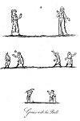
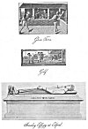
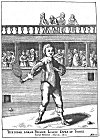
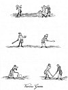
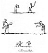

  
[Intangible Textual Heritage](../../../index) 
[Legends/Sagas](../../index)  [England](../index)  [Index](index) 
[Previous](spe09)  [Next](spe11) 

------------------------------------------------------------------------

p. 80

### CHAPTER III

Hand-ball an ancient Game--Used by the Saxons--And by the Schoolboys of
London--Ball Play in France--Hand Tennis or Fives--Fives in Church and
Churchyard--Tennis--Tennis Courts erected--Tennis fashionable in
England--Killed by a Tennis Ball--London Tennis Courts in 1615--Origin
of Tennis Courts--Tennis in Monasteries--Rackets--Lawn
Tennis--Balloon-ball--Hurling--Hockey--Camp-ball--Football--Golf--Cricket--Cricket
on Horseback--Trap-ball and Knur and Spell.

HAND-BALL.--The ball has given origin to many popular pastimes, and I
have appropriated this chapter to such of them as are or have been
usually practised in the fields and other open places. The most ancient
amusement of this kind, is distinguished with us by the name of
hand-ball, and is, if Homer may be accredited, coeval at least with the
destruction of Troy. Herodotus attributes the invention of the ball to
the Lydians; succeeding writers have affirmed, that a female of
distinction named Anagalla, a native of Corcyra, was the first who made
a ball for the purpose of pastime, which she presented to Nausica, the
daughter of Alcinous, king of Phœacia, and at the same time taught her
how to use it; this piece of history is partly derived from Homer, who
introduces the princess of Corcyra with her maidens, amusing themselves
at hand-ball:

O’er the green mead the sporting virgins play,  
Their shining veils unbound, along the skies,  
Tost and retost, the ball incessant flies.

Homer has restricted this pastime to the young maidens of Corcyra, at
least he has not mentioned its being practised by the men; in times
posterior to the poet, the game of hand-ball was indiscriminately played
by both sexes.

ANGLO-SAXON BALL PLAY.--It is altogether uncertain at what period the
ball was brought into England: the author of a manuscript in Trinity
College, Oxford, written in the fourteenth century, and containing the
life of Saint Cuthbert, [1](#fn_351) says of
him, that when he was young, "he pleyde atte balle with the children
that his fellowes were." On what authority this information is
established I cannot tell. The venerable Bede, who also wrote the life
of that saint, makes no mention of ball play, but tells us he excelled
in jumping, running, wrestling, and such exercises as required great
muscular exertion, and among them, indeed, it is highly probable that of
the ball might be included.

LONDON BALL PLAY.--Fitzstephen, who wrote in the thirteenth century,
speaking of the London school-boys, says, "Annually upon Shrove Tuesday,
they go into the fields immediately after dinner, and play at the
celebrated

 

[  
Click to enlarge](img/pl08.jpg)  
Games with the Ball (1)  

 

p. 81

game of ball: [1](#fn_352) every party of boys
carrying their own ball"; for it does not appear that those belonging to
one school contended with those of another, but that the youth of each
school diverted themselves apart. Some difficulty has been stated by
those who have translated this passage, respecting the nature of the
game at ball here mentioned. Stow, considering it as a kind of goff or
bandy-ball, has, without the least sanction from the Latin, added the
word bastion, [2](#fn_353) meaning a bat or
cudgel; others again have taken it for foot-ball, [3](#fn_354) which pastime, though probably known at
the time, does not seem to be a very proper one for children: and
indeed, as there is not any just authority to support an argument on
either side, I see no reason why it should not be rendered
hand-ball. [4](#fn_355)

BALL PLAY IN FRANCE,--The game of hand-ball is called by the French palm
play, [5](#fn_356) because, says St Foix, a
modern author, originally "this exercise consisted in receiving the ball
and driving it back again with the palm of the hand. In former times
they played with the naked hand, then with a glove, which in some
instances was lined; afterwards they bound cords and tendons round their
hands to make the ball rebound more forcibly, and hence the racket
derived its origin." [6](#fn_357) During the
reign of Charles V. palm play, which may properly enough be denominated
hand-tennis, was exceedingly fashionable in France, being played by the
nobility for large sums of money; and when they had lost all that they
had about them, they would sometimes pledge a part of their wearing
apparel rather than give up the pursuit of the game. The duke of
Burgundy, according to an old historian, [7](#fn_358) having lost sixty franks at palm play
with the duke of Bourbon, Messire William de Lyon, and Messire Guy de la
Trimouille, and not having money enough to pay them, gave his girdle as
a pledge for the remainder; and shortly afterwards he left the same
girdle with the comte D’Eu for eighty franks, which he also lost at
tennis.

HAND-TENNIS OR FIVES.--At the top of plate eight is the reproduction of
a supposed game at ball-play between a man and woman from an illuminated
Hours of the fourteenth century; but on referring to the original [8](#fn_359) it is doubtful whether this is any game
at all; the figures are on opposite pages, and the ball appears to be an
accidental blemish on the vellum! Another picture, however, on the same
plate, is of much interest. It is at the foot of a fourteenth-century
copy of the romance called *Histoire de Lancelot, ou S. Graal*. [9](#fn_360) To the left is a player about to strike
the ball with his right hand, whilst behind him stands another player
apparently suggesting how he should make his stroke. To the right, on
the opposite page, separated by an upright ornament--of which the

p. 82

designer apparently took advantage to indicate an intervening
line--stand two more players, with open hands or palms uplifted ready to
receive and return the ball.

\* In a fifteenth-century beautifully illuminated copy of Valerius
Maximus there is a picture of a game of hand-tennis or fives; each of
the two players wears a white glove on the right hand. [1](#fn_361) This is reproduced in the centre of
plate nine.

\* Hand-tennis still continues to be played, though under a different
name, and probably a different modification of the game; it is now
called fives, which denomination perhaps it might receive from having
five competitors on each side, as the succeeding passage seems to
indicate. In 1591, when queen Elizabeth was entertained at Elvetham in
Hampshire, by the earl of Hertford, "after dinner, about three o'clock,
ten of his lordship's servants, all Somersetshire men, in a square
greene court before her majesties windowe, did hang up lines, squaring
out the forme of a tennis-court, and making a cross line in the middle;
in this square they (being stript out of their dublets) played five to
five with hand-ball at bord and cord as they tearme it, to the great
liking of her highness." [2](#fn_362)

\* Edicts against ball-playing in St Paul's of the time of Elizabeth are
often cited, but the desecration of the great church by such games is of
far older date. In 1385 Robert Braybrooke, bishop of London, denounced
the custom both within and without his cathedral church:--*Necnon ad
pilam infra et extra ecclesiam ludunt*. [3](#fn_363)

\* The custom of playing fives in churchyards continued in many a
country district until quite recent years, notably in Somersetshire and
Staffordshire. Ball-playing in such a place no doubt prevailed because
the church tower often afforded so suitable a wall for fives. It was
usually practised on the north side, because there were generally no
graves on that side, and the sport created less scandal. A painted line
for the game still remains on some of our church towers, but a
string-course of suitable elevation more usually sufficed. Fives used to
be played at Eton between the buttresses on the north wall of the
college chapel, and the "pepper box" peculiar to Eton fives courts had
its origin in a natural angle in one of these buttresses. Notices
against ball play on church walls may be seen in various parts of Italy.
In the Basque district, on both sides of the Pyrenees, church walls are
still openly used for the Jett de paume.

\* TENNIS.--Tennis, though essentially a French game in its origin, soon
became domesticated in England. Here as on the Continent it was
originally played in unenclosed spaces, but its great popularity caused
it to be adopted as a good means of recreation and exercise in towns.
Hence came about the use of spaces surrounded by walls, and the
introduction of rackets made boundaries desirable. Eventually this led
to special buildings for the purpose and roofed-in tennis courts.

 

[  
Click to enlarge](img/pl09.jpg)  
Games with the Ball (2)  

 

p. 83

\* As to the origin of the name, though the best authorities consider
the term to be of French extraction, there is still much dispute. The
suggestion, origin-ally made in 1617, that the word comes from *tenez*,
a term used by the player as a warning to receive the ball, *tenez le
jeu*, is still accepted by some. Others consider that the passage just
quoted as to the game played before queen Elizabeth, when the players
were five to five in hand-ball, is the origin not only of the name
Fives, but that the aggregate number of ten may well have given its name
to Tenes, Tennes, Teneis, Tenice, Tennice, Tenys, Tynes, Tenyse, Tenice,
Tennies, or Tennis, for the game is found spelt in all these
varieties. [1](#fn_364)

\* In 1365 the earliest restrictive Act prohibiting various sports in
favour of archery was passed; the first game named is that of hand-ball.
This was renewed in 1388, when it took the form of sumptuary or class
legislation, laying down that servants and labourers were to find their
only pastime in bows and arrows, and prohibiting their playing tennis,
foot-ball, etc. In 1410 this latter statute was re-enacted and
confirmed, delinquents on conviction being liable to imprisonment for
six days.

\* The antiquity of the racket in this country is shown by a passage in
Chaucer's *Troylus and Cryseyde* (*circa* 1380), where Troylus says:

But canstow playen racket, to and fro,  
Nettle in, dokke out, now this, now that, Pandare?

\[paragraph continues\] This evidently alludes to the hitting of a ball
with a racket backwards and forwards, and to the curing of a
nettle-sting by a dock leaf, in protest to the kind of inconstancy
suggested to Troylus by Pandarus. Much the same words are also used in
the first book of Chaucer's *Testament of Love*.

\* Probably the first English mention of the word tennis occurs in
Gower's ballad to Henry IV. (*circa* 1400):--

Of the tennis to winne or lese a chace  
  May no life wete or that the bal be ronne,  
Al stant in God what thing men shal purchase,  
  Th’ ende is in hym or that it be begonne.

\* In the beginning of the reign of Henry V. occurred a remarkable
incident in connection with the royal game of tennis, immortalised by
Shakespeare. Holinshed, who was the dramatist's favourite chronicler,
relates that:

"Whilest in the Lente season the Kyng laye at Kenilworth, there came to
him from Charles, Dolphin of Fraunce, the Frenche King's eldest sonne,
certayne Ambassadours, that broughte with them a barrell of Paris
balles, which they presented to hym for a token from their maister,
whiche presente was taken in verie ill parte, as sent in scorne, to
signifie that it was more mete for the King to passe the tyme with suche
childish exercise, than to attempte anye worthy exployte: wherefore the
Kyng wrote to hym, that ere ought long, hee woulde sende to hym some
London balles, that should breake and batter downe the roofes of his
houses about hys eares."

p. 84

\* Caxton, in the continuation of Higden's *Polycronicon* (1482), calls
these *pilas Parisianes* "tenyse balles," as the name by which
Englishmen would most readily recognise them. Hall, in his *Chronicle*
(1545) describes them as "a tunne of tennis balles."

\* The passage in Shakespeare's *Henry V*. (Act i. sc. 2) is that in
which the French ambassador brings the young king "a tun of treasure"
from the Dauphin, and Henry asks:

What treasure, uncle?  
  *Exeter*.               Tennis balls, my liege.  
  *K. Henry*. We are glad the Dauphin is so pleasant with us;  
His present and your pains we thank you for:  
When we have match’d our rackets to these balls,  
We will, in France, by God's grace, play a set  
Shall strike his father's crown into the hazard.  
Tell him he hath made a match with such a wrangler  
That all the courts of France will be disturb’d  
With chases.

\* In Drayton's poem *The Ballade of Agincourt*, the king's answer is
thus given:

. . . I'll send him Balls and Rackets if I live,  
That thy such Racket shall in Paris see,  
When over lyne with Bandies I shall drive,  
As that before the Set be fully done,  
France may (perhaps) into the Hazard runne.

This passage is cited by Mr Marshall as offering one of the first
examples of the double sense of racket meaning *hubbub*, as well as a
tennis bat, and also as showing the early use of the word bandy in the
game.

\* About the same period a rude sort of tennis, in spite of statutory
prohibition, was practised out of doors by the working classes. In 1447,
the bishop, and dean and chapter of Exeter complained to the mayor that
ungodly young people of the commonalty were in the habit, during divine
service, of playing at unlawful games in the cloister, such "as the
toppe, penny prykke, and most atte tenys," by which the walls were
defiled and the glass windows broke. [1](#fn_365) In some towns, such as Lydd, Kent, the
laws against games were sought to be enforced. In 1456-8, 1462-3, and
1477-8, proclamations were made in that town forbidding tennis and
dice-playing, and exhorting the youth to turn to bow and arrows and
other manlier recreations. [2](#fn_366)

\* Towards the end of the reign of Henry VI. begin a number of curious
entries in the accounts of the Ironmongers' Company relative to tennis
balls. The earliest of these is of the year 1459

"ix daie of March Anno xxxvij (Hen. VI.)--And at the tyme of the accompt
ther was delyvèd to the seid wardeyns for ballis lixs. ijd."

An entry *temp*. Edward IV. records the receipt of, £4 for "teneis
balles" from Robert Tooke. The trade was vigorous, for in another year
of the same

p. 85

reign the wardens sold 47 gross of tennis balls to Thomas Tooke at god.
the gross. The entries as to the sale of these balls continue up to
1535. Their sale by this company led to the singular supposition that
the balls were made of iron; [1](#fn_367) but
Mr Marshall has shown that there are strong probabilities that the
Ironmongers' Company owned a tennis court in Fenchurch Street, for which
they made balls so well that they were in demand with players in other
courts.

\* KILLED BY A TENNIS BALL.--The foolish suggestion that tennis balls
used to be made of iron has been used by some to account for the death
of the youthful son of John Stanley in the fifteenth century. But an
ordinary tennis ball striking a child, when in full play, on the temple
might readily have a fatal result. In the beautiful village church of
Elford, five miles from Lichfield, is a small monumental effigy,
indicating by its attitude, after a pathetic fashion, the cause of
death. The boy, who has curly hair and is clad in a long tunic reaching
to his ankles, holds in his left hand a ball, whilst the right hand is
raised to the head, the fingers evidently pointing to the seat of injury
behind the right ear. On the monument is inscribed--*Ubi dolor, ibi
digitus*. The date of this memorial is about the year 1460. It is said
to represent the grandson and heir of Sir John Stanley, first cousin of
Thomas, first Lord Stanley, who died in 1474, and whose fine alabaster
effigy is close to that of the lad slain by a tennis ball. [2](#fn_368) This effigy is shown on plate nine.

\* TENNIS FASHIONABLE IN ENGLAND.--The journals of the Proceedings of
the Court of Common Council of the City of London show that the
injunctions against games (headed by tennis) played by labourers,
servants, or apprentices, were enforced by severe penalties during the
reign of Edward IV., at the very time when nobles, gentlefolk, and the
wealthier burgesses were free to use the tennis courts, and when one of
the most prominent of the city companies was largely adding to its
revenue by the manufacture and sale of tennis balls!

\* The game was also forbidden to the common folk by legislation of
Henry VII. and Henry VIII., though both those monarchs were fond of
tennis, and lost both balls and money at the pastime, as their accounts
show. They played in courts at Woodstock, Wycombe, Sheen, Greenwich,
Richmond, Blackfriars, and Whitehall or Westminster. There was also a
court at Windsor in the time of Henry VII. It was standing in 1607,
though roofless, and is shown in John Norden's MS. account of Windsor
Castle, as lying within the walls, on the eastern side, just below the
keep. [3](#fn_369) A later drawing of Hollar,
among the Ashmolean MSS., shows that the Windsor tennis court was still
standing in 1672.

It was in this court, probably at that time roofed, as it is called a
room, that on January 31st, 1516, the king of Castile played tennis with
the marquis of Dorset, Henry VII. looking on. This match is noteworthy
as showing that

p. 86

the hand was still in use by English players. The king of Castile used a
racket, and as the marquis played with the bare hand, he gave him
fifteen. [1](#fn_370)

Mr Marshall gives numerous interesting references and extracts relative
to Henry VIII.'s devotion to the royal game. [2](#fn_371)

\* Pages might readily be filled as to the popularity and general use of
tennis by the noblemen and gentlefolk of the reign of Elizabeth. It must
suffice to give one anecdote that yields a vivid picture of court
manners even in the presence of the virgin queen. In a letter from
Thomas Randolphe to Sir Nicholas Throckmorton, dated March 31st, 1565,
at Edinburgh, occurs the following passage: "I have it from this
nobleman's mouthe that latlye the Duke \[of Norfolk\] and my L. of
L\[eicester\] were playinge at tennes, the Q. beholdinge of them, and my
L. Rob. being verie hotte and swetinge, tooke the Q. napken owte of her
hande and wyped his face, wch the Duke seinge saide that he
was to sawcie and swhore yt he wolde laye his racket upon his
face. Hereupon rose a great troble and the Q. offendid sore
wth the Duke. Thys tale is tolde by the Earle Atholl the same
daye that Fowler came to thys towne wt hys Mties
license." [3](#fn_372)

\* The privilege of keeping tennis courts in Elizabeth's reign was
eagerly sought, and in 1597 one Thomas Bedingfield applied for an
exclusive license to keep houses in London and Westminster for tennis,
bowling, cards, dice, and backgammon. The application, which was
apparently granted, represented that the number of such houses was very
great, but that they were often kept by disorderly persons, so that the
honest sort would not resort thither; and further that it would not only
be well to restrict the number, but to prohibit any play on the forenoon
of any Sabbath day and during evening and morning prayers on holy days,
to forbid all swearing and blasphemy, and to suffer none to play save
noblemen, gentlemen, and merchants, or such as shall be entered in the
Book of Subsidies at £10 in land or goods." [4](#fn_373)

\* The demanding a money qualification from the tennis player is to some
extent paralleled by the dress test of the keeper of the court alluded
to by Prince Henry in his speech to Poins:--

"What a disgrace is it to me to remember thy name! or to know thy name
to-morrow! or to take note how many pair of silk stockings thou hast,
viz. these, and those that were the peach-colour’d ones! or to bear the
inventory of thy shirts, as, one for superfluity, and one other for use!
But that the tennis-court keeper knows better than I; for it is a low
ebb of linen with thee when thou keepest not racket there."  [5](#fn_374)

\* The tennis ball of this period was stuffed with hair, to which the
dramatists of Elizabethan and Stuart days make many satirical allusions.
Thus in *The Gentle Craft*, of 1600, occurs the phrase--"He'll shave it
off, and stuffe tenice balls with it."

p. 87

\* James I. commended tennis, with certain other games, to be used in
moderation, and not as a craft, to his son Henry. [1](#fn_375) The young prince became a great adept at
tennis by assiduous practice in the Whitehall court, and there are
records of various quarrels in which he took part when engaged in this
game.

\* Gervase Markham, in 1615, describes tennis as "a pastime in close or
open courts, striking little round balls to or fro, either with the palm
of the hand or with racket." [2](#fn_376)

\* Charles I., when duke of York, began to play tennis; the sum of 420
was paid to John Webb, "Master of His Majesty's Tennis plays," for his
attendance in teaching the young duke to play tennis, and providing him
with balls and rackets for the year ending Michaelmas, 1610. [3](#fn_377)

\* A list of the London tennis courts, in 1615, in a book kept by the
clerk of the works at Petworth, and cited by Mr Marshall, shows that
there were then fourteen courts in the metropolis, whose dimensions are
given, in addition to one at St James'. Whitehall had two, one covered
and one uncovered; the rest were all roofed. The largest was at Essex
House, which was 84 ft. long by 22 ft. broad, and 21 ft. high; the
smallest was "Fowles chaine tennis courte," which was 55 ft. long by 16
ft. broad, and 17 ft. high.

\* The game was fashionable both at Oxford and Cambridge in the
seventeenth century.

\* In a rare book, published in 1641, entitled *The True Effigies of our
Most Illustrious Sovereigne Lord King Charles, Queene Mary, with the
rest of the Royal Progenie*, a most interesting portrait of the Duke of
York (James II.) is given on p. 7. The young prince is represented
holding a short-handled racket in his right hand, in a tennis court with
a gallery full of spectators; it is evidently intended for the uncovered
court of Whitehall. A reproduction of this portrait is given on plate
nine.

\* In July 1649 a warrant was issued by the Council of State to John
Hooke, keeper of the St. James' tennis court, to deliver up the key to
Colonel Pride to enable him therein to quarter his soldiers. [4](#fn_378)

\* Charles Hoole, in 1659, translated, from the High Dutch and Latin, J.
A. Komensky's *Orbis Sensualium Pictus*. Plate cxxxiii. gives a rude
representation of a smaller tennis court, termed "Ludus Pilæ or Tennis
Play." The remarks of the brief letterpress refer to the like numbers on
the plate. Numbers 4 and 5 refer to the game of wind-ball played
outside. "In a Tennis-Court 1 they play with a ball 2 which one throweth
and another taketh and sendith it back with a Racket 3; and that is the
sport of Noblemen to stir their body."

\* After the Restoration, Charles II. frequently used the court at
Hampton Court, and had a new one built at Whitehall. Pepys states that
the new court was built so badly that it fell down in June 1663. The
great diarist has several

p. 88

other allusions to play in this court when re-erected. In December 1663
he watched the king and Sir Arthur Slingsby play against Lord Suffolk
and Lord Chesterfield, and admired the royal play; but in the following
month, when watching the royal game, he remarks: "To see how the King's
play was extolled, without any cause at all, was a loathsome sight,
though sometimes indeed he did play very well, and deserved to be
commended; but such open flattery is beastly."

\* A curious book of fiction appeared in 1701, written by Gatien de
Courtilz de Sandras, styled *Mémoires de M. it Marquis de Montbrun*,
most of the scene of which is laid in England. This French adventurer is
described as visiting England to replenish his purse, when he took with
him one of the best tennis-markers of Paris disguised as his valet. By
concealing at first his own skill and introducing the marker as his
partner, and no more skilled than himself, Montbrun succeeded in winning
a vast sum from his chief antagonist, the "Comte do Nortampton." The
novel has a good many illustrations, and plate 20 represents the marquis
and his valet playing a deliberately clumsy game in a London tennis
court, to delude Nortampton, who is concealed behind a thick
wire-netting on the left and disguised in female attire, though
recognised by the accomplices. Mr Marshall, in reproducing this plate,
says that "the court is evidently one of the kind called Quarré and
uncovered. The mode of erecting nets above the walls on every side to
prevent balls from flying over is clearly shown. The *cord* (as usual
then) has no net attached to it, but only a sort of fringe. The marker
stands at a door, nearly in the middle of the length of the court; but
including that door, there are only three gallery-divisions on that side
of the line, while there are four on the other side. Running along the
end-wall, on the service side, is a very peculiarly built thickening of
the wall, seeming to be a sort of horizontal, but flat-topped tambour,
and containing a *petit trou* in the fore-hand corner." [1](#fn_379)

\* ORIGIN OF TENNIS COURTS.--It has been more than once suggested that
the origin of the tennis court is to be found in the cloister court or
garth. The cloister roofs were supposed to be the first *pent-houses*; a
buttress the origin of the *tambour*; and the *grille* a development of
the opening through which strangers spoke to the inmates. We do not at
all believe this; those who advance the theory apparently forget that
domestic houses and other buildings, besides those of monastic
foundations, of the, period when tennis courts were developing, were
usually built round an open quadrangular space which had usually
cloisters or alleys to give access to the various rooms. It is quite
possible, nay probable, to suppose that some of the eccentricities of
the tennis-court arrangement arose from their being copied from some
secular courtyard where the game had previously been played--in the same
way as an Eton fives-court imitates a chapel buttress. Although it is
not in the least likely that its construction was imitated from a
conventual cloister, some of those who object to the theory go quite
astray in their strenuous objections. Mr

 

[  
Click to enlarge](img/pl10.jpg)  
Duke of York at Tennis  

 

p. 89

\[paragraph continues\] Marshall, when gainsaying it, writes:--"No one
possessed of the smallest knowledge of monastic institutions will for a
moment believe the statement. That a game should be played, openly,
within the walls or cloisters of an abbey or monastery, would be
entirely opposed to every rule of such a fraternity. . . . It would show
a ludicrous ignorance of monastic institutions to place the smallest
confidence in this alleged origin of the game." [1](#fn_380)

\* TENNIS IN MONASTERIES.--NOW it so happens that clear proof can be
given of the not infrequent playing of this very game in the cloister
court of the religious houses of at all events one order. In the
original twelfth-century statutes of the Premonstratensian or White
Canons, who had so many important houses in England, it was laid down
that twice a week the brethren might find recreation in some honest
exercise. [2](#fn_381) The time for this
varied, but was usually after Nones (three o'clock service) and ceased
with the first bell for Vespers. In course of time this somewhat vaguely
worded order got so abused in the houses that were laxly conducted, that
the General Chapter of 1559 interfered. It was stated that it had come
to their knowledge that the very cloisters and their roofs were used for
hand tennis (*ludo palmario*), and all exercises in such sacred places
(for one wall of the cloister court was always formed by the nave wall
of the conventual church) or in the cemeteries were strictly prohibited.
The important General Chapter of 1639, in their revision and
interpretation of the statutes, laid down, in comment on the recreation
rule, the wise principle that man, however religiously he lived, was
still man, and that therefore it was not prudent to deny him honest and
moderate relaxation, which might prove of service to his soul as well as
his body. They adopted, however, this precautionary measure, namely,
that in houses where ball-play (*lusus pili*) was allowed, it was only
to be permitted in some secluded place to which no secular person could
gain access. [3](#fn_382)

\* In the edition of *Britannia Illustrata*, published in 1720, a
bird's-eye view of Hampton Court shows the tennis court as restored by
William III.

\* The Hanoverian dynasty were not specially addicted to tennis, but
Frederick, prince of Wales, who died in March 1751, is said, by Horace
Walpole, to have been a victim to the game. "An imposthume had broken,
which, on his body being opened, the physicians were of opinion had not
been occasioned by the fall, but from the blow of a tennis ball three
years before." [4](#fn_383) During the latter
half of the eighteenth century the game lost much of its popular
character and became still more the amusement of the wealthy. The
*Sporting Magazine* of September 1793 shows, however, that the outdoor
form of this sport was in full vigour:--"Field tennis threatens ere long
to bowl out cricket. The former game is now patronised by Sir Peter
Burrel; the latter has for some time back been given up by Sir Horace
Mann."

\* Throughout the nineteenth century, especially towards its close,
there

p. 90

was a marked revival of tennis in England, though it is almost extinct
on the Continent. Mr Marshall's account of tennis, in the All England
Series, published in 1890, enumerates thirty-one courts in England,
nineteen of which were attached to private houses. Mr Heathcote in the
Badminton Library volume, the fourth edition of which was published in
1897, increases the list to thirty-four. Nevertheless, there can be no
doubt that, though somewhat on the increase, the number of English
courts at the opening of the twentieth century is considerably behind
those in constant use at the beginning of either the seventeenth or
eighteenth century. The enthusiasts say of this sport that it is not
only the game for kings but the king of games.

\* RACKETS.--There is not much history attached to the game of rackets
apart from tennis. It originated in the tennis courts, as has been shown
by Mr Marshall, who has drawn attention to a print at the British
Museum, inscribed: "Fives Played at the Tennis Court, Leicester Fields.
Printed by Carrington Bowles, 1788." The players are represented as
using tennis rackets and playing against only one wall of the tennis
court, on which is chalked out a certain area within which the balls had
to be driven. Mr Marshall has thus clearly defined the sequence of the
game:--"First came fives, played with the hand against any available
wall. Then came bat-fives, in which a wooden instrument, roughly
imitated from the tennis racket, was employed. That was a good game; and
it is still played in many places, and notably at some of our great
schools, Rugby, Westminster, Cheltenham, and others. Not content with
the wooden bat, players acquainted with the tennis racket seem to have
adopted that instrument about 1749, or a little earlier . . . so it
continued to be played until 1788, the date of the print mentioned
above, which the players still called the game fives." [1](#fn_384)

'With the introduction of the racket, the change in the name gradually
followed. It used to be popular in the prisons of the Fleet and King's
Bench, and afterwards in the gardens of some of the great London
taverns. A special form of the real game became localised at Harrow
about 1822. With its later history we are not here concerned, nor with
the various developments of the present game of fives, which is
essentially a pastime for boys.

\* LAWN TENNIS.--Of the widespread pastime of lawn tennis, which assumed
definite shape in 1874, it need only be remarked in these pages that it
can lay claim to a long pedigree, though suspended in its action for a
considerable period. The earlier notices of tennis establish the fact
that the royal game was originally played in the open air.

\* THE WIND-BALL OR BALLOON.--The wind-ball or leathern ball filled with
air, after the fashion of the later form of football, but struck with
the hand or fist, is as old as the time of the Romans, by whom it was
termed *follis*. Gervase Markham, in 1615, couples the "Baloone" with
tennis as good sports either for health or action. He describes it as "a
strong and moving sport in the open

p. 91

fields, with a great ball of double leather fill’d with winde, and
driven to and fro with the strength of a man's arme arm’d in a bracer of
wood." [1](#fn_385)

\* In the 1659 English edition of Komensky's *Orbis Sensualium Pictus*,
this game is depicted as being played outside a tennis court, and is
thus described, the numerals being references to the picture:--"A
Winde-ball 4 being filled with air by means of a Ventie is tossed to and
fro with the fist 5 in the open air." [2](#fn_386)

\* Doctor Jones, the Buxton physician of Elizabethan fame, did not
disdain to recommend his patients to play at ball. "The wind baule, or
yarne ball, betwene three or foure shall not bee inutile to be used in a
place convenient, eache keeping their limite. For tossinge wherein may
bee a very profitable exercise, bycause at all tymes they keepe not the
lyke force in striking, so that shalbee constrayned to use more violent
stretching with swifter moving at one time than another, which will make
the exercise more nymble, and deliver both of hand and whole body:
therefore encreasing of heat through swift moving in all partes the
sooner." [3](#fn_387)

HURLING, HOCKEY, CAMP-BALL.--Hurling is an ancient exercise, and seems
originally to have been a species of the hand-ball; it was played by the
Romans with a ball called harpastum, a word probably derived from
harpago, to snatch or take by violence. The contending parties
endeavoured to force the ball one from the other, and they who could
retain it long enough to cast it beyond an appointed boundary were the
conquerors. The inhabitants of the western counties of England have long
been famous for their skill in the practice of this pastime. There were
two methods of hurling in Cornwall, at the commencement of the
seventeenth century, and both are particularly described by Carew, a
contemporary writer, [4](#fn_388) whose words
are these: "Hurling taketh his denomination from throwing of the ball,
and is of two sorts; in the east parts of Cornwall to goales, and in the
west to the country. For hurling to goales there are fifteen, twenty, or
thirty players, more or less, chosen out on each side, who strip
themselves to their slightest apparell and then join hands in ranke one
against another; out of these rankes they match themselves by payres,
one embracing another, and so passe away, every of which couple are
especially to watch one another during the play; after this they pitch
two bushes in the ground, some eight or ten feet asunder, and directly
against them, ten or twelve score paces off, other twain in like
distance, which they term goales, where some indifferent person throweth
up a ball, the which whosoever can catch and carry through his
adversaries goale, hath wonne the game; but herein consisteth one of
Hercules his labours, for he that is once possessed of the ball, hath
his contrary mate waiting at inches and assaying to lay hold upon him,
the other thrusteth him in the breast with his closed fist to keep him
off, which they call *butting*." According to the laws of the game,
"they must hurle man to man, and not two set upon one man at

p. 92

once. The hurler against the ball must not *but* nor *handfast* under
the girdle, he who hath the ball must *but* only in the other's breast,
and deale no fore ball, that is, he may not throw it to any of his mates
standing nearer to the goale than himself." In hurling to the country,
"two or three, or more parishes agree to hurl against two or three other
parishes. The matches are usually made by gentlemen, and their goales
are either those gentlemen's houses, or some towns or villages three or
four miles asunder, of which either side maketh choice after the
nearnesse of their dwellings; when they meet there is neyther comparing
of numbers nor matching of men, but a silver ball is cast up, and that
company which can catch and carry it by force or slight to the place
assigned, gaineth the ball and the victory. Such as see where the ball
is played give notice, crying 'ware east,' 'ware west,' as the same is
carried. The hurlers take their next way over hilles, dales, hedges,
ditches; yea, and thorow bushes, briars, mires, plashes, and rivers
whatsoever, so as you shall sometimes see twenty or thirty lie tugging
together in the water, scrambling and scratching for the ball."

About the year 1775, the hurling to the goales was frequently played by
parties of Irishmen, in the fields at the back of the British Museum,
but they used a kind of bat to take up the ball and to strike it from
them; this instrument was flat on both sides, and broad and curving at
the lower end. I have been greatly amused to see with what facility
those who were skilful in the pastime would catch up the ball upon the
bat, and often run with it for a considerable time, tossing it
occasionally from the bat and recovering it again, till such time as
they found a proper opportunity of driving it back amongst their
companions, who generally followed and were ready to receive it. In
other respects, I do not recollect that the game differed materially
from the description above given. The bat for hurling was known and
probably used in England more than two centuries ago, for it is
mentioned in a book published in the reign of Queen Elizabeth, [1](#fn_389) and is there called "a clubbe" or "hurle
batte."

\* Mr Strutt's paragraph as to the Irish bat hurling at once suggests
hockey. In Chambers's *Information for the People* it is stated that,
"shinty in Scotland, hockey in England, and hurling in Ireland appear to
be very much the same out-of-door sport." [2](#fn_390) In a recent brief essay on the history
of hockey, an enthusiastic writer states that "the game existed in
Ireland two thousand years ago, though possibly in a form that would not
be recognised by the modern player, and its trail may be found here and
there, across the story of social England from quite early days." [3](#fn_391) The earliest known use of the word
occurs in certain local statutes enacted by the town of Galway in the
year 1527, when, amongst prohibited games is named--"The horlinge of the
litill balle with hockie stickes or staves." [4](#fn_392) Hockey is described in Murray's
Dictionary as equivalent to bandy or shinty.

p. 93

\[paragraph continues\] The game, which was for a long time during last
century chiefly confined to the ice, has of late years experienced a
remarkable revival among both sexes.

\* All games with ball have a tendency to change and mingle with others,
and vary much in different districts, as well as at different periods.
Hence it is difficult to keep their nomenclature accurate and distinct.
The true Cornish hurling, and a like game in other parts of England,
seems to have consisted in the hurling or hand-throwing of a
comparatively small ball. An interesting, but unfortunately brief,
reference to this western game as a sport between counties occurs as
early as 1648: "The Counties of Devon and Cornwall are, on Monday next,
to meet at a hurling, a sport they have with a ball." [1](#fn_393)

\* This form of western hurling was very similar to the camp-ball (from
A.S. *camp*, a combat) of the eastern counties, which was distinct from
football, termed "kicking-camp." In Mr Albert Way's notes to the
*Promptorium Parvulorum* (Camden Society), it is stated that
"camping-land appropriated to this game occurs, in several instances, in
authorities of the fifteenth century." Camp-ball prevailed in many parts
of Norfolk, Suffolk, and Essex in the seventeenth and eighteenth
centuries. It is thus described by Major Moor in 1823:--

"Goals were pitched 150 to 200 yards apart, formed of the thrown-off
clothes of the competitors. Each party has two goals, To or 15 yards
apart. The parties, 10 to 15 a side, stand in a line facing their own
goals and each other, at to yards distance, midway between the goals and
nearest that of their adversaries. An indifferent spectator throws up
the ball--the size of a cricket ball--midway between the confronted
players, whose object is to seize and convey it between their own goals.
The shock of the first onset to catch the falling ball is very great,
and the player who seizes it speeds home pursued by his opponents,
through whom he has to make his way, aided by the jostlings of his own
side. If caught and held, he throws the ball--but must in no case give
it--to a comrade, who, if it be not arrested in its course, or be
jostled away by his eager foes, catches it and hurries home, winning the
notch or snotch if he continues to carry--not throw--it between the
goals. A holder of the ball caught with it in his possession loses a
snotch. At the loss of each of these the game recommences, after a
breathing time. Seven or nine snotches are the game, and these it will
sometimes take two or three hours to win. At times a large football was
used, and the game was then called 'kicking camp'; and if played with
shoes on was termed 'savage camp.'" [2](#fn_394)

''The same correspondent of *Notes and Queries*, who cited this account
in 1892, stated that the game seemed to have died away owing to numerous
and fatal accidents that happened to players. "Two men were killed at a
grand match at Euston, Suffolk, about the close of last century."

FOOTBALL.--Football is so called because the ball is driven about with
the feet instead of the hands. It was formerly much in vogue among the
common people of England, though of late years it seems to have fallen
into disrepute,

p. 94

and is but little practised. I cannot pretend to determine at what
period the game of football originated; it does not, however, to the
best of my recollection, appear among the popular exercises before the
reign of Edward III., and then, in 1349, it was prohibited by a public
edict; not, perhaps, from any particular objection to the sport in
itself, but because it co-operated, with other favourite amusements, to
impede the progress of archery.

When a match at football is made, two parties, each containing an equal
number of competitors, take the field, and stand between two goals,
placed at the distance of eighty or an hundred yards the one from the
other. The goal is usually made with two sticks driven into the ground,
about two or three feet apart. The ball, which is commonly made of a
blown bladder, and cased with leather, is delivered in the midst of the
ground, and the object of each party is to drive it through the goal of
their antagonists, which being achieved the game is won. The abilities
of the performers are best displayed in attacking and defending the
goals; and hence the pastime was more frequently called a goal at
football than a game at football. When the exercise becomes exceeding
violent, the players kick each other's shins without the least ceremony,
and some of them are overthrown at the hazard of their limbs.

Barclay in his fifth eclogue [1](#fn_395) has
these lines:

        The sturdie plowmen lustie, strong and bold,  
Overcometh the winter with driving the foote-ball,  
Forgetting labour and many a grievous fall.

And a more modern poet, Waller:

As when a sort of lusty shepherds try  
Their force at foot-ball; care of victory  
Makes them salute so rudely breast to breast,  
That their encounter seems too rough for jest.

The danger attending this pastime occasioned King James I. to say, "From
this court I debarre all rough and violent exercises, as the foot-ball,
meeter for lameing than making able the users thereof." [2](#fn_396)

The rustic boys made use of a blown bladder without the covering of
leather by way of football, putting peas and horse beans withinside,
which occasioned a rattling as it was kicked about.

--And nowe in the winter, when men kill the fat swine,  
They get the bladder and blow it great and thin,  
With many beans and peason put within:  
It ratleth, soundeth, and shineth clere and fayre,  
While it is throwen and caste up in the ayre,  
Eche one contendeth and hath a great delite  
With foote and with hande the bladder for to smite;  
If it fall to grounde, they lifte it up agayne,  
And this waye to labour they count it no payne. [3](#fn_397)

"It had been the custom," says a Chester antiquary, [4](#fn_398) "time out of mind,

p. 95

for the shoemakers yearly on the Shrove Tuesday, to deliver to the
drapers, in the presence of the mayor of Chester, at the cross on the
Rodehee, [1](#fn_399) one ball of leather
called a foote-ball, of the value of three shillings and fourpence or
above, to play at from thence to the Common Hall of the said city; which
practice was productive of much inconvenience, and therefore this year
(1540), by consent of the parties concerned, the ball was changed into
six glayves of silver of the like value, as a reward for the best runner
that day upon the aforesaid Rodehee."

In an old comedy, the *Blind Beggar of Bethnal Green*, by John
Day, [2](#fn_400) one of the characters speaks
thus of himself: "I am Tom Stroud of Hurling, I'll play a gole at
camp-ball, or wrassel a fall a the hip or the hin turn." Camp-ball, I
conceive, is only another denomination for foot-ball, and is so called,
because it was played to the greatest advantage in an open country. The
term may probably be a contraction of the word campaign.

\* It has been thought well to give the whole of the passage originally
published by Joseph Strutt in 180f, relative to football, as it not only
gives an account of the game as played at the end of the eighteenth
century, but also points with emphasis to the marvellous growth and
popularity achieved by football in the course of a hundred years.

\* Mr Strutt conceived that camp-ball was but another name for football;
his partial error in that respect has already been pointed out, yet he
might have claimed a good and early authority for such a mistake. In the
*Promptorium Parvulorum* occurs this definition: "*Campan*, or playar at
foott balle, *pediluson*; *campyon*, or champion." It is also obvious
that Rugby football owes a good deal to the old camp-ball proper, which
was a hand game.

The legends connected with English football point to a very early use of
the game. The Shrovetide game at Chester is said to have been in
commemoration of the barbarous kicking about of the head of a captured
Dane; whilst the Derby game is supposed to have been a memorial of a
local victory over the Romans.

\* Ball play, apparently football, was so popular in London in the time
of Edward II. that a proclamation was issued in 1314 forbidding the
hustling of over-large balls (*rageries de grosses pelotes*) within the
city under pain of imprisonment.

\* There is a curious instance of a fatal football accident caused by a
religious of the Gilbertine order in the time of Edward II. During a
game William de Spalding, canon of the Gilbertine house of Shouldham,
Norfolk, when in the act of kicking the ball was run against by a lay
friend of his, who was also called William. The canon was carrying a
sheathed knife in his girdle, but in the collision the layman wounded
himself on the knife so severely that he died within six days. The canon
was instantly suspended from all clerical duty; but on appealing to the
pope, dispensation to resume his work was granted him,

p. 96

as it was shown that no blame attached to him, and that he deeply
regretted the death of his friend. [1](#fn_401)

\* In 1349 football and other games were forbidden by Edward III. in
favour of archery. It was again forbidden by statute under Richard II.
in 1389, which statute was re-enacted in 1401. These statutes had,
however, but partial and temporary success. Football came again under
the ban of the law in the sixteenth century, both under Henry VIII. and
Elizabeth. There seems, however, to have been reasonable excuse for
these repressive measures, judging from the violence with which it was
played.

\* Mr Montague Shearman cites various official records as to serious or
fatal results from football of the sixteenth century; [2](#fn_402) and these might be materially increased
by reference to coroners' rolls.

\* After the dissolution of the monasteries, when Sir Roger Townsend was
pulling down the tower of Coxford Priory, Norfolk, to build himself a
goodly house, the steeple came down with a crash and fell upon a house
near by, "breaking it down and slaying one Mr Seller, that lay lame in
it of a broken leg gotten at foot-ball." [3](#fn_403)

''Sir Thomas Elyot, in his charming little work entitled *The Boke named
the Governour*, first published in 1531, says of football that it "is
nothyng but beastely fury and extreme violence, whereof procedeth hurte,
and consequently rancour and malice do remayne with thym that be
wounded, wherfore it is to be put in perpetuall silence." [4](#fn_404)

\* In Stubbes' *Anatomie of Abuses* (1583) football is described as "a
develishe pastime . . . and hereof groweth envy, rancour, and malice,
and sometimes brawling, murther, homicide, and great effusion of blood,
as experience daily teacheth."

\* And yet there must have been gentler forms of this exercise. The
married women and spinsters of Inverness used to have a Shrovetide match
of football; and a writer in *Notes and Queries* for 1892 cites the
following lines as to matron and girls playing from Sir Philip Sidney's
*Dialogue between Two Shepherds*:--

A time there is for all, my mother often says,  
  When she, with skirts tucked very high,  
With girls at football plays.

\* One of the chief objections to football in the early part of the
seventeenth century naturally arose from the habit of playing it in the
streets of towns instead of the open country. In Hone's *Table-Book* the
following passage is cited from Davenant's description of London in
1634:--

"I would now make a safe retreat, but that methinks I am stopped by one
of your heroic games called football; which I conceive (under your
favour) not very conveniently civil in the streets, especially in such
irregular and narrow

p. 97

roads as Crooked Lane. Yet it argues your courage, much like your
military pastime of throwing at cocks, since you have long allowed these
two valiant exercises in the streets."

\* This extract seems to show that the numerous town bye-laws against
foot-ball were but seldom enforced. A century earlier than this football
had been singled out for special honour by the town of Galway, but to be
played outside the walls; the local statutes of 1527 forbad, in favour
of archery, every other kind of sport and pastime "onely the great foote
balle." [1](#fn_405)

\* Football seems to have been well established at Cambridge in the time
of Charles II. In the second register book of Magdalen College occurs
the following entry of 1679, relative to abuses connected with
Michaelmas football:--

\* "That no schollers give or receive at any time any treat or collation
upon account of ye football play, on or about Michaelmas Day, further
then Colledge beere or ale in ye open hall to quench their thirsts. And
particularly that that most vile custom of drinking and spending
money--Sophisters and Freshmen together--upon ye account of making or
not making a speech at that football time be utterly left off and
extinguished." [2](#fn_406)

\* Pepys and other well-known authorities give evidence of much football
play in the latter half of the seventeenth century. It is alluded to in
the *Spectator*, as a game played on village greens, but save in a few
traditionary towns at certain dates--usually Shrovetide--football seems
to have gradually died out during the eighteenth century, and to have
remained quiescent during the first half of the nineteenth century. The
revival began in our great public schools.

\* Derby and Kingston were among the most noteworthy places for
Shrove-tide town football; the game was vigorously and furiously played
in both these towns well into the nineteenth century. At Dorking efforts
are still made to maintain the annual street game.

GOLF.--There are many .games played with the ball that require the
assistance of a club or bat, and probably the most ancient among them is
the pastime now distinguished by the name of golf. [3](#fn_407) In the northern parts of the kingdom
golf is much practised. It requires much room to perform this game with
propriety, and therefore I presume it is rarely seen at present in the
vicinity of the metropolis. It answers to a rustic pastime of the Romans
which they played with a ball of leather stuffed with feathers, called
*paganica*, because it was used by the common people: the golf-ball is
composed of the same materials to this day: I have been told it is
sometimes, though rarely, stuffed with cotton. In the reign of Edward
III. the Latin name *cambuca* [4](#fn_408) was
applied to this pastime, and it derived the denomination, no doubt, from
the crooked

p. 98

club or bat with which it was played; the bat was also called a bandy,
from its being bent, and hence the game itself is frequently written in
English bandy ball. At the bottom of [plate eight](#img_pl08) are two
figures engaged at bandy-ball, showing the form of the bandy, as it was
used early in the fourteenth century, from a MS. book of prayers
beautifully illuminated, in the possession of Mr Francis Douce.

Golf, according to the present modification of the game, is performed
with a bat, not much unlike the bandy: the handle of this instrument is
straight, and usually made of ash, about four feet and a half in length;
the curvature is affixed to the bottom, faced with horn and backed with
lead; the ball is a little one, but exceedingly hard, being made with
leather, and, as before observed, stuffed with feathers. There are
generally two players, who have each of them his bat and ball. The game
consists in driving the ball into certain holes made in the ground; he
who achieves it the soonest, or in the fewest number of strokes, obtains
the victory. The golf-lengths, or the spaces between the first and last
holes, are sometimes extended to the distance of two or three miles; the
number of intervening holes appears to be optional, but the balls must
be struck into the holes, and not beyond them; when four persons play,
two of them are sometimes partners, and have but one ball, which they
strike alternately, but every man has his own bandy.

It should seem that golf was a fashionable game among the nobility at
the commencement of the seventeenth century, and it was one of the
exercises with which prince Henry, eldest son to James I., occasionally
amused himself, as we learn from the following anecdote recorded by a
person who was present: [1](#fn_409) "At
another time playing at goff, a play not unlike to pale-maille, whilst
his school-master stood talking with another, and marked not his
highness warning him to stand farther off, the prince thinking he had
gone aside, lifted up his goff-club to strike the ball; mean tyme one
standing by said to him, "beware that you hit not Master Newton":
wherewith he drawing back his hand, said, "Had I done so, I had but paid
my debts."'

\* In addition to the early drawing given on plate eight, another one
has been reproduced at the bottom of [plate eleven](#img_pl11). In this
drawing of fourteenth-century date, which has been named as illustrating
golf, two men are standing with the ends of their knobbed clubs, which
they hold in both hands, crossed on the ground; but this illustration
seems to point to some form of bandy-ball or hockey rather than
golf. [2](#fn_410) A third illustration, at the
top of [plate nine](#img_pl09), taken from a series of miniatures in a
Book of Hours, circa 1500, undoubtedly refers to golf as then played;
the figure down on his knees is "holing." [3](#fn_411)

\* The definition of the word given in Murray's New Dictionary is
admirable

"A game of considerable antiquity in Scotland, in which a small hard
ball

 

[  
Click to enlarge](img/pl11.jpg)  
Various Games  

 

p. 99

is struck with various clubs into a series of small cylindrical holes
made at intervals, usually of a hundred yards or more, on the surface of
a moor, field, etc. The aim is to drive the ball into any one hole, or
into all the holes successively, with the fewest possible strokes.
Commonly two persons or two couples (a 'foursome') play against each
other."

\* The same work cites authorities for "golf," 1457; "gouff," 1491;
"goiff," 1538; "golf," 1575; and "goff," 1615 and 1669. The origin of
the word is obscure.

\* Golf is essentially the national pastime of Scotland, and has been so
for more than four centuries. The first known notice of the game by its
proper name is of the year 1457, when the lords and barons, spiritual
and temporal, of the kingdom ruled that football and golf were to be
utterly cried down and not to be used, lest they should interfere with
the due following of archery.

\* Golf-playing on Sunday was frequently punished by the local
authorities of Edinburgh and other Scotch towns in the sixteenth and
seventeenth centuries.

\* It was a royal as well as a popular game before the time of England's
James I. In 1503, nine shillings were paid for the royal club and balls
when the king played golf with the earl of Bothwell. The clubs at that
time cost one shilling, and the feather-stuffed balls of leather were
four shillings the dozen. In 1603 James I. appointed one William Mayne
"clubmaker to his Hienes all the days of his lyftime." Montrose, who
played at the Leith and St Andrews Links, was a golf expert; evidently
in his days those who could afford it used a variety of clubs, for he
was the purchaser of a set of six. [1](#fn_412)
Charles I. was a player; the story of his breaking off a match at Leith,
when news of the outbreak of the Irish rebellion reached him, is well
known.

\* Charles's son, James II., when duke of York, was a frequent player,
and made use of a "fore-cadie" to run in front and mark the ball down.
It was probably through the duke, and the royal family generally, that
the game became known in England. In *Westminster Drollery*, published
in London in 1671, occurs the couplet:

At Goff and at Football, and when we have done  
These innocent sports we'll laugh and he down.

\* The game was first formally established at Blackheath, so far as
England was concerned. Some think that it was begun there as early as
the time of James I. A club was certainly in existence there some time
prior to 1745. A club that was formed at Pau in the "fifties" was one of
the chief causes of establishing the game in various parts of England,
such as Westward Ho and Wimbledon. English officers. and gentlemen who
had wintered at Pau, and found that golf was congenial to mature years,
became anxious to see it established in their own country. Of late years
golf has spread with extraordinary rapidity to almost every part of
England.

\* Much more might be recorded of the early history and development of

p. 100

golf in Scotland, but that would not be in accord with a work on the
"sports and pastimes of the people of England." [1](#fn_413)

\* CRICKET.--The exact origin of cricket is somewhat difficult to
determine, but there is no doubt whatever that it is a game essentially
and exclusively English in its rise and development. As early as the
middle of the thirteenth century a game of ball was played with a
crooked or clubbed stick called *cryc*. In the Wardrobe Accounts of
Edward I. for 1300 the sum of 100s. is entered towards the expenses
incurred by John Luk, tutor and chaplain of the young prince (Edward
II.), in playing at *Creag’* and other games. *Cricce*, Anglo-Saxon for
a crooked stick, is the probable origin of the name; but if this be the
case the shape of the stick or club changed and became for the most part
straight. Club-ball, as distinguished from cambuc or goff, seems to have
been of the nature of cricket, and was played for some time with a
comparatively straight club or bat. A Bodleian MS. of the year 1344
shows a woman in the act of throwing a ball to a man who elevates his
bat to give it a back-hand stroke. [2](#fn_414)
This is shown at the top of [plate twelve](#img_pl12). In the original
drawing there are several figures of both sexes at a little distance
behind the bowler, apparently waiting to catch or stop the ball when
returned by the batsman. An earlier drawing of the end of the reign of
Henry III., in the centre of the same plate, of two figures one with a
ball and straight bat, and the other with hands outstretched for a
catch, [3](#fn_415) can scarcely be considered
a forerunner of cricket, as the player possessed of the bat himself
holds the ball which he is about to strike. A third drawing, of the
fourteenth century (plate eleven), gives two players, one of them
holding a large ball in the left hand, and a straight bat or club in the
right, whilst the other is grasping a plucked-up stump or wicket in a
bat-like attitude. [4](#fn_416)

\* There is an interesting reference to this early form of cricket about
1420. John Combe of Quidhampton was one of the witnesses examined by the
commissioners appointed by the pope to inquire into the alleged miracles
at the tomb of Bishop Osmund, of Salisbury, when a petition had been
presented for that prelate's canonisation. Combe testified that, ten
years before, his neighbours were playing at ball with great clubs
(*ludentes ad pilam cum baculis magnis*) in the village of Bemerton,
when they quarrelled over the game. The witness interposed and tried to
make peace, when one of the players struck him with his club, breaking
his head and right shoulder, so that he lay sick and unable to hear or
to see or to move head or arm for more than three months. Eventually he
was healed by making an offering of his head and shoulders in wax,
marked with wounds similar to his own, at the tomb of the bishop,
accompanied by prayers. [5](#fn_417)

\* But in none of these early drawings, or in any mention of club-ball,
is there any reference to that essential of cricket, the stumps or
wicket at which the ball

 

[  
Click to enlarge](img/pl12.jpg)  
Bat and Ball  

 

p. 101

is aimed. This is to be found in another old game which went by the name
of stool-ball.

Stool-ball is frequently mentioned by the writers of the three last
centuries, but without any proper definition of the game. I (Mr Strutt)
have been informed that a pastime called stool-ball is practised to this
day in the northern parts of England, which consists simply in setting a
stool upon the ground, and one of the players takes his place before it,
while his antagonist, standing at a distance, tosses a ball with the
intention of striking the stool, and this it is the business of the
former to prevent by beating it away with the hand, reckoning one to the
game for every stroke of the ball; if, on the contrary, it should be
missed by the hand and touch the stool, the players change places; the
conquerer at this game is he who strikes the ball most times before it
touches the stool. I believe the same also happens if the person who
threw the ball can catch and retain it when driven back, before it
reaches the ground.

\* From this description it is fairly obvious that a combination of
stool-ball with club-ball, a bat being substituted for the hand,
produced the origin of the game now known as cricket.

\* The pastime of "handyn and handout" named in the prohibitory statute
of 17 Edward IV., is supposed by some to refer to cricket.

The oldest known mention of the game by its modern name goes back to the
time of Edward VI. In the "Constitution Book" of Guildford, there is
record of a dispute of the year 1598 as to the enclosure of an acre of
common land near the town. John Derrick, a county coroner, deposed that
he knew it fifty years ago or more when it lay waste. "When he was a
scholler in the free school of Guildeford he and severell of his
fellowes did run and play there at crickett and other plaies."

\* Cotgrave, in his French-English Dictionary of 1611, translates the
French *crosse*, "a crosier, or bishop's staffe, also a cricket staffe,
or the crooked staffe wherewith boies play at cricket." Edward Phillips,
the poet Milton's nephew, in a work called *The Mysteries of Love and
Eloquence* published in 1685, exclaims--"Would my eyes had been beat out
of my head with a cricket-ball the day before I saw thee!" Several other
references to the word and the game of seventeenth-century writers might
be given, but when the eighteenth century is entered they become
numerous.

\* In the Cambro-British doggerel of D’Urfey, in 1719, occurs the
stanza:

Hur was the prettiest fellow  
  At football or at cricket,  
At hunting-chase, or prison-base,  
  Cot's plut, how hur could nick it.

Pope wrote in the *Dunciad*--

The Judge to dance his brother Serjeants call,  
The Senators at cricket urge the ball.

Lord Chesterfield, in 1740, told his son that--"if you have a right
ambition

p. 102

you will desire to excell all boys of your age at cricket." Horace
Walpole, Gray, and others allude to its being played early in the
century at Eton, and there is a strikingly vivid description of the game
in a poem in the *Gentleman's Magazine* for October 1756, where it is
described as "An Exercise at Merchant Taylors' School." It ends with a
moral:

Yes, all in public and in private strive  
To keep the ball of action still alive;  
And just to all, when each his ground has run,  
Death tips the wicket, and the game is done.

\* A writer in the same magazine for September 1743 abuses the
extravagant use of the game, which was evidently by that time
exceedingly popular, and is disgusted to find that "noblemen, gentlemen,
and clergymen" were then, as now, in the habit of playing with their
social inferiors. The moralist also considered that the game was
responsible for propagating a sad spirit of idleness. He was on safer
ground when finding fault with the heavy stakes, even for £500 or £1000,
which "advertisements of the game most impudently recite." However much
betting may have increased in England of late years, there is no doubt
whatever that the habit in connection with cricket has much decreased as
compared with that which was prevalent in the eighteenth and earlier
part of the nineteenth centuries. [1](#fn_418)

\* Kent was one of the earliest counties where the game throve under the
lead of Lord John Sackville. In 1746 a match was played on the Artillery
Ground, London, by Kent against All England, eleven a side, when the
latter won by two wickets. A newspaper advertisement announced a match
on the same ground on July 24th, 1749, between five of the Addington
Club and an All England five. The advertisement gave the names of the
players, and thus concluded: "*N.B.*--The last match, which was play’d
on Monday the 10th instant, was won by All England, notwithstanding it
was eight to one on Addington in the playing."

\* Hambledon, in Hampshire, was the special home of cricket; its club
long maintained great efficiency and popularity, and it is to Hambledon
that the honour belongs of being the first to promote regular laws for
the guidance of the game. These rules were drawn up by a committee of
noblemen and gentlemen who met at the "Star and Garter" in Pall Mall in
the year 1774. Among those present were the duke of Dorset, Lord
Tankerville, and Sir Horace Mann. The distance between the stumps was
the same as at present; the crease was cut in the turf, not painted; the
stumps were twenty-two inches in height; and there was only one bail,
six inches in length. Just about this time the epic poet of the sport,
James Love, comedian, put forth a shilling quarto, dedicated to the
Richmond Club. The poem opens with an exhortation to Britain to leave
"puny Billiards" and all meaner sports, and only to cultivate cricket:--

Hail Cricket, glorious, manly, British game,  
First of all sports, be first alike in fame!

p. 103

\* The bat of those days has been described as "similar to an
old-fashioned dinner-knife, curved at the back, and sweeping in the form
of a volute at the front and end. With such a bat, the system must have
been all for hitting; it would be barely possible to block; and when the
practice of bowling length balls was introduced, which gave the bowler
so great an advantage in the game, it became absolutely necessary to
change the form of the bat, in order that the striker might be able to
keep pace with the improvement. It was therefore made straight in the
pod; in consequence of which, a total revolution, it may be said a
reformation too, ensued in the style of play . . . the system of
stopping or blocking was adopted." [1](#fn_419)
A picture by Francis Hayman, R.A. (who exhibited between 1769 and 1772),
belonging to the M.C.C., shows the almost cudgel shape of the bat in a
country cricket match; the wicket is very low with only two stumps; a
lad in the foreground is scoring "notches" on a stick.

\* Among the satirical prints of the British Museum [2](#fn_420) is one published on January 1st, 1778,
from a picture painted in 1770, which bears witness to the early
attention paid to this game by the fair sex, and also pourtrays with
exactness the shape of the bat. It is entitled "Miss Wicket and Miss
Trigger," and is a mezzotint engraving showing a meadow near a
farmhouse, where two young women appear. Below are the lines--

Miss Trigger you see is an excellent shot,  
And forty-five notches Miss Wicket's just got.

\* Miss Wicket is represented leaning on a cricket-bat, wearing a dress
trimmed with ribbons, and red shoes. A little girl catches a ball in the
fore-ground. The stumps of the wicket are but two, and forked at the top
to carry a transverse stick or bail.

\* The exact shape of the bat is also shown in the picture of "A Young
Cricketer," of about the same date, ascribed to Gainsborough, which
belongs to the M.C.C.

\* The ball in Miss Wicket's picture has heavy cross seams; but a silver
ball, over a hundred years old, which was used as a snuff-box by the
Vine Club, Sevenoaks, is marked with seams like those now in use.

\* That central parliament of cricket, the Marylebone Club, came into
existence on the dissolution of the old White Conduit Club in 1787. One
Thomas Lord, a cricket enthusiast, with the aid of some members of the
dissolved association, made a ground on the site of what is now Dorset
Square. This was the first "Lord's." After a move to North Bank, Thomas
Lord finally pitched his camp, in the year 1814, on the present famous
ground.

\* This is not the place in which to chronicle the general run of
cricket eccentricities, but early instances of attempts to play the game
on horseback may perhaps be recorded.

p. 104

\* CRICKET ON HORSEBACK.--The advertisement columns of the *Kentish
Gazette* of 29th April 1794, contain the following:--

"Cricketing on Horseback.--A very singular game of cricket will be
played on Tuesday, the 6th of May, in Linsted Park, between the
Gentlemen of the Hill and the Gentlemen of the Dale, for one guinea a
man. The whole to be performed on horseback. To begin at nine o'clock,
and the game to be played out. A good ordinary on the ground by John
Hogben."

\* In Lilywhite's *Score Sheets* it is stated that, in or about 1800,
Sir Horace Mann caused a cricket match to be played on ponies at
Harrietsham. [1](#fn_421)

TRAP-BALL, AND KNUR AND SPELL.--The game of trap-ball, or
trap-bat-and-ball, which can be traced back to at least the beginning of
the fourteenth century (see [Plate 13](spe11.htm#img_pl13) [2](#fn_422)), afterwards developed into the northern
game of knur and spell. In the first quarter of the nineteenth century
this game was a favourite one amongst adults in several of our northern
counties, particularly in Hallamshire. The knur, or ball, used in the
game, was made of various hard materials. It was sometimes carved by
hand out of a hard wood, such as holly, or engine-turned out of
lignum-vitæ; in the pottery districts it was commonly made of white
Wedgewood material, and usually called a "pottie"; whilst in its most
scientific form the knur was made out of stag-horn and weighted with
lead. The spell, or trap, was of varying design, sometimes assuming the
shoe form, which could commonly be obtained in toy shops in the middle
of the last century and later; but ingenuity devised a spring spell,
which, being set and detached by means of a toothed click, could be
regulated so as to always raise the knur to the same height, thus
greatly increasing the certainty of the player hitting it. The third
implement required for this game is the trip-stick used for striking the
ball. It differs much from the old form of short bat, and consists of
two parts, the stick and the pomel. The former is made of ash or lance
wood, so as to combine stiffness and elasticity, and for a two-handed
player is about four feet in length. The widened end, or pomel, is made
of any hard heavy wood that will not easily split. The main point of the
game is the distance to which the player can strike the knur; a
first-rate hand is said to have been able to send a loaded ball as far
as sixteen score yards. [3](#fn_423)

------------------------------------------------------------------------

### Footnotes

[80:1](spe10.htm#fr_351) No. lvii.

[81:1](spe10.htm#fr_352) "Lusum pilæ celebrem."
Stephanides de ludis.

[81:2](spe10.htm#fr_353) "The scholars of each
school have their ball or bastion in their hands." *Survey of London*.

[81:3](spe10.htm#fr_354) Lord Lyttelton,
*History of Henry the Second*, vol. iii. p. 295; and \[Dr Pegge\] the
translator of Fitzstephen in 1772.

[81:4](spe10.htm#fr_355) By the word *celebrem*
Fitzstephen might advert to the antiquity of the pastime.

[81:5](spe10.htm#fr_356) *Jeu de paume*, and in
Latin *pila palmaria*.

[81:6](spe10.htm#fr_357) *Essais Historiques
sur Paris*, vol. i. p. 160.

[81:7](spe10.htm#fr_358) Laboureur, sub an.
1368.

[81:8](spe10.htm#fr_359) Roy. Lib. 20 D. iv. f.
207.

[81:9](spe10.htm#fr_360) Hart MSS. 6563, f. 95.

[82:1](spe10.htm#fr_361) Harl. MSS. 4375, f.
151, Two men are playing chess in a cloister at the back of the court.

[82:2](spe10.htm#fr_362) Nichols' Progresses of
*Q. Eliz.* vol. ii. p. 19.

[82:3](spe10.htm#fr_363) Wilkins' *Concilia*,
iii. 194.

[83:1](spe10.htm#fr_364) Marshall's *Annals of
Tennis*, 53. In the 6th Series of *Notes and Queries* there are long and
frequent references to the etymology of Tennis, in which Professor Skeat
and other learned men took part.

[84:1](spe10.htm#fr_365) *Shillingford's
Letters* (Camd. Soc. 1871), p. tot.

[84:2](spe10.htm#fr_366) Hist. MSS. Reports, v.
pp. 516, 521, 523, 526.

[85:1](spe10.htm#fr_367) *Notes and Queries*,
Series IV. ii. 178; v. 263, 436.

[85:2](spe10.htm#fr_368) The reproduction of
this effigy is taken from plate viii. of Edward Richardson's *Monumental
Effigies of Elford Church* (1852).

[85:3](spe10.htm#fr_369) Harl. MSS. 3749.

[86:1](spe10.htm#fr_370) Cott. MSS. Vesp. C.
xii. fol. 281.

[86:2](spe10.htm#fr_371) *Annals of Tennis*,
63.68.

[86:3](spe10.htm#fr_372) State Papers,
Scotland, x. No. 31d.

[86:4](spe10.htm#fr_373) Dom. State Papers,
Eliz. ccxliii. 58.

[86:5](spe10.htm#fr_374) Henry IV. Part ii. Act
ii. sc. 2.

[87:1](spe10.htm#fr_375) *His Majesties
Instructions to his dearest Sonne, Henry the Prince* (1603), p. 120.

[87:2](spe10.htm#fr_376) *Country
Contentments*, bk. i. p. 109.

[87:3](spe10.htm#fr_377) Devon's *Issues of the
Exchequer*, p. 116.

[87:4](spe10.htm#fr_378) *Cal. of State
Papers*, 1649-50, p. 542.

[88:1](spe10.htm#fr_379) *Annals of Tennis*,
93, 94.

[89:1](spe10.htm#fr_380) *Tennis, Rackets,
Fives* (All England Series, 1890), p. 9.

[89:2](spe10.htm#fr_381) Norbert's Statutes,
Dist. i. cap. viii.

[89:3](spe10.htm#fr_382) Holstein's *Codex
Regularum* (1759), v. 206, 207.

[89:4](spe10.htm#fr_383) *Memoirs of George
II*. vii. 6x, 62.

[90:1](spe10.htm#fr_384) *Tennis, Rackets,
Fives* (All England Series, 1890), by Julian Marshall, pp. 43, 44.

[91:1](spe10.htm#fr_385) *Country
Contentments*, bk. i. p. 109.

[91:2](spe10.htm#fr_386) Pl. cxxxiii.

[91:3](spe10.htm#fr_387) *The Benefit of the
Ancient Bathes of Buckstones*, 1572.

[91:4](spe10.htm#fr_388) *Survey of Cornwall*,
2602, bk. i. p. 73.

[92:1](spe10.htm#fr_389) *Philogamus*, black
letter, without date.

[92:2](spe10.htm#fr_390) Edit. 1842, vol. ii.
p. 543.

[92:3](spe10.htm#fr_391) Mr H. F. Prevost
Battersby, in *Football, Hockey, Lacrosse* (The Sports Library), p. 80.

[92:4](spe10.htm#fr_392) *Hist. MSS. Com.* 10th
Report, app. v. p. 402.

[93:1](spe10.htm#fr_393) *Hamilton's Papers*
(Camden Soc.), p. 171.

[93:2](spe10.htm#fr_394) *Notes and Queries*,
Ser. VIII. ii. 214.

[94:1](spe10.htm#fr_395) *Ship of Fools*, 1508.

[94:2](spe10.htm#fr_396) *Basilicon Doron*, bk.
iii.

[94:3](spe10.htm#fr_397) Barclay, *ut supra*.

[94:4](spe10.htm#fr_398) I rather think the
elder Randel Holmes, one of the city heralds, MS. Harl. 2150, fol. 23.

[95:1](spe10.htm#fr_399) An open place near the
city.

[95:2](spe10.htm#fr_400) Acted A.D. 1659.

[96:1](spe10.htm#fr_401) *Cal. of Papal
Letters*, ii. 214.

[96:2](spe10.htm#fr_402) *Football* (Badminton
Library, 1844), 7, 8.

[96:3](spe10.htm#fr_403) Spelman's *History of
Sacrilege*, 1632, edit. 1853, p. 251.

[96:4](spe10.htm#fr_404) Edit. 1546, p. 32b.

[97:1](spe10.htm#fr_405) *Hist. MSS. Com.* 10th
Report, App. v. 402.

[97:2](spe10.htm#fr_406) *Ibid*. 5th Report,
483.

[97:3](spe10.htm#fr_407) Spelt *goff*
throughout in the original edition, which is undoubtedly the right
pronunciation. See *Notes and Queries*, Ser. viii. vols. 4, 5, and 6.

[97:4](spe10.htm#fr_408) *Cambuta vel cambuca*.
*Baculus incurvatus*, a crooked club or staff: the word cambuca was also
used for the *virga episcoparum*, or episcopal crosier, because it was
curved at the top. Du Cange, *Glossary*, in voce *cambuta*.

[98:1](spe10.htm#fr_409) An anonymous author,
*Harl. MSS*. 6391.

[98:2](spe10.htm#fr_410) Roy. Lib. 10 E. iv.
fol. 95.

[98:3](spe10.htm#fr_411) Add. MSS. 24,098, fol.
27.

[99:1](spe10.htm#fr_412) Napier's *Memoirs of
Montrose*, 1856.

[100:1](spe10.htm#fr_413) *Historical Gossip
about Golf and Golfers*, Edinburgh, 1863; *Golf, an Ancient and Royal
Game*, R. and R. Clark, Edinburgh, 1875; *Golf* (Badminton Library,
1898), historical chapter by Andrew Lang.

[100:2](spe10.htm#fr_414) Bodl. 264.

[100:3](spe10.htm#fr_415) Roy. Lib. 14 B. v.

[100:4](spe10.htm#fr_416) *Ibid*. 10 E. iv.
fol. 94b.

[100:5](spe10.htm#fr_417) *The Canonisation of
St Osmund* (Wilts Record Soc. 1902), pp. xiv. 71.

[102:1](spe10.htm#fr_418) For an interesting
account of betting at cricket see Pycroft's *Cricket Field*, ch. vi.

[103:1](spe10.htm#fr_419) Nyren's *Cricketer's
Guide*, 4th edit. (1846), pp. 93, 94.

[103:2](spe10.htm#fr_420) Stephen's
*Catalogue*, iv. 728.

[104:1](spe10.htm#fr_421) On the general
question of the early history of cricket, see Nyren's *Cricketer's
Guide*; Blaine's *Rural Sports*, 133-136; Badminton Library *Cricket*,
history of the game by Andrew Lang; *Notes and Queries*, Ser. ii. and v.
etc.

[104:2](spe10.htm#fr_422) Bodl. MS.

[104:3](spe10.htm#fr_423) *Reliquary*, Ser. I.
vi. 233-236.

------------------------------------------------------------------------

[Next: Chapter I](spe11)
