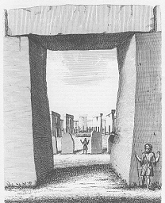

  
[Intangible Textual Heritage](../../../index)  [Legends &
Sagas](../../index)  [England](../index) 

------------------------------------------------------------------------

<table width="75%">
<colgroup>
<col style="width: 50%" />
<col style="width: 50%" />
</colgroup>
<tbody>
<tr class="odd">
<td width="50%" data-valign="TOP"> 
[Public Domain Image]</td>
<td width="50%" data-valign="CENTER"><h3 id="stonehenge-a-temple-restord-to-the-british-druids" data-align="CENTER">Stonehenge, A Temple Restor'd to the British Druids</h3>
<h4 id="by-william-stukeley" data-align="CENTER">by William Stukeley</h4>
<h4 id="section" data-align="CENTER">[1740]</h4></td>
</tr>
</tbody>
</table>

------------------------------------------------------------------------

[Contents](#contents)    [Start Reading](str00)    [Page
Index](pageidx)    [Text \[Zipped\]](str.txt.gz)

------------------------------------------------------------------------

Like Lockyer's [Stonehenge and Other British Stone Monuments
Astronomically Considered](../sac/index), William Stukeley's 1740 study
of Stonehenge stands out among the huge number of books on the subject.
Stukeley was a pioneer preservationist. He lamented the callous
treatment of the majestic ruins both by tourists and landholders. He
coined the term 'trilithon' for the doorway-like arrangement of three
stones, now common in the literature about megalithic architecture.
Stukeley was one of the first to make accurate drawings of the site. The
three dozen illustrations to this book, which show Stonehenge from every
angle and document its context in the 18th century landscape, are still
used today by scholars. He also did some rudimentary archeology, and
describes opening the grave of a warrior princess.

Stukeley's Stonehenge was intended to be the first volume in a
comprehensive study of universal history, which he never completed. He
believed a pure form of Christianity was the original religion of
mankind, which had been subverted by idolatry, and finally restored by
Jesus. Stonehenge was a temple of this primordial patriarchial religion,
built by immigrants from the Near East, possibly Phoenicians. They
became the progenitors of the Celts, founded the Druid religion and
built the mysterious standing stones. (Today scholars believe that
Stonehenge was constructed by an indigenous, pre-Celtic, pre-Druid
culture).

It is remarkable that two centuries later Lockyer also propounded a
theory that Stonehenge was built by immigrants from the Near East. Also
of note is Stukeley's discovery of vast linear features in the vicinity
of Stonehenge. This of course anticipated [Watkins' ley
lines](../ebt/index). He points out one case where these lines have
Roman roads constructed over them, indicating that they could not be
Roman in origin. He describes a huge oval track in the landscape, which
he hypothesized was an ancient horse race course! Stukeley also proposed
that the builders of Stonehenge used a standard measurement,
anticipating the 'Megalithic yard' which was suggested in 1955 by
Alexander Thom.

Stukeley was adamant that Stonehenge was pre-Roman (a view held by some
at the time). He believed that it was constructed about 460 B.C.
(currently it is believed that it dates back as far as 3000 B.C.) He
arrived at this date by assuming that the builders had a knowledge of
the compass, and by extrapolating variations in magnetic north, which he
incorrectly assumed occillated in a regular pattern (today we know that
the magnetic North pole moves somewhat at random). However, this was one
of the first attempts to associate the alignment of the monument with
some natural phenomena, and to use it to date the structure.

Stukeley's book has been long out of print, although a facsimile of it
and his Avebury was published by Garland Press in the 1984. This edition
was used as the copytext for this etext. This etext retains the original
text, spelling and italicization with only one change: the 'long s' has
been consistently altered to 'f'. With this change, the book is
surprisingly accessible and makes a fascinating read.

------------------------------------------------------------------------

 [Title Page](str00)  
[Dedication](str01)  
[Preface](str02)  
[Chapter I](str03)  
[Chapter II](str04)  
[Chapter III](str05)  
[Chapter IV](str06)  
[Chapter V](str07)  
[Chapter VI](str08)  
[Chapter VII](str09)  
[Chapter VIII](str10)  
[Chapter IX](str11)  
[Chapter X](str12)  
[Chapter XI](str13)  
[Chapter XII](str14)  
[Index](str15)  
