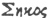

  
[Intangible Textual Heritage](../../../index)  [Legends &
Sagas](../../index)  [England](../index)  [Index](index) 
[Previous](str06)  [Next](str08) 

------------------------------------------------------------------------

  
*Stonehenge, A Temple Restor'd to the British Druids*, by William
Stukeley, \[1740\], at Intangible Textual Heritage

------------------------------------------------------------------------

### CHAP. V.

*Of the cell or* adytum *of* Stonehenge*. Of the* Surgeons
*amphitheater,* London.

Disputations become cloisters and porticoe's. Let us now with minds free
from passion, enter the *adytum* with an intent to find out its true
figure, to examine what it really was, and what it is. And that may
easily be done, because (as I said before) as to the *trilithons* of
which it is chiefly compos’d, they are all remaining. Not a bit is lost,
but what mischievous and silly people knock off with hammers, to see
whether, as the wretched vulgar notion would have it, the stones be
factitious. [TAB. XVIII.](str10.htm#img_pl18) is a design of it, which
TAB. XVIII. I made sitting in the center
of the grand entrance in the inner circle. This point is properly the
door-way or entrance into the *adytum*, as a wicket or little door,
whilst the jambs of the hithermost *trilithons* present themselves, as
the greater door, of above 40 feet wide, 25 cubits. I observe in the old
*Greek* story, many footsteps of the primitive patriarchal way left in
their sacred structures, which are parallels to this work before us, and
others of our Druids. For instance, *Pausanias* *in atticis* speaks of a
temple dedicate to *Venus*, in the front of which, is a wall (as he
calls it) built of rude stones. Nevertheless he concludes it to be a
very famous work. One may very well imagine, this wall of rude stones is
the remnant of some such old work as ours, left for the sacred regard
the people had to it, even after art was risen to great height, together
with superstition and idolatry. For that the most ancient *Greeks* had
very little of idolatry, any more than our Druids, I shall show when I
discourse on that head. Again: the more sacred part of the temple at
*Hierapolis* answering to our *Adytum*, had no door, tho’ none enter’d
therein but the chief priests. *Lucian* *de deâ Syria*. I suppose it was
in imitation of the ancient usage, without doors to shut or open, as our
temple here. For the ancients thought it wrong, to confine the deity, as
it were, within any cover’d place: ’till *Moses*, by God's direction,
made a tabernacle cover’d with skins, which was to adumbrate the Messiah
Son of God, who was to be cloathed with our nature. And *Solomon*'s

p. 24

temple was built in imitation of this tabernacle. But before that, the
ancients meant no more by temples, or altars, as they were first call’d,
than a certain known and conspicuous place, ornamented in a particular
manner, that should mark out a *kebla*, or a place towards which we are
to address the Deity, and that for uniformity sake. As the *Turks* and
*Arabians* do now, who are the descendants of *Ishmael*, and had this
custom from *Abraham*. Tho’ the supreme Being be omnipresent, yet for
our convenience, where time, place, and such kind of circumstances are
necessary to a public action, he would have, as it were, the place of
his presence made notorious. As in the *Jewish* dispensation he did in a
most extraordinary manner, by the *shechinah*. And from *Solomon*'s
temple, all the rest of the world borrow’d the fashion of temples,
properly so call’d, built magnificently and with roofs. For the sacred
houses mention’d in scripture before then, were only little chapels,
shrines, like our Druids *kistvaens*, which sometime they carried about
in a cart, sometime were fix’d in cities, for publick use; as *Beth
Dagon*, and the like. These were but *kistvaens* improv’d, niches turn’d
into sacella, in imitation of two or three stones in *Abraham*'s altars,
which we may well call the *kebla*, and find many of them among our
Druid antiquities.

The cell is form’d by a radius of 12 cubits and a half, from the two
centers *a* and *b*, as to the inward curve; the outward takes a radius
of 15 cubits; for these stones are two cubits and a half thick. The two
circles are turn’d into an oval, by a radius of 30 cubits, (after the
usual manner) set in the two centers *c* and *d*, where the two circles
intersect. The former centers are 12 cubits and a half distant from each
other, the length of the radius. The same oval is obtain’d by a string
of 60 cubits, the ends ty’d together, and turn’d round upon two centers,
according to the gardiners method. An oval form’d as this is, upon two
centers coinciding with each other's circumference; or, which is the
same thing, whose centers are distant from each other the length of
their radius, is most natural and most beautiful, being the shape of an
egg. Most probably these religious philosophers had a meaning, in thus
including an egg-like figure, within a circle, more than mere
affectation of variety. Whatever that was, we may reasonably conclude,
that from the method in antiquity, of making the *kebla* of a curved
figure, the christians borrowed theirs of turning the east end of their
churches in that manner; and that the Druids in the work before us, have
produc’d the noblest *kistvaen* or *kebla* that is known.

My purpose in drawing many prickt lines upon the plate, is not difficult
to be understood. Nor does it require particular explanations. To avoid
affectation or tediousness, I leave them to the readers amusement: only
observe, that Mr. *Webb's* equilateral triangles have no hand in forming
the cell. The intent of it is very distant from a regular polygon. But
that it is incomparably more beautiful; than such a one would have
render’d it. It is as a magnificent niche 27 cubits long, and as much
broad, measuring in the widest place.

This part is call’d  
\[Σηκος ?--JBH\] or *concha templi* and *adytum*, into which, we may
suppose, none but the upper order of priests, together with the
high-priest, were commonly to enter, during the time of ministration, in
religious rites. We may imagine the beauty of the appearance here upon
those occasions, when an innumerable company of the Druids assisted, all
in white surplices. The center of the excentricity of this oval is but
three cubits nearer the entrance, than the center of the whole work. And
they have cut off but one *trilithon*, which they make the opening of
the *adytum*; meeting the eye to great advantage, from the grand
entrance. By the aforesaid contrivance, there is left a space of five
cubits between the jambs of the opening of the *adytum*, and the inner
circle in front, just the same as is between the inner and outer circle.
The inner circle there performing the office of *cancelli* to it, as we
observ’d before. If a choir of this form was put in practice, and
executed by a masterly hand, it would have a very extraordinary effect,
and perhaps excel the too similar concave

  [  
Click to enlarge](img/pl13.jpg)  
Plate 13. Prospect of STONEHENGE from the Southwest  

p. 25

concave of a cupola. Our Druids had undoubtedly such a notion, in
placing this within a circle. And for the sake of this, they turn’d the
two circles into a smaller species of an ellipsis.

There's a Druid antiquity like our *adytum* in shape, call’d *Eglwys
Glominog*, on the top of *Arennig vaur* in *Lhanykil* parish,
*Merionydhshire*, but made of a continued wall. The ancients thought the
world of an egg-like shape, and as the world is the temple of the Deity,
they judg’d it proper to form their temples, so as to have a resemblance
thereto. The ancient hieroglyphic of the Deity is a circle, and I have
reason to believe it more ancient than the flood. *Plato*, who learnt
much from the ancestors of our Druids, says in *Diogenes Laertius*, that
God is spherical, which he must mean hieroglyphically. So our Druids, as
well as he, may mean the infinity of nature in the Deity, who made the
world, by this scheme of *Stonehenge*; at least they understand by the
circle, the seat and residence of the Deity, the heavens, which include
all things.

It seems to me, that *Inigo Jones* from this *adytum* projected the plan
of the Surgeons theatre in *London*, a fabric for seeing and hearing
much admired by all good judges. And which my Lord *Burlington*, out of
a spirit truly noble, and a great love for the architect's memory, has
lately repair’d, with his own charges and excellent skill. I find the
*Surgeons* theatre (or rather amphitheatre) is form’d from the same
proportion as our *adytum*, the transverse and conjugate diameters being
as 4 to 3, *viz*. 40 foot and 30 foot. And this appears to me a strong
presumption, that *Inigo Jones* did not make the ground-plot of
*Stonehenge*, publish’d under his name. The *Surgeons* amphitheatre is a
good deal less than our cell.

Such is the noble and easy geometry of the *adytum* of *Stonehenge*. The
stones that compote it, are really stupendous, their height, breadths
and thickness are enormous, and to see so many of them plac’d together,
in a nice and critical figure, with exactness; to consider, as it were,
not a pillar of one stone, but a whole wall, a side, an end of a temple
of one stone; to view them curiously, creates such a motion in the mind,
which words can’t express. One very remarkable particular in the
construction of this *adytum*, has escaped all observers: which is this.
As this part is compos’d of *trilithons* (as I before call them) sett
two and two on each side, and one right before; they rise in height and
beauty of the stones, from the lower end of the *adytum*, to the upper
end. My meaning is this. The two hithermost *trilithons* corresponding,
or those next the grand entrance, on the right hand, and on the left are
exceeded in height, by the two next in order; and those are exceeded by
the *trilithon* behind the altar, in the upper end of this choir. So
that in laying down the measures of the parts, that compose this place,
the reader must be content to take my word. Mr. *Webb's* measures cannot
be precise in all of them, seeing he knew nothing of this particular;
and that his notion of an hexagon, is contradicted by it, as well as by
fact. "He says p. 60. the stones of the greater hexagon seven foot and a
half in breadth, three foot nine inches thick, and twenty foot high,
each stone having one tenon in the middle." His measure of seven foot
and a half in breadth, only shews the vastness of the stones, it is no
precise measure, for the founders regarded not any preciseness in their
breadth: because two together were design’d to make a *compages*,
whereon to set the impost, and this I call a *trilithon*. Each
*trilithon* stands by its self, independant of its neighbour, not as the
stones and imposts of the outer circle, link’d together in a continued
*corona*, by the imposts carried quite round. Indeed the breadth of a
stone at bottom is seven feet and a half, which is 4 cubits and a half.
Two stones therefore amount to nine cubits, and there is a cubit of
interval between them, making in the whole ten cubits. But they were not
careful of the particulars, only of the whole, in one of these
*compages* or *trilithons*.

p. 26

The stones of the cell are made to diminish very much, towards the top,
most apparently with a design, to take off from their weight, and render
them what we call top-heavy, in a less degree. Hence the interval
between the two upright stones of the *compages* widens so much upwards.
This must certainly contribute very much, to their stability. In
assigning 20 foot for their height, Mr. *Webb* has well taken the
*medium*. A very small matter more than 20 feet makes exactly 12 cubits
of the *Hebrews*, *Egyptians* and Druids. The reader remembers the
proportion I assign’d between the *English* foot and this cubit. 20
inches and 4/5 make a cubit, therefore 20 feet and 4/5 make 12 cubits.
The true case as to the height of the *trilithons*, is thus TAB. XV. respectively, and which may be seen in
[TAB. XV.](#img_pl15) with the harmony and symmetry, in the proportion
of the whole. We may observe their gradual rising in height, all from
the same base, like pillars of higher orders and more diameters. But the
intelligent reader must needs see, that our founders never had sight of
*Greek* or *Roman* pillars, and never pretended to imitate them, or take
any one idea from them. And of these three different orders or degrees
of altitude, in these *trilithons*, one exceeds the other by a cubit. So
that their heights respectively are 13 cubits, 14. cubits, 15 cubits.

The imposts of these *trilithons* are all of the same height. Mr. *Webb*
p. 61. "informs us, the architrave lying on the top of the great stones
of the hexagon and mortaised also into them sixteen foot long, 3 foot 9
inches broad, 3 foot 4 inches high." Mr. *Webb*'s 16 foot long, is too
scanty, it amounting to 9 cubits and 2 palms, but the intent of the
founders was to make these imposts equal both in length and breadth to
the foundation of the upright stones that supports them, I mean the two
stones at bottom, the sustaining part of the *compages*, which in its
whole breadth makes 10 cubits; and 10 cubits long the imposts are to be
assign’d. Most certainly whoever undertake to measure them, whether from
those fallen on the ground, or still in their proper place, will be apt
to fail in giving them just length. Both because 1. ’tis observable that
these imposts are form’d somewhat broader upwards, than in their bottom
part; but this may not be taken notice of by every one. This was done
very judiciously upon an optical principle, which it is plain the
founders were aware of. For a stone of so considerable an elevation, by
this means only, presents its whole face in view. Therefore they that
measure it at bottom will not take its true length. 2. If they take the
dimension, either from a stone still in its proper place, or from one
fallen down, they will be very liable to shorten the measure. For in the
first case, the upper edge of these imposts, must needs have suffer’d
from the weather, in so elevated an exposure, thro’ the space of 2000
years. It is very apparent they have suffered not a little. Large and
deep furrows of age are visible all around them. But if they measure
those fallen, they must well imagine such have doubly suffered, from
weather, and from the people every day diminishing all corners and
edges, to carry pieces away with them. So that in this cafe, analogy and
symmetry only can supply these defects. Thus we found before, that the
breadth of the imposts of the outer circle is equal to their
ichnographical breadth: so it is here, being to cubits. Besides, the
outer face of these imposts is longer than the inner, as being in the
larger circle. Therefore ten cubits is to be understood their medium
measure.

Mr. *Webb* gives it as a general measure, that they are 3 foot 9 inches
broad. He has before told us, the uprights which support them were 3
foot 9 thick; take that twice, it makes 7 foot and a half, which he
assigns for the breadth, of the uprights. This is all just within a
trifle, and it is not expected that he who was not aware of the cubit,
by which these works were made, should do it with greater accuracy. The
truth of the whole is this: *Webb's* 7 foot and half is 4 cubits and a
half, as we said before; the half of it is 3 foot 9, and a very little
more. But this must be taken for the least breadth of the imposts, that

  [  
Click to enlarge](img/pl14.jpg)  
Plate 14. The orthographical Section of Stonehenge upon the Cross
diameter  

p. 27

at the ends. For in the middle they are somewhat broader. Tho’ the
inside faces are strait, yet, as we observ’d, in proper place, of the
imposts of the outer circle; so here, they are rounded behind: their
outer circumference answering TAB. XI. to
the great oval upon which they are founded. So likewise their ends are
made upon a *radius* of that oval, whence the [inner](errata.htm#3) face
of the impost is somewhat shorter than the outer, and is another reason
why their lengths may easily be taken somewhat too short. I have drawn
the imposts in their true shape in the ground-plot. The artifice of the
tenons and mortaises of these TAB. XI.
*trilithons* and their imposts, what conformity they bear to that of the
outer circle, is exceedingly pretty, every thing being done truly
geometrical, and as would best answer every purpose, from plain and
simple principles. In the bottom face of the impost, if divided into
three squares, the two mortaises are made in the middle of the two
outermost squares. Draw diagonal lines from corner to corner; where they
intersect, is the center of the mortaise; which central distance from
one to the other, is seven cubits of the Druid measure. Each tenon is a
cubit broad upon its longest diameter, for they are of an oval figure.
An admirable contrivance, that the imposts should lie firm upon the
heads of the uprights, and keep the uprights steady in their places, to
strengthen and adorn. We may remark this pretty device, in the
management of the tenons and mortaises. Cut an egg across upon its
shortest diameter or conjugate; one half thereof represents the shape of
the tenons of the outer circle. Cut it across upon its transverse
diameter, one half is the shape of the tenons of the *adytum*. ’Tis
evident the meaning of it is this. The tenons of the outer circle are
higher in proportion, than the others, because the imposts are less and
lower than the others, and on both accounts more liable to be disturb’d,
either by accident or violence, than the others: therefore more caution
is us’d for their preservation. This is an instance of art, noble and
simple withal. Mr. *Webb* says the imposts are 3 foot 4 inches high,
which is precisely 2 cubits, a sixth part of the height of the *medium*
order of *trilithons*; as the imposts of the outer circle are a sixth
part of the height of the stones of the outer circle. The medium order
of *trilithons* is above 24 foot high, *i.e.* 14 cubits. The lower order
is 13 cubits, *viz*. those next the entrance. The upper *trilithon*
behind the altar was 15 cubits. Each rising a cubit higher than the
other, as we before observ’d.

I promis’d to show the reader what *Stonehenge* is, and what it was. The
latter, I presume, is done in the four prints, TAB.
[XII](str06.htm#img_pl12), [XIV](#img_pl14), [p. XV](#img_pl15),
[XVI.](str08.htm#img_pl16) beingTAB. XII, XIV,
XV, XVI. geometric orthographical sections of the whole work, all
necessary ways, such as architects prepare in design, when they set
about a building. ’Tis wholly needless to spend many words in explaining
them. What the work is, of our *adytum* at present, is shown in the
subsequent prints, TAB. [XVIII](str10.htm#img_pl18),
[XXI](str11.htm#img_pl21), [XXII](str11.htm#img_pl22). The
[Vth](str04.htm#img_pl05) corresponds with the
[XIIth](str06.htm#img_pl12). The one shows the front ofXVIII, XXI, XII" the temple when in perfection,
the other as now in ruins. The [XVIth](str08.htm#img_pl16) may be
compar’d with [XIX](str10.htm#img_pl19) and [XX.](str10.htm#img_pl20)
all presenting a view from the *adytum* toward the entrance. [TAB.
XVIII.](str10.htm#img_pl18) is a contrary view, when one standing by the
entrance,TAB. XVIII. looks toward the
*adytum*. The same is presented in *Plate* [VII.](str04.htm#img_pl07)
which I call a peep into the *sanctum sanctorum*.
[XXII.](str11.htm#img_pl22) is the same, but a little oblique. This
plate shows at present, what the [XIVth](#img_pl14) does in its
original. *Plate* [XV](#img_pl15) and [XXI.](str11.htm#img_pl21)
correspond, showing the *adytum* on one side, in its perfect, and in its
ruinous state. Particularly they explain, what I spoke of, as to the
orderly rising of the *trilithons* in height, one above another, from
the lower end to the upper end of the *adytum*. [TAB.
XXII.](str11.htm#img_pl22) illustrates it, by exhibiting to view,TAB. XXII. the other and most perfect side of
the *adytum*. ’Tis an oblique prospect of it, from the entrance.

The quantity of the solid is well adjusted, in proportioning the
stone-work of this *adytum*, to the intervals upon the ichnography. Each
*trilithon* is 10 cubits, and each interval about 6. The jambs, or
*vacuum* of the entry expand

p. 28

themselves to 25 cubits, which is about 43 feet. From which measure my
Lord *Pembroke* demonstrated the falsity of *Webb*'s hexagonal scheme,
when his Lordship first did me the honour to discourse about
*Stonehenge*. In Mr. *Webb*'s designs, we find two jambs (taking one
*trilithon* away) expand but little above 31 feet, by his own scales.
Tho’ I don’t pretend, but that some of my foregoing measures, may here
and there possibly vary a little, upon a very strict trial, and where
proper judgment is not us’d, because the stones in some parts may
protuberate, or great parts of them may have fallen off; yet 10 foot
differenceTAB. XIX, XX. from truth cannot
be allow’d of. In the *Plates* [XIX](str10.htm#img_pl19) and
[XX.](str10.htm#img_pl20) observe the inside of that upright stone,
which makes the northern jamb of the chief entrance of the outer circle.
A very great piece is fallen off towards the top, which discovers its
tenon and the mortaise of the impost above it. And in the management of
such prodigious stones as these are, fix’d in the ground, and ramm’d too
like posts: ’tis not to be wonder’d at, if by chance we find some little
variation. Tho’ for my own part, I observ’d none; rather wonder’d, how
it was possible for them, without lewices and the like devices, to set
them in their places to such preciseness. And the reader, whole mind has
receiv’d no prepossession, cannot but be abundantly satisfy’d, that the
multitude of measures I have given from Mr. *Webb*'s own account, are
perfectly agreeable to the scale of cubits, deduc’d from works of the
*Egyptians* and others: and that in round and full numbers, not trifling
fractions. If we collate the numbers given, with the *Roman* scale, the
measures appear very ridiculous and without design; and that is a sure
way of confuting the opinion, of its being a *Roman* work. But as these
stones are generally rough, and by time must suffer in all dimensions,
’tis not practical to take their true measure, without necessary
judgment, and relation had to symmetry.

Of these greater stones of the *adytum*, as I observed before, there are
none wanting. They are all on the spot, 10 upright stones, 5 cornishes.
The *trilithon* first on the left hand is entire *in situ*, but vastly
decay’d, especially the cornish. There are such deep holes corroded, in
some places, that dawn make their nests in them. The next *trilithon* on
the left hand, is entire, compos’d of three most beautiful stones. The
cornish happen’d to be of a very durable kind of *English* marble, and
has not been much impair’d by weather. My Lord *Winchelsea* and myself
took a considerable walk on the top of it, but it was a frightful
situation. The *trilithon* of the upper end of the adytum, was an
extraordinary beauty. But alas through the indiscretion probably, of
some body digging there, between them and the altar, the noble impost is
dislodg’d from its airy seat, and fallen upon the altar, where its huge
bulk lies unfractur’d.

*Recidit in solidam longo post tempore, terram  
Pondus, & exhibuit junctam cum viribus artem*.    Ovid *Met*.

\[paragraph continues\] The two uprights
that supported it are the most delicate stones of the whole work. They
were, I believe, above 30 foot long, and well chizell’d, finely taper’d
and proportion’d in their dimensions. That southward is broke in two,
lying upon the altar. The other frill stands entire, but leans upon one
of the stones of the inward oval.

*Jam jam lapsura cadentique  
Imminet assimilis*----------

The root-end or unhewn part of both, are rais’d somewhat above ground.
We cannot be sure of the true height of this, when it was perfect: but I
am sure 15 cubits, which I have assign’d, is the lowest. The next
*trilithon*, *that* toward the west, is intire, except that some of the
end of the impost is fallen

  [  
Click to enlarge](img/pl15.jpg)  
Plate 15. The Orthographic Section of Stonehenge up on the Chief
diameter  

p. 29

clean off; and all the upper edge is very much diminish’d by time. As
*Lucretius* says,

   --------*Minui rem quamque videmus,  
Et quasi longinquo fluere omnia cernimus ævo,  
Ex oculisque, vetustatem, subducere nostris*.

The last *trilithon*, that on the right hand of the entrance into the
*adytum*, has suffer’d much. The outer upright being the jamb of the
entrance, is still standing, the other upright and impost are both
fallen forwards into the *adytum*, and broke each into three pieces. I
suppose from digging near it. But from one piece of the impost lying
look, in the middle, between the jambs of the adytum, Mr. *Webb* in the
plan of his ruins of *Stonehenge* (being his 6th *Scheme*) forms the
remains of his imaginary 6th *trilithon*, supposing it one of the stones
of the inner or lesser hexagon, as he calls it. Yet if this fragment was
really a stump of such a stone, as he would have it, still it would not
create an hexagonal form of the cell, but stand just in the middle of
the entrance, and block it up in a very absurd, unseemly, and
incommodious a manner. And nothing can be more certain, than that there
never was such a thing in being. That stone of the *trilithon* which is
standing, has a cavity in it which two or three persons may sit in, worn
by the weather.

*Stonehenge* is compos’d of two circles and two ovals, respectively
concentric. At the distance of two cubits inward from the greater oval,
describe another lesser oval, on which the stones of the inner oval are
to stand: 19 stones in number, at about the central distance of 3
cubits. This lesser oval is to be describ’d by a string and the 2
centers, as before. Or by 2 circles from a 10 cubit *radius*, and the 2
centers *a* and *b*, as of the other before was spoken. Mr. Webb says,
p. 60, "the stones of the hexagon within, 2 foot 6 inches in breadth,
one foot and a half thick and 8 foot high, in form pyramidal." His two
foot and a half is our cubit and half; for the breadth of these stones;
being but a third of the breadth of the stones of the greater oval. And
the interval between stone and stone, the same. Their height is likewise
unequal, as the *trilithon*, for they rise in height as nearer the upper
end of the *adytum*. Mr. TAB. XV. *Webb*'s
8 foot assign’d, is a good *medium* measure, for it is just 4 cubits and
4 palms, the third part of the height of the *medium trilithon*. From
the ruins of those left, we may well suppose, the first next the
entrance and lowest were 4 cubits high; the most advanc’d height behind
the altar might be five cubits, and perhaps more. The stones are
somewhat of what Mr. *Webb* calls a pyramidal form, meaning that of an
*Egyptian* obelisk, for they taper a little upwards. They are of a much
harder sort than the other stones, as we spoke before, in the lesser
circle. The founders provided that their lesser bulk should be
compensated in solidity. They were brought somewhere from the west. Of
these there are only 6 remaining upright. The stumps of two are left on
the south side by the altar. One lies behind the altar, dug up or thrown
down, by the fall of that upright there. One or two were thrown down
probably, by the fall of the upright of the first *trilithon* on the
right hand. A stump of another remains by the upright there, still
standing. Their exact measures either as to height, breadth or
thickness, cannot well be ascertain’d. For they took such as they could
find, best suiting their scantlings, but the stones were better shap’d
and taller, as advancing towards the upper end of the cell.

------------------------------------------------------------------------

[Next: Chapter VI](str08)
