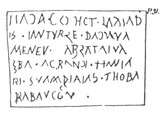

  
[Intangible Textual Heritage](../../../index)  [Legends &
Sagas](../../index)  [England](../index)  [Index](index) 
[Previous](str07)  [Next](str09) 

------------------------------------------------------------------------

  
*Stonehenge, A Temple Restor'd to the British Druids*, by William
Stukeley, \[1740\], at Intangible Textual Heritage

------------------------------------------------------------------------

p. 30

### CHAP. VI.

*Of the number of the stones. Of the altar-stone. Of what has been found
in digging, about the temple. A plate of tin of the Druids writing. A
plate of gold, supposed to be of the Druids writing*.

THUS have we finished the work, or principal part of this celebrated
wonder; properly the temple or sacred structure, as it may be called.
Tho’ its loftiest crest be compos’d but of one stone, laid upon another.
"A work, as Mr. *Webb* says justly, p. 65. built with much art, order
and proportion." And it must be own’d, that they who had a notion, that
it was an unworthy thing, to pretend to confine the deity in room and
space, could not easily invent a grander design than this, for sacred
purposes: nor execute it in a more magnificent manner. Here space indeed
is mark’d out and defin’d: but with utmost freedom and openness. Here is
a *kebla* intimating, but not bounding the presence of the Deity. Here
the variety and harmony of four differing circles presents itself
continually new, every step we take, with opening and closing light and
shade. Which way so ever we look, art and nature make a composition of
their highest gusto, create a pleasing astonishment, very apposite to
sacred places.

The great oval consists of 10 uprights, the inner with the altar, of 20,
the great circle of 30, the inner of 40. to, 20, 30, 40 together, make
100 upright stones. 5 imposts of the great oval, 30 of the great circle,
the 2 stones standing upon the bank of the *area*, the stone lying
within the entrance of the *area*, and that standing without. There
seems to have been another stone lying upon the ground, by the *vallum*
of the court, directly opposite to the entrance of the avenue. All added
together, make just 140 stones, the number of which *Stonehenge*, a
whole temple, is compos’d. Behold the solution of the mighty problem,
the magical spell is broke, which has so long perplex’d the vulgar! they
think ’tis an ominous thing to count the true number of the stones, and
whoever does so, shall certainly die after it. Thus the Druids contented
themselves to live in huts and caves: whilst they employ’d many
thousands of men, a whole county, to labour at these publick structures,
dedicated to the Deity.

Our altar here is laid toward the upper end of the *adytum*, at present
flat on the ground, and squeez’d (as it were) into it, by the weight of
the ruins upon it. ’Tis a kind of blue coarse marble, such as comes from
*Derbyshire*, and laid upon tombs in our churches and church-yards. Thus
*Virgil* describes an ancient altar, after the *Etruscan* fashion, and
which probably had remain’d from patriarchal times.

*Ædibus in mediis nudoque sub ætheris axe  
Ingens ara fuit*.---------   Æne. II.

*Servius* upon the IIId *Georg*. says, in the middle of a temple was the
place of the Deity: the rest was only ornamental. This altar is plac’d a
little above the *focus* of the upper end of the ellipsis. Mr. *Webb*
says, p. 56. the altar is 4 foot broad, 16 in length. 4 foot is 2 cubits
2 palms, which at four times measures 16 foot. I believe its breadth is
2 cubits 3 palms, *i.e.* 1 and a half: and that its first intended
length was 10 cubits, equal to the breadth of the *trilithon* before
which it lies. But ’tis very difficult to come at its true length. ’Tis
20 inches thick, a just cubit, and has been squar’d. It lies between the

  [  
Click to enlarge](img/pl16.jpg)  
Plate 16. The Section of Stonehenge looking towards the Entrance.  

p. 31

two centers, that of the compasses and that of the string: leaving a
convenient space quite round it, no doubt, as much as was necessary for
their ministration.

Mr. *Webb* says, the heads of oxen, and deer, and other beasts have been
found upon digging in and about *Stonehenge*, as divers then living
could testify, undoubted reliques of sacrifices, together with much
charcoal, meaning wood-ashes. Mr. *Camden* says, mens bones have been
found hereabouts. He means in the barrows adjacent, and I saw such
thrown out by the rabbets very near the temple. But eternally to be
lamented is the loss of that tablet of tin, which was found at this
place, in the time of King *Henry* VIII. (the *Æra* of restitution of
learning and of pure religion) inscrib’d with many letters, but in so
strange a character, that neither Sir *Thomas Elliot* a learned
antiquary, nor Mr. *Lilly* master of St. Paul's school, could make any
thing out of it. Mr. *Sammes* may be in the right, who judges it to have
been *Punic*; I imagine if we call it *Irish*, we shall not err much. No
doubt but it was a memorial of the founders, wrote by the Druids: and
had it been preserv’d till now, would have been an invaluable curiosity.
To make the reader some amends for such a loss, I have given a specimen
of supposed Druid writing, out of *Lambecius*'s account of the Emperor's
library at *Vienna*. ’Tis wrote on a wry thin plate of gold, with a
sharp-pointed instrument. It was in an urn found at *Vienna*, roll’d up
in several cases of other metal, together with funeral *exuviæ*. It was
thought by the curious, one of those epistles, which the *Celtic* people
were wont to send to their friends in the other world. So certain a hope
of a future pate had the Druids infus’d into them. The reader may divert
himself with endeavouring to explain it. The writing upon plates of gold
or tin is exceeding ancient, as we see in *Job* xix. 24.

 

Plutarch in his pamphlet *de dæmonio Socratis* tells a similar story.
“About the time of *Agesilaus*, they found a brazen tablet in the
sepulchre of *Ahemena* at *Thebes*, wrote in characters unknown, but
seem’d to be *Egyptian*. *Chonuphis*, the most learned of the Egyptian
prophets then, being consulted upon it, confirm’d it, and said it was
wrote about the time of *Hercules* and *Proteas* king in Egypt.
*Tzetzes*, chil. 2. hist. 44. mentions Proteus a king in lower Egypt by
the sea side, pretends he was son of *Neptune* and *Phœnicia*, throwing
him up thereby to very ancient times, those of the first famous
navigators, our *Hercules* and the *Phœnicians*. He is said to have
lived in the island afterward call’d *Pharos*, from the watch-tower
there erected. Here *Homer* sings, that *Proteus* diverts himself with
his *phocæ* or sea-calves, most undoubtedly

p. 32

his ships. But at that time of day, every thing new and strange was told
by the *Greeks* in a mythologic way.

In the year 1635, as they were plowing by the barrows about *Normanton*
ditch, they found a large quantity of excellent pewter, as much as they
sold at a low price for 5*l*. says Mr. *Aubry* in his manuscript
collections, relating to antiquities of this sort. There are several of
these ditches, being very small in breadth, which run across the downs.
I take them for boundaries of hundreds, TAB.
XXXI. parishes, *&c*. Such as the reader may observe in my
*Plate* [XXXI.](str14.htm#img_pl31) of the barrows in *Lake-field*. I
suspect this too was a tablet with an inscription on it, but falling
into the hands of the countrymen, they could no more discern the
writing, than interpret it. No doubt but this was some of the old
*British stanum*, which the *Tyrian Hercules*, sirnam’d *Melcarthus*,
first brought *ex Cassiteride insula*, or *Britain*. Which *Hercules*
liv’d in *Abraham*'s time, or soon after.

Mr. *Webb* tells us, the Duke of *Buckingham* dug about *Stonehenge:* I
fear much to the prejudice of the work. He himself did the like, and
found what he imagin’d was the cover of a *thuribulum*. He would have
done well to have given us a drawing of it. But whatever it was, vases
of incense, oil, slower, salt, wine and holy water, were used by all
nations in their religious ceremonies.

Mr. *Thomas Hayward*, late owner of *Stonehenge*, dug about it, as he
acquainted Lord *Winchelsea* and myself. He found heads of oxen and
other beasts bones, and nothing else. In 1724. when I was there,
*Richard Hayns* an old man of *Ambresbury*, whom I employed to dig for
me in the barrows, found some little worn-out *Roman* coins at
*Stonehenge*, among the earth rooted up by the rabbets. He sold one of
them for half a crown, to Mr. *Merril* of *Golden Square*, who came
thither whilst I was at the place. The year before, *Hayns* was one of
the workmen employ’d by Lord *Carlton* to dig clay on *Harradon* hill,
east of *Ambresbury*, where they found many *Roman* coins, which I saw.
I suspect he pretended to find those at *Stonehenge*, only for sake of
the reward. My friend the late Dr. *Harwood* of *Doctors-Commons* told
me, he was once at *Stonehenge* with such sort of *Roman* coins in his
pockets, and that one of his companions would have persuaded him, to
throw some of them into the rabbit-holes: but the Doctor was more
ingenuous. Nevertheless were never so many such coins found in
*Stonehenge*, they would prove nothing more, than that the work was in
being, when the *Romans* were here; and which we are assured of already.
I have a brass coin given me by *John Collins* Esq; collector of the
excise at *Stamford*. The heads of *Julius* and *Augustus* averse: the
reverse a crocodile, palm-branch and garland. COL. NEM. the colony of
Nemausus in France. It was found upon *Salisbury* plain; and might be
lost there before the *Roman* conquest of [*Britain*](errata.htm#4)
under *Claudius*, by people of *France* coming hither; or in after-ages:
no matter which.

*July* 5 1723. By Lord *Pembroke*'s direction, I dug on the inside of
the altar about the middle: 4 foot along the edge of the stone, 6 foot
forward toward the middle of the *adytum*. At a foot deep, we came to
the solid chalk mix’d with flints, which had never been stir’d. The
altar was exactly a cubit thick, 20 inches and 4/5; but broken in two or
three pieces by the ponderous masses of the impost, and one upright
stone of that *trilithon* which stood at the upper end of the *adytum*,
being fallen upon it. Hence appears the commodiousness of the foundation
for this huge work. They dug holes in the solid chalk, which would of
itself keep up the stones, as firm as is a wall was built round them.
And no doubt but they ramm’d up the interstices with flints. But I had
too much regard to the work, to dig any where near the stones. I took up
an oxe's tooth, above ground, without the *adytum* on the right hand of
the lowermost *trilithon*, northward. And this is all the account, of
what has been found by digging at *Stonehenge*, which I can give.

  [  
Click to enlarge](img/pl17.jpg)  
Plate 17. An inward View of Stonehenge. Aug. 1722 from the north.  

------------------------------------------------------------------------

[Next: Chapter VII](str09)
