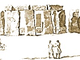

  
[Intangible Textual Heritage](../../../index)  [Legends &
Sagas](../../index)  [England](../index)  [Index](index) 
[Previous](str13)  [Next](str15) 

------------------------------------------------------------------------

  
*Stonehenge, A Temple Restor'd to the British Druids*, by William
Stukeley, \[1740\], at Intangible Textual Heritage

------------------------------------------------------------------------

p. 56

### CHAP. XII.

*A conjecture about the time of the founding of* Stonehenge*. An uniform
variation in setting these works, not to be accounted for, but by
supposing the* Druids *us’d a magnetical compass. Their leader, the*
Tyrian Hercules*, was possess’d of a compass-box. The oracle of* Jupiter
Ammon *had a compass-box. The golden fleece at* Colchis *was a
compass-box. Both these temples were founded by* Apher*,* Hercules *his
companion, and grandson to* Abraham*.* Apher*,* Aphricus*, or* Phryxus
*the same person, seems to have given name to* Britain*. The* Druids
*set their temples and other works by it. The history of the mariner's
compass, since that time. The history of the variation of the magnetic
needle. A conjecture of the time of building* Stonehenge*, from thence*.

IN my Enquiries into these works of the antient *Druids* in our island,
I observed a greater exactness in placing them, with regard to the
quarters of the heavens, than one would expect, in works seemingly so
rude; and in so remote an age, to which we must necessarily refer them.
What more particularly mov’d my attention, was a certain variation from
cardinal points, which I observed regular and uniform, in the works of
one place. And that variation was different, in works of another place;
yet equally regular and uniform in that place. Suppose (for instance)
the works about *Abury* in *Wiltshire* generally vary 9 or 10 degrees to
the left hand, from cardinal points: *i.e.* westward from the north. And
the works at *Stonehenge* generally vary to the right hand, from
cardinal points, and that to the quantity of 6 or 7 degrees. The
principal diameter or groundline of *Stonehenge*, leading from the
entrance, up the middle of the temple, to the high altar, (from which
line the whole work is form’d) varies about that quantity southward of
the north east point. The intent of the founders of *Stonehenge*, was to
set the entrance full north east, being the point where the sun rises,
or nearly, at the summer solstice. As well because *that* is the
farthest elongation of the great celestial luminary, northward; the
complement of our earthly felicity, in ripening the fruits of the earth:
as because *then* they celebrated one of their principal religious
meetings or festivals, with sacrifices, publick games, and the like.
Such was the custom of all the antient nations. The *Isthmian*,
*Nemæan*, *Olympian*, *Pythian* games, famous in the works of the
learned nations: those of *Tyre* II. *Maccabees* iv. 18. dedicated to
their and our founder, the antient *Tyrian Hercules*, who, I suppose,
conducted the first *Phœnician* colony, with our *Druids*, into
*Britain:* these were all held at this time of the year. A custom
continu’d from patriarchal times.

This exactness with which the *Druids* set their works, and the
uniformity of their variation, make me believe, this variation was not
the effect of chance or negligence.

By a superficial reflexion upon it, we should be apt to suspect, it was
owing to their observing the sun's rising on the longest day of the
year, or summer solstice, and setting their line by it. For this is
supposed to be a method by which they formerly set our Churches: marking
the sun's rising at the equinox. But the *Druids* were too good
astronomers and mathematicians to need so mean an artifice: nor does it
correspond to the quantity precisely enough. Besides, this same
variation appears where it cannot possibly regard the sun's rising at
that

  [  
Click to enlarge](img/pl29.jpg)  
Plate 29. Prospect of the Cursus & Stonehenge from the North Aug. 6,
1723.  
A. The Entrance of the Avenue. B. The 7 Barrows. C. The Kings Barrow. D.
Salisbury Steeple. E. Stonehenge.  

p. 57

For, I observ’d the like variation, or very near, in all the other parts
relating to this temple before taken notice of; beside the avenue
leading up to the temple from the north east, in a strait line; which
has the before-mention’d variation all the way. At the bottom of the
hill, this avenue divides into two wings, each going off from the list
mention’d part, with a decent sweep; the one to the left hand, westward,
the other to the right hand, eastward. They go off with a like angle,
and that angle varies the like quantity. The western wing goes to the
*cursus*, before observ’d, the place upon the downs, half a mile off
*Stonehenge*, made for races with chariots and horses. The right hand
wing of the [avenue](errata.htm#7) runs directly eastward for a mile
together, pointing to a place on an angle of the river, called *Radfin*.
This part of the avenue, which was intended by the founders, to have
been drawn precisely east and west, varies about 5 or 6 degrees to the
south.

Likewise, that great work of the *cursus* itself, which stretches its
length across the downs, from east to west, like a line of latitude upon
the globe, varies such a like quantity, from true east and west, the
same way. The meridian line of *Stonehenge* passes exactly through the
middle of this *cursus*.

Further, at the east end of this *cursus*, the huge bank of earth, above
200 foot long, made across the end of the *cursus*, as a *meta*, and
whereon sat the princes and judges of the prizes: This bank of earth is
drawn exactly at a right angle with the *cursus*, consequently due north
and south, but with the variation before spoken of. These, and other
like observations here, as well as in other *Druid* Works, appear’d to
me no otherwise to be accounted for, but that the *Druids* us’d a
magnetical compass, in laying down the works: and that the needle vary’d
so much, at that time, from the true meridian line.

I remember I open’d this affair, near 20 Years ago, to Dr. *Halley*, who
was of the same sentiment. Nor am I the first who suspected the
*Phœnicians* of old were possessed of this great secret, as well as the
*Chinese*, from times immemorial. I am not moved to think otherwise by
what *Bochart* writes against it. The very name of the magnet *lapis
Heraclius* strongly suggests, the *Tyrian* navigator before-mention’d
knew it, as is well argued by *Fuller* in his Miscellanies, IV. 19. And
many things occur, in the mythology of the antients, wherein (if I
mistake not) I discern most evident traces of this knowledge of the
directive power of the magnet. We are not to despise the fables of the
antients, but to make the best use of them, and search out for their
latent truths. My predecessor *Cumberland*, observes in *Sanchoniathon*,
p. 325. "that *Apollodorus* (for instance) hath many truths in his
mythic history, deriv’d from the tradition of *Phœnician*, and
*Egyptians*, planting *Athens*." And the *Greeks*, those happy
practitioners in writing, as well as other arts, took the unlucky turn
of the *marvellous*, to so exorbitant a degree, as to write nothing
without it. In *Apollodorus*, put out by the learned Dr. *Gale*, p. 114.
we have an account of the 10th labour of *Hercules*, his conquest of
*Cadiz*, or *Gadira*, as then call’d, or *Erythea*. We are told, the
hero set up the 2 pillars at the Streights mouth, at *Gibralter*, or
then *Tartessus*; which we may reasonably suppose some temple made of
these rough stones, or some *main ambres*, like those we mention’d
before, the *petræ ambrosiæ* in the *Tyrian* coins. Then, "says our
author, going on his journey, the rays of the sun were so vehement upon
him, that he hid the boldness to draw his bow against him. The god
admiring the intrepidity of the man, gave him a golden cup with which he
sail’d over the ocean." *Pisander* in his IId. book, (in *Atheneus
Deipnos*. XI.) writes the same, only that *Oceanus* lent him the cup.
*Panyasis* in his I. of the history of *Hercules*, says, he begg’d it of
*Nereus*, son of *Sol*, and with it sail’d to *Erythea*. (Macrob.
*Saturn*. XXI. 5.) *Theoclytus*, in *Atheneus* aforesaid, in his II. *de
tempest*. mentions the same thing. He said it before in his
*Titanomachia*. *Pherecydes*, in his III. of history, quoted both in
*Atheneus* and *Macrobius*, tells a story somewhat like that of
*Apollodorus*, but more particular.

p. 58

\[paragraph continues\] *Servius* Æn. VII,
mentions it, but as some of the former, makes the cup of brass, instead
of gold. *Alexander Ephesius* the like. All very antient writers.
*Lucian* says, that *Hercules* sail’d in a sea-conch shell. What can we
understand by all this, mention’d by so many grave authors, but a
compass-box, which enabled him to sail the great ocean, and penetrate to
our northern island, less obnoxious to the suns vehement heat? Add to
this, in the same place, *Apollodorus* speaks of his fighting *Albion*
and *Dercynus*, by *Mela*, called *Bergion*, Sons of *Neptune*; which
were the most antient names of the *Britannic* Isles, before the name of
*Britain*. *Diodorus Siculus*, in his IV. book delivers a like account
of this 10th labour of *Hercules*, but in a mere historical manner. And
adds, that when he return’d by *Sicily*, he dedicated a grove to
*Geryon* the hero, where, to his time, the people did religious rites.
For this affair of sacred groves, we know our *Druids* were famous. He
built a temple likewise at *Gades*. We are not to suppose it a cover’d
edifice, like what posterity call’d a temple, but an open one, according
to the mode of those days. Cover’d temples, at that time, being a thing
unknown in the world. Afterward, a magnificent temple, properly, was
there built to him. *Mela* witnesses, that it was our *Egyptian
Hercules*, who was there worshipped. For I suppose our *Egyptian* and
the *Tyrian Hercules* to be all one. The same mention’d by the name of
*Assis*, in *Manethons* XVII. *Dynasty*, in *Josephus* c. App. in
*Africanus*, *Eusebius*, and *Syncellus*. *Apollonius* II. 14. writes,
it was not the *Theban* but the *Egyptian Hercules* that came to
*Gades:* which is confirm’d by *Hecateus*. And *Herodotus*, in *Euterpe*
says, *Hercules* is a very antient deity among the *Egyptians*, not so,
among the *Greeks*. And I suppose this hero lived at, or very near the
time of the patriarch *Abraham*.

These were the times about the beginning of idolatry. And *Hercules* was
far from being an idolater himself, though worshipp’d afterwards, for
his great exploits, and perhaps on this very account of his inventing or
knowing the use of the compass. This is the Hercules kneeling on one
knee, a constellation in heaven, taken notice of by *Dionysius
Halycarn*. by *Tzetzes*, *Hyginus*, *Æschylus* and others. It seems to
indicate his piety; for which the astronomers his disciples plac’d him
in the heavens. He kneels upon the arctic circle, and supports the
zodiac on his shoulders; tho’ this is not understood by the painting on
our modern globes. The *Phœnicians*, his successors in the tin trade of
*Britain*, kept the trade and the very name of the Island as a great
secret; as well as the use of the compass, till it was lost with them.
But it seems highly probable, because *Lucian* describes *Hercules* with
a sphere in his hand, that he affixed the present Asterisms of the
zodiac: and his successors, the *Phœnicians*, propagated them.

’Tis next to our present purpose, to consider that famous oracle of
*Jupiter Ammon* in *Africa*, to be referr’d to the most early times of
idolatry: render’d illustrious by *Alexander* the Great taking a journey
to it. Which gives us the opportunity of knowing somewhat of it.

*Quamvis Æthiopum populis, Arabumq*\[*ue*\]*; beatis  
Gentibus, ac Indis, unus sit Jupiter Ammon*.                Lucan.

All these nations, with *Egypt* and *Africa*, were peopled by the
posterity chiefly of *Ham*. They were the first that fell into idolatry,
and worshipped their common progenitor, call’d *Amynus*, in
*Sanchoniathon*. *Hecateus* says, *Amoûn*, as the *Egyptians* write it,
is the word of those that invoke god, and that they meant somewhat very
mysterious by it. The history of its origin is this. *Bacchus*, the
hero, or demigod, travelling through the sandy desarts of *Africa*, with
a great army, was perishing with thirst; he pray’d to his father
*Jupiter* for relief, who sent a *ram* that show’d him a spring, sav’d
him and his host. Out of gratitude, the hero builds a temple there, to
the deity who thus

  [  
Click to enlarge](img/pl30.jpg)  
Plate 30. Prospect from the west end of the Cursus of Stonehenge  
A. the eastern meta. B. the eastern wing of the avenue. C. Stonehenge.  

p. 59

aided him under the form of a *ram*. There is no room to doubt, that
this is in part copied from the transaction of the children of *Israel*,
in the *Arabian* wilderness. They have added to it, a name and notion
borrowed from patriarchal tradition, of a divine person, symboliz’d by a
ram; horned, anointed, which is all one. We christians mean *Messiah*.
Innumerable passages in old authors, which I might cite, innumerable
monuments of antiquity in sculpture, shew, that *Jupiter Ammon* was
figur’d as a ram, with a ram's head, with rams horns. They applied the
patriarchal notion of the *Messiah*, to their progenitor *Ham*, in an
idolatrous way: and deified him under that character. There is a very
remarkable passage in *Herodotus*, which, it is worth our while, to
transcribe.

In Euterpe cap. 42. that author tells us, why the *Theban Egyptians* pay
so great a regard to the sheep. "*Hercules* on his importunity to
*Jupiter*, that he might have the honour personally to see him, at
length prevail’d. And the god consented to exhibit himself to his view,
under this device. *viz*. *Jupiter* cut off a ram's head, put the skin
over his own head, and thus appear’d to *Hercules*. Whence the
*Egyptians* made the statue of *Jupiter*, with a ram's head, and call
*Jupiter Ammôun*. Whence they hold sheep for sacred animals, never kill
them but once a year, upon the festival day of *Jupiter*, when only one
ram is sacrificed, and his head put upon the statue of *Jupiter*; all
that are there present, beat the ram, and at last he is buried in a
sacred urn."

It is impossible not to see, that this is derived from that history
recorded, *Exodus* xxxiii. *Moses* desires of *Jehovah* repeatedly, that
he might see him. He calls it seeing his glory. He is answer’d at
length. "I will make all my *goodness* pass before thee, and I will
proclaim the *name* of *Jehovah* before thee. Thou canst not see my
face, but I will put thee in a cleft of the rock, and cover thee with my
hand, whilst I pass by. Thou shalt see my back parts only." Here he
notoriously promises *Moses*, that he shall see him, in a symbolical
form. In the next chapter, *Jehovah* descended in the luminous cloud, or
*Shechinah*, and proclaimed the name of *Jehovah*; recites those
attributes that relate to his dealings with mankind, in the strongest
point of light; "his goodness and mercy, and long-suffering, forgiving
iniquity, transgression and sin: but adds, he will by no means clear the
guilty, but visit the fathers iniquity upon the children." Wherein our
original and fatal transgression is sufficiently intimated, and that
God's justice is equal to his mercy; and the necessity of a divine
redemption by sacrifice, which in scripture language is call’d, "the
lamb slain from the foundation of the world."

All this the most ancient nations had a knowledge of, from patriarchal
tradition. When they laps’d into idolatry, they applied these good
notions to their new idolatry, and made statues from the symbolical and
figurative forms of speech, us’d in true religion. Their sacrificing the
ram on the festival day of *Jupiter*, their beating the ram, putting his
head on the statue of their deity, burying him in a sacred urn: all most
evidently pointing out the notions they had, in the most early times, of
the suffering statue of the *Messiah*. And such was the origin, in
short, of *Jupiter Ammon*. But it appears, by what learned authors
write, on *Curtius*'s description of his statue, that a magnetical
compass box made one considerable part of his sacreds. This we read in
*Hyde* Pers. relig. p. 495. in *Curtius* publish’d by *Pitiscus*, and by
*Rader* the jesuite, and *Schottus* in *Ortelius*, by *Fuller*,
*Herwart* and others. "This compass box with the statue of the deity,
was set in a golden ship (the golden cup of *Hercules*) and carried in
procession on the shoulders of the priests, accompanied by women singing
an hymn in their own language." I doubt not, but the circumstance of
carrying this golden ship, on the shoulders of the priests, is an
imitation of the *Mosaic* ark in the march of the *Israelites*, thro’
the wilderness, during their forty years pilgrimage.

p. 60

\[paragraph continues\] Tho’ they mistook
the reason of the thing; the *Jewish* church then being in a military
and travelling state. But where the camp rested, the ark was reposited,
in the *adytum* of the tabernacle: so likewise when in possession of the
land of *Canaan*. This is sufficient proof, that the *Lybians* herein,
copied after the *Israelites*, not *vice versa*, as our moderns are
willing to think, in these cases.

*Curtius* tells us, the habit of *Ammon*'s statue was made of *Smaragd*
and other precious stones, wrought in *Mosaic* work. Which I take to be
too, in imitation of the pontifical attire, under *Moses*'s
administration: particularly of the sacred, oracular pectoral, made of
*Mosaic* work, with gems. I apprehend, that beside the statue of
*Ammon*, there was a figure of (the upper part at least of) a *ram*, on
the compass box: which was the oracle. And it is easy to guess how this
may be managed for the purpose; even beyond the trick of *Januarius*'s
blood, and other *Popish* devices.

Hence we may better understand the famous golden fleece, which
occasioned the *Argonautic* expedition, one of the earliest and most
memorable *Æra*'s of the *Grecian* history. If we suppose this golden
fleece to be a compass box, we see the reason why the choice youth of
*Greece* set out upon that voyage: which, as all other matters of
ancient history, among the *Greeks*, is so unaccountably puft \[i.e.
puffed--JBH\] up with the leaven of fable. It became navigators to run
any hazard for such a treasure. If we enquire into its origin, it is
thus. *Phrixus* son of *Athamas* and *Nepheles* (according to the
*Greeks*) had a ship given him by his mother. The ship is call’d in the
fable a golden *ram*, or the ram with a golden fleece (the same thing as
*Hercules*'s golden cup.) In this, he and his sister *Helle*, flying the
ill-usage of their mother-in-law *Ino*, sail away by sea. *Helle*
affrighted in the voyage, falls overboard and gives name to the
*Hellespont*. *Phrixus* continues the voyage, and goes to *Æetes* king
of *Colchis*, where he hangs up his golden *ram* in the temple, to
*Jupiter Phyxius*, (one would be apt to imagine they meant *Pyxius*,
alluding to the box.) *Jason* made his far-fam’d expedition thither
afterward, and stole it. But the ram was placed in the heavens, among
the constellations, as a memorial; the first sign in the *Zodiac:* which
shews the high antiquity of the story.

This account manifestly pretends very great antiquity, and some signal
event. I observe this *Ino* their mother-in-law, is said to be the nurse
of *Bacchus*, and throwing herself with her son *Melicerte* into the
sea, became a goddess, under the name of *Leucothea*. Her son became a
god, under the name of *Palæmon*. This *Melicerte* is allowed by all the
learned, to be no other than our *Melcartus* above-mention’d. *Palæmon*
is *Hercules*, says *Hesychius*. *Palæmon* is his name of deification.
*Pausanias* in the beginning of his *corinthiaca* informs us, this
*apotheosis* of *Ina* and *Melicerta* was the occasion of founding the
famous *Isthmian* games. *Plutarch* says the same, and *Phavorinus*.
Again, I observe, *Phrixus* is said to be son of *Nephele* (a cloud)
whence call’d *nubigena* by *Columella*. We must hence expect somewhat
very secret and obscure. Further, all writers say openly this *ram* or
ship of *Phrixus* was oracular and could speak upon occasion. So all the
writers of the *Argonautics* too will have the ship *Argos* to be
loquacious and oracular. *Magnes* another name of the load-stone is
often call’d *Adamas*, which seems to be no other than *Athamas*.
*Apollodorus* makes *Magnes* the son of *Æolus*, who marrying *Nais*,
inhabited the isle *Seriphus*. *Æolus* was a great sailor, invented
sails, and studied the winds, therefore deified and made the god of the
winds. I suppose it all ends in the mysterious invelopement of the
knowledge of the magnetic compass.

I hope for the readers candour, in reciting thus much from antient
fable, which I did as concisely as possible. But in matters of obscure
antiquity, we must make use of all helps. And in heathen antiquity we
have no other. A strictly historical way of writing in former times, is
only to be expected in the

  [  
Click to enlarge](img/pl31.jpg)  
Plate 31. A Prospect of the barrows in Lake field called the Eleven
barrows & lately the prophets barrows 2d. Sepr.
1723.  
A. Stonehenge. P. barrow opened by L. Pembroke. SS by Stukeley.  

p. 61

sacred canon of the *Jews*. And what is remarkable, after God's holy
spirit had deserted them, their writers became the greatest fablers in
the world, and, if possible, out-did the *Greeks*, in that way.

One would imagine, the fashion of these most antient charts, was to
divide the circle into 12 parts, and affix the celestial signs of the
zodiac to them; beginning with the east at aries, where the sun rises at
the equinoxes; and thence they might call the box by the name of
*aries*, as shewing the east where *aries* is plac’d. As now the *Turks*
and *Arabians* call it *kibla noma*, *i.e.* shewing the *kibla*, or
south point, the way toward which they turn their faces in devotion. So
we only enquire for the north point; and call it the lode-stone, because
it shews the lode-star or north pole. But ’tis all one; any one point in
a circle being found, the red are found too.

From what has been said, it seems probable, that the fable of the hero
finding out the spring in the sandy desarts of *Africa*, by the help of
a ram sent from *Jupiter*, means the travelling over those immense
plains by the help of a compass, which they call’d by the name of a
*ram*, or a golden ram. And that the possessors of the antient oracle of
*Ammon* had such a secret, which they cunningly applied to the sacreds
of their deity. Probably, in that most early age, they had not improv’d
the use of it to the pitch and manner that we enjoy, with a needle; and
*that* set upon a central pin: but having found out the veracity of the
magnet, they put it into a boat, which was to swim on water, and therein
it would have liberty to turn itself to its proper direction. And this
is the sentiment of the learned Dr. *Wallis*, in the *Philosophical
Transactions*, No. 278. This boat was the better a handle for
the mythologists to call *Hercules*'s vessel a golden cup, because cups
were made in the shape of a boat, and had the same denomination,
*cymbium*.

Those learned commentators upon *Curtius* abovementioned agree, there
was a stone along with the statue of *Ammon*, carried about in the
golden ship; and perhaps, hence the antient navigators took the hint of
applying the figure of the *ram* to their compasses, however form’d, and
gave it the name of the *ram*, or golden fleece, which the Greek fables,
their most antient history, ring of: and hence their ships deriv’d their
oracular quality. *Phrixus*'s ship, the golden *ram*, being said to
speak on occasion, as well as the ship *argos*. The stupendous
properties of this stone, without difficulty, would persuade even those
above the vulgar, that there was a divine principle in it, quite
metaphysical, consequently oracular. And in the dawnings of idolatry,
the evil agent who was vigilant to pervert every thing to his own
purpose, would not fail to make great use of the secrets of the magnet.
The intire notion of oracles among the heathen, is caused by the devil's
mimickry of God's transactions among the patriarchs and the *Jews*. But
I believe the *Egyptians* took their notion of carrying a boat in all
their religious processions, from this magnetic boat, of which both
*Herodotus* and *Plutarch* inform us. For they intended it to signify
the movement and descent of the divine ideas from the supreme mind;
especially the very fountain and principal of those ideas: and it must
be own’d to be admirably well chose. Hence the top and the bottom of the
verge or *limbus* of the celebrated *Iliac* table, is adorn’d with a
boat. In one a ram, in the other a bull. Meaning the origin of the chain
of ideas flowing from the divine mind. ’Tis highly probable, *that* with
the ram is the copy of *Jupiter Ammon*'s boat, mention’d by *Curtius*.
And I suppose this is *Herwart*'s opinion, but I have not yet seen his
book. Of this I shall discourse larger in my explication of the *Bembin*
table. However *Herodotus* tells us in his II. book, that the temple of
*Jupiter Ammon* took its rise from *Phœnicia*. I only mention this for
the sake of those that are over acting the credit of antiquities in
*Egypt*.

We learn in *Plutarch*'s discourse de *Isid. & Osir*, that the ship
*argos* of the *Greeks*, was is reality the ship that our *Hercules*
sail’d round the world in.

p. 62

\[paragraph continues\] Further, this
oracular ship has its name *argos*, says my friend Mr. *Baxter*, *gloss.
ant. rom*. from the *Hebrew* and *Syrian* word *argan*, an ark. Which
confirms what I said above, concerning the carrying about the ship of
*Ammon* on the shoulders of the priests. *Strabo* in II. of his
geography, mentions the temple of *Leucothea*, built by *Phrixus* at
*Colchos*; that there was an oracle there; and that the sheep was never
slain at the place. This shews its relation to that of *Jupiter Ammon*.
*Leucothea* is the name of consecration of *Hercules* his mother,
*Hercules* himself being call’d *Palæmon*; both made sea deities: from
the extraordinary fame of *Hercules*, the first and great sea captain.
*Pausanias* in *Atticis* says, he was buried in the Corinthian
*Isthmus*; where the *Isthmian* games were kept to his memory. But
*Mela* writes, that his remains were at *Gades*. It's probable there was
only an honorary monument of him at the *Isthmus*, as founder: as the
honorary monument of *Jolaus* mention’d to be among the *Thebans*, by
the *Stadium*, p. 42.

Mr. *Baxter* in *gloss. ant. rom. ascania* makes *Phrixus* to be
*Aphricus*, and the same person as *Jupiter Ammon*, or the founder of
the temple of *Jupiter Ammon*; rather, of that prior to *Jupiter Ammon*.
We are not to regard the little artifices of the *Greeks*, who draw all
celebrated events and persons of antiquity, into their own country.
*Aphricus*, no doubt, is the *Aphre* before-mentioned, son of *Midian*,
son of *Abraham*; whom *Cleodemus* makes an associate of *Hercules*, in
his *Lybian* wars. *Josephus* makes him the conqueror of *Lybia*, and
that he gave name to *Africa*. ’Tis not unlikely but that he is the hero
that travell’d over these barren lands by the help of the compass, as
his countrymen the *Arabians* have from times immemorial practised, in
travelling over their own desarts. And might probably erect a
patriarchal temple there; and in times of his posterity it degenerated
into the idolatrous temple of *Jupiter Ammon:* And there the compass box
of the hero remain’d, and was converted into part of the heathen
sacreds.

’Tis no very strange matter, is they at another time call this same hero
*Bacchus*, therein confounding him with the like travels of the
*Israelites*, through the *Arabian* desarts. We are not to expect these
histories of old times involv’d in fable, absolutely consistent. But is
this account be agreeable to truth or near it; then we may imagine the
same *Aphre*, by the *Greeks* call’d *Phrixus*, according to Mr.
*Baxter*, pass’d the *Hellespont*, made the expedition into *Colchis*,
and built a like temple there. And a compass box called the golden
*ram*, was made alike part of the object of their adoration. This is
exceedingly confirm’d by the report of *Herodotus* and *Diodorus S*. who
say, the *Colchi* practised the rite of circumcision, a matter which the
learned cannot account for; but appears plain from hence: these being
the descendants of *Abraham*. They say, at the same time, that the
*Ethiopians* practise the like: and that ’tis no recent custom among
them, but from the beginning. I apprehend by *Ethiopians* are meant
*Arabians*, who are people descended from *Abraham*. *Herodotus* says
likewise the *Egyptians* circumcis’d, which must be accounted for in
this same manner; some *Arabian* or *Ethiopian* nation bringing the
custom among them. As a further confirmation of *Phrixus* being
*Aphricus*, *Bochart* shews the *Colchic* and *Hebrew* tongue is much
a-kin. And thus we may account for what Mr. *Toland*, p. 133. says, that
the idiom of the *Irish* language (which we suppose the remnant of the
most antient oriental,) has a mixture of *Arabic* in it.

I saw a book in Dr. *Mead*'s library, *Museo de las medallas
desconecidas Espanolas*, p. 35. No. 82, 83. are two ancient unknown
medals, such as they often find in *Spain*. The first a head (not of the
best workmanship) on the obverse, young, but heroical enough, a necklace
on. Behind it Α Φ Ρ Α in the old *Phœnician* character, like the
*Samaritan*. Reverse a horseman, and under the exergue another word in
like *Punic* character. The other No. 83. has the same head
in the obverse, but without the necklace: and Α Φ Ρ Α before, in plain
*Greek*, behind a dolphin. The reverse as the last. There is another
such coin in the

  [  
Click to enlarge](img/pl32.jpg)  
Plate 32. Female Celtic ornaments found in a barrow north of Stonehenge
which I open’d 5 July 1723. among burnt bones, all drawn as big as
Life.  

p. 63

same book, no difference, but the name and dolphin transpos’d: I verily
believe this is our *Aphra*, or *Apher* in our *English* translation
call’d *Epher*, *Gen*. xxv. 4. struck by some city in *Spain*, who
acknowledged him their founder.

It is remarkable enough, what Mr. *Norden* writes, in his history of
*Cornwall*. The *Cornish* men universally suppose that the *Jews* are
the people who first work’t in their rocks, for tin: and in old
neglected tin-works, they find some of their tools. The workmen call
them *attal sarazin*, the *Jews* cast off works, in their *Hebrew*
speech, says *Norden*. Now I apprehend he means our *Arabians*: and it
is a circumstance confirming the former notions. And to it we may refer
the origin of the odd reports, of our *Stonehenge* coming from *Africa*
and the like. By the *Greeks*, *Hercules Melcartus* or *Melicerta*, and
*Phryxus* or *Apricus* are made half brothers: by *Josephus*, *Hercules*
is son-in-law to *Aphricus*. The *Phœnicians* paid tythe. So the
*Arabians*, in *Pliny*, the like: being patriarchal customs.

*Aphricus* or *Phryxus* we may very well suppose to be father of the
*Phrygians*. And his expedition thro’ the *propontis* to the *Euxine*
sea, the *Greeks* colour over with their *Helle* and *Hellespont*. But
we cannot entertain too high a respect for him, because I see it no less
reasonable, to refer the origin of the *Britons* to him. I mean that
eastern colony that came hither with *Hercules*, upon the old possessors
or *aborigines Albionites*, which gave the more famous name of *Britain*
to the island. The *Brigantes* is the same name, says Mr. *Baxter* the
common and more ancient name of this people: who being driven northwards
by inundations of foreigners from the continent in after times, the name
became more appropriate to the inhabitants of *Yorkshire* and the
neighbouring counties. In *Tacitus* the *Brigantes* are called *maxima
Brittanorum natio*. At the same time they forc’d the ancientest
possessors, the *Albionites* or *Albanians* still more northwards.
Likewise many of these *Brigantes* pass’d into *Ireland*, where they
became a famous nation. The *Bryges*, *Phryges*, *Phrixi*, *Brisones*,
*Brigantes*, *Britons* are intirely synonimous words in different
dialects. And this assignment of the origin of our ancestors, very well
accounts for that notion of their *Phrygian* or *Trojan* descent, so
riveted in the minds of the old *Britons*. A notion which prevail’d
among some of the *Gallic* nations on the continent, and they had
retain’d the memory of it, in the time of *Ammianus Marcellinus*, who
mentions it. Likewise in *Cæsar*'s time, some *Gallic* nations, claimed
kindred with the *Romans*; probably upon this very account.

This is, in short, some presumptive evidence we have, of *Hercules* and
*Aphricus* planting *Britain*, introducing the Druids with the
patriarchal religion: and concerning the knowledge they had of the use
of the compass. This whole matter will be further considered, when I
come to treat of it expressly. At present we will continue the history
of the compass, as it became more fully known to the world.

*Martinius* in his *Atlas*, and *Gilbertus de magnete*, *Lib*. I. 2.
show us, the *Chinese* have us’d the magnetic needle from times
immemorial: that they have a trick of telling fortunes with it: as the
heathen afore-mentioned made it oracular. The *Arabians* likewise have
us’d it, for travelling over the great and wild desarts, of weeks
together, where there is no track to guide them; nor have they any
notion of time when they began this practice. *Herwartius* published
*admiranda ethnicæ theologiæ*, wherein he endeavours to prove that the
old *Egyptians* had the use of the magnetic needle, and that the
*Bembin* table contains the doctrine of it, invelop’d in hieroglyphicks.
The learned *Fuller* in his *Miscellanies* *Lib*. 4. 19. asserts, that
the *Phœnicians* knew the use of it, which they endeavour’d to conceal
by all possible means, as they did their trading in general. That it was
lost with them, as many other arts, their *ars plumaria*, the dying of
purple, (the invention of our *Hercules* of *Tyre*) the *Hebrew* poetry,
and other curious knowledge, which is perished.

p. 64

’Tis not unlikely that the lodestone being applied to religious use, was
one cause of its being forgot: together with the secrecy of the
*Phœnician* voyages. *Suetonius* in *Nero*, speaks of a prophetic
needle, which the emperor us’d to pay his devotions to. The learned
*Burman* shews, that most, or all of the old MSS. and printed books,
read it *acuncula*, *acucula*, or *acungula*; which, in my opinion, the
criticks have causelesly corrected into *icuncula:* because they had no
notion of the magnetic needle being understood by it.

Monsieur *Fauchet*, a famous *French* antiquary, in his antiquities of
*France*, quotes some verses from a poet in that country, who wrote A.D.
1180. wherein is as plain a description of the mariner's box, as words
can make. The poet mentions it by accident, not as a thing new and
strange. *Osorius* in his discourse of the acts of king *Emanuel*,
refers the use of the compass among the *Europeans*, to *Gama* and the
*Portuguese*, who found it among some barbarous pyrates, about the
*Cape* of *Good Hope*; who probably were some remains of the old
*Phœnicians*, or *Arabians*, or at least have preserved from them, this
practice. About A.D. 1260. *Paulus Venetus* is said to have brought it
from *China*; by the great author on the magnet, our countryman
*Gilbert*. *Genebrand* in his *chron*. says, the use of the lode-stone
reviv’d among us about A.D. 1303. by *Fl. Melvius* a *Neapolitan*, and
others attribute it about that time to *John Goia* a *Neapolitan*.
*Joseph de Costa* says, some *Mahometan* seamen whom *Vasquez de Gama*
met with near *Mosambick*, who had sail’d those seas by the use thereof,
taught it him. I observe our ancient *Britons*, the *Welsh*, call a
steers-man or pilot *llywydd*, whence no doubt comes our *English* word
lode-stone, and lode-star, the north-pole. *Llyw* is the helm of a ship
in *British*. *Lodemanage* in *Skinner*'s *etymology* an old *English*
word, signifying the price paid to the pilot. Our lords of the *Cinque
Ports* keep a court at *Dover*, by that name. These things seem to
indicate some memorial of the magnet left among the *Welsh*, from the
oldest times: and of its application to sailing.

Thus have we given a kind of history of this prodigy in nature, the
magnetic needle: to confirm our suspicion, that the *British* Druids
knew the use of it, and used it in these works of theirs, which we have
been treating of. We learn in the *Philosophical Transactions*,
*Lowthorp*, Vol. II. p. 601. that there are considerable veins of the
magnet, in our own country, in *Devonshire*; where the *Phœnicians* and
Druids must needs be very conversant.

We return now to our first subject *Stonehenge*, and apply what has been
said, to the observation we there made. It is not to be thought, that
the Druids, men who employed themselves in those noble studies, which
*Cæsar* gives us an account of; and who were at the pains of bringing
these vast stones together, from such a considerable distance of 16
miles: I say, it is not to be thought, but that they would be nice and
exact in placing them. And this, not only particularly, in respect of
each other, upon the projected ground-plot: but also in general, in
respect of the quarters of the heavens. And this I found to be a just
surmise, when I examined their works for several years together, with
sufficient accuracy, with a *theodilite*. As I took notice before, the
works of one place regarded the cardinal points, but with a certain
uniform variation therefrom. Whence I grounded my conjecture, that they
were set by a compass, which at that time varied, according to that
quantity observ’d. Of which property of variation we may well suppose,
the Druids were ignorant. This I now propose for the rule of
investigation, of the time when *Stonehenge* was erected. Hoping the
reader will judge as favourably of the attempt, as things of this great
antiquity require.

The variation at *Stonehenge* is about 6 or 7 degrees, from the north
eastward. I have in order to form our hypothesis, set down a scheme of
the state of the variation in *England*, from the best observations I
could meet with Dr. *Halley* takes notice, that the variation at *Paris*
is always 2 degrees and a half

  [  
Click to enlarge](img/pl33.jpg)  
Plate 33. Prospect from Bushbarrow.  
a. Runway hill. b. Oldbury. D. Stonehenge.  

p. 65

more easterly than with us. *Orontius Finæus* in 1550 observ’d it to be
there, about 9 degrees, easterly, therefore to reduce it, I have stated
it at 11 degrees 30. and from thence continued it, to the present time,
as in the ensuing table.

<table data-border="0">
<colgroup>
<col style="width: 33%" />
<col style="width: 33%" />
<col style="width: 33%" />
</colgroup>
<tbody>
<tr class="odd">
<td data-valign="top">
<em>Anno Dom</em>.
</td>
<td data-valign="top">
Observation.
</td>
<td data-valign="top">
Variation. 
deg. min.
</td>
</tr>
<tr class="even">
<td data-valign="top">
1550
</td>
<td data-valign="top">
By <em>Finæus</em>
</td>
<td data-valign="top">
11 30 east.
</td>
</tr>
<tr class="odd">
<td data-valign="top">
1580
</td>
<td data-valign="top">
   Mr. <em>Burroughs</em>
</td>
<td data-valign="top">
11 15 east.
</td>
</tr>
<tr class="even">
<td data-valign="top">
1600
</td>
<td data-valign="top">
 
</td>
<td data-valign="top">
8  0 east.
</td>
</tr>
<tr class="odd">
<td data-valign="top">
1622
</td>
<td data-valign="top">
   Mr. <em>Gunter</em>
</td>
<td data-valign="top">
6  0 east.
</td>
</tr>
<tr class="even">
<td data-valign="top">
1634
</td>
<td data-valign="top">
   Mr. <em>Gellibrand</em>
</td>
<td data-valign="top">
4  5 east.
</td>
</tr>
<tr class="odd">
<td data-valign="top">
1642
</td>
<td data-valign="top">
 
</td>
<td data-valign="top">
3  5 east.
</td>
</tr>
<tr class="even">
<td data-valign="top">
1657
</td>
<td data-valign="top">
   Mr. <em>Bond</em>
</td>
<td data-valign="top">
0  0      
</td>
</tr>
<tr class="odd">
<td data-valign="top">
1665
</td>
<td data-valign="top">
   Mr. <em>Bond</em>
</td>
<td data-valign="top">
1 22 west.
</td>
</tr>
<tr class="even">
<td data-valign="top">
1666
</td>
<td data-valign="top">
   Capt. <em>Sturmy</em>
</td>
<td data-valign="top">
1 27 west.
</td>
</tr>
<tr class="odd">
<td data-valign="top">
1667
</td>
<td data-valign="top">
   Capt. <em>Sturmy</em>
</td>
<td data-valign="top">
1 33 weft.
</td>
</tr>
<tr class="even">
<td data-valign="top">
1672
</td>
<td data-valign="top">
   Dr. <em>Halley</em>
</td>
<td data-valign="top">
2 30 west.
</td>
</tr>
<tr class="odd">
<td data-valign="top">
1683
</td>
<td data-valign="top">
 
</td>
<td data-valign="top">
4 30 west.
</td>
</tr>
<tr class="even">
<td data-valign="top">
1685
</td>
<td data-valign="top">
 
</td>
<td data-valign="top">
5  5 west.
</td>
</tr>
<tr class="odd">
<td data-valign="top">
1692
</td>
<td data-valign="top">
 
</td>
<td data-valign="top">
6  0 west.
</td>
</tr>
<tr class="even">
<td data-valign="top">
1723
</td>
<td data-valign="top">
 
</td>
<td data-valign="top">
11  0 west.
</td>
</tr>
<tr class="odd">
<td data-valign="top">
1733
</td>
<td data-valign="top">
 
</td>
<td data-valign="top">
12  0 west.
</td>
</tr>
<tr class="even">
<td data-valign="top">
1740
</td>
<td data-valign="top">
 
</td>
<td data-valign="top">
15 45 west.
</td>
</tr>
</tbody>
</table>

By this table it appears, that in the space of 180 years, the variation
of the magnetic needle in *England*, has shifted from 11 degrees and a
half eastward, to 11 degrees and a half westward. In 90 years the medium
of those extremes, which was 1657, there was no variation at all; the
needle pointing due north and south. But alas our observations extend no
farther. We know not the bound of the variation, on either hand: nor the
quantity of its motion, when thereabouts. Mr. *Geo. Graham* thinks it is
now near the western bound. It is very slow, in all probability, when
upon the return, and as it were, stationary: like the sun's motion at
the tropics, when it is returning. So that the nice determination of its
circle, and of its motion, is reserved for remote posterity. Dr. Halley
conjectures, that the whole period of variation, is perform’d in about
700 years. Upon this supposition, in gross, [we](errata.htm#8) may thus
found our conjecture, of the time of building of *Stonehenge*.

By what we can find, the variation is about 9 minutes in a year, or a
degree and a half in to years, at this part of its circle. Now I
observ’d at *Stonehenge*, that the eastern wing of the avenue, the
*cursus* and other parts belonging to the temple, abated somewhat in
their variation, eastward, being somewhat less than that of the temple
itself. It is highly reasonable to believe, that the great work of
*Stonehenge* could not take less than half a score years in building:
and that those other works were made in succeeding years, not long after
it was finished. From hence I gather, which way the magnetic variation
was moving, at the time of sounding *Stonehenge*, *viz*. from east
toward no variation and so to west. This must be the foundation of our
*calculus*.

Therefore at the time of the founding of *Stonehenge*, the variation was
about the same quantity and place, as [about](errata.htm#9) A.D. 1620.
in our preceeding table. Supposing with Dr. *Halley*, the revolution of
this variation be about 700 years, three intire revolutions thereof,
bring us to about the year of the city of *Rome* 280. which is about 460
years before our Saviour's time: 420 years before *Cæsar* invaded
*Britain*. About 100 years before our Saviour's birth, *Divitiacus* made
the *Wansdike* north of *Stonehenge*, and drove the possessors of this
fine country of the *Wiltshire* downs, northwards. So that the Druids
enjoyed their magnificent work of *Stonehenge*, but about 360 years. And
the very

p. 66

great number of barrows about it, requires, that we should not much
shorten the time. Sir *Isaac Newton* in his *Chronology*, reckons 19
years for a medium of a king's reign. So that in that space, there were
about 19 kings, in this country. And there seems to be about that number
of royal barrows (in my way of conjecturing) about the place.

I observe, this time we have assign’d for the building of *Stonehenge*,
is not long after *Cambyses*'s invasion of *Egypt*. When he committed
such horrid outrages there, and made such dismal havock, with the
priests and inhabitants in general, that they fled the country to all
parts of the world. Some went as far as the *East Indies*, and there
taught many of the antient *Egyptian* customs; as is taken notice of by
the learned. It is not to be doubted that some of them fled as far
westward, into the island of Britain, and introduced some of their
learning, arts and religion, among the Druids; and perhaps had a hand in
this very work of *Stonehenge:* the only one that I know of, where the
stones are chizel’d. All other works of theirs, are of rude stones,
untouch’d of tool, exactly after the patriarchal and *Jewish* mode:
therefore older.

This was at a time, when the *Phœnician* trade was at height, the
readier a conveyance to *Britain*: it was before the second temple at
*Jerusalem* was built: before the *Grecians* had any history.

\_\_\_\_\_\_\_\_\_\_\_\_\_\_\_\_\_\_\_\_\_\_\_\_\_\_\_\_\_\_\_\_\_\_\_\_\_\_\_\_\_\_\_\_\_\_\_\_\_\_\_\_

*Directions to the binder*.

All the half sheet plates are to be bound up with the book, as single
leaves, according to their pages, and without guards, *viz*. Plate,
No. 1, 2, 4, 6, 7, S, 9, 10, 12, 14, 15, 16, 23, 24, 25, 26,
27, 28, 29, 30, 31, 32, 33, 34, 35. Those Plates, No. 11, 17,
19, 21, are to be once folded in the middle, and bound up with guards.
Those Plates, No. 3, 5, 13, 18, 20, 22, are to be folded in
three parts, and bound up with guards.

\_\_\_\_\_\_\_\_\_\_\_\_\_\_\_\_\_\_\_\_\_\_\_\_\_\_\_\_\_\_\_\_\_\_\_\_\_\_\_\_\_\_\_\_\_\_\_\_\_\_\_\_

  [  
Click to enlarge](img/pl34.jpg)  
Plate 34. Carvilii Regis Tumulus Iuly 29 1723.  
Sorbiodunum. C. Salisbury. D. the Icening street road. F. Harnham
hill.  

  [  
Click to enlarge](img/pl35.jpg)  
Plate 35. The Perspective of the Second Temple at Persepolis.  
(inset) Groundplot of the Second Temple at Persepolis.  

------------------------------------------------------------------------

[Next: Index](str15)
