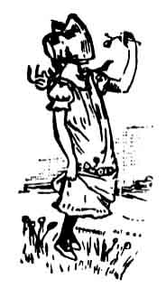

  
[Intangible Textual Heritage](../../../index)  [Sagas and
Legends](../../index)  [English Folklore](../index) 

------------------------------------------------------------------------

<table width="75%">
<colgroup>
<col style="width: 50%" />
<col style="width: 50%" />
</colgroup>
<tbody>
<tr class="odd">
<td width="50%" data-valign="TOP"></td>
<td width="50%" data-valign="TOP"><h1 id="tales-of-the-dartmoor-pixies" data-align="CENTER">Tales of the Dartmoor Pixies</h1>
<h2 id="by-william-crossing" data-align="CENTER">by William Crossing</h2>
<h4 id="section" data-align="CENTER">[1890]</h4></td>
</tr>
</tbody>
</table>

------------------------------------------------------------------------

[Title Page](tdp00)  
[Preface](tdp01)  
[Chapter I: The Moorland Haunts of the Pixies](tdp02)  
[Chapter II: The Pixies' Trysting Place](tdp03)  
[Chapter III: By the Peat Filled Hearth](tdp04)  
[Chapter IV: Lough Tor Hole. The Huccaby Courting](tdp05)  
[Chapter V: The Pixie at the Ockerry. Jimmy Townsend and his Sister
Race](tdp06)  
[Chapter VI: The Ungrateful Farmer.--The Pixy Threshers.--Rewarding a
Pixy](tdp07)  
[Chapter VII: Nanny Norrish and the Pixies.--The Ploughman's
Breakfast.--The Pixy Riders.--Jan Coo](tdp08)  
[Chapter VIII: The Borrowed Colts.--The Boulder in the
Room.--Vickeytoad.--Modilla and Podilla](tdp09)  
[Chapter IX: The Lost Path.--The Pixies' Revel.--Conclusion](tdp10)  
