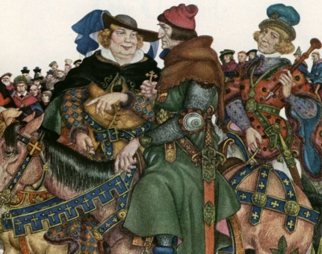

  
[Intangible Textual Heritage](../../../index)  [Legends and
Sagas](../../index)  [England](../index) 

------------------------------------------------------------------------

[Buy this Book on
Kindle](https://www.amazon.com/exec/obidos/ASIN/B002IKKI0C/internetsacredte)

------------------------------------------------------------------------

<table width="75%">
<colgroup>
<col style="width: 50%" />
<col style="width: 50%" />
</colgroup>
<tbody>
<tr class="odd">
<td width="50%" data-valign="TOP"></td>
<td width="50%" data-valign="CENTER"><h1 id="tales-from-chaucer" data-align="CENTER">Tales from Chaucer</h1>
<h2 id="by-charles-cowden-clarke" data-align="CENTER">by Charles Cowden Clarke</h2>
<h4 id="section" data-align="CENTER">[1833]</h4></td>
</tr>
</tbody>
</table>

------------------------------------------------------------------------

[Contents](#contents)    [Start Reading](tfc00)    [Page
Index](pageidx)    [Text \[Zipped\]](tfc.txt.gz)

------------------------------------------------------------------------

|                                                                                                                           |
|---------------------------------------------------------------------------------------------------------------------------|
|  |

This is a modern retelling of the highlights of Chaucer's Canterbury
Tales. While it is written for a younger audience, readers of any age
can enjoy these timeless stories, illustrated by witty fairy-tale style
color drawings by Arthur Szyk.

Also at this site: [Chaucer in Middle English](../mect/index).

------------------------------------------------------------------------

 [Title Page](tfc00)  
[Contents](tfc01)  
[To My Young Readers](tfc02)  
[To An Adult Reader](tfc03)  
[Introduction](tfc04)  
[The Prologue](tfc05)  
[The Knight's Tale](tfc06)  
[The Lawyer's Tale](tfc07)  
[The Student's Tale](tfc08)  
[The Wife of Bath](tfc09)  
[The Squire's Tale](tfc10)  
[The Pardoner's Tale](tfc11)  
[The Nun's Priest's Tale](tfc12)  
[The Cook's Tale of Gamelin](tfc13)  
[The Canon's Yeoman's Tale](tfc14)  
