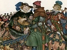

  
[Intangible Textual Heritage](../../../index)  [Legends and
Sagas](../../index)  [England](../index)  [Index](index) 
[Previous](tfc02)  [Next](tfc04) 

------------------------------------------------------------------------

[Buy this Book on
Kindle](https://www.amazon.com/exec/obidos/ASIN/B002IKKI0C/internetsacredte)

------------------------------------------------------------------------

  
*Tales from Chaucer*, by Charles Cowden Clarke, \[1833\], at Intangible
Textual Heritage

------------------------------------------------------------------------

p. xiii

THE adult reader (should I be honoured with such) , who can scarcely
fail to discern an abrupt stiffness in the construction of the sentences
in the following Tales, will bear in mind the many complicated
difficulties I have had to contend with in retaining, as much as
possible, Chaucer's antique quaintness and distinctive character; in
avoiding his repetitions, and yet in incorporating every nervous
expression which constitutes the great charm of his graphic
descriptions.

The task I proposed to myself was to render my translations literal with
the original, to preserve their antique fashion, and withal to give them
a sufficiently modern air to interest the young reader. I was to be at
one and the same time "modernly antique," prosaically poetic, and
comprehensively concise. He only will appreciate my frequent
perplexities who shall attempt the same task—observing the same
restrictions.

------------------------------------------------------------------------

[Next: Introduction](tfc04)
