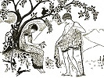

  
[Intangible Textual Heritage](../../index)  [Legends and
Sagas](../index)  [Index](index)  [Previous](ftmg01)  [Next](ftmg03) 

------------------------------------------------------------------------

[Buy this Book on
Kindle](https://www.amazon.com/exec/obidos/ASIN/B002HWRKVG/internetsacredte)

------------------------------------------------------------------------

  
*Fairy Tales of Modern Greece*, by Theodore P. Gianakoulis and Georgia
H. MacPherson, \[1930\], at Intangible Textual Heritage

------------------------------------------------------------------------

p. 8 p. 9

### ILLUSTRATIONS

|                                                                                   |                                      |
|-----------------------------------------------------------------------------------|--------------------------------------|
| "Stop!" He was directly above me now and he planted himself in my way             | [Frontispiece](ftmg00.htm#img_front) |
|                                                                                   | PAGE      |
| In the lake one saw mermaids with fairy faces                                     | [31](ftmg05.htm#img_03100)           |
| She had risen and was following him, weeping and reluctant                        | [41](ftmg06.htm#img_04100)           |
| She thought she saw the forms of three maidens combing out their long hair        | [49](ftmg07.htm#img_04900)           |
| She shrieked and fled like a wild dart of light                                   | [61](ftmg08.htm#img_06100)           |
| Vassos was seen on the hill of Trikkala running or rather gliding above the earth | [67](ftmg09.htm#img_06700)           |
| Three cloud-like chariots with leaping white horses                               | [75](ftmg10.htm#img_07500)           |
| He moved solemnly to Tasoula's bed and held his cross above her                   | [85](ftmg11.htm#img_08500)           |
| A strange and beautiful creature, half woman, half fish                           | [95](ftmg12.htm#img_09500)           |
| Nikolas became a shepherd at the age of fifteen                                   | [105](ftmg13.htm#img_10500)          |
| Anasto was loved by Tassos                                                        | [109](ftmg14.htm#img_10900)          |
| Agnoste darted straight through the flames                                        | [123](ftmg15.htm#img_12300)          |

------------------------------------------------------------------------

[Next: Foreword](ftmg03)
