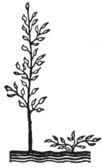
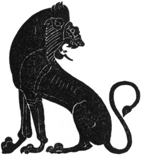

  
[Intangible Textual Heritage](../../index)  [Legends and
Sagas](../index)  [Index](index)  [Previous](ftmg02)  [Next](ftmg04) 

------------------------------------------------------------------------

[Buy this Book on
Kindle](https://www.amazon.com/exec/obidos/ASIN/B002HWRKVG/internetsacredte)

------------------------------------------------------------------------

  
*Fairy Tales of Modern Greece*, by Theodore P. Gianakoulis and Georgia
H. MacPherson, \[1930\], at Intangible Textual Heritage

------------------------------------------------------------------------

p. 10 p. 11

 

### FOREWORD

TO the question, "Does any fragment of ancient Greek mythology survive?"
the answer is, "Yes, the nymphs." For among the hills and across the
fields and streams of Greece, where the gods were born and dwelt,
fairies now dance and play and radiate a subtle charm. Fairies are none
other than the modern forms of the dryads, oreads, naiads, nerejds,
fates, furies, graces and muses of the ancient myths. They are the
nymphs that sang and played with Pan and Hermes, Apollo and the satyrs,
but now they play and dance and sing with common shepherds, fishermen
and hunters. Their very name is as old as Pontus, their father, and
Doris, their mother. Νηρηΐδα or Νεράϊδα and Νύμφη, vernacular Νύφη, have
the same meaning, which we may translate "fairy" or "nymph."

Fairies are the virgin divinities of the earth. They know no heaven, for
they take the place of the lower, earth-dwelling gods of the ancient
mythology. They were never born;

p. 12

they never grow old; yet they are not immortal. Their beauty is
everlasting and their dance eternal. They were created out of the earth
and always live upon it, the anthropomorphic spirits of hills, streams,
trees and ocean.

The Greek's conception of fairies springs from his worship of nature, to
which he is bound by his constant love of beauty. To his mind they are
beautiful maidens, endowed with mysterious power, who inhabit palaces in
the clouds, in caves on remote mountain peaks, along wild, rocky shores,
or at the bottom of the sea. At noon on sunlit days and moonlit nights
they visit the haunts of mortals, often choosing a tall pine tree, a
cave or a spring. Sometimes they come singing, playing violins or
flutes, or gently beating drums; sometimes they steal silently over
hills and fields, seeking beautiful children or youths or maidens to
carry away to their palaces for purposes of pleasure.

The fairy world is higher than that of mortals. Its creatures are not
subject to the same laws of nature as are binding upon us. Nevertheless,
they are not goddesses and their power is not unlimited. They can be
frightened and driven away by the firing of a gun. They dare not touch
the mortal who wears a *felahtare*, bag of incense, such as many Greeks
have suspended about their necks. The cross, a sign of the cross, and
prayer, are protections against them. If a mortal seizes a fairy's
handkerchief or veil, a strand of hair or a bit of clothing, the fairy
becomes a helpless mortal woman, bound

p. 13

to serve the human being who thus captured her. If the fairy article
returns to the possession of its rightful owner, the woman regains her
fairy attributes and power, but should the article be burned to ashes,
communication between her and the fairy world ceases and she is doomed
to die a mortal's death.

Music, laughter and song, play, dancing and love are associated with
fairies, but at times these creatures can be cunning and cruel and, when
thwarted, revengeful. Occasionally, as in the case of the water fairies,
they offer gifts to their prospective captives. By accepting these
gifts, mortals place themselves under the fairies’ dominion, from which
escape is possible only by burning the gifts. Fairies have destroyed the
happiness or wrecked the life of many a youth who, having seen them,
cannot put the memory of them from his mind, or who, having possessed
one of them, has lost her forever. The springs from which fairies drink
are called μαγεμένες, bewitched. The mortal who drinks from such a
spring becomes μαγεμὲνος, fairy-possessed, and, forgetting home and
family, wanders aimlessly like one mad.

The mediator between the fairy and the mortal worlds is the sorcerer or
the sorceress. The sorceress is the more common. She is usually an old
woman with a practical knowledge of healing and much supernatural lore.
She not only cures physical ills, but she ministers also to the troubled
mind. By conjuring, murmuring mystic words, and applying

p. 14

magic herbs, she can release a μαγεμὲνον, bewitched mortal, from evil
spirits. The sight of an old sorceress with her bag of magics, wandering
over lonely hills in search of herbs, is familiar to every villager in
Greece. These awesome women live a hermit's life, seeking the
unfrequented ways, speaking little, mingling with their fellow beings
only when summoned to aid.

The relation of Christianity to this last remnant of mythology is an
interesting field of study. As a sacred Christian symbol serves to
frustrate the power of a present-day fairy, so has Christianity, adopted
as the state religion, dethroned and driven out the ancient gods. In the
revolution, the new religion borrowed much from the old worship in
church customs and seasonal festivities. It can be truly said that the
Greeks are scarcely yet Christians, for in their hearts linger fragments
of pagan nature worship and superstitious awe of the anthropomorphic
creatures that are a part of nature.

One can see most clearly the mingling of Christianity and paganism in
the *felahtare*. Grandmother Adamis’ bag, described in "The Fairies’
Theft," page [89](ftmg11.htm#page_89), "contained incense from Mount
Levanos, a bit of candle that had burned on Easter before the portrait
of the Virgin, a leaf from a hundred-petaled rose and an amethyst stone.
The bag had been hung about her neck by her godfather on the day of her
baptism, to protect her from all evil."

My personal experience with fairies, which is recounted

p. 15

in "The Fairy-Hunter," began and ended in that one venture. But I was to
be associated with many who claimed first-hand knowledge of fairies and
with many more whose relatives or acquaintances or ancestors said they
had been given glimpses of the fairy world or contact with its
inhabitants.

In "The Fairies’ Theft" is found the story that my Grandmother Adamis
related as her own. It was she who told me "The Fairy Ring," "A Fairy
Wedding," and "The Fairy Wife." She had heard the latter from the lips
of Demetros’ mother who went about half mad through Loutro, telling the
sad tale after her son's disappearance. Uncle Kostas, "uncle" to the
whole village, loved nothing better than to narrate, to anyone who would
listen, the story we give in "Fairy Gardens."

Many summer afternoons when I was tired swimming, diving or pulling up
traps for fish, I would walk a little way along the Gulf shore to find
an old fisherman called Gero Nassos. He was almost sure to be sitting at
the water's edge where his fishing boat was fastened, waiting till
sundown to cast his nets. Gero Nassos was always barefooted and hatless,
with flowing white hair and beard. Like an ancient god of the sea he
sat, cynical yet beneficent, and to him came his worshippers, village
folk and children, to listen to his violin music or his stories. He was
called *alafroiskeotos*, one who is a seer.

p. 16

"Ho, Theodorake!" he would cry out, on seeing me. "Run up to the fields
and bring me some grapes."

Swiftly I would dart up to the vineyards with their green or purple
fruit, for I knew well that the reward would be a sea story. Sometimes
it was about sea monsters or sea ghosts that Gero Nassos told, but the
story I liked best was of sea fairies, because he said it had happened
to him.

He always began with his early life on the beautiful island of Psara,
one of the cluster of emeralds that gleam in the Aegean Sea. His father
owned many trading ships and was very rich. But after his death the
ships one by one slipped out of the family's control. At the age of
eighteen, Nassos became owner and captain of the last one and was never
happy again, he said, except for one moment. His story is related in
"The Haunted Ship."

With two of the tales I was indirectly connected, "The Fairies’ Theft"
and "The Wonder of Skoupa." I was playing in the fields of Petsà with
other children, while our parents were threshing wheat, when the
shepherds brought Tasoula, fainting, down from the hills. I knew
Tasoula, I had often played with her, and I can never forget how white
and still she looked as she was laid on her bed. I remember the
difference of opinion from the onlookers. Some thought she was dead,
others that her spirit was in the possession of the fairies. After she
was restored, it was agreed in Petsà that many prayers and offerings had
been needed to free her soul from the fairies’ evil power and that if
she had been

p. 17

more beautiful, her body would have been stolen too and we should never
have seen her again.

On the Saint Nikolaos Day that the shepherd boy, Nikolas, disappeared at
the Stavrodromos, I was visiting my cousin Nikolas in the village of
Skoupa. The old field watchman, Vasilis, burst in upon our festivities
to ask breathlessly whether any of us had seen the fairy shepherd on
that day. My uncle Kristophoros went out to join him and the other
villagers in their fruitless search.

During my years in America, I have listened to many narratives about
fairies told by my countrymen from all parts of Greece. These tales can
be found in any section, from Thrace to the Peloponnesus and from the
Aegean Sea to the Ionian, with variations in names, perhaps, and
details. They came to me in fragments which have had to be pieced
together.

Fashions in fairy tales differ as much from section to section as do
customs and dialect. There are, however, certain universal fairy
characteristics of which every Greek has heard and which are never
disputed. These are the supernatural beauty of fairies; their love of
the beautiful which makes them seek to carry away beautiful youths and
maidens; their power over mortals; and their transition to a human,
powerless state when an article belonging to them is in the possession
of a mortal. The authors have tried to catch these universals and clothe
them in characteristic form.

It is not at all times that a Greek will speak of fairies.

p. 18

The mood of the unreal, of the idealistic, the mood of poetry and of
dreams, must be evoked before he can unveil his soul and talk of the
mysterious, elusive beings that are part of his native land, almost of
his religion. It is in some such mood as this, forgetting the world of
logic, of material things and of everyday thinking, that I hope our
readers will enter our world of Faery.

T. P. G.

 

------------------------------------------------------------------------

[Next: I. The Fairy Hunter](ftmg04)
