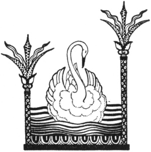

  
[Intangible Textual Heritage](../../index)  [Legends and
Sagas](../index)  [Index](index)  [Previous](ftmg04)  [Next](ftmg06) 

------------------------------------------------------------------------

[Buy this Book on
Kindle](https://www.amazon.com/exec/obidos/ASIN/B002HWRKVG/internetsacredte)

------------------------------------------------------------------------

  
*Fairy Tales of Modern Greece*, by Theodore P. Gianakoulis and Georgia
H. MacPherson, \[1930\], at Intangible Textual Heritage

------------------------------------------------------------------------

p. 27

 

### II

### FAIRY GARDENS

UNCLE KOSTAS, as everyone called him, had once been a prisoner of the
fairies. He would sit stiffly down upon a stone and lean upon the tall,
shepherd's staff which he always carried, to recount his story.

"Look," he would begin. "Do you see those hills yonder? They are the
Hills of the Dragons. Many, many years ago

Kostas was resting at noon beside a spring under the shadow of a pine in
one of the Dragonorahes, Dragon Hills, after eating his bread and
cheese. He closed his eyes for a little while and when he opened them,
there were fairies dancing all around him in the air. He knew that he
was handsome, handsome enough to tempt them to carry him away, but since
he had his gun with him he thought himself safe.

p. 28

Some of the fairies were singing, others were playing their flutes, and
all would pause now and then to ask Kostas to play his flute and dance
with them. Pointing to his gun, he shook his head and even though they
were angry they dared not harm him. Suddenly the music and the dancing
ceased. The fairies whispered together a moment and then disappeared
like a cob web that is brushed away.

Kostas was about to go back to his sheep, grazing lower down on the
hillside, but he was unable to move, even to stretch out his hand. Then
the fairies were back again and this time their queen was with them,
riding on a great white horse. Around her were a thousand fairies on
white horses and others kept coming and coming until the Dragonorahe was
covered with them.

Kostas tried to stand up, he tried to reach his gun, but he could do
nothing except gaze at the beautiful queen, with her shining, silken
hair and her shimmering white garments, as she sat upon her proud horse.
There was a great murmuring around him. After a while he understood that
all the fairies were talking about him.

"Does he please you?" one asked the queen.

"Will you have him?" asked another.

"He is powerless now," said a third. "Shall we take him?"

The queen looked down at him thoughtfully for a long time. Then she
smiled, lifted her wand and cried, "I shall have him! He is beautiful!
Let us bring him with us!"

Servant fairies caught up Kostas and darted away with him as fast as an
eagle flies. The queen with the thousand

p. 29

fairies on horseback followed and after them came the thousands and
thousands of others, all in white, all dancing around and around as they
swept forward. They took him up to the highest peak of the mountain
Kyllene, where there is snow nearly all the year. A yawning, black
opening admitted to a long dark passage, ending in a golden gate. Beyond
lay the gardens of the fairies, where the sweet, warm air of summer
always dwelt.

"Here you must stay  
 For a year and a day,  
 And never, oh never,  
 Will you wish to go away."

sang the queen to her new prisoner and all the fairies echoed softly,

"And never, oh never,  
 Will you wish to go away."

Looking about him, Kostas saw that he was in a paradise. There were
gardens everywhere, each with flowers of a different color. One garden
was white, one yellow, one purple, then green, rose and blue, with many
shades of each, so that they all blended together like the bars of a
magnificent rainbow. In the center was a lake, mirror-like, upon which
an island appeared to float. So clear was the water that one could see
to the bottom which was studded with emeralds. Upon the surface, like
great bubbles, diamonds, rubies and sapphires moved with the slow
current.

On the island many youths, stolen by the fairies, were playing with
flower-wreaths, chains of precious stones, and

p. 30

fine gold and silver-like sand. Kostas was taken to the island, given
fairy clothes such as the other youths wore, and shown trees from which
he could gather as much fruit as he wished.

There were as many kinds of fruit trees on the island as there were
flower gardens around the lake. Figs, pears and olives, peaches and
plums, as well as grapes heavy upon their vines, hung in tempting
profusion. The fruit would fall to the ground when it was ripe and if no
one ate it, it would harden into a jewel of the shape and color of the
fruit.

Peacocks strutted about and birds of bright plumage flitted through the
trees. In the lake one saw mermaids with fairy faces, graceful swans,
and fish such as are not found in any other sea. All the time, for there
never is any night there, fairies danced in the flower gardens, gazed at
their reflections in the lake, sang or made music on their flutes, while
youths played on their beautiful island, and the queen appeared happiest
of all, watching the others being happy.

But Kostas, alone of all those thousands, was not happy. He enjoyed
living in that paradise, but he could never forget his home and his
sweetheart Christena, and he longed to go back. Then he would think of
the queen. He thought she cared a great deal for him, more, perhaps,
than for any of the other youths. He remembered her song:

"Here you must stay  
 For a year and a day,  
 And never, oh never,  
 Will you wish to go away."

p. 31

  [  
Click to enlarge](img/03100.jpg)  
In the lake one saw mermaids with fairy faces.  

p. 32 p. 33

"I must wait," he told himself again and again. "I must wait for a year
and a day."

Finally the time passed. Kostas went to the queen, bowed very humbly and
said:

"Here did I stay  
 For a year and a day,  
 But always and always  
 I've wished to go away."

Then he told her how, even though she was so beautiful and everything
was so lovely, he desired above all to go home to his sweetheart
Christena. The queen did not answer immediately, and he waited in
anguish on his knees with his head bowed to the ground.

"Kostas," she said at last, "will you do anything I ask you?"

"Anything!" he cried, starting up eagerly.

"Then listen. I have lost a gold vase set with turquoise and lined with
golden hair. Find the vase for me by noon to-day. Be sure of the lining
of golden hair, for that is important. Go!"

Hopefully Kostas began his search in the gardens, but though he looked
carefully among all the vari-colored flower beds, he found nothing.
Going to the island, he searched anxiously beneath all the fruit trees
and even scanned their branches, but the vase was not there. It was now
almost noon.

p. 34

\[paragraph continues\] He walked to the
shore and stood looking hopelessly into the water, thinking how far he
was from his desire. A strange fish, all gold and blue, appeared
swimming toward him. But no, it was not a fish. It was a vase, gold set
with turquoise!

Kostas seized it and held it up joyfully. The lining! He was almost
afraid to look. There it was, the fine gold hair, and there was
something else, more precious to him than hair or jewels or gold. It was
the shepherd's clothes that he had worn when the fairies carried him
away. He knew then that the queen meant to let him go. Quickly
exchanging the fairy garments for the old loose cloak and short, full
skirt of the shepherd, he returned to the queen and laid the vase before
her, just as the sun reached the meridian.

The queen smiled and touched Kostas with her wand.

"You may go back to your home and your sweetheart," she said, "and you
may take with you a strand of the hair lining the vase. It is my hair,
and if you should ever wish to return to the fairy gardens, you have
only to show it to the fairies and they will bring you back."

Kostas thanked her many times and arose. There was a beautiful white
horse with a golden tail and mane and a human face, to carry him, and
three fairy princesses with red caps, to show him the way. Through the
golden gate, through the long, dark passage, through the snow-fringed
opening in the mountain and over the hills they flew until they reached
the spring on the Dragonorahe. There the fairies left him, just where he
had been a year and a day before.

p. 35

But the strand of golden hair Kostas lost out of his selahe as they came
swiftly over the hills. Afterward he searched for it tirelessly,
climbing all of the Dragon Hills as high as he could go, but he never
found it.

 

------------------------------------------------------------------------

[Next: III. The Fairy Wife](ftmg06)
