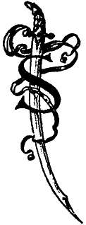
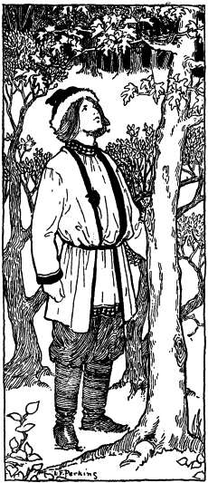
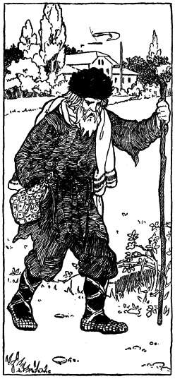
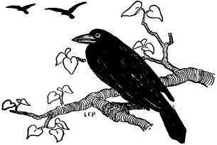

  
[Intangible Textual Heritage](../../index)  [Legends and
Sagas](../index)  [Index](index)  [Previous](chap02)  [Next](chap04) 

------------------------------------------------------------------------

[Buy this Book on
Kindle](https://www.amazon.com/exec/obidos/ASIN/B002H9XSSI/internetsacredte)

------------------------------------------------------------------------

  
*Folk Tales From the Russian*, by Verra Xenophontovna Kalamatiano de
Blumenthal, \[1903\], at Intangible Textual Heritage

------------------------------------------------------------------------

p. 66

### THE LANGUAGE OF THE BIRDS

|                       |
|-----------------------|
|  |

SOMEWHERE in a town in holy Russia, there lived a rich merchant with his
wife. He had an only son, a dear, bright, and brave boy called Ivan. One
lovely day Ivan sat at the dinner table with his parents. Near the
window in the same room hung a cage, and a nightingale, a sweet-voiced,
gray bird, was imprisoned within. The sweet nightingale began to sing
its wonderful song with trills and high silvery tones. The merchant
listened and listened to the song and said:

"How I wish I could understand the meaning of the different songs of all
the birds! I would give half my wealth to the man, if only there were
such a man, who could make plain to me all the different songs of the
different birds."

Ivan took notice of these words and no matter where he went, no matter
where he was, no matter what he did, he

p. 67

* *

Ivan learns the language of the birds

p. 68

always thought of how he could learn the language of the birds.

Some time after this the merchant's son happened to be hunting in a
forest. The winds rose, the sky became clouded, the lightning flashed,
the thunder roared loudly, and the rain fell in torrents. Ivan soon came
near a large tree and saw a big nest in the branches. Four small birds
were in the nest; they were quite alone, and neither father nor mother
was there to protect them from the cold and wet. The good Ivan pitied
them, climbed the tree and covered the little ones with his "kaftan," a
long-skirted coat which the Russian peasants and merchants usually wear.
The thunderstorm passed by and a big bird came flying and sat down on a
branch near the nest and spoke very kindly to Ivan.

"Ivan, I thank thee; thou hast protected my little children from the
cold and rain and I wish to do something for thee. Tell me what thou
dost wish."

Ivan answered; "I am not in need; I have everything for my comfort. But
teach me the birds' language."

p. 69

"Stay with me three days and thou shalt know all about it."

Ivan remained in the forest three days. He understood well the teaching
of the big bird and returned home more clever than before. One beautiful
day soon after this Ivan sat with his parents when the nightingale was
singing in his cage. His song was so sad, however, so very sad, that the
merchant and his wife also became sad, and their son, their good Ivan,
who listened very attentively, was even more affected, and the tears
came running down his cheeks.

"What is the matter?" asked his parents; "what art thou weeping about,
dear son?"

"Dear parents," answered the son, "it is because I understand the
meaning of the nightingale's song, and because this meaning is so sad
for all of us."

"What then is the meaning? Tell us the whole truth; do not hide it from
us," said the father and mother.

"Oh, how sad it sounds!" replied the son. "How much better would it be
never to have been born!"

p. 70

"Do not frighten us," said the parents, alarmed. "If thou dost really
understand the meaning of the song, tell us at once."

"Do you not hear for yourselves? The nightingale says: 'The time will
come when Ivan, the merchant's son, shall become Ivan, the king's son,
and his own father shall serve him as a simple servant.'"

The merchant and his wife felt troubled and began to distrust their son,
their good Ivan. So one night they gave him a drowsy drink, and when he
had fallen asleep they took him to a boat on the wide sea, spread the
white sails, and pushed the boat from the shore.

For a long time the boat danced on the waves and finally it came near a
large merchant vessel, which struck against it with such a shock that
Ivan awoke. The crew on the large vessel saw Ivan and pitied him. So
they decided to take him along with them and did so. High, very high,
above in the sky they perceived cranes. Ivan said to the sailors: "Be
careful; I hear the birds predicting

p. 71

a storm. Let us enter a harbor or we shall suffer great danger and
damage. All the sails will be torn and all the masts will be broken."

But no one paid any attention and they went farther on. In a short time
the storm arose, the wind tore the vessel almost to pieces, and they had
a very hard time to repair all the damage. When they were through with
their work they heard many wild swans flying above them and talking very
loud among themselves.

"What are they talking about?" inquired the men, this time with
interest.

"Be careful," advised Ivan. "I hear and distinctly understand them to
say that the pirates, the terrible sea robbers, are near. If we do not
enter a harbor at once they will imprison and kill us."

The crew quickly obeyed this advice and as soon as the vessel entered
the harbor the pirate boats passed by and the merchants saw them capture
several unprepared vessels. When the danger was over, the sailors with
Ivan went farther, still farther. Finally the vessel anchored

p. 72

near a town, large and unknown to the merchants. A king ruled in that
town who was very much annoyed by three black crows. These three crows
were all the time perching near the window of the king's chamber. No one
knew how to get rid of them and no one could kill them. The king ordered
notices to be placed at all crossings and on all prominent buildings,
saying that whoever was able to relieve the king from the noisy birds
would be rewarded by obtaining the youngest korolevna, the king's
daughter, for a wife; but the one who should have the daring to
undertake but not succeed in delivering the palace from the crows would
have his head cut off. Ivan attentively read the announcement, once,
twice, and once more. Finally he made the sign of the cross and went to
the palace. He said to the servants:

"Open the window and let me listen to the birds."

The servants obeyed and Ivan listened for a while. Then he said:

"Show me to your sovereign king."

When he reached the room where the

p. 73

king sat on a high, rich chair, he bowed and said:

"There are three crows, a father crow, a mother crow, and a son crow.
The trouble is that they desire to obtain thy royal decision as to
whether the son crow must follow his father crow or his mother crow."

The king answered: "The son crow must follow the father crow."

As soon as the king announced his royal decision the crow father with
the crow son went one way and the crow mother disappeared the other way,
and no one has heard the noisy birds since. The king gave one-half of
his kingdom and his youngest korolevna to Ivan, and a happy life began
for him.

In the meantime his father, the rich merchant, lost his wife and by and
by his fortune also. There was no one left to take care of him, and the
old man went begging under the windows of charitable people. He went
from one window to another, from one village to another, from one town
to another, and one bright day he came to the palace where Ivan

p. 74

 

*"The old man went begging from town to town"*

p. 75

lived, begging humbly for charity. Ivan saw him and recognized him,
ordered him to come inside, and gave him food to eat and also supplied
him with good clothes, asking questions:

"Dear old man, what can I do for thee?" he said.

"If thou art so very good," answered the poor father, without knowing
that he was speaking to his own son, "let me remain here and serve thee
among thy faithful servants."

"Dear, dear father!" exclaimed Ivan, "thou didst doubt the true song of
the nightingale, and now thou seest that our fate was to meet according
to the predictions of long ago."

The old man was frightened and knelt before his son, but his Ivan
remained the same good son as before, took his father lovingly into his
arms, and together they wept over their sorrow.

Several days passed by and the old father felt courage to ask his son,
the korolevitch:

"Tell me, my son, how was it that thou didst not perish in the boat?"

p. 76

Ivan Korolevitch laughed gayly.

"I presume," he answered, "that it was not my fate to perish at the
bottom of the wide sea, but my fate was to marry the korolevna, my
beautiful wife, and to sweeten the old age of my dear father."

 

------------------------------------------------------------------------

[Next: Ivanoushka the Simpleton](chap04)
