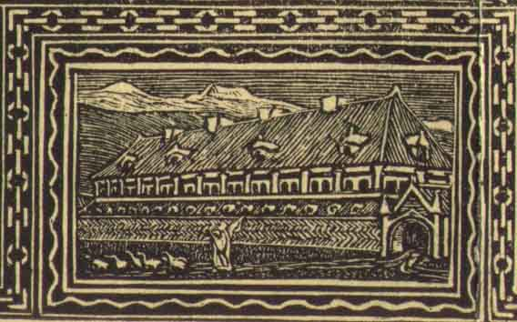

[Intangible Textual Heritage](../../index)  [Legends and
Sagas](../index) 

------------------------------------------------------------------------

<table width="75%">
<colgroup>
<col style="width: 50%" />
<col style="width: 50%" />
</colgroup>
<tbody>
<tr class="odd">
<td width="50% VALIGN=" data-top"=""></td>
<td><h3 id="the-story-of" data-align="CENTER">The Story of</h3>
<h1 id="grettir-the-strong" data-align="CENTER">Grettir the Strong</h1>
<h6 id="translated-by" data-align="CENTER">translated by</h6>
Eiríkr Magnússon
<h6 id="and" data-align="CENTER">and</h6>
<h4 id="willam-morris" data-align="CENTER">Willam Morris</h4>
<h4 id="section" data-align="CENTER">[1869]</h4></td>
</tr>
</tbody>
</table>

------------------------------------------------------------------------

[Contents](#contents)     [Start Reading](gre00)

------------------------------------------------------------------------

This is one of the few Magnusson and Morris Icelandic Saga translations
which has yet to be converted to etext as of 2003. I like this
translation much better than the 1914 Hight translation, (available in
etext as the Online Medieval and Classical Library release \#9). Morris
is one of the great stylists of the fantasy field, and his
pseudo-archaic language just feels right for this meaty story of revenge
served up hot and cold. In addition, there is a gorgeous [map of
North-west Iceland](gre05) which, although it isn't signed, was probably
drawn by Morris.

The protagonist, Grettir Asmudson, is a bad seed, a loner, a thief, a
grave-robber, and a murderer. On the plus side, he has an incredible
tolerance for pain and an uncanny ability to extemporize poetry.
Grettir's poor anger management starts a cycle of revenge. In spite of
some heroic deeds (particularly an almost cinematic confrontation with
some berserkers), Grettir gets a bad reputation which he is never able
to shake off. Grettir has several encounters with supernatural beings:
ghosts, trolls and liches. The pivot of the story is a particularly
bloodthirsty ghost who fortells Grettir's doom when he vanquishes it.

This is a tragic story told from a perspective that is just outside our
modern conventions of storytelling. Grettir lived just on the cusp of
the introduction of Christianity in Iceland, at a time when the ancient
customs of blood-money and vendetta still held. There is no redemption
for Grettir, even though his character evolves over the course of the
story arc. Grettir is banished from society for most of his life.
Towards the end almost everyone he comes in contact with eventually
tries to betray him. In the end, it takes dire witchcraft and a small
army of men to bring Grettir down. *--J.B. Hare*

------------------------------------------------------------------------

[Colophon](gre00)  
[Title Page](gre01)  
[Preface](gre02)  
[CHRONOLOGY OF THE STORY](gre03)  
[Contents](gre04)  
[Map of North-west Iceland \[201 kb\]](gre05)  
[Chapter I](gre06)  
[Chapter II](gre07)  
[Chapter III](gre08)  
[Chapter IV](gre09)  
[Chapter V](gre10)  
[Chapter VI](gre11)  
[Chapter VII](gre12)  
[Chapter VIII](gre13)  
[Chapter IX](gre14)  
[Chapter X](gre15)  
[Chapter XI](gre16)  
[Chapter XII](gre17)  
[Chapter XIII](gre18)  
[Chapter XIV: Of Grettir as a Child, and his froward ways with his
Father](gre19)  
[Chapter XV: Of the Ball-play on Midfirth Water](gre20)  
[Chapter XVI: Of the Slaying of Skeggi](gre21)  
[Chapter XVII: Of Grettir's Voyage out](gre22)  
[Chapter XVIII: Of Grettir at Haramsey and his dealings with Karr the
Old](gre23)  
[Chapter XIX: Of Yule at Haramsey, and how Grettir dealt with the
Bearserks](gre24)  
[Chapter XX: How Thorfinn met Grettir at Haramsey again](gre25)  
[Chapter XXI: Of Grettir and Biorn and the Bear](gre26)  
[Chapter XXII: Of the Slaying of Biorn](gre27)  
[Chapter XXIII: The Slaying of Hiarandi](gre28)  
[Chapter XXIV: Of the Slaying of Gunnar, and Grettir's strife with Earl
Svein](gre29)  
[Chapter XXV: The Slaying of Thorgils Makson](gre30)  
[Chapter XXVI: Of Thorstein Kuggson, and the gathering for the Bloodsuit
for the Slaying of Thorgils Makson](gre31)  
[Chapter XXVII: The Suit for the Slaying of Thorgils Makson](gre32)  
[Chapter XXVIII: Grettir comes out to Iceland again.](gre33)  
[Chapter XXIX: Of the Horse-fight at Longfit](gre34)  
[Chapter XXX: Of Thorbiorn Oxmain and Thorbiorn Tardy, and of Grettir's
meeting with Kormak on Ramfirth-neck](gre35)  
[Chapter XXXI: How Grettir met Bardi, the Son of Gudmund, as he came
back from the Heath-slayings](gre36)  
[Chapter XXXII: Of the Haunting at Thorhall-stead; and how Thorhall took
a Shepherd by the rede of Skapti the Lawman, and of what befell
thereafter](gre37)  
[Chapter XXXIII: Of the doings of Glam at Thorhall-stead](gre38)  
[Chapter XXXIV: Grettir hears of the Hauntings](gre39)  
[Chapter XXXV: Grettir goes to Thorhall-stead, and has to do with
Glam](gre40)  
[Chapter XXXVI: Of Thorbiorn Oxmain's Autumn-feast, and the mocks of
Thorbiorn Tardy](gre41)  
[Chapter XXXVII: Olaf the Saint, King in Norway; the slaying of
Thorbiorn Tardy; Grettir goes to Norway](gre42)  
[Chapter XXXVIII: Of Thorir of Garth and his sons; and how Grettir
fetched fire for his shipmates](gre43)  
[Chapter XXXIX: How Grettir would fain bear Iron before the
King](gre44)  
[Chapter XL: Of Grettir and Snækoll](gre45)  
[Chapter XLI: Of Thorstein Dromond's Arms, and what he deemed they might
do](gre46)  
[Chapter XLIII: Of the Death of Asmund the Greyhaired](gre47)  
[Chapter XLIII: The Onset on Atli at the Pass and the Slaying of Gunnar
and Thorgeir](gre48)  
[Chapter XLIV: The Suit for the Slaying of the Sons of Thorir of the
Pass.](gre49)  
[Chapter XLV: Of the Slaying of Atli Asmundson](gre50)  
[Chapter XLVI: Grettir outlawed at the Thing at the Suit of Thorir of
Garth](gre51)  
[Chapter XLVII: Grettir comes out to Iceland again](gre52)  
[Chapter XLVIII: The Slaying of Thorbiorn Oxmain](gre53)  
[Chapter XLIX: The gathering to avenge Thorbiorn Oxmain](gre54)  
[Chapter L: Grettir and the Foster-brothers at Reek-knolls](gre55)  
[Chapter LI: Of the suit for the Slaying of Thorbiorn Oxmain, and how
Thorir of Garth would not that Grettir should be made sackless](gre56)  
[Chapter LII: How Grettir was taken by the Icefirth Carles](gre57)  
[Chapter LIII: Grettir with Thorstein Kuggson](gre58)  
[Chapter LIV: Grettir meets Hallmund on the Keel](gre59)  
[Chapter LV: Of Grettir on Ernewaterheath, and his dealings with Grim
there](gre60)  
[Chapter LVI: Of Grettir and Thorir Redbeard](gre61)  
[Chapter LVII: How Thorir of Garth set on Grettir on
Ernewaterheath](gre62)  
[Chapter LVIII: Grettir in Fairwood-fell](gre63)  
[Chapter LIX: Gisli's meeting with Grettir](gre64)  
[Chapter LX: Of the Fight at Hitriver](gre65)  
[Chapter LXI: How Grettir left Fairwoodfell, and of his abiding in
Thorir's-dale](gre66)  
[Chapter LXII: Of the Death of Hallmund, Grettir's Friend](gre67)  
[Chapter LXIII: How Grettir beguiled Thorir of Garth when he was nigh
taking him](gre68)  
[Chapter LXIV: Of the ill haps at Sand-heaps, and how Guest came to the
Goodwife there](gre69)  
[Chapter LXV: Of Guest and the Troll-wife](gre70)  
[Chapter LXVI: Of the Dweller in the Cave under the Force](gre71)  
[Chapter LXVII: Grettir driven from Sand-heaps to the West](gre72)  
[Chapter LXVIII: How Thorod, the Son of Snorri Godi went against
Grettir](gre73)  
[Chapter LXIX: How Grettir took leave of his Mother at Biarg, and fared
with Illugi his Brother to Drangey](gre74)  
[Chapter LXX: Of the Bonders who owned Drangey between them](gre75)  
[Chapter LXXI: How those of Skagafirth found Grettir on
Drangey](gre76)  
[Chapter LXXII: Of the Sports at Heron-ness Thing](gre77)  
[Chapter LXXIII: The Handselling of Peace](gre78)  
[Chapter LXXIV: Of Grettir's Wrestling: and how Thorbiorn Angle now
bought the more part of Drangey](gre79)  
[Chapter LXXV: Thorbiorn Angle goes to Drangey to speak with
Grettir](gre80)  
[Chapter LXXVI: How Noise let the Fire out on Drangey, and how Grettir
must needs go a land for more](gre81)  
[Chapter LXXVII: Grettir at the Home-stead of Reeks](gre82)  
[Chapter LXXVIII: Of Hæring at Drangey, and the end of him](gre83)  
[Chapter LXXIX: Of the Talk at the Thing about Grettir's
Outlawry](gre84)  
[Chapter LXXX: Thorbiorn Angle goes with his Foster-mother out to
Drangey](gre85)  
[Chapter LXXXI: Of the Carline's evil Gift to Grettir](gre86)  
[Chapter LXXXII: Grettir sings of his Great Deeds](gre87)  
[Chapter LXXXIII: How Thorbiorn Angle gathered Force and set Sail for
Drangey](gre88)  
[Chapter LXXXIV: The Slaying of Grettir Asmundson](gre89)  
[Chapter LXXXV: How Thorbiorn Angle claimed Grettir's
Head-money](gre90)  
[Chapter LXXXVI: How Thorbiorn Angle brought Grettir's Head to
Biarg](gre91)  
[Chapter LXXXVII: Affairs at the Althing](gre92)  
[Chapter LXXXVIII: Thorbiorn Angle goes to Norway, and thence to
Micklegarth](gre93)  
[Chapter LXXXIX: How the Short-Sword was the easier known when sought
for by reason of the notch in the blade](gre94)  
[Chapter XC: How the Lady Spes redeemed Thorstein from the
Dungeon](gre95)  
[Chapter XCI: Of the doings of Thorstein and the Lady Spes](gre96)  
[Chapter XCII: Of the Oath that Spes made before the Bishop](gre97)  
[Chapter XCIII: Thorstein and Spes come out to Norway](gre98)  
[Chapter XCIV: Thorstein Dromund and Spes leave Norway again](gre99)  
[Chapter XCV: How Thorstein Dromund and Spes fared to Rowe and died
there](gre100)  
[End Notes](gre101)  
