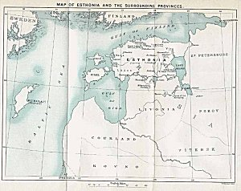

[Sacred-Texts](../../index) [Legends & Sagas](../index)

------------------------------------------------------------------------

<table data-align="center" data-cellpadding="10">
<colgroup>
<col style="width: 50%" />
<col style="width: 50%" />
</colgroup>
<tbody>
<tr class="odd">
<td> 
<em>click to enlarge</em></td>
<td style="text-align: center;"><strong>The Hero of Esthonia 
by W. F. Kirby 
in two volumes 
[London, 1895]</strong></td>
</tr>
</tbody>
</table>

------------------------------------------------------------------------

Volume 1

[Title Page](hoe1-00)  
[CONTENTS](hoe1-01)  
[PREFACE](hoe1-02)  
[INTRODUCTION](hoe1-03)  

**PART I — [THE HERO OF ESTHONIA](hoe1-04)**

[ARGUMENT OF THE “KALEVIPOEG”](hoe1-05)  

|                 |                                                    |
|----------------:|----------------------------------------------------|
|      CANTO I —  | [THE MARRIAGES OF SALME AND LINDA](hoe1-06)        |
|     CANTO II —  | [THE DEATH OF KALEV](hoe1-07)                      |
|    CANTO III —  | [THE FATE OF LINDA](hoe1-08)                       |
|     CANTO IV —  | [THE ISLAND MAIDEN](hoe1-09)                       |
|      CANTO V —  | [THE KALEVIDE AND THE FINNISH SORCERER](hoe1-10)   |
|     CANTO VI —  | [THE KALEVIDE AND THE SWORD-SMITHS](hoe1-11)       |
|    CANTO VII —  | [THE RETURN OF THE KALEVIDE](hoe1-12)              |
|   CANTO VIII —  | [THE CONTEST AND PARTING OF THE BROTHERS](hoe1-13) |
|     CANTO IX —  | [RUMOURS OF WAR](hoe1-14)                          |
|      CANTO X —  | [THE HEROES AND THE WATER-DEMON](hoe1-15)          |
|     CANTO XI —  | [THE LOSS OF THE SWORD](hoe1-16)                   |
|    CANTO XII —  | [THE FIGHT WITH THE SORCERER’S SONS](hoe1-17)      |
|   CANTO XIII —  | [THE KALEVIDE’S FIRST JOURNEY TO HADES](hoe1-18)   |
|    CANTO XIV —  | [THE PALACE OF SARVIK](hoe1-19)                    |
|     CANTO XV —  | [THE MARRIAGE OF THE SISTERS](hoe1-20)             |
|    CANTO XVI —  | [THE VOYAGE OF THE KALEVIDE](hoe1-21)              |
|   CANTO XVII —  | [THE HEROES AND THE DWARF](hoe1-22)                |
|  CANTO XVIII —  | [THE KALEVIDE’S JOURNEY TO PŌRGU](hoe1-23)         |
|    CANTO XIX —  | [THE LAST FEAST OF THE HEROES](hoe1-24)            |
|     CANTO XX —  | [ARMAGEDDON](hoe1-25)                              |

 

**PART II — [ESTHONIAN FOLKTALES](hoe1-26)**

 **SECTION I — [TALES ILLUSTRATIVE OF THE “KALEVIPOEG”](hoe1-27)**  
  [THE MILKY WAY. (JANNSEN.)](hoe1-28)  
  [THE GRATEFUL PRINCE. (KREUTZWALD.)](hoe1-29)  
  [SLYBOOTS. (KREUTZWALD.)](hoe1-30)  
  [THE GOLD-SPINNERS. (KREUTZWALD.)](hoe1-31)  

 

SECTION II — [ORPHAN AND FOUNDLING TALES](hoe1-32)  
  [THE WOOD OF TONTLA. (KREUTZWALD.)](hoe1-33)  
  [THE ORPHAN BOY AND THE HELL-HOUNDS. (KREUTZWALD.)](hoe1-34)  
  [THE EGG-BORN PRINCESS. (KREUTZWALD.)](hoe1-35)  
  [THE ROYAL HERD-BOY. (KREUTZWALD.)](hoe1-36)  
  [TIIDU THE FLUTE-PLAYER.](hoe1-37)  
  [THE LUCKY EGG. (KREUTZWALD.)](hoe1-38)  
  [THE MAGICIAN IN THE POCKET, THE GOD-DAUGHTER OF THE ROCK-MAIDENS, and
THE FOUNDLING](hoe1-39)  

Volume 2

[Title Page](hoe2-00)  
[CONTENTS](hoe2-01)  

 **SECTION III — [COSMOPOLITAN STORIES](hoe2-02)**  
  [BLUEBEARD. (KREUTZWALD)](hoe2-03)  
  [CINDERELLA. (KREUTZWALD.)](hoe2-04)  
  [THE DRAGON-SLAYER.](hoe2-05)  
  [THE DWARF’S CHRISTENING. (JANNSEN.)](hoe2-06)  
  [THE ENVIOUS SISTERS.](hoe2-07)  
  [THE GIFTED BROTHERS. (KREUTZWALD.)](hoe2-08)  
  [THE IDIOT’S LUCK.](hoe2-09)  
  [THE MAGICIAN’S HEIRS. (KREUTZWALD.)](hoe2-10)  
  [THE MAN IN THE MOON.](hoe2-11)  
  [VIDEVIK, KOIT, ANDÄMARIK (Twilight, Dawn, and Evening
Twilight).](hoe2-12)  
  [THE MAIDEN AT THE VASKJALA BRIDGE. (KREUTZWALD.)](hoe2-13)  
  [THE WOMAN IN THE MOON. (JANNSEN.)](hoe2-14)  
  [POLYPHEMUS. (JANNSEN.)](hoe2-15)  
  [RED RIDING-HOOD.](hoe2-16)  
  [SNOWWHITE, THE GLASS MOUNTAIN, AND THE DESPISED YOUNGEST
SON.](hoe2-17)  
  [THE THREE SISTERS. (JANNSEN.)](hoe2-18)  
  [THE THREE WISHES.](hoe2-19)  
  [THE WITCH-BRIDE.](hoe2-20)  
  [THE STEPMOTHER. (KREUTZWALD.)](hoe2-21)  

 **SECTION IV — [FAMILIAR STORIES OF NORTHERN EUROPE](hoe2-22)**  
  [THE FISHERMAN AND HIS WIFE.](hoe2-23)  
  [THE MERMAID. (KREUTZWALD.)](hoe2-24)  
  [HOW THE SEA BECAME SALT. (JANNSEN.)](hoe2-25)  
  [THE TWO BROTHERS AND THE FROST. (JANNSEN.)](hoe2-26)  
  [THE SOLDIER AND THE DEVIL. (JANNSEN.)](hoe2-27)  

 **SECTION V — [STORIES OF THE GODS, AND SPIRITS OF THE
ELEMENTS](hoe2-28)**  
  [THE SONG-GOD’S DEPARTURE. (JANNSEN.)](hoe2-29)  
  [JUTTA. (JANNSEN.)](hoe2-30)  
  [THE TWELVE DAUGHTERS. (KREUTZWALD.)](hoe2-31)  
  [THE FOUR GIFTS OF THE WATER-SPRITE. (JANNSEN.)](hoe2-32)  
  [THE LAKE-DWELLERS. (JANNSEN.)](hoe2-33)  
  [THE FAITHLESS FISHERMAN. (JANNSEN.)](hoe2-34)  
  [THE SPIRITS OF THE NORTHERN LIGHTS. (JANNSEN.)](hoe2-35)  
  [THE SPIRIT OF THE WHIRLWIND. (JANNSEN.)](hoe2-36)  
  [THE WILL O’ THE WISPS. (JANNSEN.)](hoe2-37)  
  [THE FOUNDLING. (JANNSEN.)](hoe2-38)  
  [THE CAVE-DWELLERS. (KREUTZWALD.)](hoe2-39)  
  [THE COMPASSIONATE WOODCUTTER. (JANNSEN.)](hoe2-40)  
  [THE GOOD DEED REWARDED. (KREUTZWALD.)](hoe2-41)  

 **SECTION VI — [HEATH LEGENDS. (JANNSEN.)](hoe2-42)**  
  [THE WONDERFUL HAYCOCK. (JANNSEN.)](hoe2-43)  
  [THE MAGIC EGG. (JANNSEN.)](hoe2-44)  

 **SECTION VII — [LAKE LEGENDS.](hoe2-45)**  
  [LAKE PEIPUS. (JANNSEN.)](hoe2-46)  
  [THE LAKE AT EUSEKÜLL. (JANNSEN.)](hoe2-47)  
  [EMMU LAKE AND VIRTS LAKE. (KREUTZWALD.)](hoe2-48)  
  [THE BLUE SPRING. (JANNSEN.)](hoe2-49)  
  [THE BLACK POOL. (JANNSEN.)](hoe2-50)  

 **SECTION VIII — [STORIES OF THE DEVIL AND OF BLACK
MAGIC.](hoe2-51)**  
  [THE SON OF THE THUNDER-GOD. (KREUTZWALD.)](hoe2-52)  
  [THE MOON-PAINTER. (JANNSEN.)](hoe2-53)  
  [THE TREASURE-BRINGER. (JANNSEN.)](hoe2-54)  
  [THE WOODEN MAN AND THE BIRCH-BARK MAID. (KREUTZWALD.)](hoe2-55)  
  [THE COMPASSIONATE SHOEMAKER. (JANNSEN.)](hoe2-56)  
  [MARTIN AND HIS DEAD MASTER.](hoe2-57)  
  [THE BEWITCHED HORSE.](hoe2-58)  

 **SECTION IX — [HIDDEN TREASURES](hoe2-59)**  
  [THE COURAGEOUS BARN-KEEPER. (KREUTZWALD.)](hoe2-60)  
  [THE GALLOWS-DWARFS. (KREUTZWALD.)](hoe2-61)  
  [THE TREASURE AT KERTELL. (JANNSEN.)](hoe2-62)  
  [THE GOLDEN SNAKES. (JANNSEN.)](hoe2-63)  
  [THE DEVIL’S TREASURE. (JANNSEN.)](hoe2-64)  
  [THE NOCTURNAL CHURCH-GOERS. (KREUTZWALD.)](hoe2-65)  

 **SECTION X — [ORIENTAL TALES.](hoe2-66)**  
  [THE NORTHERN FROG. (KREUTZWALD).](hoe2-67)  

 **SECTION XI — [CHURCH-STORIES](hoe2-68)**  
  [THE CHURCH AT REVEL.](hoe2-69)  
  [THE CHURCH AT PÜHALEPP.](hoe2-70)  
  [THE CHURCH OF THE HOLY CROSS.](hoe2-71)  
  [THE CHURCH AT FELLIN.](hoe2-72)  

 **SECTION XII — [UNNATURAL BROTHERS](hoe2-73)**  
  [THE RICH BROTHER AND THE POOR ONE.](hoe2-74)  

 **SECTION XIII — [PLAGUE-LEGENDS](hoe2-75)**  

 **SECTION XIV — [BEAST-STORIES](hoe2-76)**  
  [THE MAN WITH THE BAST SHOES.](hoe2-77)  
  [WHY THE DOG AND CAT AND THE CAT AND MOUSE ARE ENEMIES.](hoe2-78)  
  [THE ORIGIN OF THE SWALLOW.](hoe2-79)  
  [THE SPIDER AND THE HORNET.](hoe2-80)  
  [THE OFFICIOUS FLIES.](hoe2-81)  

**PART III — [ESTHONIAN BALLADS, &C.](hoe2-82)**

  [THE HERALD OF WAR](hoe2-83)  
  [THE BLUE BIRD (I.).](hoe2-84)  
  [THE BLUE BIRD (II.).](hoe2-85)  
  [CHARM AGAINST SNAKE-BITE.](hoe2-86)  

[BIBLIOGRAPHY](hoe2-87)
