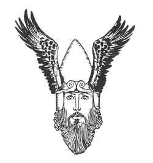

  
[Intangible Textual Heritage](../../../index)  [Legends and
Sagas](../../index)  [Iceland](../index)  [Index](index)  [Next](coo01) 

------------------------------------------------------------------------

[Buy this Book at
Amazon.com](https://www.amazon.com/exec/obidos/ASIN/B0025VKZFM/internetsacredte)

------------------------------------------------------------------------

  
*The Children of Odin*, by Padraic Colum, \[1920\], at Intangible
Textual Heritage

------------------------------------------------------------------------

# The Children of Odin

## by Padraic Colum

### Illustrated by Willy Pogány

#### Macmillan Publishing Co., New York

#### \[1920\]

###### Scanned, proofed and formatted at Intangible Textual Heritage, July 2004 by John Bruno Hare. This text is in the public domain in the United States because it was published prior to 1923.

 

 

------------------------------------------------------------------------

[Next: Contents](coo01)
