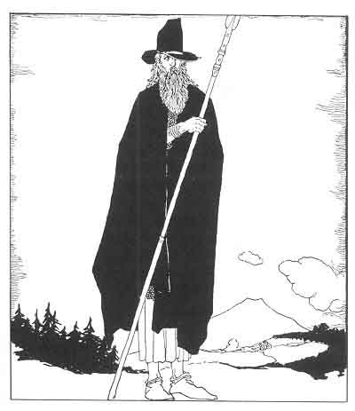
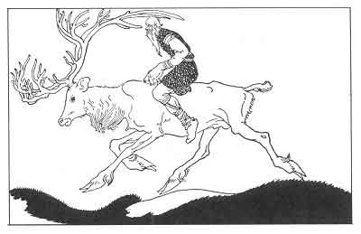

  
[Intangible Textual Heritage](../../../index)  [Legends and
Sagas](../../index)  [Iceland](../index)  [Index](index) 
[Previous](coo10)  [Next](coo12) 

------------------------------------------------------------------------

[Buy this Book at
Amazon.com](https://www.amazon.com/exec/obidos/ASIN/B0025VKZFM/internetsacredte)

------------------------------------------------------------------------

  
*The Children of Odin*, by Padraic Colum, \[1920\], at Intangible
Textual Heritage

------------------------------------------------------------------------

p. 74 p. 75 p. 76

 

# PART II

# ODIN THE WANDERER

p. 77

 

### 1. ODIN GOES TO MIMIR'S WELL: HIS SACRIFICE FOR WISDOM

AND so Odin, no longer riding on Sleipner, his eight-legged steed; no
longer wearing his golden armor and his eagle-helmet, and without even
his spear in his hand, traveled through Midgard, the World of Men, and
made his way toward Jötunheim, the Realm of the Giants.

No longer was he called Odin All-Father, but Vegtam the Wanderer. He
wore a cloak of dark blue and he carried a traveler's staff in his
hands. And now, as he went toward Mimir's Well, which was near to
Jötunheim, he came upon a Giant riding on a great Stag.

Odin seemed a man to men and a giant to giants. He

p. 78

went beside the Giant on the great Stag and the two talked together.
"Who art thou, O brother?" Odin asked the Giant.

"I am Vafthrudner, the wisest of the Giants," said the one who was
riding on the Stag. Odin knew him then. Vafthrudner was indeed the
wisest of the Giants, and many went to strive to gain wisdom from him.
But those who went to him had to answer the riddles Vafthrudner asked,
and if they failed to answer the Giant took their heads off.

"I am Vegtam the Wanderer," Odin said, "and I know who thou art, O
Vafthrudner. I would strive to learn something from thee."

The Giant laughed, showing his teeth. "Ho, ho," he said, "I am ready for
a game with thee. Dost thou know the stakes? My head to thee if I cannot
answer any question thou wilt ask. And if thou canst not answer any
question that I may ask, then thy head goes to me. Ho, ho, ho. And now
let us begin."

"I am ready," Odin said.

"Then tell me," said Vafthrudner, "tell me the name of the river that
divides Asgard from Jötunheim?"

"Ifling is the name of that river," said Odin. "Ifling that is dead
cold, yet never frozen."

"Thou hast answered rightly, O Wanderer," said the Giant. "But thou hast
still to answer other questions. What are the names of the horses that
Day and Night drive across the sky?"

"Skinfaxe and Hrimfaxe," Odin answered. Vafthrudner

p. 79

was startled to hear one say the names that were known only to the Gods
and to the wisest of the Giants. There was only one question now that he
might ask before it came to the stranger's turn to ask him questions.

"Tell me," said Vafthrudner, "what is the name of the plain on which the
last battle will be fought?"

"The Plain of Vigard," said Odin, "the plain that is a hundred miles
long and a hundred miles across."

It was now Odin's turn to ask Vafthrudner questions. "What will be the
last words that Odin will whisper into the ear of Baldur, his dear son?"
he asked.

Very startled was the Giant Vafthrudner at that question. He sprang to
the ground and looked at the stranger keenly.

"Only Odin knows what his last words to Baldur will be," he said, "and
only Odin would have asked that question. Thou art Odin, O Wanderer, and
thy question I cannot answer."

"Then," said Odin, "if thou wouldst keep thy head, answer me this: what
price will Mimir ask for a draught from the Well of Wisdom that he
guards?"

"He will ask thy right eye as a price, O Odin," said Vafthrudner.

"Will he ask no less a price than that?" said Odin.

"He will ask no less a price. Many have come to him for a draught from
the Well of Wisdom, but no one yet has given the price Mimir asks. I
have answered thy question, O Odin. Now give up thy claim to my head and
let me go on my way."

p. 80

give up my claim to thy head," said Odin. Then Vafthrudner, the wisest
of the Giants, went on his way, riding on his great Stag.

It was a terrible price that Mimir would ask for a draught from the Well
of Wisdom, and very troubled was Odin All-Father when it was revealed to
him. His right eye! For all time to be without the sight of his right
eye! Almost he would have turned back to Asgard, giving up his quest for
wisdom.

He went on, turning neither to Asgard nor to Mimir's Well. And when he
went toward the South he saw Muspelheim, where stood Surtur with the
Flaming Sword, a terrible figure, who would one day join the Giants in
their war against the Gods. And when he turned North he heard the
roaring of the cauldron Hvergelmer as it poured itself out of Niflheim,
the place of darkness and dread. And Odin knew that the world must not
be left between Surtur, who would destroy it with fire, and Niflheim,
that would gather it back to Darkness and Nothingness. He, the eldest of
the Gods, would have to win the wisdom that would help to save the
world.

And so, with his face stern in front of his loss and pain, Odin
All-Father turned and went toward Mimir's Well. It was under the great
root of Ygdrassil--the root that grew out of Jötunheim. And there sat
Mimir, the Guardian of the Well of Wisdom, with his deep eyes bent upon
the deep water. And Mimir, who had drunk every day from the Well of
Wisdom, knew who it was that stood before him.

"Hail, Odin, Eldest of the Gods," he said.

p. 81

Then Odin made reverence to Mimir, the wisest of the world's beings. "I
would drink from your well, Mimir," he said.

"There is a price to be paid. All who have come here to drink have
shrunk from paying that price. Will you, Eldest of the Gods, pay it?"

"I will not shrink from the price that has to be paid, Mimir," said Odin
All-Father.

"Then drink," said Mimir. He filled up a great horn with water from the
well and gave it to Odin.

Odin took the horn in both his hands and drank and drank. And as he
drank all the future became clear to him. He saw all the sorrows and
troubles that would fall upon Men and Gods. But he saw, too, why the
sorrows and troubles had to fall, and he saw how they might be borne so
that Gods and Men, by being noble in the days of sorrow and trouble,
would leave in the world a force that one day, a day that was far off
indeed, would destroy the evil that brought terror and sorrow and
despair into the world.

Then when he had drunk out of the great horn that Mimir had given him,
he put his hand to his face and he plucked out his right eye. Terrible
was the pain that Odin All-Father endured. But he made no groan nor
moan. He bowed his head and put his cloak before his face, as Mimir took
the eye and let it sink deep, deep into the water of the Well of Wisdom.
And there the Eye of Odin stayed, shining up through the water, a sign
to all who came to that place of the. price that the Father of the Gods
had paid for his wisdom.

------------------------------------------------------------------------

[Next: 2. Odin Faces an Evil Man](coo12)
