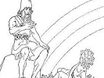
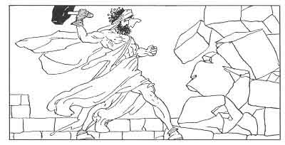

  
[Intangible Textual Heritage](../../../index)  [Legends and
Sagas](../../index)  [Iceland](../index)  [Index](index) 
[Previous](coo15)  [Next](coo17) 

------------------------------------------------------------------------

[Buy this Book at
Amazon.com](https://www.amazon.com/exec/obidos/ASIN/B0025VKZFM/internetsacredte)

------------------------------------------------------------------------

  
*The Children of Odin*, by Padraic Colum, \[1920\], at Intangible
Textual Heritage

------------------------------------------------------------------------

p. 116

 

### 6. HOW THOR AND LOKI BEFOOLED THRYM THE GIANT

LOKI told another tale about Thor--about Thor and Thrym, a stupid Giant
who had cunning streaks in him. Loki and Thor had been in this Giant's
house. He had made a feast for them and Thor had been unwatchful.

Then when they were far from Jötunheim Thor missed Miölnir, missed the
hammer that was the defence of Asgard and the help of the Gods. He could
not remember how or where he had mislaid it. Loki's thoughts went toward
Thrym, that stupid Giant who yet had cunning streaks in him. Thor, who
had lost the hammer that he had sworn never to let out of his sight, did
not know what to do.

But Loki thought it would be worth while to see if Thrym knew anything
about it. He went first to Asgard.

p. 117

\[paragraph continues\] He hurried across
the Rainbow Bridge and passed Heimdall without speaking to him. To none
of the Dwellers in Asgard whom he met did he dare relate the tidings of
Thor's loss. He spoke to none until he came to Frigga's palace.

To Frigga he said, "You must lend me your falcon dress until I fly to
Thrym's dwelling and find out if he knows where Miölnir is."

"If every feather was silver I would give it to you to go on such an
errand," Frigga said.

So Loki put on the falcon dress and flew to Jötunheim and came near
Thrym's dwelling. He found the Giant upon a hillside putting golden and
silver collars upon the necks of his hounds. Loki in the plumage of a
falcon perched on the rock above him, watching the Giant with falcon
eyes.

And while he was there he heard the Giant speak boastful words. "I put
collars of silver and gold on you now, my hounds," said he, "but soon we
Giants will have the gold of Asgard to deck our hounds and our steeds,
yea, even the necklace of Freya to put upon you, the best of my hounds.
For Miölnir, the defence of Asgard, is in Thrym's holding."

Then Loki spoke to him. "Yea, we know that Miölnir is in thy possession,
O Thrym," said he, "but know thou that the eyes of the watchful Gods are
upon thee."

"Ha, Loki, Shape-changer," said Thrym, "you are there! But all your
watching will not help you to find Miölnir.

p. 118

\[paragraph continues\] I have buried
Thor's hammer eight miles deep in the earth. Find it if you can. It is
below the caves of the Dwarfs."

"It is useless for us to search for Thor's hammer," said Loki; "eh,
Thrym?"

"It is useless for you to search for it," said the Giant sulkily.

"But what a recompense you would gain if you restored Thor's hammer to
the Dwellers in Asgard," Loki said.

"No, cunning Loki, I will never restore it, not for any recompense,"
said Thrym.

''Yet bethink thee, Thrym," said Loki. "Is there nought in Asgard you
would like to own? No treasure, no possession? Odin's ring or Frey's
ship, Skidbladnir?"

"No, no," said Thrym. "Only one thing could the Dwellers in Asgard offer
me that I would take in exchange for Miölnir, Thor's hammer."

"And what would that be, Thrym?" said Loki, flying toward him.

"She whom many Giants have striven to gain--Freya, for my wife," said
Thrym.

Loki watched Thrym for long with his falcon eyes. He saw that the Giant
would not alter his demand. "I will tell the Dwellers in Asgard of your
demand," he said at last, and he flew away.

Loki knew that the Dwellers in Asgard would never let Freya be taken
from them to become the wife of Thrym, the stupidest of the Giants. He
flew back.

By this time all the Dwellers in Asgard had heard of the

p. 119

loss of Miölnir, the help of the Gods. Heimdall shouted to him as he
crossed the Rainbow Bridge to ask what tidings he brought back. But Loki
did not stop to speak to the Warden of the Bridge but went straight to
the hall where the Gods sat in Council.

To the Æsir and the Vanir he told Thrym's demand. None would agree to
let the beautiful Freya go live in Jötunheim as a wife to the stupidest
of the Giants. All in the Council were cast down. The Gods would never
again be able to help mortal men, for now that Miölnir was in the
Giants' hands all their strength would have to be used in the defence of
Asgard.

So they sat in the Council with looks downcast. But cunning Loki said,
"I have thought of a trick that may win back the hammer from stupid
Thrym. Let us pretend to send Freya to Jötunheim as a bride for him. But
let one of the Gods go in Freya's veil and dress."

"Which of the Gods would bring himself to do so shameful a thing?" said
those in the Council.

"Oh, he who lost the hammer, Thor, should be prepared to do as much to
win it back," said Loki.

"Thor, Thor! Let Thor win back the hammer from Thrym by Loki's trick,"
said the Æsir and the Vanir. They left it to Loki to arrange how Thor
should go to Jötunheim as a bride for Thrym.

Loki left the Council of the Gods and came to where he had left Thor.
"There is but one way to win the hammer back, Thor," he said, "and the
Gods in Council have decreed that you shall take it."

p. 120

"What is the way?" said Thor. "But no matter what it is, tell me of it
and I shall do as thou dost say."

"Then," said laughing Loki, "I am to take you to Jötunheim as a bride
for Thrym. Thou art to go in bridal dress and veil, in Freya's veil and
bridal dress."

"What! I dress in woman's garb?" shouted Thor.

"Yea, Thor, and wear a veil over your head and a garland of flowers upon
it."

"I--I wear a garland of flowers?"

"And rings upon thy fingers. And a bunch of housekeeper's keys in thy
girdle."

"Cease thy mockery, Loki," said Thor roughly, "or I shall shake thee."

"It is no mockery. Thou wilt have to do this to win Miölnir back for the
defence of Asgard. Thrym will take no other recompense than Freya. I
would mock him by bringing thee to him in Freya's veil and dress. When
thou art in his hall and he asks thee to join hands with him, say thou
wilt not until he puts Miölnir into thy hands. Then when thy mighty
hammer is in thy holding thou canst deal with him and with all in his
hall. And I shall be with thee as thy bridesmaid! O sweet, sweet maiden
Thor!"

"Loki," said Thor, "thou didst devise all this to mock me. I in a bridal
dress! I with a bride's veil upon me! The Dwellers in Asgard will never
cease to laugh at me."

"Yea," said Loki, "but there will never be laughter again in Asgard
unless thou art able to bring back the hammer that thine unwatchfulness
lost."

"True," said Thor unhappily, "and is this, thinkst

p. 121

thou, Loki, the only way to win back Miölnir from Thrym?"

"It is the only way, O Thor," said the cunning Loki.

So Thor and Loki set out for Jötunheim and the dwelling of Thrym. A
messenger had gone before them to tell Thrym that Freya was coming with
her bridesmaid; that the wedding-feast was to be prepared and the guests
gathered and that Miölnir was to be at hand so that it might be given
over to the Dwellers in Asgard. Thrym and his Giant mother hastened to
have everything in readiness.

Thor and Loki came to the Giant's house in the dress of a bride and a
bridesmaid. A veil was over Thor's head hiding his beard and his fierce
eyes. A red-embroidered robe he wore and at his side hung a girdle of
housekeeper's keys. Loki was veiled, too. The hall of Thrym's great
house was swept and garnished and great tables were laid for the feast.
And Thrym's mother was going from one guest to another, vaunting that
her son was getting one of the beauteous Dwellers in Asgard for his
bride, Freya, whom so many of the Giants had tried to win.

When Thor and Loki stepped across the threshold Thrym went to welcome
them. He wanted to raise the veil of his bride and give her a kiss. Loki
quickly laid his hand on the Giant's shoulder.

"Forbear," he whispered. "Do not raise her veil. We Dwellers in Asgard
are reserved and bashful. Freya would be much offended to be kissed
before this company."

"Aye, aye," said Thrym's old mother. "Do not raise thy bride's veil,
son. These Dwellers in Asgard are more refined

p. 122

in their ways than we, the Giants." Then the old woman took Thor by the
hand and led him to the table.

The size and the girth of the bride did not surprise the huge Giants who
were in the wedding company. They stared at Thor and Loki, but they
could see nothing of their faces and little of their forms because of
their veils.

Thor sat at the table with Thrym on one side of him and Loki on the
other. Then the feast began. Thor, not noticing that what he did was
unbecoming to a refined maiden, ate eight salmon right away. Loki nudged
him and pressed his foot, but he did not heed Loki. After the salmon he
ate a whole ox.

"These maids of Asgard," said the Giants to each other, "they may be
refined, as Thrym's mother says, but their appetites are lusty enough."

"No wonder she eats, poor thing," said Loki to Thrym. "It is eight days
since we left Asgard. And Freya never ate upon the way, so anxious was
she to see Thrym and to come to his house."

"Poor darling, poor darling," said the Giant. "What she has eaten is
little after all."

Thor nodded his head toward the mead vat. Thrym ordered his servants to
bring a measure to his bride. The servants were kept coming with
measures to Thor. While the Giants watched, and while Loki nudged and
nodded, he drank three barrels of mead.

"Oh," said the Giants to Thrym's mother, "we are not so sorry that we
failed to win a bride from Asgard."

And now a piece of the veil slipped aside and Thor's

p. 123

eyes were seen for an instant. "Oh, how does it come that Freya has such
glaring eyes?" said Thrym.

"Poor thing, poor thing," said Loki, "no wonder her eyes are glaring and
staring. She has not slept for eight nights, so anxious was she to come
to you and to your house, Thrym. But now the time has come for you to
join hands with your bride. First, put into her hands the hammer Miölnir
that she may know the great recompense that the Giants have given for
her coming."

Then Thrym, the stupidest of the Giants, rose up and brought Miölnir,
the defence of Asgard, into the feasting hall. Thor could hardly
restrain himself from springing up and seizing it from the Giant. But
Loki was able to keep him still. Thrym brought over the hammer and put
the handle into the hands of her whom he thought was his bride. Thor's
hands closed on his hammer. Instantly he stood up. The veil fell off
him. His countenance and his blazing eyes were seen by all. He struck
one blow on the wall of the house. Down it crashed. Then Thor went
striding out of the ruin with Loki beside him, while within the Giants
bellowed as the roof and walls fell down on them. And so was Miölnir,
the defence of Asgard, lost and won back.

------------------------------------------------------------------------

[Next: 7. Aegir's Feast: How Thor Triumphed](coo17)
