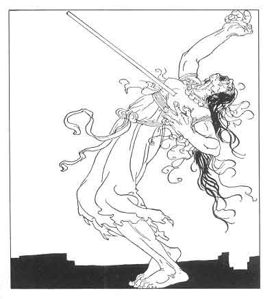
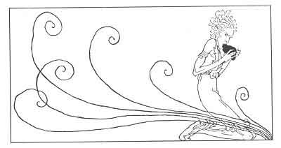

  
[Intangible Textual Heritage](../../../index)  [Legends and
Sagas](../../index)  [Iceland](../index)  [Index](index) 
[Previous](coo18)  [Next](coo20) 

------------------------------------------------------------------------

[Buy this Book at
Amazon.com](https://www.amazon.com/exec/obidos/ASIN/B0025VKZFM/internetsacredte)

------------------------------------------------------------------------

  
*The Children of Odin*, by Padraic Colum, \[1920\], at Intangible
Textual Heritage

------------------------------------------------------------------------

p. 149

 

# PART III

# THE WITCH'S HEART

p. 150 p. 151

 

### 1. FOREBODING IN ASGARD

WHAT happened afterwards is to the shame of the Gods, and mortals may
hardly speak of it. Gulveig the Witch came into Asgard, for Heimdall
might not forbid her entrance. She came within and she had her seat
amongst the Æsir and the Vanir. She walked through Asgard with a smile
upon her face, and where she walked and where she smiled Care and dire
Foreboding came.

Those who felt the care and the foreboding most deeply were Bragi the
Poet and his wife, the fair and simple Iduna, she who gathered the
apples that kept age from the Dwellers in Asgard. Bragi ceased to tell
his never-ending tale. Then one day, overcome by the fear and the
foreboding that was creeping through Asgard, Iduna slipped down
Ygdrassil, the World Tree, and no one was left to

p. 152

pluck the apples with which the Æsir and the Vanir stayed their youth.

Then were all the Dwellers in Asgard in sore dismay. Strength and beauty
began to fade from all. Thor found it hard to lift Miölnir, his great
hammer, and the flesh under Freya's necklace lost its white radiance.
And still Gulveig the Witch walked smiling through Asgard, although now
she was hated by all.

It was Odin and Frey who went in search of Iduna. She would have been
found and brought back without delay if Frey had had with him the magic
sword that he had bartered for Gerda. In his search he had to strive
with one who guarded the lake wherein Iduna had hidden herself. Beli was
the one he strove against. He overcame him in the end with a weapon made
of stags' antlers. Ah, it was not then but later that Frey lamented the
loss of his sword: it was when the Riders of Muspell came against
Asgard, and the Vanir, who might have prevailed, prevailed not because
of the loss of Frey's sword.

They found Iduna and they brought her back. But still Care and
Foreboding crept through Asgard. And it was known, too, that the witch
Gulveig was changing the thoughts of the Gods.

At last Odin had to judge Gulveig. He judged her and decreed her death.
And only Gungnir, the spear of Odin, might slay Gulveig, who was not of
mortal race.

Odin hurled Gungnir. The spear went through Gulveig. But still she stood
smiling at the Gods. A second time Odin hurled his spear. A second time
Gungnir

p. 153

pierced the witch. She stood livid as one dead but fell not down. A
third time Odin hurled his spear. And now, pierced for the third time,
the witch gave a scream that made all Asgard shudder and she fell in
death on the ground.

"I have slain in these halls where slaying is forbidden," Odin said.
"Take now the corpse of Gulveig and burn it on the ramparts, so that no
trace of the witch who has troubled us will remain in Asgard."

They brought the corpse of Gulveig the witch out on the ramparts and
they lighted fires under the pile on which they laid her and they called
upon Hræsvelgur to fan up the flame:

\#dir\#Hræsvelgur is the Giant,  
Who on heaven's edge sits  
In the guise of an eagle;  
And the winds, it is said,  
Rush down on the earth  
From his outspreading pinions.\#/dir\#

Far away was Loki when all this was being done. Often now he went from
Asgard, and his journeys were to look upon that wondrous treasure that
had passed from the keeping of the Dwarf Andvari. It was Gulveig who had
kept the imagination of that treasure within his mind. Now, when he came
back and heard the whispers of what had been done, a rage flamed up
within him. For Loki was one of those whose minds were being changed by
the

p. 154

presence and the whispers of the witch Gulveig. His mind was being
changed to hatred of the Gods. Now he went to the place of Gulveig's
burning. All her body was in ashes, but her heart had not been devoured
by the flames. And Loki in his rage took the heart of the witch and ate
it. Oh, black and direful was it in Asgard, the day that Loki ate the
heart that the flames would not devour!

------------------------------------------------------------------------

[Next: 2. Loki the Betrayer](coo20)
