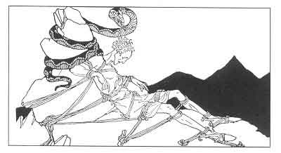

  
[Intangible Textual Heritage](../../../index)  [Legends and
Sagas](../../index)  [Iceland](../index)  [Index](index) 
[Previous](coo24)  [Next](coo26) 

------------------------------------------------------------------------

[Buy this Book at
Amazon.com](https://www.amazon.com/exec/obidos/ASIN/B0025VKZFM/internetsacredte)

------------------------------------------------------------------------

  
*The Children of Odin*, by Padraic Colum, \[1920\], at Intangible
Textual Heritage

------------------------------------------------------------------------

p. 193

 

### 7. LOKI'S PUNISHMENT

THE crow went flying toward the North, croaking as she flew, "Let Hela
keep what she holds. Let Hela keep what she holds." That crow was the
hag Thaukt transformed, and the hag Thaukt was Loki.

He flew to the North and came into the wastes of Jötunheim. As a crow he
lived there, hiding himself from the wrath of the Gods. He told the
Giants that the time had come for them to build the ship Naglfar, the
ship that was to be built out of the nails of dead men, and that was to
sail to Asgard on the day of Ragnarök with the Giant Hrymer steering it.
And harkening to what he said the Giants then and there began to build
Naglfar, the ship that Gods and men wished to remain unbuilt for long.

Then Loki, tiring of the wastes of Jötunheim, flew to the burning South.
As a lizard he lived amongst the rocks

p. 194

of Muspelheim, and he made the Fire Giants rejoice when he told them of
the loss of Frey's sword and of Tyr's right hand.

But still in Asgard there was one who wept for Loki--Siguna, his wife.
Although he had left her and had shown his hatred for her, Siguna wept
for her evil husband.

He left Muspelheim as he had left Jötunheim and he came to live in the
World of Men. He knew that he had now come into a place where the wrath
of the Gods might find him, and so he made plans to be ever ready for
escape. He had come to the River where, ages before, he had slain the
otter that was the son of the Enchanter, and on the very rock where the
otter had eaten the salmon on the day of his killing, Loki built his
house. He made four doors to it so that he might see in every direction.
And the power that he kept for himself was the power of transforming
himself into a salmon.

Often as a salmon he swam in the River. But even for the fishes that
swam beside him Loki had hatred. Out of flax and yarn he wove a net that
men might have the means of taking them out of the water.

The wrath that the Gods had against Loki did not pass away. It was he
who, as Thaukt, the Hag, had given Hela the power to keep Baldur
unransomed. It was he who had put into Hödur's hand the sprig of
Mistletoe that had bereft Baldur of life. Empty was Asgard now that
Baldur lived no more in the Peace Stead, and stern and gloomy grew the
minds of the Æsir and the Vanir with thinking on the direful things that
were arrayed against them. Odin in his hall of Valhalla thought only of
the ways by which

p. 195

he could bring heroes to him to be his help in defending Asgard.

The Gods searched through the world and they found at last the place
where Loki had made his dwelling. He was weaving the net to take fishes
when he saw them coming from four directions. He threw the net into the
fire so that it was burnt, and he sprang into the River and transformed
himself into a salmon. When the Gods entered his dwelling they found
only the burnt-out fire.

But there was one amongst them who could understand all that he saw. In
the ashes were the marks of the burnt net and he knew that these were
the tracing of something to catch fishes. And from the marks left in the
ashes he made a net that was the same as the one Loki had burnt.

With it in their hands the Gods went down the River, dragging the net
through the water. Loki was affrighted to find the thing of his own
weaving brought against him. He lay between two stones at the bottom of
the River, and the net passed over him.

But the Gods knew that the net had touched something at the bottom. They
fastened weights to it and they dragged the net through the River again.
Loki knew that he might not escape it this time and he rose in the water
and swam toward the sea. The Gods caught sight of him as he leaped over
a waterfall. They followed him, dragging the net. Thor waded behind,
ready to seize him should he turn back..

Loki came out at the mouth of the River and behold! There was; a great
eagle hovering over the waves of the sea and ready to swoop down on
fishes. He turned back in the

p. 196

\[paragraph continues\] River. He made a
leap that took him over the net that the Gods were dragging. But Thor
was behind the net and he caught the salmon in his powerful hands and he
held him for all the struggle that Loki made. No fish had ever struggled
so before. Loki got himself free all but his tail, but Thor held to the
tail and brought him amongst the rocks and forced him to take on his
proper form.

He was in the hands of those whose wrath was strong against him. They
brought him to a cavern and they bound him to three sharp-pointed rocks.
With cords that were made of the sinews of wolves they bound him, and
they transformed the cords into iron bands. There they would have left
Loki bound and helpless. But Skadi, with her fierce Giant blood, was not
content that he should be left untormented. She found a serpent that had
deadly venom and she hung this serpent above Loki's head. The drops of
venom fell upon him, bringing him anguish drop by drop, minute by
minute. So Loki's torture went on.

But Siguna with the pitying heart came to his relief. She exiled herself
from Asgard, and endured the darkness and the cold of the cavern, that
she might take some of the torment away from him who was her husband.
Over Loki Siguna stood, holding in her hands a cup into which fell the
serpent's venom, thus sparing him from the full measure of anguish. Now
and then Siguna had to turn aside to spill out the flowing cup, and then
the drops of venom fell upon Loki and he screamed in agony, twisting in
his bonds. It was then that men felt the earth quake. There in his bonds
Loki stayed until the coming of Ragnarök, the Twilight of the Gods.

------------------------------------------------------------------------

[Next: 1. Sigurd's Youth](coo26)
