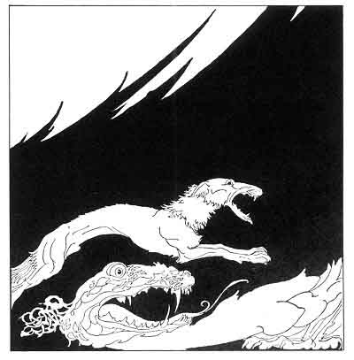
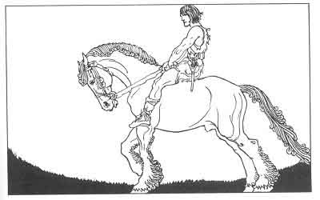

  
[Intangible Textual Heritage](../../../index)  [Legends and
Sagas](../../index)  [Iceland](../index)  [Index](index) 
[Previous](coo25)  [Next](coo27) 

------------------------------------------------------------------------

[Buy this Book at
Amazon.com](https://www.amazon.com/exec/obidos/ASIN/B0025VKZFM/internetsacredte)

------------------------------------------------------------------------

  
*The Children of Odin*, by Padraic Colum, \[1920\], at Intangible
Textual Heritage

------------------------------------------------------------------------

p. 197

 

# PART IV

# THE SWORD OF THE VOLSUNGS AND THE TWILIGHT OF THE GODS

 

p. 198 p. 199

 

### 1. SIGURD'S YOUTH

IN Midgard, in a northern Kingdom, a King reigned whose name was Alv; he
was wise and good, and he had in his house a fosterson whose name was
Sigurd.

Sigurd was fearless and strong; so fearless and so strong was he that he
once captured a bear of the forest and drove him to the King's Hall. His
mother's name was Hiordis. Once, before Sigurd was born, Alv and his
father who was King before him went on an expedition across the sea mid
came into another country. While they were yet afar off they heard the
din of a great battle. They came to the battlefield, but they found no
living warriors on it, only heaps of slain. One warrior they marked: he
was white-bearded

p. 200

and old and yet he seemed the noblest-looking man Alv or his father had
ever looked on. His arms showed that he was a King amongst one of the
bands of warriors.

They went through the forest searching for survivors of the battle. And,
hidden in a dell in the forest, they came upon two women. One was tall
with blue, unflinching eyes and ruddy hair, but wearing the garb of a
serving-maid. The other wore the rich dress of a Queen, but she was of
low stature and her manner was covert and shrinking.

When Alv and his father drew near, the one who had on her the raiment of
a Queen said, "Help us, lords, and protect us, and we will show you
where a treasure is hidden. A great battle has been fought between the
men of King Lygni and the men of King Sigmund, and the men of King Lygni
have won the victory and have gone from the field. But King Sigmund is
slain, and we who are of his household hid his treasure and we can show
it to you."

"The noble warrior, white-haired and white-bearded, who lies yonder--is
he King Sigmund?"

The woman answered, "Yes, lord, and I am his Queen."

"We have heard of King Sigmund," said Alv's father. "His fame and the
fame of his race, the Volsungs, is over the wide world."

Alv said no word to either of the women, but his eyes stayed on the one
who had on the garb of a serving-maid. She was on her knees, wrapping in
a beast's skin two pieces of a broken sword.

p. 201

"You will surely protect us, good lords," said she who had on the
queenly dress.

"Yea, wife of King Sigmund, we will protect you and your serving-maid,"
said Alv's father, the old King.

Then the women took the warriors to a wild place on the seashore and
they showed them where King Sigmund's treasure was hidden amongst the
rocks: cups of gold and mighty armrings and jeweled collars. Prince Alv
and his father put the treasure on the ship and brought the two women
aboard. Then they sailed from the land.

That was before Sigurd, the fosterson of King Alv, was born.

Now the mother of Alv was wise and little of what she saw escaped her
noting. She saw that of the two women that her son and her husband had
brought into their kingdom, the one who wore the dress of the
serving-maid

had unflinching eyes and a high beauty, while the one who wore the
queenly dress was shrinking and unstately. One night when all the women
of the household were sitting round her, spinning wool by the light of
torches in the hall, the Queen-mother said to the one who wore the
queenly garb:

"Thou art good at rising in the morning. How dost thou know in the dark
hours when it wears to dawn?"

The one clad in the queenly garb said, "When I was young I used to rise
to milk the cows, and I waken ever since at the same hour."

The Queen-mother said to herself, "It is a strange country in which the
royal maids rise to milk the cows."

p. 202

Then she said to the one who wore the clothes of the serving-maid:

"How dost thou know in the dark hours when the dawn is coming?"

"My father," she said, "gave me the ring of gold that I wear, and always
before it is time to rise I feel it grow cold on my finger."

"It is a strange country, truly," said the Queen-mother to herself, "in
which the serving-maids wear rings of gold."

When all the others had left she spoke to the two women who had been
brought into her country. To the one who wore the clothes of a
serving-maid she said:

"Thou art the Queen."

Then the one who wore the queenly clothes said, "Thou art right, lady.
She is the Queen, and I cannot any longer pretend to be other than I
am."

Then the other woman spoke. Said she: "I am the Queen as thou hast
said-the Queen of King Sigmund who was slain. Because a King sought for
me I changed clothes with my serving-maid, my wish being to baffle those
who might be sent to carry me away.

"Know that I am Hiordis, a King's daughter. Many men came to my father
to ask for me in marriage, and of those that came there were two whom I
heard much of: one was King Lygni and the other was King Sigmund of the
race of the Volsungs. The King, my father, told me it was for me to
choose between these two. Now King Sigmund was old, but he was the most
famous warrior in the whole world, and I chose him rather than King
Lygni.

p. 203

"We were wed. But King Lygni did not lose desire of me, and in a while
he came against King Sigmund's kingdom with a great army of men. We hid
our treasure by the seashore, and I and my maid watched the battle from
the borders of the forest. With the help of Gram, his wondrous sword,
and his own great warrior strength, Sigmund was able to harry the great
force that came against him. But suddenly he was stricken down. Then was
the battle lost. Only King Lygni's men survived it, and they scattered
to search for me and the treasure of the King.

"I came to where my lord lay on the field of battle, and he raised
himself on his shield when I came, and he told me that death was very
near him. A stranger had entered the battle at the time when it seemed
that the men of King Lygni must draw away. With the spear that he held
in his hand he struck at Sigmund's sword, and Gram, the wondrous sword,
was broken in two pieces. Then did King Sigmund get his death-wound. 'It
must be I shall die,' he said, 'for the spear against which my sword
broke was Gungnir, Odin's spear. Only that spear could have shattered
the sword that Odin gave my fathers. Now must I go to Valhalla, Odin's
Hall of Heroes.'

"'I weep,' I said, 'because I have no son who might call himself of the
great race of the Volsungs.'

"'For that you need not weep,' said Sigmund, 'a son will be born to you,
my son and yours, and you shall name him Sigurd. Take now the broken
pieces of my wondrous sword and give them to my son when he shall be of
warrior age.'

p. 204

''Then did Sigmund turn his face to the ground and the death-struggle
came on him. Odin's Valkyrie took his spirit from the battlefield. And I
lifted up the broken pieces of the sword, and with my serving-maid I
went and hid in a deep dell in the forest. Then your husband and your
son found us and they brought us to your kingdom where we have been
kindly treated, O Queen."

Such was the history that Hiordis, the wife of King Sigmund, told to the
mother of Prince Alv.

Soon afterwards the child was born to her that was Sigmund's son. Sigurd
she named him. And after Sigurd was born the old King died and Prince
Alv became King in his stead. He married Hiordis, she of the ruddy hair,
the unflinching ways, and the high beauty, and he brought Lip her son
Sigurd in his house as his fosterson.

Sigurd, the son of Sigmund, before he came to warrior's age, was known
for his strength and his swiftness and for the fearlessness that shone
round him like a glow. "Mighty was the race he sprang from, the Volsung
race," men said, "but Sigurd will be as mighty as any that have gone
before him." He built himself a hut in the forest that he might hunt
wild beasts and live near to one who was to train him in many crafts.

This one was Regin, a maker of swords and a cunning man besides. it was
said of Regin that he was an Enchanter and that he had been in the world
for longer than the generations of men. No one remembered, nor no one's
father remembered, when Regin had come into that country. He taught
Sigurd the art of working in metals and he

p. 205

taught him, too, the lore of other days. But ever as he taught him he
looked at Sigurd strangely, not as a man looks at his fellow, but as a
lynx looks at a stronger beast.

One day Regin said to young Sigurd, "King Alv has thy father's treasure,
men say, and yet he treats thee as if thou wert thrall-born."

Now Sigurd knew that Regin said this that he might anger him and
thereafter use him to his own ends. He said, "King Alv is a wise and a
good King, and he would let me have riches if I had need of them."

"Thou dost go about as a footboy, and not as a King's son."

"Any day that it likes me I might have a horse to ride," Sigurd said.

"So thou dost say," said Regin, and he turned from Sigurd and went to
blow the fire of his smithy.

Sigurd was made angry and he threw down the irons on which he was
working and he ran to the horse-pastures by the great River. A herd of
horses was there, gray and black and roan and chestnut, the best of the
horses that King Alv possessed. As he came near to where the herd grazed
he saw a stranger near, an ancient but robust man, wearing a strange
cloak of blue and leaning on a staff to watch the horses. Sigurd, though
young, had seen Kings in their halls, but this man had a bearing that
was more lofty than any King's he had ever looked on.

"Thou art going to choose a horse for thyself," said the stranger to
Sigurd.

"Yea, father," Sigurd said.

p. 206

"Drive the herd first into the River," the stranger said.

Sigurd drove the horses into the wide River. Some were swept down by the
current, others struggled back and clambered up the bank of the
pastures. But one swain across the river, and throwing up his head
neighed as for a victory. Sigurd marked him; a gray horse he was, young
and proud, with a great flowing inane. He went through the water and
caught this horse, mounted him, and brought him back across the River.

"Thou hast done well," said the stranger. "Grani, whom thou hast got, is
of the breed of Sleipner, the horse of Odin."

"And I am of the race of the sons of Odin," cried Sigurd, his eyes wide
and shining with the very light of the sun. "I am of the race of the
sons of Odin, for my father was Sigmund, and his father was Volsung, and
his father was Rerir, and his father was Sigi, who was the son of Odin."

The stranger, leaning on his staff looked on the youth steadily. Only
one of his eyes was to be seen, but that eye, Sigurd thought, might see
through a stone. "All thou hast named," the stranger said, "were as
swords of Odin to send men to Valhalla, Odin's Hall of Heroes. And of
all that thou hast named there were none but were chosen by Odin's
Valkyries for battles in Asgard."

Cried Sigurd, "Too much of what is brave and noble in the world is taken
by Odin for his battles in Asgard."

The stranger leaned on his staff and his head, was bowed. "What wouldst
thou?" he said, and it did not seem to Sigurd that he spoke to him.
"What wouldst thou? The

p. 207

leaves wither and fall off Ygdrassil, and the day of Ragnarök comes."
Then he raised his head and spoke to Sigurd. "The time is near," he
said, "when thou mayst possess thyself of the pieces of thy father's
sword."

Then the man in the strange cloak of blue went climbing up the hill and
Sigurd watched him pass away from his sight. He had held back Grani, his
proud horse, but now he turned him and let him gallop along the River in
a race that was as swift as the wind.

------------------------------------------------------------------------

[Next: 2. The Sword Gram and the Dragon Fafnir](coo27)
