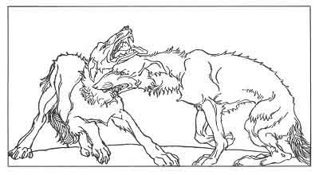

  
[Intangible Textual Heritage](../../../index)  [Legends and
Sagas](../../index)  [Iceland](../index)  [Index](index) 
[Previous](coo29)  [Next](coo31) 

------------------------------------------------------------------------

[Buy this Book at
Amazon.com](https://www.amazon.com/exec/obidos/ASIN/B0025VKZFM/internetsacredte)

------------------------------------------------------------------------

  
*The Children of Odin*, by Padraic Colum, \[1920\], at Intangible
Textual Heritage

------------------------------------------------------------------------

p. 233

 

### 4. THE STORY OF SIGMUND AND SINFIOTLI

Sigurd rode the ways of the forest he thought upon Sigmund, his father,
on his life and his death, according to what Hiordis, his mother, had
told him. Sigmund lived for long the life of the hunter and the outlaw,
but he never strayed far from the forest that was in King Siggeir's
dominion. Often did he get a token from Signy. They two, the last of the
Volsungs, knew that King Siggeir and his house would have to perish for
the treason he had wrought on their father and their brothers.

Sigmund knew that his sister would send her son to help him. One morning
there came to his hut a boy of ten years. He knew that this was one of
Signy's sons, and that she

p. 234

would have him train him into being a warrior worthy of the Volsung
breed.

Sigmund hardly looked and hardly spoke to the lad. He was going hunting,
and as he took down his spear from the wall he said:

"There is the mealbag, boy. Mix the meal and make the bread, and we will
eat when I come back."

When he returned the bread was unmade, and the boy was standing watching
the mealbag with widened eyes. "Thou didst not make the bread?" Sigmund
said.

"Nay," said the boy, "I was afeard to go near the bag. Something stirred
within it."

"Thou hast the heart of a mouse so to be frighted. Go back to thy mother
and tell her that not in thee is the stuff for a Volsung warrior."

So Sigmund spoke, and the boy went away weeping.

A year later another son of Signy's came. As before Sigmund hardly
looked at and hardly spoke to the boy. He said:

"There is the mealbag. Mix the meal and make ready the bread against the
time I return."

When Sigmund came back the bread was unmade. The boy had shrunk away
from where the bag was.

"Thou hast not made the bread?" Sigmund said.

"Nay," said the boy, "something stirred in the bag, and I was afeard."

"Thou hast the heart of a mouse. Get thee back to thy mother and tell
her that there is not in thee the stuff for the making of a Volsung
warrior."

And this boy, like his brother, went back weeping.

p. 235

At that time Signy had no other sons. But at last one was born to her,
the child of a desperate thought. Him, too, when he was grown, she sent
to Sigmund.

"What did thy mother say to thee?" Sigmund said to this boy when he
showed himself at the hut.

"Nothing. She sewed my gloves to my hands and then bade me pull them
off."

"And didst thou?"

"Aye, and the skin came with them."

"And didst thou weep?"

"A Volsung does not weep for such a thing."

Long did Sigmund look on the lad. He was tall and fair and great-limbed,
and his eyes had no fear in them.

"What wouldst thou have me do for thee?" said the lad.

"There is the mealbag," Sigmund said. "Mix the meal and make the bread
for me against the time I return."

When Sigmund came back the bread was baking on the coals. "What didst
thou with the meal?" Sigmund asked.

"I mixed it. Something was in the meal--a serpent, I think--but I
kneaded it with the meal, and now the serpent is baking on the coals."

Sigmund laughed and threw his arms around the boy. "Thou wilt not eat of
that bread," he said. "Thou didst knead into it a venomous serpent."

The boy's name was Sinfiotli. Sigmund trained him in the ways of the
hunter and the outlaw. Here and there they went, taking vengeance on
King Siggeir's men. The boy was fierce, but never did he speak a word
that was false.

One day when Sigmund and Sinfiotli were hunting,

p. 236

they came upon a strange house in the dark wood. When they went within
they found two men lying there sleeping a deep sleep. On their arms were
heavy rings of gold, and Sigmund knew that they were the sons of Kings.

And beside the sleeping men he saw wolfskins, left there as though they
had been cast off. Then Sigmund knew that these men were
shape-changers--that they were ones who changed their shapes and ranged
through the forests as wolves.

Sigmund and Sinfiotli put on the skins that the men had cast off, and
when they did this they changed their shapes and became as wolves. And
as wolves they ranged through the forest, now and then changing their
shapes back to those of men. As wolves they fell upon King Siggeir's men
and slew more and more of them.

One day Sigmund said to Sinfiotli: "Thou art still young and I would not
have thee be too rash. If thou dost come upon a company of seven men,
fight them. But if thou dost come on a company greater than seven, raise
up thy voice as a wolf's cry and bring me to thy side."

Sinfiotli promised that he would do this.

One day, as he went through the forest in his wolf's shape, Sigmund
heard the din of a struggle and he stopped to listen for Sinfiotli's
call. But no call came. Then Sigmund went through the forest in the
direction of the struggle. On his way he passed the bodies of eleven
slain men. And he came upon Sinfiotli lying in the thicket, his wolf's
shape upon him, and panting from the battle he had waged.

p. 237

"Thou didst strive with eleven men. Why didst thou not call to me?"
Sigmund said.

"Why should I have called to thee? I am not so feeble but I can strive
with eleven men."

Sigmund was made angry with this answer. He looked on Sinfiotli where he
lay, and the wicked wolf's nature that was in the skin came over him. He
sprang upon him, sinking his teeth in Sinfiotli's throat.

Sinfiotli lay gasping in the throes of death. And Sigmund, knowing the
deadly grip that was in those jaws of his, howled his anguish.

Then, as he licked the face of his comrade, he saw two weasels meet.
They began to fight, one with the other, and the first caught the second
at the throat, and bit him with his teeth and laid him out as if in
death. Sigmund marked the combat and the end of it. But then the first
weasel ran and found leaves of a certain herb and he put them upon his
comrade's wound. And the herb cured the wound, and the weasel that was
bitten rose up and was sound and swift again.

Sigmund went searching for the herb he saw the weasel carry to his
comrade. And as he sought for it he saw a raven with a leaf in her beak.
She dropped the leaf as he came to her, and behold! It was the same leaf
as the weasel had brought to his comrade. Sigmund took it and laid it on
the wound he had made in Sinfiotli's throat, and the wound healed, and
Sinfiotli was sound once more. They went back to their hut in the
forest. And the next day they burnt the wolfskins, and they prayed the
Gods that they

p. 238

might never be afflicted with the wolf's evil nature again. And Sigmund
and Sinfiotli never afterwards changed their shapes.

------------------------------------------------------------------------

[Next: 5. The Story of the Vengeance of the Volsungs and of the Death of
Sinfiotli](coo31)
