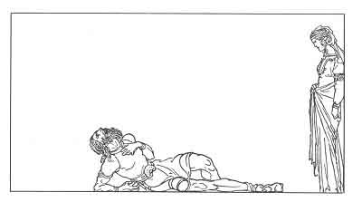

  
[Intangible Textual Heritage](../../../index)  [Legends and
Sagas](../../index)  [Iceland](../index)  [Index](index) 
[Previous](coo30)  [Next](coo32) 

------------------------------------------------------------------------

[Buy this Book at
Amazon.com](https://www.amazon.com/exec/obidos/ASIN/B0025VKZFM/internetsacredte)

------------------------------------------------------------------------

  
*The Children of Odin*, by Padraic Colum, \[1920\], at Intangible
Textual Heritage

------------------------------------------------------------------------

p. 239

 

### 5. THE STORY OF THE VENGEANCE OF THE VOLSUNGS AND OF THE DEATH OF SINFIOTLI

AND now Sinfiotli had come to his full strength and it was time to take
vengeance on King Siggeir for the slaying of Volsung and the dread doom
he had set for Volsung's ten sons. Sigmund and Sinfiotli put helmets on
their heads and took swords in their hands and went to King Siggeir's
Hall. They hid behind the casks of ale that were at the entrance and
they waited for the men-at-arms to leave the Hall that they might fall
upon King Siggeir and his attendants.

The younger children of King Siggeir were playing in the Hall and one
let fall a ball. It went rolling behind the

p. 240

casks of ale. And the child peering after the ball saw two men crouching
with swords in their hands and helmets on their heads.

The child told a servant who told the King. Then Siggeir arose, and he
drew his men-at-arms around him, and he set them on the men who were
hiding behind the barrels. Sigmund and Sinfiotli sprang up and fought
against the men of King Siggeir, but they were taken captives.

Now they might not be slain there and then, for it was unlawful to slay
captives after sunset. But for all that, King Siggeir would not leave
them above ground. He decreed that they should be put in a pit, and a
mound made over them so that they would be buried alive.

The sentence was carried out. A great flagstone was put down to divide
the pit in two, so that Sigmund and Sinfiotli might hear each other's
struggle and not be able to give help to each other. All was done as the
King commanded.

But while his thralls were putting sods over the pit, one came amongst
them, cloaked and hooded, and dropped something wrapped in straw into
the side of the pit where Sinfiotli lay. And when the sky was shut out
from them with the turf and soil that was put over the pit, Sinfiotli
shouted to Sigmund: "I shall not die, for the queen has thrown down to
me meat wrapped in a parcel of straw."

And a while afterwards Sinfiotli shouted to Sigmund: "The queen has left
a sword in the meat which she flung down to me. It is a mighty sword.
Almost I think it is Gram, the sword you told me of."

"If it be Gram," Sigmund said, "it is a sword that can

p. 241

cut through this flagstone. Thrust the blade against the stone and try."

Sinfiotli thrust the blade against the stone and the blade went through
the stone. Then, one on each side, they took hold of the sword and they
cut the great stone in two. Afterwards, working together, it was easy to
shift the turf and soil. The two came out under the sky.

Before them was the Hall of King Siggeir. They came to the Hall and they
set dry wood before it and they fired the wood and made the Hall blaze
up. And when the Hall was in a blaze King Siggeir came to the door and
shouted, "Who is it that has fired the house of the King?"

And Sigmund said, "I, Sigmund, the son of Volsung, that you may pay for
the treason wrought on the Volsungs."

Seeing Sigmund there with Gram, the great sword, in his hands, Siggeir
went back into his Hall. Then Signy was seen with her white face and her
stern eyes, and Sigmund called to her, "Come forth, come forth. Sigmund
calls. Come out of Siggeir's blazing house and together we will go back
to the Hall of the Branstock."

But Signy said, "All is finished now. The vengeance is wrought and I
have no more to keep me in life. The Volsung race lives on in you, my
brother, and that is my joy. Not merrily did I wed King Siggeir and not
merrily did I live with him, but merrily will I die with him now."

She went within the Hall; then the flames burst over it and all who were
within perished. Thus the vengeance of the Volsungs was wrought.

And Sigurd thought on the deed that Sigmund, his

p. 242

father, and Sinfiotli, the youth who was his father's kinsman, wrought,
as he rode the ways of the forest, and of the things that thereafter
befell them.

Sigmund and Sinfiotli left King Siggeir's land and came back to the land
where was the Hall of the Branstock. Sigmund became a great King and
Sinfiotli was the Captain of his host.

And the story of Sigmund and Sinfiotli goes on to tell how Sigmund wed a
woman whose name was Borghild, and how Sinfiotli loved a woman who was
loved by Borghild's brother. A battle came in which the youths were on
opposite sides, and Sinfiotli killed Borghild's brother, and it was in
fair combat.

Sinfiotli returned home. To make peace between him and the Queen,
Sigmund gave Borghild a great measure of gold as compensation for the
loss of her brother. The Queen took it and said, "Lo, my brother's worth
is reckoned at this; let no more be said about his slaying." And she
made Sinfiotli welcome to the Hall of the Branstock.

But although she showed herself friendly to him her heart was set upon
his destruction.

That night there was a feast in the Hall of the Branstock and Borghild
the Queen went to all the guests with a horn of mead in her hand. She
came to Sinfiotli and she held the horn to him. "Take this from my
hands, O friend of Sigmund," she said.

But Sinfiotli saw what was in her eyes and he said, "I will not drink
from this horn. There is venom in the drink."

p. 243

Then, to end the mockery that the Queen would have made over Sinfiotli,
Sigmund who was standing by took the horn out of Borghild's hand. No
venom or poison could injure him. He raised the horn to his lips and
drained the mead at a draught.

The Queen said to Sinfiotli, "Must other men quaff thy drink for thee?"

Later in the night she came to him again, the horn of mead in her hand.
She offered it to Sinfiotli, but he looked in her eyes and saw the
hatred that was there. "Venom is in the drink," he said. "I will not
take it."

And again Sigmund took the horn and drank the mead at a draught. And
again the Queen mocked Sinfiotli.

A third time she came to him. Before she offered the horn she said,
"This is the one who fears to take his drink like a man. What a Volsung
heart he has!" Sinfiotli saw the hatred in her eyes, and her mockery
could not make him take the mead from her. As before Sigmund was
standing by. But now he was weary of raising the horn and he said to
Sinfiotli, "Pour the drink through thy beard."

He thought that Sigmund meant that he should pour the mead through his
lips that were bearded and make trouble no more between him and the
Queen. But Sigmund did not mean that. He meant that he should pretend to
drink and let the mead run down on the floor. Sinfiotli, not
understanding what his comrade meant, took the horn from the Queen and
raised it to his lips and drank. And as soon as he drank, the venom that
was in the drink went to his heart, and he fell dead in the Hall of the
Branstock.

p. 244

Oh, woeful was Sigmund for the death of his kinsman and his comrade. He
would let no one touch his body. He himself lifted Sinfiotli in his arms
and carried him out of the Hall, and through the wood, and down to the
seashore. And when he came to the shore he saw a boat drawn up with a
man therein. Sigmund came near to him and saw that the man was old and
strangely tall. "I will take thy burthen from thee," the man said.

Sigmund left the body of Sinfiotli in the boat, thinking to take a place
beside it. But as soon as the body was placed in it the boat went from
the land without sail or oars. Sigmund, looking on the old man who stood
at the stern, knew that he was not of mortal men, but was Odin
All-Father, the giver of the sword Gram.

Then Sigmund went back to his Hall. His Queen died, and in time he wed
with Hiordis, who became the mother of Sigurd. And now Sigurd the
Volsung, the son of Sigmund and Hiordis, rode the ways of the forest,
the sword Gram by his side, and the Golden Helmet of the Dragon's Hoard
above his golden hair.

------------------------------------------------------------------------

[Next: 6. Brynhild in the House of Flame](coo32)
