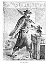
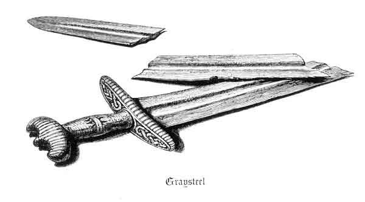

  
[Intangible Textual Heritage](../../../index)  [Legends &
Sagas](../../index)  [Iceland](../index)  [Index](index)  [Next](gto01) 

------------------------------------------------------------------------

p. i

THE STORY OF GISLI THE OUTLAW.

 

p. ii

*Printed by R. Clark*,

FOR

EDMONSTON AND DOUGLAS, EDINBURGH.

|           |                          |
|-----------|--------------------------|
| LONDON    | HAMILTON, ADAMS, AND CO. |
| CAMBRIDGE | MACMILLAN AND CO.        |
| DUBLIN    | M‘GLASHAN AND GILL.      |
| GLASGOW   | JAMES MACLEHOSE.         |

p. iii

 

[  
Click to enlarge](img/front.jpg)  
GISLI IN SÆBOL.  

#### THE STORY

###### OF

# GISLI THE OUTLAW

##### from the Icelandic

###### BY

## GEORGE WEBBE DASENT

###### D.C.L.

### WITH ILLUSTRATIONS BY C. E. ST. JOHN MILDMAY

   
Graysteel

#### EDINBURGH: EDMONSTON AND DOUGLAS

#### \[1866\]

###### Scanned April 2004, at Intangible Textual Heritage. John Bruno Hare, redactor. This text is in the public domain. These files may be used for any non-commercial purpose, provided this notice of attribution is intact.

 

------------------------------------------------------------------------

[Next: Notice](gto01)
